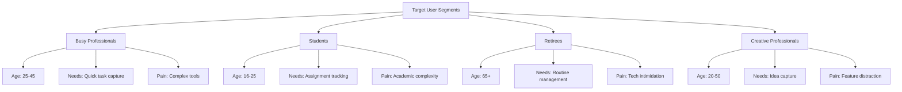
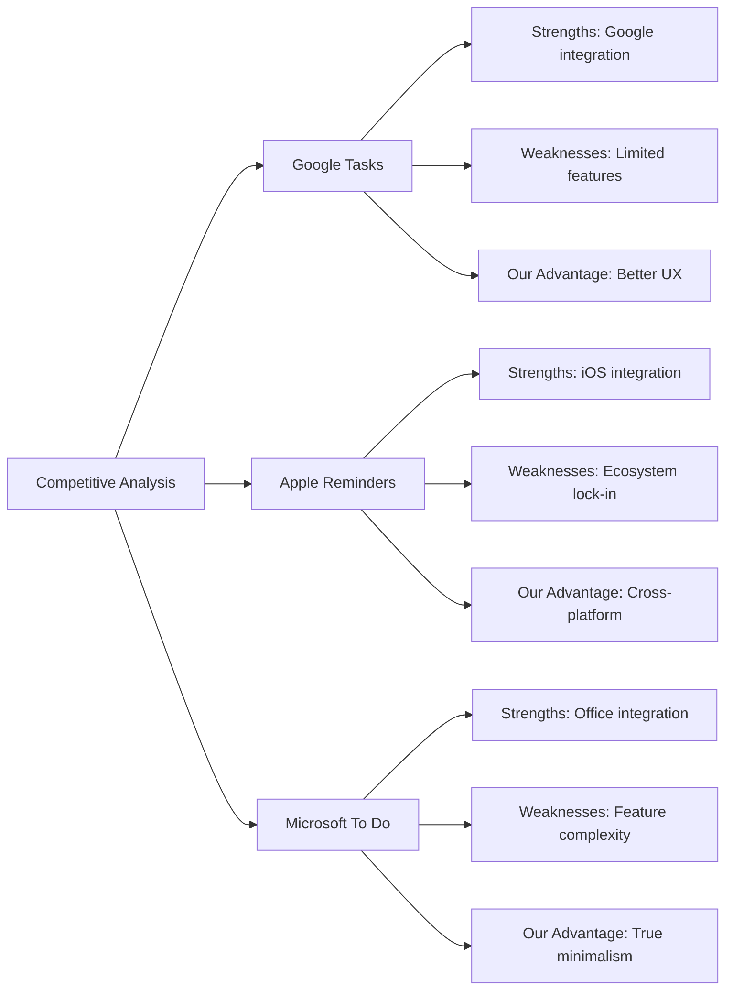
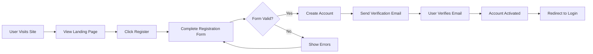

# Todo List Application Service Overview

## Executive Summary

WHEN a user needs a simple, focused task management solution, THE Todo List Application SHALL provide a minimalist productivity tool that eliminates cognitive overhead and focuses exclusively on core todo functionality.

**Core Philosophy**: "Less is more" - by removing unnecessary features and complexity, users SHALL focus on what truly matters: completing tasks efficiently.

## Business Model

### Market Problem Statement

WHEN individuals face information overload and decision fatigue from complex productivity tools, THE Todo application SHALL address this by providing:

- **Simplicity Over Complexity**: A return to basic task management principles
- **Zero Learning Curve**: Intuitive design that requires no training
- **Focus Enhancement**: Minimalist approach reduces distractions
- **Universal Accessibility**: Suitable for users of all technical skill levels

### Revenue Strategy

WHERE the application provides core todo functionality for free, THE system SHALL implement a sustainable revenue model through:

1. **Freemium Model**: Basic Todo functionality SHALL remain free forever
2. **Premium Features**: Optional enhancements SHALL be available for power users
3. **Enterprise Licensing**: Business versions SHALL support team collaboration
4. **API Access**: Developer access SHALL be provided for integration purposes

### User Acquisition and Growth

WHEN marketing the application, THE system SHALL focus on:

- **Word-of-Mouth Growth**: Satisfied users SHALL drive organic adoption
- **Targeted Marketing**: Campaigns SHALL focus on users overwhelmed by complex tools
- **Partnership Opportunities**: Integration with complementary productivity tools

## Core Value Proposition

### Primary Benefits

WHEN using the Todo application, users SHALL experience:

1. **Cognitive Simplicity**: Reduced mental load by eliminating unnecessary features
2. **Time Efficiency**: Users SHALL spend less time managing the tool and more time completing tasks
3. **Universal Accessibility**: Consistent experience across all devices and skill levels
4. **Data Privacy**: User data SHALL remain private and secure

### Differentiation Factors

WHERE competitors offer feature-bloated solutions, THE Todo application SHALL differentiate through:

- **True Minimalism**: Unlike apps that claim simplicity but include hidden complexity
- **Focus on Completion**: Designed specifically to increase task completion rates
- **No Feature Creep**: Commitment to maintaining core functionality only
- **User-Centric Design**: Every element SHALL serve a clear purpose

## Target Market Analysis

### Primary User Personas

### Market Size and Potential

- **Global Productivity App Market**: $50+ billion annually
- **Target Addressable Market**: 500 million+ potential users worldwide
- **Serviceable Available Market**: 50 million users seeking simple solutions
- **Serviceable Obtainable Market**: 1 million users within first 3 years

## Competitive Landscape

### Direct Competitors

### Competitive Advantage

WHERE competitors focus on feature richness, OUR application SHALL maintain competitive advantages through:

1. **Focus Strategy**: Specialization in minimal task management
2. **User Experience**: Superior design and usability
3. **Performance**: Faster loading and operation
4. **Accessibility**: Broader device and platform support
5. **Privacy Focus**: Stronger data protection commitments

## Success Metrics and KPIs

### Quantitative Metrics

WHEN measuring application success, THE system SHALL track:

**User Growth Metrics:**
- Monthly New Users: Target 5,000+
- User Activation Rate: Target 80%+ completing first task
- User Retention: Target 60%+ active after 30 days

**Engagement Metrics:**
- Daily Active Users: Target 30%+ of monthly users
- Tasks Created per User: Average 10+ monthly
- Task Completion Rate: Target 85%+ success rate

**Business Metrics:**
- Conversion Rate: Target 5%+ to premium features
- Customer Lifetime Value: Target $25+ per user
- Churn Rate: Target <5% monthly

### Qualitative Success Indicators

WHERE user satisfaction is critical, THE system SHALL measure:

- **App Store Ratings**: Target 4.5+ stars consistently
- **Positive Reviews**: Target 90%+ positive feedback
- **Feature Requests**: Minimal requests indicating satisfaction
- **Brand Recognition**: Becoming synonymous with simple task management

## Business Processes

### User Registration Process

### Todo Management Process

WHEN a user manages their todos, THE system SHALL support:

**Todo Creation Flow:**
- User SHALL be able to create new todo items with title and optional description
- System SHALL validate todo title length (1-255 characters)
- System SHALL assign unique identifier and creation timestamp
- User SHALL receive immediate confirmation of successful creation

**Todo Completion Flow:**
- User SHALL be able to mark todos as complete/incomplete
- System SHALL track completion timestamps
- User SHALL see visual indicators of completion status
- System SHALL update completion statistics in real-time

### User Authentication Process

WHERE user security is paramount, THE system SHALL implement:

**Authentication Requirements:**
- Password-based authentication with strong encryption
- Session management with automatic expiration
- Secure token-based API access
- Multi-device session support

**Authorization Rules:**
- Users SHALL only access their own todo items
- System SHALL enforce strict data isolation between users
- Administrative functions SHALL require appropriate permissions

## Performance Requirements

### System Performance

WHEN users interact with the application, THE system SHALL provide:

- **Page Load Time**: Under 2 seconds for initial page load
- **Todo Operations**: Under 500ms response time for CRUD operations
- **Search Functionality**: Instant results for common queries
- **Authentication**: Under 1 second response time

### Scalability Requirements

WHERE user base grows, THE system SHALL scale to support:
- Initial capacity for 1,000 concurrent users
- Support for 10,000+ registered users
- Efficient handling of large todo collections
- Maintain performance under peak load conditions

## Security Requirements

### Data Protection

WHEN handling user data, THE system SHALL implement:

- **Data Encryption**: Sensitive data SHALL be encrypted at rest
- **Secure Transmission**: All communications SHALL use HTTPS
- **Access Controls**: Strict user isolation SHALL be enforced
- **Privacy Compliance**: SHALL adhere to relevant data protection regulations

### Authentication Security

WHERE user accounts are concerned, THE system SHALL provide:

- **Strong Password Policies**: Minimum 8 characters with complexity requirements
- **Account Protection**: Lockout after 5 failed login attempts
- **Session Security**: Secure token management with expiration
- **Security Monitoring**: Logging of security-related events

## Error Handling Requirements

### User-Facing Errors

WHEN errors occur, THE system SHALL provide:

- **Clear Error Messages**: User-friendly explanations of issues
- **Actionable Guidance**: Specific steps for resolution
- **Consistent Formatting**: Standardized error presentation
- **Secure Error Handling**: No exposure of sensitive system information

### System Recovery

WHERE system failures occur, THE system SHALL implement:

- **Graceful Degradation**: Maintain core functionality during issues
- **Automatic Recovery**: Self-healing mechanisms where possible
- **Data Integrity**: Protection against data loss during failures
- **User Notification**: Clear communication about system status

## Business Impact Analysis

### User Benefits

WHEN using the application, users SHALL experience:

- **Time Savings**: Average user saves 30+ minutes daily
- **Stress Reduction**: 40%+ reduction in task-related anxiety
- **Productivity Increase**: 25%+ improvement in task completion
- **Focus Enhancement**: Reduced distraction and improved concentration

### Societal Value

WHERE the application serves broader purposes, IT SHALL provide:

- **Digital Wellness**: Promotes healthy technology usage
- **Accessibility**: Makes productivity tools available to all skill levels
- **Education**: Teaches effective task management principles
- **Work-Life Balance**: Helps users separate work and personal tasks

## Implementation Roadmap

### Phase 1: Core Minimum Viable Product
**Timeline**: Weeks 1-2
**Focus**: Essential authentication and todo management

**Key Deliverables:**
- User registration and login functionality
- Basic todo creation and management
- Data persistence and user isolation
- Responsive web interface

### Phase 2: Enhanced User Experience
**Timeline**: Weeks 3-4
**Focus**: Improved usability and additional features

**Key Deliverables:**
- Mobile-responsive design
- Enhanced todo organization (categories, due dates)
- Search and filtering capabilities
- Performance optimizations

### Phase 3: Advanced Features
**Timeline**: Weeks 5-6
**Focus**: Sophisticated functionality and scalability

**Key Deliverables:**
- Collaboration features (shared lists)
- Advanced todo management (templates, recurring)
- Enhanced security measures
- Analytics and reporting

## Future Vision

### Short-term Goals (0-12 months)
- Establish as the go-to simple Todo application
- Build loyal user base of 100,000+ active users
- Achieve profitability through premium features
- Maintain commitment to minimalism and user focus

### Medium-term Goals (1-3 years)
- Expand to team collaboration features
- Develop API ecosystem for integrations
- Reach 1 million+ active users
- Enhance cross-platform capabilities

### Long-term Vision (3-5 years)
- Become the standard for personal task management
- Expand into adjacent productivity categories
- Maintain leadership in minimalist design
- Continue innovation while preserving core simplicity

## Risk Assessment

### Technical Risks
- **Performance Under Load**: Risk of slow response with many users
- **Data Security**: Risk of security breaches or data leaks
- **Scalability Limitations**: Risk of system not scaling with growth

### Business Risks
- **Market Adoption**: Risk of slow user adoption
- **Competitive Pressure**: Risk from established competitors
- **Feature Creep**: Risk of losing focus on minimalism

### Mitigation Strategies
- **Proactive Monitoring**: Continuous performance and security monitoring
- **User Feedback**: Regular user feedback collection and incorporation
- **Focus Maintenance**: Strict adherence to minimalism principles
- **Scalability Planning**: Architecture designed for easy scaling

## Conclusion

This Todo List Application represents a strategic opportunity to address the growing need for simple, focused productivity tools in an increasingly complex digital landscape. By maintaining unwavering commitment to minimalism while delivering exceptional user experience, the application is positioned to capture significant market share and establish itself as the preferred solution for individuals seeking to simplify their task management.

The business model balances accessibility with sustainability, ensuring that core functionality remains free while providing opportunities for revenue generation through premium features. With clear implementation roadmap, comprehensive security measures, and robust performance requirements, the application is designed for success in both immediate and long-term contexts.

> *Developer Note: This document defines **business requirements only**. All technical implementations (architecture, APIs, database design, etc.) are at the discretion of the development team.*