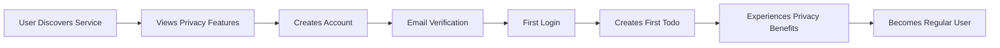
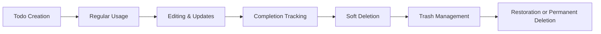
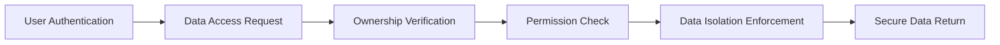

# Multi-User Todo Application Service Overview

## Service Vision and Purpose

### Why This Service Exists
The Multi-User Todo Application addresses the growing need for secure, private task management solutions in an era of increasing digital privacy concerns. While numerous todo applications exist in the market, most prioritize collaboration and sharing features, leaving a significant gap for users who require robust personal task management with absolute data privacy.

### Market Need Analysis
Current task management solutions typically fall into two categories:
- **Collaboration-focused platforms**: Designed for team workflows with extensive sharing capabilities
- **Simple personal apps**: Basic functionality but often lack comprehensive privacy guarantees

This service fills the critical gap by providing enterprise-grade task management capabilities with ironclad privacy protection, ensuring users can manage their personal and professional tasks without compromising data security.

### Problem Statement
The modern digital user faces increasing concerns about:
- Data privacy and ownership in cloud-based applications
- Unwanted data sharing or exposure through collaboration features
- Complexity of task management systems designed for teams rather than individuals
- Lack of comprehensive edit history and audit trails for personal task management

## Target User Base

### Primary User Personas

#### Professional Individual Users
- **Demographics**: Professionals aged 25-55 working in knowledge-intensive industries
- **Needs**: Secure task management for work-related projects, personal organization, and confidential planning
- **Pain Points**: Concerns about corporate data security, need for audit trails, requirement for reliable task tracking

#### Privacy-Conscious Personal Users
- **Demographics**: Individuals concerned about digital privacy, data ownership, and personal information security
- **Needs**: Personal task management without data sharing, comprehensive history tracking, reliable backup and recovery
- **Pain Points**: Distrust of free services with data mining practices, desire for complete control over personal information

#### Small Business Owners
- **Demographics**: Entrepreneurs and small business owners managing multiple projects
- **Needs**: Professional task management without the complexity and cost of enterprise collaboration tools
- **Pain Points**: Overwhelmed by feature-rich team applications, need for simple yet powerful individual task management

## Core Value Proposition

### Key Differentiators

#### Absolute Privacy Guarantee
- **WHEN** a user creates an account, **THE** system **SHALL** ensure complete data isolation between users
- **THE** system **SHALL** guarantee that no user can access, view, or share another user's todos under any circumstances
- **WHILE** the application operates, **THE** privacy protection **SHALL** remain active without any configuration required from the user

#### Comprehensive Edit History
- **WHEN** a user edits any todo item, **THE** system **SHALL** automatically create a detailed history entry
- **THE** history tracking **SHALL** capture changes to title, description, start date, and due date with timestamps
- **WHERE** audit trails are needed, **THE** system **SHALL** provide complete visibility into todo modification history

#### Intelligent Soft Deletion System
- **WHEN** a user deletes a todo, **THE** system **SHALL** move it to a trash system rather than permanent deletion
- **THE** trash management **SHALL** allow users to restore accidentally deleted items
- **IF** a user permanently deletes an item from trash, **THE** system **SHALL** remove all associated data including edit history

### Unique Selling Points

1. **Privacy-First Design**: Unlike collaborative todo apps, this service prioritizes individual privacy above all else
2. **Comprehensive Audit Trails**: Full edit history provides unprecedented visibility into task evolution
3. **Flexible Task Management**: Support for start dates, due dates, and comprehensive filtering/sorting options
4. **User-Controlled Data Lifecycle**: From creation to permanent deletion, users maintain complete control

## Business Objectives

### Strategic Goals

#### Short-Term Objectives (0-6 months)
- Achieve 10,000 registered users within the first six months
- Maintain 99.9% service availability
- Establish positive user reviews focusing on privacy and reliability
- Implement continuous improvement based on user feedback

#### Medium-Term Objectives (6-18 months)
- Expand to 50,000 active users with strong retention rates
- Introduce premium features while maintaining free core functionality
- Build brand recognition as the leading privacy-focused todo application
- Develop mobile applications to complement web functionality

#### Long-Term Vision (18+ months)
- Become the industry standard for secure personal task management
- Expand into adjacent productivity tools while maintaining privacy focus
- Establish enterprise-grade security certifications
- Build a sustainable business model around privacy-respecting premium features

### Revenue Strategy

#### Freemium Model Approach
The service will employ a sustainable freemium model:
- **Free Tier**: Core todo functionality with privacy guarantees
- **Premium Tier**: Advanced features such as extended history retention, advanced analytics, and priority support

#### Monetization Timeline
- **Phase 1 (0-12 months)**: Focus on user acquisition with completely free service
- **Phase 2 (12-24 months)**: Introduce premium features with clear value differentiation
- **Phase 3 (24+ months)**: Refine pricing strategy based on user adoption and market feedback

### Growth Plan

#### User Acquisition Strategy
- **Content Marketing**: Create educational content about digital privacy and task management
- **Word-of-Mouth Referrals**: Leverage privacy-focused communities and forums
- **Partnerships**: Collaborate with privacy advocacy organizations
- **SEO Optimization**: Target keywords related to "private todo app" and "secure task management"

#### Retention Strategy
- **WHEN** users interact with the application, **THE** system **SHALL** provide reliable performance and intuitive user experience
- **THE** service **SHALL** maintain consistent uptime and rapid response times to ensure user satisfaction
- **WHERE** user feedback is provided, **THE** development team **SHALL** prioritize improvements based on common requests

## Competitive Landscape

### Market Position Analysis

#### Direct Competitors
- **Simple Todo Apps**: Basic functionality but lack privacy guarantees and comprehensive features
- **Collaboration Platforms**: Over-engineered for individual use with unnecessary sharing capabilities
- **Note-taking Applications**: Often include todo features but not optimized for task management

#### Competitive Advantages
1. **Privacy Focus**: Unlike competitors who monetize through data, this service respects user privacy
2. **Comprehensive Feature Set**: Combines simplicity with powerful features like edit history and trash management
3. **User-Centric Design**: Built specifically for individual users rather than adapting team collaboration tools

#### Market Differentiation
- **Privacy by Design**: Not an afterthought but the core architectural principle
- **Audit Trail Focus**: Unique emphasis on tracking changes and maintaining history
- **Controlled Collaboration**: While primarily individual-focused, the architecture allows for future privacy-respecting sharing options

## Success Metrics

### Key Performance Indicators (KPIs)

#### User Engagement Metrics
- **Monthly Active Users (MAU)**: Target 85% monthly retention rate
- **Daily Active Users (DAU)**: Target 40% daily engagement rate
- **Average Session Duration**: Target 8+ minutes per session
- **Feature Adoption Rate**: Track usage of advanced features like filtering and history viewing

#### Business Health Metrics
- **User Acquisition Cost**: Maintain cost-effective growth through organic channels
- **Customer Lifetime Value**: Build sustainable value through premium feature adoption
- **Net Promoter Score (NPS)**: Target score of +50 within first year
- **Churn Rate**: Maintain monthly churn below 5%

#### Technical Performance Metrics
- **Uptime**: 99.9% service availability target
- **Response Time**: Average API response time under 200ms
- **Error Rate**: Maintain error rate below 0.1% of requests
- **Data Security**: Zero data breaches or privacy incidents

### Success Criteria Definition

#### Minimum Viable Success
- 5,000 registered users within first 6 months
- 90% positive user feedback on privacy features
- Consistent service availability above 99.5%

#### Target Success
- 25,000 active users with 80% retention rate
- Industry recognition as leading privacy-focused todo application
- Sustainable revenue from premium features

#### Exceptional Success
- 100,000+ active user base
- Expansion into adjacent productivity tools
- Establishment as industry standard for secure task management

## Future Vision and Expansion Opportunities

### Product Roadmap Considerations

#### Phase 1: Core Functionality
- Complete implementation of specified todo management features
- Robust authentication and privacy protection
- Comprehensive testing and security validation

#### Phase 2: Enhanced User Experience
- Mobile application development
- Advanced filtering and sorting capabilities
- Integration with calendar systems

#### Phase 3: Ecosystem Expansion
- Privacy-respecting sharing options (opt-in only)
- Advanced analytics and reporting
- API development for third-party integrations

### Long-term Strategic Direction
The service will maintain its core commitment to privacy while exploring adjacent opportunities in the productivity space. All expansions will be evaluated against the fundamental principle of user privacy and data ownership.

## Business Process Flow

### User Registration and Onboarding

### Todo Lifecycle Management

### Data Privacy Assurance Process

## Comprehensive Business Requirements

### Privacy-First Architecture Requirements
- **WHEN** designing system architecture, **THE** development team **SHALL** prioritize data isolation as the foundational principle
- **THE** system **SHALL** implement strict access controls that prevent any cross-user data visibility
- **WHERE** user data is stored, **THE** system **SHALL** employ encryption and secure storage practices

### User Experience Requirements
- **WHEN** users interact with the application, **THE** system **SHALL** provide intuitive navigation and clear feedback
- **THE** interface **SHALL** emphasize privacy features and data control options prominently
- **WHERE** performance is concerned, **THE** system **SHALL** maintain responsive interactions under all normal load conditions

### Scalability Requirements
- **THE** system **SHALL** be designed to scale horizontally to accommodate user growth
- **WHEN** user base expands, **THE** system **SHALL** maintain performance standards without degradation
- **WHERE** data volume increases, **THE** system **SHALL** implement efficient data management strategies

### Security Requirements
- **THE** system **SHALL** implement industry-standard security practices for authentication and data protection
- **WHEN** security vulnerabilities are identified, **THE** development team **SHALL** prioritize timely remediation
- **WHERE** compliance requirements exist, **THE** system **SHALL** meet or exceed all regulatory standards

## Implementation Guidelines

### Development Priorities
1. **Core Privacy Infrastructure**: Implement robust data isolation and access controls
2. **Basic Todo Functionality**: Deliver reliable todo creation, editing, and completion features
3. **Advanced Features**: Add history tracking, trash management, and filtering capabilities
4. **Performance Optimization**: Ensure system responsiveness under various load conditions

### Quality Assurance Focus Areas
- **Data Isolation Testing**: Verify that user data remains completely private
- **Feature Completeness**: Ensure all specified functionality works as intended
- **Performance Validation**: Confirm that response times meet user expectations
- **Security Auditing**: Regularly test for vulnerabilities and compliance gaps

### User Acceptance Criteria
The service will be considered ready for production when:
- All privacy guarantees are demonstrably functional
- Core todo management features work reliably
- Performance metrics meet or exceed specified targets
- Security testing confirms robust protection measures

> *Developer Note: This document defines **business requirements only**. All technical implementations (architecture, APIs, database design, etc.) are at the discretion of the development team.*