**multiUserTodo — Business concepts, relationships, and states from user perspective**

Business concepts, relationships, and states from user perspective

# Domain Concepts

Describe what each concept means to users and why it exists.

## User Concept

A User represents an individual account holder in the multi-user Todo application. Users create accounts by registering with their email address and a secure password. Each user has a unique identity within the system that ensures their todos remain private and inaccessible to others. Users can authenticate themselves through login credentials to access their personal todo workspace. The user concept enables personalization by allowing users to set a display name that appears throughout their interface. Users manage their own account settings, including password changes and account deletion. When a user deletes their account, all associated todos and edit history are permanently removed from the system. The user concept establishes the foundation for data privacy and ownership in the application.

### User Account Creation

## User Account Creation

A User Account represents an individual's identity within the multi-user Todo application. Each account provides a private workspace for managing personal todos.

### Account Registration Process

WHEN a guest registers for a new account, THE system SHALL:
1. Require a valid email address that is not already registered
2. Require a secure password meeting complexity requirements
3. Create a unique user identity associated with the email
4. Establish a personal workspace isolated from other users

IF the email is already registered, THE system SHALL reject the registration.
IF the password does not meet security requirements, THE system SHALL reject the registration.

### Account Properties

Each User Account SHALL contain:
- Email address (unique identifier)
- Hashed password (secure authentication)
- Display name (user's visible identity)
- Account creation timestamp
- Account status (active/suspended/deleted)

THE system SHALL ensure that email addresses remain unique across all accounts.
THE system SHALL protect password data using industry-standard hashing algorithms.

### Authentication Process

## Authentication Process

Authentication verifies a user's identity before granting access to their personal todo workspace.

### Login Credentials Verification

WHEN a user attempts to log in, THE system SHALL:
1. Validate the provided email address exists in the system
2. Verify the provided password matches the stored hash
3. Establish an authenticated session for valid credentials
4. Grant access to the user's personal workspace

IF the email address is not found, THE system SHALL reject the login attempt.
IF the password does not match, THE system SHALL reject the login attempt.

### Session Management

WHILE a user remains authenticated, THE system SHALL:
1. Maintain session state for continuous access
2. Allow access to all user-specific operations
3. Enforce privacy boundaries preventing cross-user data access

WHEN a user logs out or the session expires, THE system SHALL terminate access to the personal workspace.

### Account Ownership and Privacy

## Account Ownership and Privacy

Each User Account establishes complete ownership over personal data and enforces strict privacy boundaries.

### Data Isolation

THE system SHALL ensure that each user's todos, edit history, and profile information are completely isolated from other users.

WHEN any user accesses the system, THE system SHALL restrict data visibility to only that user's own content.

### Privacy Boundary Enforcement

THE system SHALL prevent:
- Viewing other users' profiles
- Accessing other users' todos
- Seeing other users' edit history
- Any form of data sharing between accounts

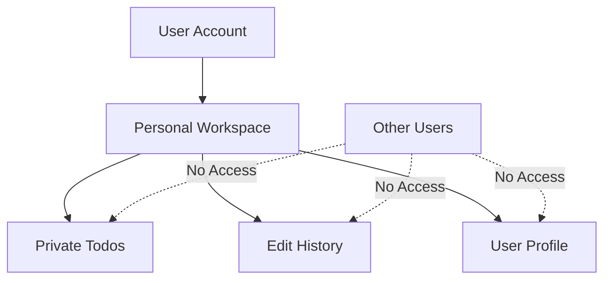

### Account Management Operations

## Account Management Operations

Users have full control over their account lifecycle and personal information.

### Profile Management

WHEN a user updates their display name, THE system SHALL:
1. Validate the new display name meets format requirements
2. Update the user's profile with the new display name
3. Reflect the change throughout the user's interface

### Password Management

WHEN a user changes their password, THE system SHALL:
1. Require verification of the current password
2. Validate the new password meets security requirements
3. Update the password hash securely
4. Invalidate any existing sessions for security

### Account Deletion

WHEN a user deletes their account, THE system SHALL:
1. Permanently remove all user's todos, including those in trash
2. Permanently remove all associated edit history
3. Completely erase the user account and profile
4. Ensure no data remnants remain in the system

IF account deletion is requested, THE system SHALL provide confirmation before permanent removal.

### User Identity and Registration Flow

## User Identity and Registration Flow

User Identity establishes the foundation for personalization and data ownership within the application.

### Registration Flow

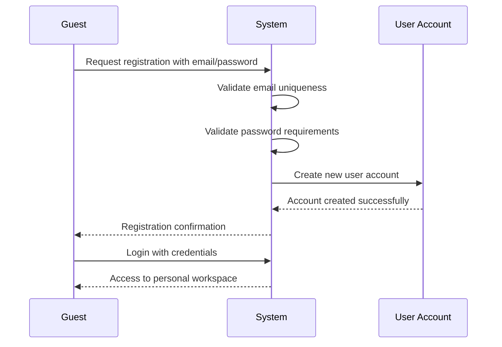

### Identity Establishment

THE system SHALL establish user identity through:
- Unique email address as primary identifier
- Secure authentication credentials
- Personal display name for interface personalization
- Private workspace association

WHEN a user identity is established, THE system SHALL maintain consistent association between the user and all their created content.

### Identity Verification

THE system SHALL verify user identity before allowing:
- Access to personal todos
- Modification of account settings
- Viewing of edit history
- Any data management operations

## Todo Concept

A Todo represents a single task or item that users create to track their work or personal activities. Each todo has a required title that serves as the primary identifier for the task. Users can add optional details through a description field to provide context or additional information. Todos support scheduling through optional start and due dates that help users plan their work timeline. New todos are created in an incomplete state by default, representing work that needs to be done. Users interact with todos by marking them complete when finished or incomplete if work remains. Todos can be edited to update any of their properties as plans change over time. Each todo maintains its own edit history that tracks all changes made throughout its lifecycle. Users organize their todos through filtering by completion status and sorting by various date fields. Todos that are deleted move to a trash area where they can be restored or permanently removed.

### Task Creation and Initial State

### Todo Creation Process

WHEN a user creates a new todo, THE system SHALL:
1. Require a title as the primary identifier for the task
2. Allow an optional description field for additional context
3. Accept optional start date for scheduling purposes
4. Accept optional due date for deadline tracking
5. Initialize the todo in an incomplete state by default
6. Associate the todo exclusively with the creating user
7. Record the creation timestamp automatically

IF the title is missing or empty, THE system SHALL reject the creation request.
IF the due date precedes the start date, THE system SHALL reject the creation request.

### Initial Todo State

WHEN a todo is first created, THE system SHALL:
1. Assign a unique identifier to the todo
2. Set the creation timestamp to the current date and time
3. Mark the todo as incomplete (isCompleted = false)
4. Store empty values for optional fields that were not provided
5. Create an initial edit history entry recording the creation event

THE system SHALL ensure that only the creating user can access the newly created todo.

### Core Todo Properties

### Required Properties

THE system SHALL maintain the following required properties for each todo:
1. **Title**: A short, descriptive name that identifies the task
2. **Creation Date**: The timestamp when the todo was created
3. **Owner**: The user who created and owns the todo
4. **Completion Status**: Boolean indicating whether the todo is complete

### Optional Properties

THE system SHALL support the following optional properties:
1. **Description**: Detailed information about the task (can be empty)
2. **Start Date**: The planned start date for the task (can be empty)
3. **Due Date**: The target completion date for the task (can be empty)

### Property Constraints

WHEN setting todo properties, THE system SHALL:
1. Enforce that title cannot be empty or contain only whitespace
2. Validate that start date and due date are valid date values
3. Ensure that due date cannot precede start date when both are set
4. Allow description to contain any text content without length restrictions

IF an invalid property value is provided, THE system SHALL reject the operation and notify the user of the specific validation failure.

### Completion Tracking and Status Management

### Completion Status Operations

WHEN a user marks a todo as complete, THE system SHALL:
1. Update the completion status to true
2. Record the completion timestamp in the edit history
3. Maintain the todo's position in the user's list
4. Allow the user to filter for completed todos

WHEN a user marks a todo as incomplete, THE system SHALL:
1. Update the completion status to false
2. Record the status change in the edit history
3. Make the todo available for incomplete todo filtering
4. Preserve all other todo properties unchanged

### Completion Status Behavior

WHILE a todo is marked as complete, THE system SHALL:
1. Display it with visual indicators of completion
2. Include it in "complete todos" filter results
3. Exclude it from "incomplete todos" filter results
4. Allow the user to toggle it back to incomplete at any time

WHILE a todo is marked as incomplete, THE system SHALL:
1. Display it as an active, pending task
2. Include it in "incomplete todos" filter results
3. Exclude it from "complete todos" filter results
4. Allow the user to mark it complete at any time

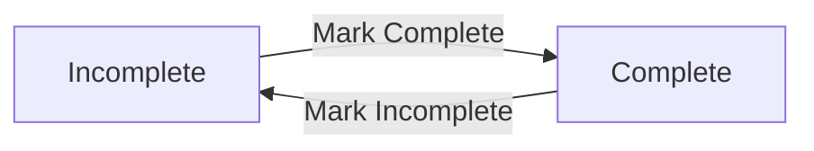

### Scheduling Features and Date Management

### Start Date Functionality

WHEN a start date is set for a todo, THE system SHALL:
1. Store the date value for scheduling purposes
2. Allow the todo to be sorted by start date
3. Display the start date in todo listings
4. Enable filtering based on start date ranges (future enhancement)

WHEN a start date is not provided, THE system SHALL:
1. Treat the todo as having no specific start date
2. Position the todo at the end when sorting by start date
3. Allow the user to add a start date later through editing

### Due Date Functionality

WHEN a due date is set for a todo, THE system SHALL:
1. Store the deadline value for completion tracking
2. Allow the todo to be sorted by due date
3. Display the due date in todo listings with appropriate urgency indicators
4. Enable deadline-based notifications (future enhancement)

WHEN a due date is not provided, THE system SHALL:
1. Treat the todo as having no specific deadline
2. Position the todo at the end when sorting by due date
3. Allow the user to add a due date later through editing

### Date Validation Rules

IF a user attempts to set a due date that precedes the start date, THE system SHALL reject the operation and notify the user of the scheduling conflict.
IF a user attempts to set invalid date values, THE system SHALL reject the operation and provide specific error information.

### Edit Capabilities and Property Updates

### Todo Editing Operations

WHEN a user edits a todo, THE system SHALL:
1. Allow modification of the title, description, start date, and due date
2. Require that at least one property is changed for the edit to be recorded
3. Create an edit history entry documenting the changes
4. Preserve the previous values of modified properties in the history
5. Update the todo's last modified timestamp

### Property-Specific Editing Rules

WHEN editing the title, THE system SHALL:
1. Require the new title to be non-empty
2. Record the previous title value in the edit history
3. Update the todo's primary identifier

WHEN editing the description, THE system SHALL:
1. Allow the description to be set to empty
2. Record the previous description value in the edit history
3. Accept any text content without restrictions

WHEN editing dates, THE system SHALL:
1. Validate that start date and due date maintain proper chronological order
2. Allow dates to be removed (set to empty)
3. Record previous date values in the edit history

### Edit Validation

IF a user attempts to save an edit with no changes, THE system SHALL not create an edit history entry.
IF a user attempts to save an edit with invalid data, THE system SHALL reject the operation and preserve the original values.

### Todo Lifecycle Management

### Active Todo Lifecycle

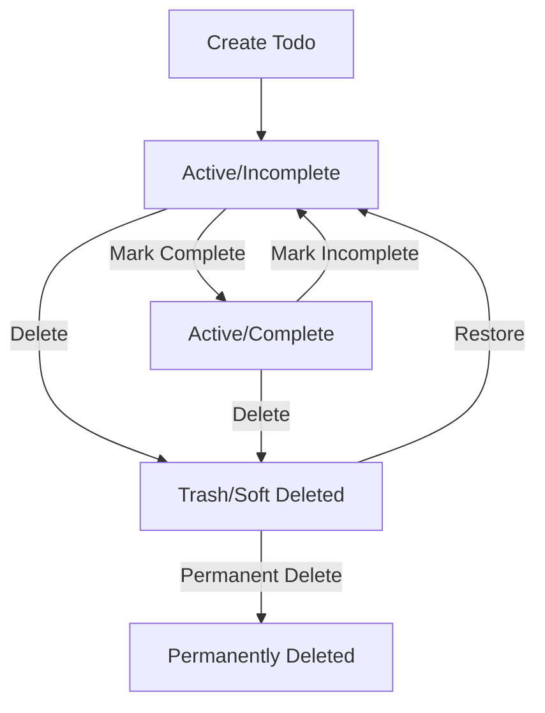

### Active State Management

WHILE a todo is in the active state, THE system SHALL:
1. Display it in the user's main todo list
2. Allow all editing operations (title, description, dates)
3. Support completion status toggling
4. Enable filtering and sorting operations
5. Permit deletion (moving to trash)

### Trash State Management

WHILE a todo is in the trash state, THE system SHALL:
1. Exclude it from the main todo list
2. Display it only in the trash view
3. Allow restoration to active state
4. Permit permanent deletion
5. Prevent editing of todo properties

### Permanent Deletion

WHEN a todo is permanently deleted from trash, THE system SHALL:
1. Remove all todo data from the system
2. Delete all associated edit history entries
3. Make the todo irrecoverable
4. Free up any storage resources associated with the todo

### Organization Methods and User Workflow

### Todo Organization Principles

THE system SHALL provide organization methods that help users:
1. Manage multiple todos effectively
2. Prioritize tasks based on various criteria
3. Group related todos through filtering
4. Arrange todos in meaningful order through sorting

### Completion-Based Organization

WHEN organizing by completion status, THE system SHALL:
1. Group complete todos separately from incomplete todos
2. Allow users to focus on pending work (incomplete filter)
3. Enable review of completed work (complete filter)
4. Provide quick status overview through visual indicators

### Date-Based Organization

WHEN organizing by dates, THE system SHALL:
1. Prioritize todos with approaching due dates
2. Group todos by their planned start dates
3. Arrange todos chronologically by creation date
4. Handle todos without dates appropriately (position at end)

### User Workflow Support

THE system SHALL support common todo management workflows:
1. **Planning**: Creating todos with scheduling information
2. **Execution**: Tracking progress through completion status
3. **Review**: Filtering and sorting to assess workload
4. **Cleanup**: Moving completed or obsolete todos to trash
5. **Archival**: Permanent deletion of unnecessary todos

### Filtering Options and View Management

### Completion Status Filtering

WHEN a user filters by completion status, THE system SHALL:
1. **All Todos**: Display both complete and incomplete todos
2. **Complete Only**: Show only todos marked as complete
3. **Incomplete Only**: Show only todos marked as incomplete

### Filter Application Rules

WHEN applying completion filters, THE system SHALL:
1. Maintain the current sorting order within the filtered set
2. Apply pagination to the filtered results
3. Update the display count to reflect the filtered quantity
4. Provide clear visual indication of the active filter

### Filter Persistence

THE system SHALL:
1. Remember the user's last applied filter between sessions
2. Allow users to change filters without losing their place in pagination
3. Reset filters when explicitly requested by the user
4. Handle empty filter results with appropriate messaging

### Future Filtering Capabilities

THE system MAY support additional filtering options in future versions:
1. Date range filtering (start date, due date)
2. Text search within todo titles and descriptions
3. Combined filters (e.g., incomplete todos with due dates)

### Sorting Mechanisms and Display Order

### Available Sorting Options

THE system SHALL allow users to sort their todo list by:
1. **Creation Date**: Newest first or oldest first
2. **Start Date**: Earliest first or latest first
3. **Due Date**: Earliest first or latest first

### Sorting Behavior Rules

WHEN sorting by creation date, THE system SHALL:
1. **Newest First**: Show most recently created todos first
2. **Oldest First**: Show oldest created todos first
3. Use exact timestamp precision for accurate ordering

WHEN sorting by start date, THE system SHALL:
1. **Earliest First**: Show todos with earliest start dates first
2. **Latest First**: Show todos with latest start dates first
3. Position todos without start dates at the end
4. Use date comparison without time component

WHEN sorting by due date, THE system SHALL:
1. **Earliest First**: Show todos with earliest due dates first
2. **Latest First**: Show todos with latest due dates first
3. Position todos without due dates at the end
4. Use date comparison without time component

### Sorting and Pagination Integration

THE system SHALL:
1. Apply sorting before pagination to ensure correct order
2. Maintain sort order across pagination pages
3. Allow users to change sort order without losing their place
4. Provide visual indicators of the current sort method and direction

### Trash Handling and Deletion Management

### Soft Delete Process

WHEN a user deletes a todo, THE system SHALL:
1. Move the todo to the trash instead of permanent deletion
2. Preserve all todo properties and edit history
3. Remove the todo from the main todo list
4. Record the deletion timestamp
5. Allow the todo to be restored later

### Trash View Management

WHEN a user views their trash, THE system SHALL:
1. Display only todos that have been soft-deleted
2. Apply pagination to the trash list
3. Show basic todo information (title, deletion date, original dates)
4. Provide options to restore or permanently delete each todo

### Restoration Process

WHEN a user restores a todo from trash, THE system SHALL:
1. Return the todo to the main todo list
2. Preserve all original properties and edit history
3. Maintain the todo's completion status
4. Remove the todo from the trash view
5. Record the restoration timestamp in the edit history

### Permanent Deletion from Trash

WHEN a user permanently deletes a todo from trash, THE system SHALL:
1. Remove all todo data from the system permanently
2. Delete all associated edit history entries
3. Make the todo irrecoverable
4. Free up storage resources
5. Require user confirmation before proceeding

### Trash Cleanup Rules

THE system SHALL:
1. Maintain todos in trash indefinitely until user action
2. Not automatically purge todos from trash
3. Allow users to manage their trash content manually
4. Provide clear warnings before permanent deletion operations

## EditHistory Concept

EditHistory represents the complete record of changes made to a todo throughout its existence. Each time a user edits any property of a todo, a new history entry is automatically created. The history captures exactly what was changed, including the previous values of title, description, start date, and due date. Users can view the full edit history of any todo to understand how it has evolved over time. History entries are timestamped to show exactly when each change occurred. The edit history provides transparency and accountability for todo modifications. Users benefit from seeing the progression of their todos from creation through various updates. The history serves as an audit trail that cannot be modified or deleted by users. When a todo is permanently deleted from trash, its associated edit history is also removed. Edit history entries are displayed in chronological order from most recent to oldest.

### Change Tracking Mechanism

THE system SHALL automatically track all changes made to todo properties.

WHEN a user edits any property of a todo, THE system SHALL:
1. Capture the previous value of the changed property
2. Record the timestamp when the edit occurred
3. Associate the change with the user who made the edit
4. Create a new history entry linked to the todo

THE system SHALL track changes to:
- Title (when modified)
- Description (when modified)
- Start date (when modified)
- Due date (when modified)

IF multiple properties are edited simultaneously, THE system SHALL create a single history entry containing all changes made in that edit operation.

### Audit Trail Characteristics

THE system SHALL maintain a complete audit trail for every todo.

THE audit trail SHALL:
1. Provide chronological record of all modifications
2. Show exactly what was changed in each edit
3. Display who made each change
4. Indicate when each change occurred

WHILE a todo exists in the system, THE system SHALL preserve all edit history entries.

THE audit trail SHALL be accessible to users for transparency and accountability purposes.

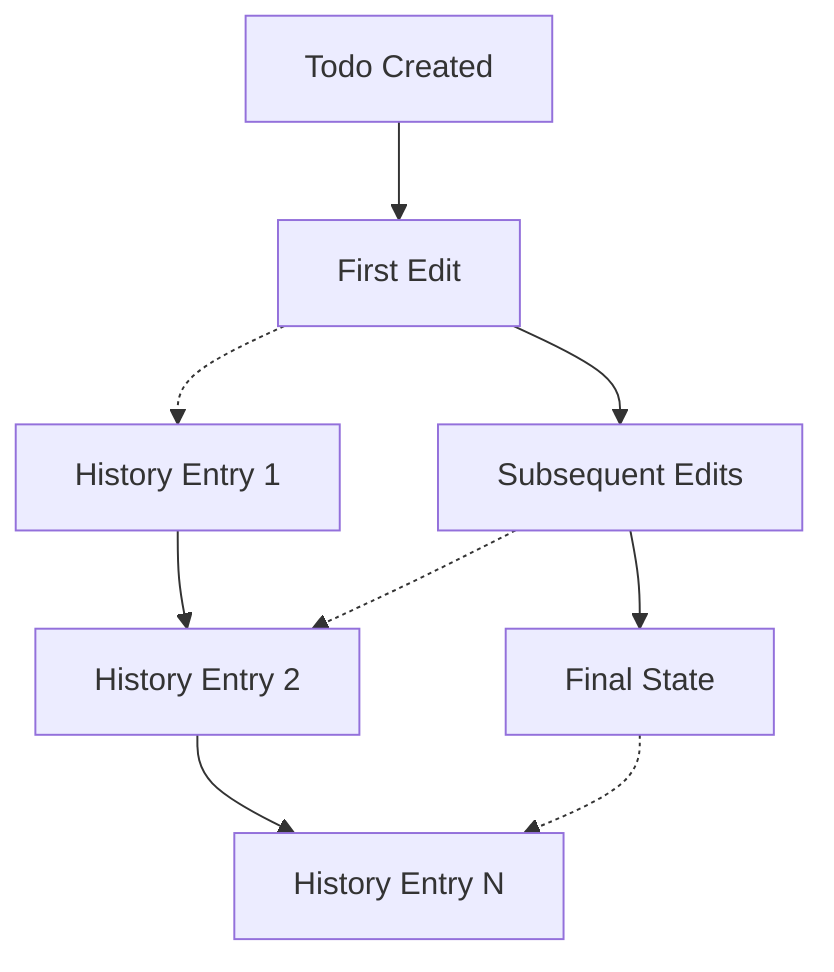

### Historical View Capabilities

THE system SHALL provide users with a comprehensive historical view of their todos.

WHEN a user requests to view a todo's edit history, THE system SHALL:
1. Display all history entries for that todo
2. Sort entries from most recent to oldest
3. Show the timestamp of each edit
4. Display which user made each edit
5. Show exactly which properties were changed
6. Display the previous values of changed properties

THE historical view SHALL allow users to:
- Understand the progression of their todo over time
- See how each edit contributed to the todo's current state
- Track the evolution of todo details from creation to present

IF a todo has no edit history, THE system SHALL indicate that no edits have been made.

### Property Change Logging

THE system SHALL log property changes with precision and completeness.

FOR EACH property change, THE system SHALL record:
1. The property that was modified
2. The previous value of the property
3. The timestamp when the change occurred
4. The user who initiated the change

WHEN a property value is cleared (set to empty/null), THE system SHALL record the previous value before clearing.

WHEN a property value is set (from empty to non-empty), THE system SHALL record the new value and indicate the previous state was empty.

THE system SHALL handle partial edits where only some properties are modified while others remain unchanged.

### Immutable Record Properties

THE system SHALL maintain edit history as immutable records.

ONCE a history entry is created, THE system SHALL:
1. Prevent modification of the recorded data
2. Prevent deletion of the history entry
3. Preserve the accuracy of timestamps and change details

WHILE a todo exists in the system, THE system SHALL retain all associated edit history entries.

THE system SHALL only remove edit history entries when:
- The associated todo is permanently deleted from trash
- The user account owning the todo is deleted

THE immutable nature of edit history SHALL ensure:
- Data integrity and reliability
- Accurate accountability for changes
- Trustworthy audit trail functionality

# Domain Relationships

Describe how concepts relate to each other from a business perspective.

## Conceptual Relationships

Describe how concepts relate to each other in business terms.

### User-Todo Ownership Relationship

THE system SHALL establish a one-to-many ownership relationship where each User owns multiple Todo entities.

WHEN a User creates a Todo, THE system SHALL associate the Todo with that User as the owner.

WHEN a User views their todo list, THE system SHALL display only Todos owned by that User.

WHEN a User edits a Todo, THE system SHALL verify that the User owns the Todo before allowing the edit.

WHEN a User deletes their account, THE system SHALL permanently delete all Todos owned by that User.

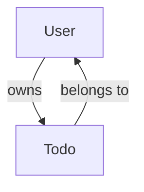

### Todo-EditHistory Association

THE system SHALL establish a one-to-many association where each Todo has multiple EditHistory entries.

WHEN a User edits a Todo, THE system SHALL create a new EditHistory entry associated with that Todo.

WHEN a User views a Todo's edit history, THE system SHALL display all EditHistory entries associated with that Todo.

WHEN a Todo is permanently deleted from trash, THE system SHALL delete all associated EditHistory entries.

WHILE a Todo exists, THE system SHALL maintain its complete EditHistory.

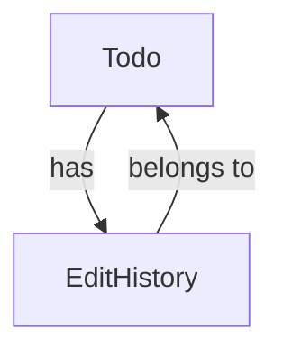

### User-EditHistory Association

THE system SHALL establish a one-to-many association where each User has multiple EditHistory entries.

WHEN a User edits a Todo, THE system SHALL associate the EditHistory entry with the User who made the edit.

WHEN a User views their todo's edit history, THE system SHALL display only EditHistory entries associated with their actions.

WHEN a User deletes their account, THE system SHALL permanently delete all EditHistory entries associated with that User.

THE system SHALL maintain the association between EditHistory entries and the User who created them.

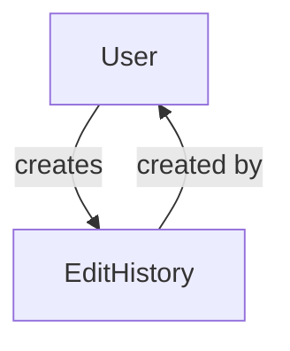

### Business Relationship Patterns

THE system SHALL implement the following business relationship patterns:

**Ownership Pattern**:
- Users own their Todos
- Users own their EditHistory entries
- Ownership implies exclusive control and privacy

**Association Pattern**:
- Todos have EditHistory entries
- EditHistory entries belong to specific Todos
- Associations enable tracking and auditing

**Belongs-to Pattern**:
- Each Todo belongs to exactly one User
- Each EditHistory entry belongs to exactly one Todo
- Each EditHistory entry belongs to exactly one User

**Has-many Pattern**:
- Each User has many Todos
- Each User has many EditHistory entries
- Each Todo has many EditHistory entries

THE system SHALL enforce these relationship patterns consistently across all operations.

### Data Isolation Boundaries

THE system SHALL maintain strict data isolation boundaries based on relationship ownership.

WHEN a User accesses any Todo-related data, THE system SHALL verify ownership before granting access.

WHEN a User views their todo list, THE system SHALL return only Todos where the User owns the Todo.

WHEN a User views edit history, THE system SHALL return only EditHistory entries where the User owns the Todo being edited.

IF a User attempts to access a Todo they do not own, THE system SHALL reject the request.

IF a User attempts to access EditHistory for a Todo they do not own, THE system SHALL reject the request.

THE system SHALL ensure that relationship-based isolation prevents any cross-user data visibility.

## Lifecycle and Retention

Describe business rules for concept lifecycle and data retention from a user perspective.

### Todo Lifecycle Management

## Todo Lifecycle Management

THE system SHALL manage the complete lifecycle of todo items from creation through final disposition.

### Creation Phase
WHEN a user creates a todo, THE system SHALL:
- Initialize the todo with incomplete status
- Record the creation timestamp
- Associate the todo with the creating user

### Active Phase
WHILE a todo exists in the active state, THE system SHALL:
- Allow the user to toggle completion status between complete and incomplete
- Track all edits through the EditHistory mechanism
- Display the todo in the user's main todo list

### Edit Tracking
WHEN any todo property is modified, THE system SHALL:
- Create an EditHistory entry recording the change
- Preserve the previous value of each modified field
- Associate the EditHistory entry with both the todo and the user who made the change

### Deletion Phase
WHEN a user deletes a todo, THE system SHALL:
- Move the todo to the trash state (soft delete)
- Remove the todo from the user's main todo list
- Preserve all EditHistory entries associated with the todo

### Final Disposition Phase
WHILE a todo exists in the trash state, THE system SHALL:
- Allow the user to restore the todo to active state
- Allow the user to permanently delete the todo
- Maintain the todo's EditHistory until permanent deletion

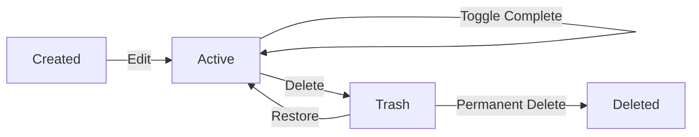

### Data Retention Policies

## Data Retention Policies

THE system SHALL implement retention policies that govern how long user data persists in the system.

### Active Todo Retention
WHILE a user account remains active, THE system SHALL:
- Retain all active todos indefinitely
- Preserve all EditHistory entries for active todos
- Maintain the ability to view and edit active todos

### Trash Retention
WHEN a todo is moved to trash, THE system SHALL:
- Retain the todo in trash state until user action
- Preserve EditHistory entries while the todo remains in trash
- Not automatically purge todos from trash

### Account Deletion Impact
WHEN a user deletes their account, THE system SHALL:
- Permanently delete all active todos belonging to the user
- Permanently delete all todos in trash belonging to the user
- Permanently delete all EditHistory entries associated with the user's todos
- Complete the deletion process within the account deletion transaction

### EditHistory Retention
THE system SHALL retain EditHistory entries:
- For the lifetime of their associated todo
- Through todo state transitions (active to trash)
- Until permanent deletion of the associated todo

IF a todo is permanently deleted, THE system SHALL delete all associated EditHistory entries.

### Archival Mechanisms

## Archival Mechanisms

THE system SHALL provide archival capabilities that preserve data while removing it from active view.

### Soft Delete Archival
WHEN a user deletes a todo, THE system SHALL:
- Archive the todo by marking it as deleted (soft delete)
- Remove the todo from the user's active todo list
- Preserve the todo's complete data including all properties
- Maintain all EditHistory entries associated with the archived todo

### Trash View Access
WHILE a todo exists in archival (trash) state, THE system SHALL:
- Allow the user to view the archived todo list (trash)
- Display archived todos with pagination similar to active todos
- Show the same todo properties as in the active list
- Provide access to the todo's complete EditHistory

### Archival Integrity
THE system SHALL ensure archival integrity by:
- Preserving all todo properties during archival
- Maintaining the association between archived todos and their owner
- Keeping EditHistory entries accessible for archived todos
- Preventing modification of archived todos except through restoration

WHERE archival is implemented, THE system SHALL maintain data consistency across state transitions.

### Deletion Policy

## Deletion Policy

THE system SHALL implement a deletion policy that governs permanent data removal.

### Permanent Todo Deletion
WHEN a user permanently deletes a todo from trash, THE system SHALL:
- Remove the todo from the system completely
- Delete all EditHistory entries associated with the todo
- Ensure the deletion is irreversible
- Complete the deletion within a single transaction

### Account Deletion Policy
WHEN a user deletes their account, THE system SHALL:
- Permanently delete all active todos owned by the user
- Permanently delete all todos in trash owned by the user
- Permanently delete all EditHistory entries associated with the user's todos
- Ensure no data remnants remain after account deletion

### Cascading Deletion Rules
THE system SHALL enforce cascading deletion rules:
- Todo deletion SHALL cascade to associated EditHistory entries
- User account deletion SHALL cascade to all owned todos and their EditHistory
- No orphaned EditHistory entries SHALL remain after todo deletion

### Deletion Authorization
THE system SHALL ensure deletion authorization by:
- Allowing only the todo owner to permanently delete their todos
- Requiring explicit user confirmation for permanent deletion
- Preventing accidental permanent deletion through confirmation mechanisms

IF a user attempts to delete a todo they do not own, THE system SHALL reject the request.

### Recovery Processes

## Recovery Processes

THE system SHALL provide recovery mechanisms for accidentally deleted or archived data.

### Todo Restoration
WHEN a user restores a todo from trash, THE system SHALL:
- Return the todo to active state
- Make the todo visible in the user's main todo list
- Preserve all EditHistory entries associated with the todo
- Maintain all todo properties unchanged during restoration

### Restoration Integrity
THE system SHALL ensure restoration integrity by:
- Preserving all todo properties during the restoration process
- Maintaining the chronological order of EditHistory entries
- Keeping the association between the todo and its owner intact
- Ensuring the restored todo appears in the correct sort order

### Recovery Limitations
WHILE recovery capabilities exist, THE system SHALL:
- Only allow recovery of todos from trash (soft deleted state)
- Prevent recovery of permanently deleted todos
- Maintain the distinction between recoverable and non-recoverable deletions

### User Recovery Interface
THE system SHALL provide a recovery interface that:
- Allows users to browse their trash (archived todos)
- Enables selective restoration of individual todos
- Provides clear indication of which todos are recoverable
- Shows the original deletion timestamp for recovery context

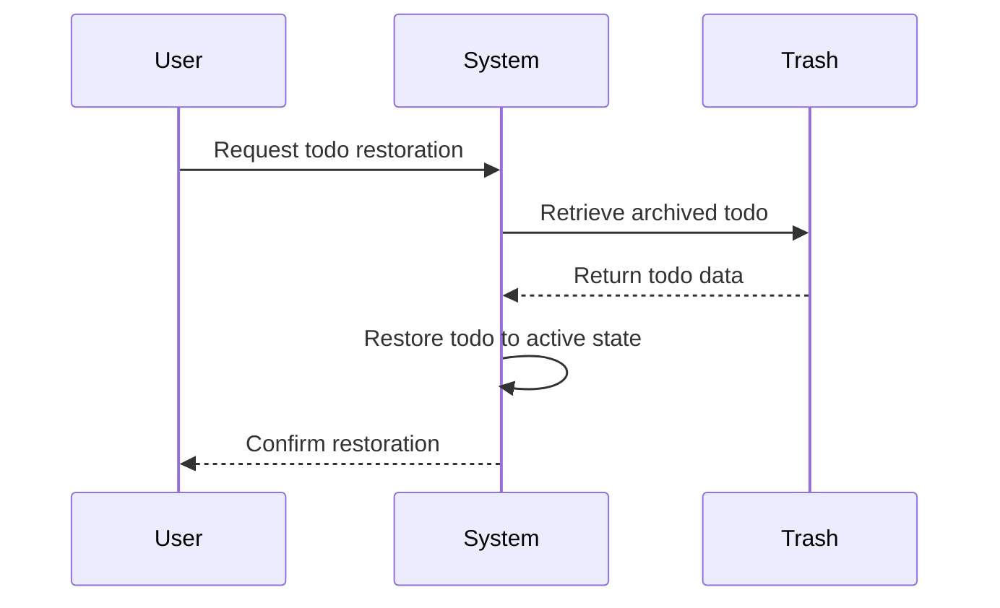

# Business Categories and State Flows

Business category classifications and state flow definitions.

## Business Category Definitions

Define all business category classifications with their allowed values and descriptions.

### Todo Completion Status Classification

THE system SHALL classify todos by completion status using a binary classification system.

**Allowed Values**:
- `incomplete`: The todo has not been completed
- `complete`: The todo has been marked as completed

**Business Rules**:
- WHEN a user creates a new todo, THE system SHALL automatically classify it as `incomplete`
- WHEN a user marks a todo as complete, THE system SHALL change the classification to `complete`
- WHEN a user marks a todo as incomplete, THE system SHALL change the classification to `incomplete`

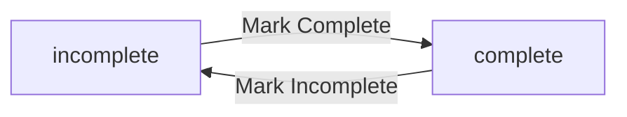

### Todo Lifecycle State Categories

THE system SHALL categorize todos by their lifecycle state using a three-state classification.

**Allowed Values**:
- `active`: The todo is visible in the main todo list
- `deleted`: The todo has been soft-deleted and moved to trash
- `permanently_deleted`: The todo has been permanently removed from the system

**Business Rules**:
- WHEN a user creates a new todo, THE system SHALL automatically categorize it as `active`
- WHEN a user deletes a todo, THE system SHALL change the category to `deleted`
- WHEN a user permanently deletes a todo from trash, THE system SHALL change the category to `permanently_deleted`
- WHEN a user restores a todo from trash, THE system SHALL change the category back to `active`

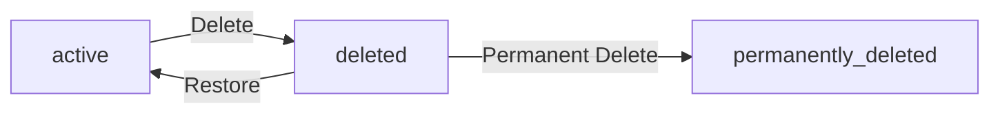

### User Account Status Classification

THE system SHALL classify user accounts by their operational status.

**Allowed Values**:
- `active`: The user account is operational and can access the system
- `deleted`: The user account has been deleted and all associated data is removed

**Business Rules**:
- WHEN a user successfully signs up, THE system SHALL classify the account as `active`
- WHEN a user deletes their account, THE system SHALL change the classification to `deleted`
- IF a user account is classified as `deleted`, THE system SHALL permanently remove all associated todos and edit history

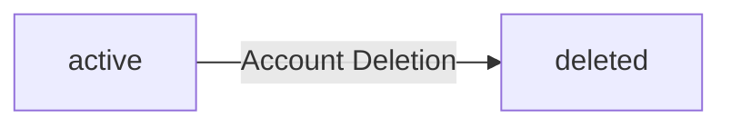

### Edit History Change Type Classification

THE system SHALL classify edit history entries by the type of change made.

**Allowed Values**:
- `title_change`: The todo title was modified
- `description_change`: The todo description was modified
- `start_date_change`: The todo start date was modified
- `due_date_change`: The todo due date was modified
- `completion_status_change`: The todo completion status was modified

**Business Rules**:
- WHEN a user edits a todo property, THE system SHALL create an edit history entry with the corresponding change type
- IF multiple properties are edited simultaneously, THE system SHALL create separate history entries for each change type
- THE system SHALL record only the properties that were actually modified in each edit operation

**Classification Examples**:
- User changes only the title → `title_change`
- User changes title and description → `title_change` + `description_change`
- User marks todo as complete → `completion_status_change`

## State Transitions

Define valid state transition paths for stateful concepts.

### Todo Completion Status Transitions

### Todo Completion Status Transitions

THE system SHALL manage todo completion status transitions between incomplete and complete states.

WHEN a user marks an incomplete todo as complete, THE system SHALL:
1. Change the todo's completion status from incomplete to complete
2. Record the completion timestamp
3. Preserve all other todo properties unchanged

WHEN a user marks a complete todo as incomplete, THE system SHALL:
1. Change the todo's completion status from complete to incomplete
2. Clear any completion timestamp
3. Preserve all other todo properties unchanged

**Status Change Validation Rules:**
- IF a todo is already in the target completion state, THE system SHALL maintain the current state without error
- THE system SHALL only allow completion status changes on todos owned by the requesting user
- THE system SHALL reject completion status changes on todos that are in trash

### Todo Lifecycle State Flow

### Todo Lifecycle State Flow

THE system SHALL manage the lifecycle state flow for todos through active, trash, and permanently deleted states.

WHEN a user deletes a todo from the active list, THE system SHALL:
1. Transition the todo from active state to trash state
2. Remove the todo from the active todo list
3. Preserve the todo's properties and edit history

WHEN a user restores a todo from trash, THE system SHALL:
1. Transition the todo from trash state to active state
2. Return the todo to the active todo list
3. Preserve the todo's properties and edit history

WHEN a user permanently deletes a todo from trash, THE system SHALL:
1. Transition the todo from trash state to permanently deleted state
2. Remove the todo from the trash list
3. Delete all associated edit history records

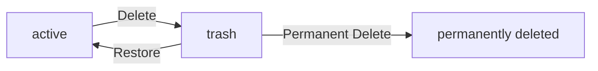

**Lifecycle Transition Rules:**
- THE system SHALL only allow transitions between adjacent states in the lifecycle flow
- THE system SHALL prevent direct transitions from active to permanently deleted state
- THE system SHALL require trash state as an intermediate step before permanent deletion

### Edit History Creation Workflow

### Edit History Creation Workflow

THE system SHALL create edit history entries following a consistent workflow when todo modifications occur.

WHEN a user edits a todo's properties, THE system SHALL:
1. Create a new edit history entry
2. Record the timestamp of the edit
3. Record only the properties that were actually changed
4. Associate the edit history entry with both the todo and the user

**Edit History Recording Rules:**
- IF only the title is changed, THE system SHALL record the titleChange property
- IF only the description is changed, THE system SHALL record the descriptionChange property
- IF only the start date is changed, THE system SHALL record the startDateChange property
- IF only the due date is changed, THE system SHALL record the dueDateChange property
- IF multiple properties are changed in a single edit, THE system SHALL record changes for all modified properties

**Workflow Constraints:**
- THE system SHALL create edit history entries only for active todos
- THE system SHALL not create edit history entries for todos in trash state
- THE system SHALL maintain edit history entries in chronological order from most recent to oldest