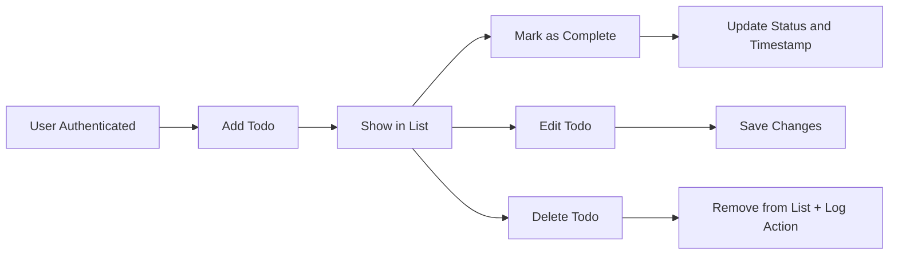

# Requirements Analysis: Todo List Application

## 1. Introduction
The Todo List application enables users to record, organize, and monitor personal or professional tasks efficiently. The application minimizes cognitive overhead, prevents the loss of important tasks, and increases productivity by providing a user-oriented, cloud-accessible system focused on simplicity and reliability.

## 2. User Personas & Their Pain Points
- **Students** who manage assignments, exams, and personal goals, often feeling overwhelmed by numerous deadlines and lack of centralized tracking.
- **Professionals** balancing simultaneous work projects, meetings, and follow-ups, at risk of missing priorities due to fragmented tracking systems.
- **General users** seeking to organize household tasks or self-improvement goals, often frustrated by forgotten errands and lack of motivation.

### Common Pain Points (EARS)
- WHEN tasks are recorded in multiple places, THE user SHALL be unable to trust that their list is up-to-date, leading to duplicated effort or missed items.
- IF prioritization is not supported, THEN important tasks SHALL be lost among low-urgency items, undermining effectiveness.
- THE system SHALL address user anxiety resulting from not having a transparent, single location showing everything outstanding.

## 3. Problem Definition (Reference)
- THE average user SHALL face challenges in managing tasks effectively without a purpose-built tool, particularly when tracking volume and velocity increase.
- WHEN users lack a centralized, accessible system, THE probability of missing or duplicating important tasks SHALL increase.
- IF personal organization relies on memory or fragmented records, THEN routine commitments SHALL be forgotten.
- WHEN an existing solution is hard to set up or excessive in scope, THE user SHALL abandon it quickly, preferring not to use a task system at all.

## 4. Key Product Opportunities
- Provide a secure, user-specific todo list accessible from any device.
- Support basic CRUD operations: create, read (list), update (edit), and delete todos, with intuitive controls and visual cues.
- Enable marking todos as completed, clearly distinguishing active and finished items.
- WHEN a user edits or completes a task, THE update SHALL be reflected in real time across all devices.
- Guarantee user authentication so each todo list is private (unless shared features are explicitly added in future versions).

## 5. Core Functional Requirements (EARS Format)
- WHEN a user is authenticated, THE system SHALL allow creation of a new todo with a title and optional description.
- WHEN a todo is created, THE system SHALL save it in association with the current authenticated user only.
- WHEN viewing the todo list, THE user SHALL see all their own todos, sorted by creation time or status.
- WHEN a user marks a todo as completed, THE system SHALL record the completion timestamp and reflect the status instantly in the UI.
- IF a user edits a todo's content, THEN THE amended details SHALL replace previous text, retaining update timestamps for reference.
- WHEN a user deletes a todo, THE system SHALL permanently remove it from their visible list, and store a deletion log for auditing.
- IF another user is not authenticated, THEN THE system SHALL NOT show any existing todos or allow task operations.
- WHEN a user signs in, THE application SHALL only show the todos belonging to that specific user.

### Authentication and Authorization
- THE application SHALL require users to authenticate with a unique identifier (such as email/login) before accessing the todo features.
- WHEN authentication fails, THE user SHALL be denied access to all todo data.
- THE system SHALL never expose one user's data to another without explicit, future-enabled sharing permissions (MVP excludes group/shared features).

## 6. User Scenarios & Usage Patterns

### Scenario 1: Creating a Todo
- WHEN a user logs in and adds an item, THE system SHALL save the entry and immediately show it at the top of the user's list.

### Scenario 2: Checking Daily Tasks
- WHEN opening the app, THE current day's incomplete todos SHALL be visually prioritized, helping the user know what to tackle next.

### Scenario 3: Marking a Task Complete
- WHEN a user checks off an item, THE system SHALL visibly cross out or dim the item and record the completed timestamp.

### Scenario 4: Editing and Deleting
- WHEN editing, THE system SHALL allow the user to change title or description, instantly updating the view.
- WHEN deleting, THE item SHALL be removed from the visible list and a record SHALL be kept for the user to restore if undelete support is added.

## 7. Product Success Metrics, Milestones, and Business Outcomes
- WHEN the number of overdue or missed tasks for users declines, THE system SHALL be judged effective in its primary purpose.
- THE adoption rate among students and professionals SHALL reflect satisfaction with the problem-solving approach.
- WHEN frequent logins and consistent use are observed, THE application SHALL be confirmed as providing value in everyday task management.

## Mermaid Diagram: User Flow and Requirements Mapping

---
All requirements above serve as an actionable, production-ready analysis grounding the development of a minimal Todo List backend. All core features are described from the user's perspective, mapped to the business outcomes, and formatted for immediate use in further design and engineering phases.