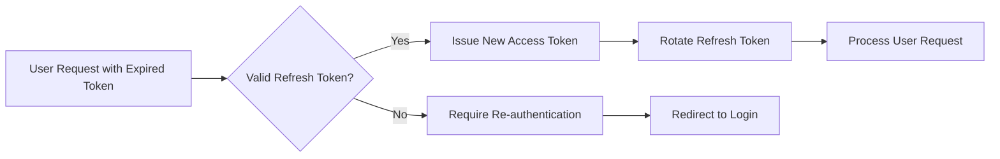

# User Actors and Authentication Requirements

## Introduction

This document defines the user actors, authentication requirements, and account management workflows for the multi-user Todo application. The system provides a private, personal task management solution where each user's data is completely isolated from other users.

## User Actor Definitions

### Authenticated User

The primary actor in the Todo application is the authenticated user who manages personal todos, profile settings, and account operations.

**Actor Characteristics:**
- **Name**: User
- **Type**: Member
- **Description**: Authenticated user who can manage personal todos, profile, and account settings
- **Permissions**: Full access to own todos, profile data, and account operations

**JWT Payload Structure:**
```json
{
  "userId": "unique-user-identifier",
  "role": "user",
  "permissions": ["todo:create", "todo:read", "todo:update", "todo:delete", "profile:manage", "account:manage"]
}
```

## Authentication Requirements

### User Registration

**WHEN** a new user attempts to register, **THE** system **SHALL** validate the email format and password strength.

**Registration Process:**
1. User provides email address and password
2. System validates email format and ensures uniqueness
3. System validates password meets security requirements
4. User account is created with default profile settings
5. Email verification is sent to the provided address

**EARS Requirements:**
- **WHEN** a user submits registration information, **THE** system **SHALL** validate that the email is unique and properly formatted.
- **WHEN** email validation fails, **THE** system **SHALL** return an appropriate error message.
- **WHEN** password validation fails, **THE** system **SHALL** indicate the specific security requirements not met.

### User Login

**WHEN** a user attempts to log in, **THE** system **SHALL** authenticate credentials and establish a secure session.

**Login Process:**
1. User enters email and password
2. System verifies credentials against stored data
3. System generates JWT token with user information
4. User session is established with appropriate permissions

**EARS Requirements:**
- **WHEN** valid credentials are provided, **THE** system **SHALL** generate a JWT token and establish user session.
- **IF** credentials are invalid, **THEN THE** system **SHALL** return authentication failure without indicating whether email or password was incorrect.
- **WHILE** a user is authenticated, **THE** system **SHALL** maintain session security and validate token integrity.

### Session Management

**THE** system **SHALL** implement secure session management with token expiration and refresh capabilities.

**Token Specifications:**
- **Access Token Expiration**: 30 minutes
- **Refresh Token Expiration**: 30 days
- **Token Storage**: Secure HTTP-only cookies
- **Token Rotation**: Refresh tokens are rotated on each use

**EARS Requirements:**
- **WHEN** an access token expires, **THE** system **SHALL** allow token refresh using a valid refresh token.
- **IF** a refresh token is compromised, **THEN THE** system **SHALL** invalidate all tokens for that user.
- **WHILE** a user session is active, **THE** system **SHALL** validate token authenticity on each request.

## Account Management Workflows

### Password Change

**WHEN** a user requests to change their password, **THE** system **SHALL** verify current password and apply new password securely.

**Password Change Process:**
1. User provides current password for verification
2. User enters new password meeting security requirements
3. System validates new password strength
4. Password is updated and all active sessions are notified
5. User receives confirmation of successful password change

**EARS Requirements:**
- **WHEN** a user submits a password change request, **THE** system **SHALL** require current password verification.
- **IF** current password verification fails, **THEN THE** system **SHALL** deny the password change request.
- **WHERE** password changes occur, **THE** system **SHALL** enforce password security requirements.

### Account Deletion

**WHEN** a user requests account deletion, **THE** system **SHALL** permanently remove all user data including todos and edit history.

**Account Deletion Process:**
1. User confirms account deletion intention
2. System performs comprehensive data cleanup:
   - Permanent deletion of all user todos
   - Removal of todo edit history
   - Deletion of user profile data
   - Invalidation of all active sessions
3. User receives confirmation of account deletion
4. All data is irrecoverably removed from the system

**EARS Requirements:**
- **WHEN** account deletion is confirmed, **THE** system **SHALL** permanently remove all user-associated data.
- **IF** deletion confirmation is not provided, **THEN THE** system **SHALL** cancel the deletion process.
- **WHERE** account deletion occurs, **THE** system **SHALL** ensure complete data removal including items in trash.

## Profile Management Requirements

### User Profile Structure

Each user has a profile containing:
- Display name (required)
- Email address (immutable after registration)
- Account creation timestamp
- Last profile update timestamp

**EARS Requirements:**
- **THE** user profile **SHALL** contain a display name that can be edited by the user.
- **WHEN** a user updates their display name, **THE** system **SHALL** record the update timestamp.
- **WHERE** profile information exists, **THE** system **SHALL** ensure it is only accessible to the profile owner.

### Profile Editing

**WHEN** a user edits their profile, **THE** system **SHALL** validate changes and update the profile information.

**Profile Editing Process:**
1. User accesses profile editing interface
2. User modifies display name
3. System validates the new display name
4. Profile is updated with new information
5. Update timestamp is recorded

**EARS Requirements:**
- **WHEN** a user submits profile changes, **THE** system **SHALL** validate the display name format.
- **IF** display name validation fails, **THEN THE** system **SHALL** return specific validation errors.
- **WHILE** profile editing is in progress, **THE** system **SHALL** maintain data consistency.

## Permission Matrix

| Action | Authenticated User |
|--------|-------------------|
| Create new todo | ✅ |
| View own todo list | ✅ |
| View single todo details | ✅ |
| Edit own todo | ✅ |
| Mark todo complete/incomplete | ✅ |
| Delete todo (soft delete) | ✅ |
| View trash (deleted todos) | ✅ |
| Restore todo from trash | ✅ |
| Permanently delete todo from trash | ✅ |
| View todo edit history | ✅ |
| Filter todos by status | ✅ |
| Sort todos by various criteria | ✅ |
| Edit user profile | ✅ |
| Change password | ✅ |
| Delete user account | ✅ |
| View other users' data | ❌ |
| Modify other users' data | ❌ |

## Security Considerations

### Data Privacy

**THE** system **SHALL** ensure complete data isolation between users.

**EARS Requirements:**
- **WHERE** user data exists, **THE** system **SHALL** enforce strict access controls.
- **WHEN** data access is attempted, **THE** system **SHALL** verify user ownership.
- **IF** unauthorized access is detected, **THEN THE** system **SHALL** log the attempt and deny access.

### Authentication Security

**THE** system **SHALL** implement industry-standard authentication security measures.

**Security Measures:**
- Password hashing with salt and appropriate work factor
- Rate limiting on authentication attempts
- Secure token transmission (HTTPS only)
- Session timeout enforcement
- Cross-site request forgery (CSRF) protection

**EARS Requirements:**
- **WHEN** authentication attempts exceed reasonable limits, **THE** system **SHALL** implement temporary lockouts.
- **WHERE** passwords are stored, **THE** system **SHALL** use secure hashing algorithms.
- **WHILE** user sessions are active, **THE** system **SHALL** protect against session hijacking.

### Error Handling

**WHEN** authentication errors occur, **THE** system **SHALL** provide appropriate feedback without revealing sensitive information.

**Error Scenarios:**
- Invalid credentials: Generic error message
- Account locked: Temporary lockout notification
- Token expiration: Redirect to login
- Permission denied: Access denied message

**EARS Requirements:**
- **IF** authentication fails, **THEN THE** system **SHALL** return generic error messages.
- **WHEN** permission checks fail, **THE** system **SHALL** log the attempt and deny access.
- **WHERE** security incidents occur, **THE** system **SHALL** follow established security protocols.

## Token Management Strategy

### JWT Implementation

**THE** system **SHALL** use JSON Web Tokens (JWT) for authentication with the following specifications:

**Access Token:**
- Type: JWT
- Expiration: 30 minutes
- Claims: userId, role, permissions, iat, exp
- Signature: HMAC SHA-256

**Refresh Token:**
- Type: JWT  
- Expiration: 30 days
- Storage: Secure HTTP-only cookie
- Rotation: New token issued on each refresh

**EARS Requirements:**
- **WHEN** a token is issued, **THE** system **SHALL** include necessary claims for authorization.
- **IF** token validation fails, **THEN THE** system **SHALL** require re-authentication.
- **WHERE** token management occurs, **THE** system **SHALL** follow secure token practices.

### Token Refresh Flow



## User Experience Requirements

### Authentication Flow

**THE** authentication process **SHALL** provide clear feedback and intuitive user experience.

**Performance Expectations:**
- Login response time: Under 2 seconds
- Registration processing: Under 3 seconds
- Password change: Under 2 seconds
- Profile updates: Under 1 second

**EARS Requirements:**
- **WHEN** users interact with authentication features, **THE** system **SHALL** provide immediate feedback.
- **WHERE** authentication processes occur, **THE** system **SHALL** maintain responsive performance.
- **IF** authentication processes experience delays, **THEN THE** system **SHALL** provide progress indicators.

### Error Recovery

**WHEN** authentication errors occur, **THE** system **SHALL** provide clear recovery paths.

**Recovery Scenarios:**
- Invalid credentials: Clear instructions for correction
- Account lockout: Information about lockout duration
- Token expiration: Smooth redirect to login
- Network errors: Retry mechanisms with guidance

**EARS Requirements:**
- **WHEN** authentication failures occur, **THE** system **SHALL** provide actionable recovery steps.
- **IF** users encounter repeated authentication issues, **THEN THE** system **SHALL** offer alternative authentication methods.
- **WHERE** error recovery is needed, **THE** system **SHALL** maintain user confidence and trust.

## Compliance and Standards

**THE** system **SHALL** adhere to relevant security and privacy standards.

**Applicable Standards:**
- OWASP Authentication Security Guidelines
- GDPR compliance for user data protection
- Industry best practices for password security
- Secure session management standards

**EARS Requirements:**
- **WHERE** user data is processed, **THE** system **SHALL** comply with data protection regulations.
- **WHEN** authentication mechanisms are implemented, **THE** system **SHALL** follow security best practices.
- **IF** compliance requirements change, **THEN THE** system **SHALL** adapt authentication processes accordingly.

This document defines the complete authentication and user management requirements for the multi-user Todo application. All technical implementation decisions, including specific API designs, database schemas, and architectural choices, are at the discretion of the development team based on these business requirements.