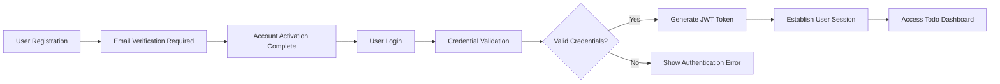

# User Actors and Authentication Requirements for Todo List Application

## Document Purpose
This document defines the complete authentication and authorization requirements for the Todo list application. It specifies user roles, authentication flows, permission structures, and security requirements that backend developers need to implement a secure and functional authentication system.

## User Actor Definitions

### Single User Actor Structure
The Todo list application employs a simplified user model with a single authenticated user type:

**User Actor: Standard Authenticated User**
- **Description**: Individual users who can create, manage, and organize their personal todo items
- **Scope**: Each user has complete control over their own todo items and lists
- **Isolation**: User data is completely isolated - users cannot access or modify other users' todo items

### User Capabilities
Standard authenticated users have the following business-level capabilities:

- **Todo Creation**: Create new todo items with title, description, and status
- **Todo Reading**: View all personal todo items and lists
- **Todo Modification**: Update todo item properties (title, description, status)
- **Todo Deletion**: Remove todo items from personal lists
- **Status Management**: Mark todos as complete, incomplete, or in-progress
- **Personal Organization**: Create, rename, and delete personal todo lists

## Authentication System Requirements

### Core Authentication Functions
The authentication system must provide the following business functions:

**User Registration**
- WHEN a new user provides valid registration information, THE system SHALL create a new user account
- THE system SHALL require email verification before allowing full access
- THE system SHALL validate email uniqueness during registration

**User Login**
- WHEN a user provides valid credentials, THE system SHALL authenticate and create a session
- THE system SHALL respond to login requests within 2 seconds
- THE system SHALL prevent brute force attacks with rate limiting

**Session Management**
- THE system SHALL maintain user sessions securely
- THE system SHALL automatically expire inactive sessions after 30 days
- THE system SHALL allow users to log out from all devices

**Password Management**
- THE system SHALL allow users to reset forgotten passwords
- THE system SHALL require password confirmation for changes
- THE system SHALL enforce strong password policies

### Authentication Flow Requirements



## Permission Hierarchy

### Permission Matrix
| Action | Standard User |
|--------|---------------|
| Create personal todo items | ✅ Allowed |
| Read personal todo items | ✅ Allowed |
| Update personal todo items | ✅ Allowed |
| Delete personal todo items | ✅ Allowed |
| Create personal todo lists | ✅ Allowed |
| Manage personal todo list organization | ✅ Allowed |
| Access other users' todo items | ❌ Prohibited |
| Modify other users' todo items | ❌ Prohibited |
| View system administration functions | ❌ Prohibited |

### Business-Level Permission Rules

**Data Isolation Requirements**
- THE system SHALL ensure complete data isolation between users
- WHEN a user requests todo items, THE system SHALL return only their own items
- THE system SHALL prevent any cross-user data access

**Ownership Validation**
- WHEN a user attempts to modify a todo item, THE system SHALL validate ownership
- IF ownership validation fails, THEN THE system SHALL return access denied error
- THE system SHALL log all unauthorized access attempts

## Session Management

### Token-Based Session Requirements

**JWT Token Specification**
- **Token Type**: JSON Web Tokens (JWT) MUST be used for authentication
- **Access Token Expiration**: 30 minutes recommended for security
- **Refresh Token Expiration**: 30 days for user convenience
- **Token Storage**: localStorage for simplicity in minimal implementation

**JWT Payload Structure**
```json
{
  "userId": "unique-user-identifier",
  "email": "user@example.com",
  "role": "user",
  "permissions": ["todo:create", "todo:read", "todo:update", "todo:delete"],
  "iat": 1672531200,
  "exp": 1672533000
}
```

**Session Lifecycle Management**
- WHEN a user logs in, THE system SHALL generate fresh JWT tokens
- WHEN access token expires, THE system SHALL use refresh token to obtain new tokens
- WHEN a user logs out, THE system SHALL invalidate both access and refresh tokens

### User Experience Requirements

**Session Persistence**
- THE system SHALL maintain user sessions across browser restarts
- THE system SHALL automatically renew tokens transparently to the user
- THE system SHALL handle token expiration gracefully with re-authentication prompts

**Multi-Device Support**
- THE system SHALL support simultaneous sessions across multiple devices
- THE system SHALL allow users to view active sessions and revoke access
- THE system SHALL notify users of new login events from unrecognized devices

## Security Requirements

### Data Protection

**User Data Security**
- THE system SHALL encrypt passwords using industry-standard hashing algorithms
- THE system SHALL never store passwords in plain text
- THE system SHALL implement proper salt and pepper techniques for password storage

**Transmission Security**
- THE system SHALL use HTTPS for all authentication-related communications
- THE system SHALL implement CSRF protection for state-changing operations
- THE system SHALL validate JWT signatures on every authenticated request

### Authentication Security Measures

**Credential Validation**
- WHEN validating passwords, THE system SHALL use constant-time comparison
- THE system SHALL implement account lockout after 5 failed login attempts
- THE system SHALL require secure password policies (minimum 8 characters, mixed characters)

**Token Security**
- THE system SHALL use strong secret keys for JWT signing
- THE system SHALL implement token revocation for compromised sessions
- THE system SHALL regularly rotate JWT signing keys

## Error Handling and Recovery

### Authentication Error Scenarios

**Login Failure Handling**
- WHEN invalid credentials are provided, THE system SHALL return generic error message
- THE system SHALL not disclose whether email exists or password is incorrect
- WHEN account is locked, THE system SHALL inform user of lockout duration

**Token Validation Errors**
- WHEN expired token is presented, THE system SHALL return 401 status code
- WHEN invalid token is presented, THE system SHALL return 403 status code
- THE system SHALL provide clear error messages for token-related issues

### User Recovery Flows

**Password Recovery**
- WHEN user requests password reset, THE system SHALL send secure reset link
- THE system SHALL expire reset links after 1 hour for security
- THE system SHALL require identity verification before allowing password changes

**Account Recovery**
- WHEN user cannot access account, THE system SHALL provide email-based recovery
- THE system SHALL verify email ownership before allowing account recovery
- THE system SHALL log all recovery attempts for security monitoring

## Performance Expectations

### Authentication Performance
- THE system SHALL authenticate users within 500 milliseconds
- THE system SHALL handle at least 100 concurrent authentication requests
- THE system SHALL maintain response times under 2 seconds during peak load

### Session Management Performance
- THE system SHALL validate JWT tokens within 100 milliseconds
- THE system SHALL support at least 10,000 active concurrent sessions
- THE system SHALL scale session management linearly with user growth

## Compliance and Standards

### Industry Standards
- THE system SHALL follow OWASP authentication security guidelines
- THE system SHALL implement RFC-compliant JWT token handling
- THE system SHALL adhere to privacy regulations for user data protection

### Audit and Monitoring
- THE system SHALL log all authentication attempts (success and failure)
- THE system SHALL monitor for suspicious authentication patterns
- THE system SHALL provide audit trails for security investigations

## Enhanced Business Requirements for Minimal Todo Application

### User Registration Workflow

**Complete Registration Process**
- WHEN a user navigates to the registration page, THE system SHALL display a simple registration form with email, password, and password confirmation fields
- THE system SHALL validate email format and ensure it's not already registered
- WHEN registration is successful, THE system SHALL send a verification email with a secure link
- THE user SHALL click the verification link to activate their account
- AFTER account activation, THE system SHALL automatically log the user in and redirect to the todo dashboard

**Registration Validation Rules**
- THE email field SHALL require valid email format (user@domain.com)
- THE password field SHALL require minimum 8 characters with at least one uppercase letter, one lowercase letter, and one number
- THE password confirmation field SHALL exactly match the password field
- WHEN any validation fails, THE system SHALL display specific error messages indicating the exact issue

### User Login Workflow

**Complete Login Process**
- WHEN a user attempts to log in, THE system SHALL present a clean login form
- THE system SHALL validate credentials against the user database
- IF credentials are valid, THE system SHALL generate a JWT token and establish a session
- THE user SHALL be redirected to their personal todo dashboard
- IF credentials are invalid, THE system SHALL display a generic authentication error

**Login Security Measures**
- THE system SHALL implement rate limiting to prevent brute force attacks
- AFTER 5 failed login attempts within 15 minutes, THE system SHALL temporarily lock the account
- THE system SHALL track login attempts by IP address and user agent
- ALL login attempts SHALL be logged for security monitoring purposes

### Password Management Workflow

**Password Reset Process**
- WHEN a user forgets their password, THE system SHALL provide a "Forgot Password" link
- THE user SHALL enter their email address to initiate password reset
- THE system SHALL send a secure reset link to the registered email
- THE reset link SHALL expire after 1 hour for security
- WHEN the user clicks the reset link, THE system SHALL present a password reset form
- THE new password SHALL meet the same complexity requirements as registration

**Password Change Process**
- WHEN a logged-in user wants to change their password, THE system SHALL provide a password change form
- THE user SHALL enter their current password for verification
- THE system SHALL validate the new password meets complexity requirements
- AFTER successful password change, THE system SHALL invalidate all existing sessions
- THE user SHALL be required to log in again with the new password

### Session Management Details

**Session Lifecycle**
- EACH user session SHALL have a unique identifier
- THE session SHALL expire after 30 minutes of inactivity
- WHEN a session expires, THE system SHALL redirect the user to the login page
- THE system SHALL provide a "Remember Me" option for extended sessions
- "Remember Me" sessions SHALL expire after 30 days of inactivity

**Multi-Device Session Support**
- USERS SHALL be able to log in from multiple devices simultaneously
- EACH device SHALL have its own independent session
- THE system SHALL allow users to view and manage active sessions
- USERS SHALL be able to log out from specific devices or all devices

### Enhanced Security Requirements

**Data Protection at Rest**
- ALL user passwords SHALL be hashed using bcrypt with appropriate salt rounds
- SENSITIVE user data SHALL be encrypted in the database
- THE system SHALL implement proper key management for encryption

**Data Protection in Transit**
- ALL communications SHALL use HTTPS/TLS encryption
- THE system SHALL implement proper certificate management
- DATA transmitted between client and server SHALL be encrypted

**Cross-Site Request Forgery (CSRF) Protection**
- THE system SHALL implement CSRF tokens for all state-changing operations
- CSRF tokens SHALL be validated on the server for each request
- THE system SHALL implement SameSite cookie attributes

**Cross-Origin Resource Sharing (CORS)**
- THE system SHALL implement proper CORS headers for API endpoints
- CORS policies SHALL restrict access to authorized domains only
- THE system SHALL validate origin headers for all cross-origin requests

### Error Handling Enhancements

**Authentication Error Scenarios**
- WHEN an unauthenticated user attempts to access a protected resource, THE system SHALL return HTTP 401 status
- WHEN an authenticated user lacks permission for an operation, THE system SHALL return HTTP 403 status
- ALL authentication errors SHALL be logged with appropriate security context

**Recovery Flows**
- WHEN a user account is locked due to failed login attempts, THE system SHALL provide clear unlock instructions
- THE unlock process SHALL require email verification or administrative intervention
- AFTER successful unlock, THE system SHALL reset the failed attempt counter

### Performance and Scalability

**Authentication Performance Standards**
- USER authentication SHALL complete within 500 milliseconds under normal load
- THE system SHALL handle 100 concurrent authentication requests per minute
- SESSION validation SHALL complete within 100 milliseconds

**Scalability Requirements**
- THE authentication system SHALL scale horizontally to support user growth
- SESSION storage SHALL use distributed caching for performance
- USER database queries SHALL be optimized for fast authentication

### Compliance and Monitoring

**Security Compliance**
- THE system SHALL comply with OWASP authentication security guidelines
- ALL authentication flows SHALL follow industry best practices
- THE system SHALL undergo regular security audits and penetration testing

**Monitoring and Alerting**
- THE system SHALL monitor authentication success and failure rates
- UNUSUAL authentication patterns SHALL trigger security alerts
- ALL security events SHALL be logged for forensic analysis

**Audit Trail Requirements**
- EVERY authentication attempt SHALL be logged with timestamp, IP address, and user agent
- PASSWORD changes and account modifications SHALL be recorded in the audit trail
- THE audit trail SHALL be tamper-evident and retained for 90 days

## User Experience Considerations

### Registration Experience
- THE registration process SHALL be simple and require minimal information
- EMAIL verification SHALL be straightforward with clear instructions
- THE system SHALL provide immediate feedback during registration

### Login Experience
- THE login interface SHALL be clean and intuitive
- ERROR messages SHALL be helpful but not reveal security details
- THE system SHALL remember user email addresses for convenience

### Session Management Experience
- SESSION timeouts SHALL be handled gracefully with warning messages
- USERS SHALL be able to easily extend their sessions when needed
- THE system SHALL provide clear indicators of authentication status

### Security Transparency
- THE system SHALL educate users about security best practices
- SECURITY features SHALL be implemented transparently without disrupting user experience
- USERS SHALL feel confident that their data is protected

## Implementation Guidelines

### Development Standards
- ALL authentication code SHALL follow secure coding practices
- THE system SHALL use established authentication libraries and frameworks
- CODE reviews SHALL include security assessment of authentication logic

### Testing Requirements
- AUTHENTICATION functionality SHALL undergo comprehensive testing
- SECURITY testing SHALL include penetration testing and vulnerability assessment
- PERFORMANCE testing SHALL validate authentication under load

### Deployment Considerations
- AUTHENTICATION infrastructure SHALL be deployed with security hardening
- THE system SHALL use secure configuration for all authentication components
- REGULAR security updates SHALL be applied to authentication dependencies

> *Developer Note: This document defines **business requirements only**. All technical implementations (architecture, APIs, database design, etc.) are at the discretion of the development team.*