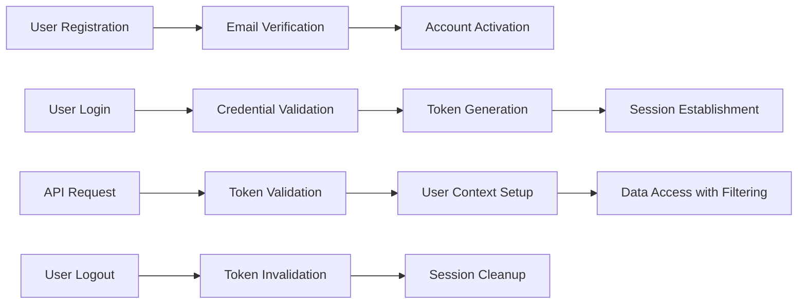

# User Actors and Authentication Requirements

## Document Overview

This document defines the complete authentication and authorization system for the Multi-User Todo Application. It specifies user actor definitions, authentication workflows, security requirements, and privacy guarantees that ensure each user's data remains completely private and secure.

## User Actor Definition

### Primary User Actor

The application supports a single primary user actor:

**User** - Authenticated individuals who can manage their personal todo lists

**Capabilities:**
- Create, view, edit, and delete their own todos
- Manage todo completion status
- View edit history of their todos
- Access trash management functionality
- Manage their personal profile information

**Restrictions:**
- Cannot view, access, or modify any other user's data
- Cannot share or collaborate on todos with other users
- Cannot access system-level administration functions

## Authentication System Requirements

### Core Authentication Functions

**WHEN a user registers for an account, THE system SHALL create a new user account with email verification.**

**WHEN a user logs in with valid credentials, THE system SHALL authenticate the user and establish a secure session.**

**WHEN a user logs out, THE system SHALL terminate the user session and invalidate authentication tokens.**

**THE system SHALL maintain user sessions securely with appropriate token expiration.**

**WHEN authentication fails, THE system SHALL provide appropriate error messages without revealing sensitive information.**

### Registration Requirements

**WHEN a new user registers, THE system SHALL:**
- Validate email format and uniqueness
- Validate password strength requirements
- Create user account with initial profile
- Send email verification if required
- Generate secure authentication tokens

**Registration Data Requirements:**
- Email address (unique identifier)
- Password (minimum 8 characters with complexity)
- Display name (optional, defaults to email username)

### Login Requirements

**WHEN a user attempts to log in, THE system SHALL:**
- Validate email format
- Verify password against stored hash
- Check account status (active/suspended)
- Generate new authentication tokens
- Record login activity
- Return user profile information

**Login Response SHALL Include:**
- User ID
- Display name
- Authentication tokens
- Account status

## Password Management

### Password Change

**WHEN a user requests to change their password, THE system SHALL:**
- Verify current password
- Validate new password meets complexity requirements
- Update password hash securely
- Invalidate existing sessions if required by security policy
- Send confirmation notification

**Password Complexity Requirements:**
- Minimum 8 characters
- At least one uppercase letter
- At least one lowercase letter
- At least one number
- At least one special character

### Password Reset

**WHEN a user requests password reset, THE system SHALL:**
- Verify email address exists
- Generate secure reset token with expiration
- Send reset instructions to verified email
- Allow password reset within specified time window
- Require re-authentication after successful reset

## Account Deletion Process

### User-Initiated Account Deletion

**WHEN a user requests account deletion, THE system SHALL:**
- Require password confirmation for security
- Permanently delete all user data including:
  - User profile information
  - All todos (including those in trash)
  - All todo edit history
  - User session data
- Remove user from authentication systems
- Send confirmation of account deletion

**Data Cleanup Requirements:**
- Immediate removal of all user-related data
- No retention period for deleted accounts
- Complete eradication of user presence from system
- Audit trail of account deletion event

### Soft Delete vs Permanent Delete

**WHEN a user deletes a todo, THE system SHALL move it to trash (soft delete).**

**WHEN a user permanently deletes from trash, THE system SHALL remove the todo and its history permanently.**

**WHEN a user deletes their account, THE system SHALL perform permanent deletion of all data.**

## Privacy and Security Requirements

### Data Privacy Enforcement

**THE system SHALL ensure complete data isolation between users.**

**WHEN any data access request occurs, THE system SHALL verify the requesting user owns the data.**

**THE system SHALL prevent any cross-user data visibility or access.**

### Authentication Token Management

**JWT Token Requirements:**
- Token type: JSON Web Tokens (JWT)
- Access token expiration: 30 minutes
- Refresh token expiration: 7 days
- Token storage: Secure httpOnly cookies
- Token payload must include: userId, role, permissions

**JWT Payload Structure:**
```json
{
  "userId": "unique-user-id",
  "role": "user",
  "permissions": ["todo:create", "todo:read", "todo:update", "todo:delete"],
  "iat": 1234567890,
  "exp": 1234567890
}
```

### Session Security

**THE system SHALL implement secure session management with:**
- HTTPS-only communication
- Secure cookie flags (HttpOnly, Secure, SameSite)
- Session timeout after 30 minutes of inactivity
- Automatic token refresh mechanisms
- Protection against session hijacking

## Permission Matrix

| Action | User |
|--------|------|
| Register new account | ✅ |
| Login to account | ✅ |
| Logout from account | ✅ |
| View own profile | ✅ |
| Edit own profile | ✅ |
| Change password | ✅ |
| Delete own account | ✅ |
| Create todos | ✅ |
| View own todos | ✅ |
| Edit own todos | ✅ |
| Delete own todos | ✅ |
| View todo edit history | ✅ |
| Access trash | ✅ |
| Restore from trash | ✅ |
| Permanently delete from trash | ✅ |
| View other users' data | ❌ |
| Modify other users' data | ❌ |
| System administration | ❌ |

## Error Handling Scenarios

### Authentication Failures

**IF invalid credentials are provided during login, THEN THE system SHALL return generic error message.**

**IF account is locked or suspended, THEN THE system SHALL inform user appropriately.**

**IF authentication token is expired, THEN THE system SHALL require re-authentication.**

### Security Violations

**IF unauthorized data access is attempted, THEN THE system SHALL log the event and deny access.**

**IF multiple failed login attempts occur, THEN THE system SHALL implement temporary account lockout.**

## Business Rules and Constraints

### Account Management Rules

**WHILE a user account is active, THE system SHALL maintain complete data privacy.**

**WHERE account deletion is requested, THE system SHALL perform complete data removal.**

**THE system SHALL enforce email uniqueness across all user accounts.**

### Privacy Enforcement Rules

**THE system SHALL implement row-level security ensuring users can only access their own data.**

**WHERE data queries are executed, THE system SHALL automatically filter by user ID.**

**THE system SHALL audit all data access attempts for security monitoring.**

## Performance Requirements

### Authentication Performance

**THE system SHALL authenticate users within 2 seconds under normal load.**

**THE system SHALL handle concurrent login requests from multiple users.**

**THE system SHALL maintain session state efficiently for active users.**

### Security Performance

**THE system SHALL perform password hashing with appropriate computational cost.**

**THE system SHALL validate JWT tokens efficiently without database queries.**

**THE system SHALL implement rate limiting for authentication endpoints.**

## Implementation Considerations

### Authentication Flow Diagram



### Data Access Security Pattern

**THE system SHALL implement automatic user-based data filtering:**
- All database queries must include user ID filter
- API endpoints must validate user ownership of requested resources
- No direct database access without authentication context

### Audit and Monitoring

**THE system SHALL log all authentication events including:**
- Successful and failed login attempts
- Password change requests
- Account deletion events
- Suspicious activity patterns

## Enhanced Security Considerations

### Multi-Factor Authentication (Future Enhancement)

**THE system SHALL support optional multi-factor authentication for enhanced security.**

**WHERE MFA is enabled, THE system SHALL require secondary verification during login.**

### Session Management Enhancements

**THE system SHALL provide session management capabilities allowing users to:**
- View active sessions
- Terminate specific sessions remotely
- Receive notifications for suspicious login attempts

### Security Event Monitoring

**THE system SHALL implement comprehensive security event monitoring:**
- Real-time detection of unusual login patterns
- Automated alerts for potential security breaches
- Detailed audit logs for forensic analysis

## User Experience Requirements

### Authentication Flow User Experience

**THE system SHALL provide intuitive authentication interfaces:**
- Clear error messages for failed authentication attempts
- Progressive disclosure of complexity requirements during registration
- Seamless password recovery workflows
- Consistent authentication experience across all application interfaces

### Account Management User Experience

**THE system SHALL ensure account management features are accessible:**
- Easy-to-find account deletion options
- Clear confirmation dialogs for destructive operations
- Comprehensive profile management capabilities
- Intuitive password change workflows

## Compliance and Regulatory Requirements

### Data Protection Compliance

**THE system SHALL comply with relevant data protection regulations:**
- Implement appropriate data minimization practices
- Provide user data export capabilities
- Support right-to-erasure requests
- Maintain transparent data processing practices

### Security Standards Compliance

**THE system SHALL adhere to industry security standards:**
- Implement OWASP security guidelines
- Follow secure coding practices
- Regular security vulnerability assessments
- Penetration testing and security audits

> *Developer Note: This document defines **business requirements only**. All technical implementations (architecture, APIs, database design, etc.) are at the discretion of the development team.*