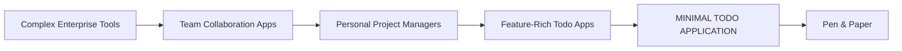
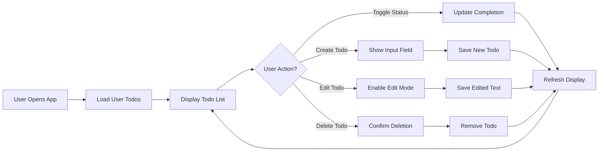
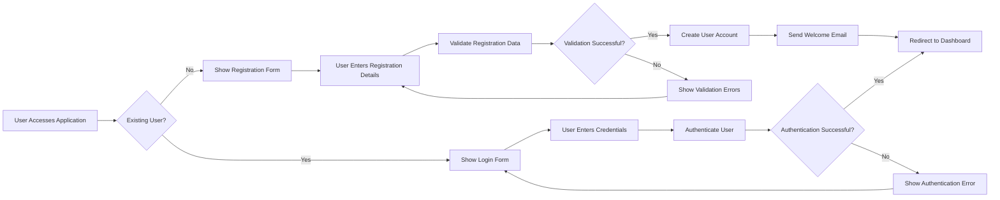
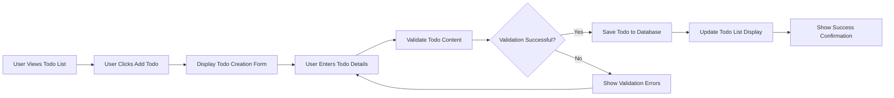
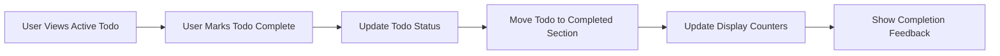

# Todo Application Requirements Analysis Report

## Executive Summary

This document provides comprehensive business requirements for a minimal Todo list application designed for personal productivity management. The application focuses on core functionality while maintaining simplicity and ease of use for non-technical users seeking straightforward task organization.

### Business Problem
Individuals struggle with task organization and prioritization in their daily lives. Traditional todo applications often include unnecessary complexity that overwhelms users seeking simple task management. Users face several key challenges:

- **Feature Overload**: Most todo applications include team collaboration, advanced project tracking, and complex workflows that individual users don't need
- **Learning Curve**: Feature-rich applications require significant time investment to learn and use effectively
- **Performance Issues**: Bloated applications often suffer from slow performance due to unnecessary features
- **Privacy Concerns**: Many todo applications require cloud synchronization and data sharing that users may not want
- **Cost Barriers**: Premium features in existing applications often come with subscription fees for functionality individual users don't require

### Solution Overview
The Todo application provides a focused solution to these challenges through strategic minimalism. The core philosophy is "Do one thing well" - the application excels at basic todo management without attempting to solve every productivity challenge.

**Key Differentiators**:
1. **Purpose-Built Simplicity**: Designed exclusively for individual task management
2. **No Feature Bloat**: Intentional exclusion of team collaboration, project management, and advanced features
3. **Instant Accessibility**: No account creation or authentication required for basic functionality
4. **Platform Agnostic**: Responsive design works across devices without app downloads
5. **Data Sovereignty**: Complete user control over personal task data

### Target Market

**Primary User Demographics**:
- **Individual Professionals**: People managing personal tasks and work-related todos
- **Students**: Academic task management and assignment tracking
- **Home Users**: Daily chore lists, shopping lists, and personal reminders
- **Minimalists**: Users who prefer simple, focused tools over feature-rich applications

**Market Positioning**:
The Todo Application occupies a unique position in the productivity software market by targeting users who have outgrown basic methods but don't need enterprise-level features.

## Core Value Proposition

### Value Delivery Framework
The application delivers value through three core principles:

1. **Time Efficiency**
   - Instant task creation and management
   - Zero configuration required
   - Faster than writing physical lists

2. **Cognitive Simplicity**
   - Reduced decision fatigue from feature overload
   - Clear focus on task completion
   - Minimal mental overhead

3. **Reliability**
   - Consistent performance across sessions
   - No dependency on internet connectivity
   - Predictable behavior

### User Benefits
**WHEN** a user needs to capture a task quickly, **THE** application **SHALL** provide instant access without barriers

**WHILE** using the application, **THE** interface **SHALL** remain consistently simple and intuitive

**WHERE** users prioritize privacy, **THE** system **SHALL** store all data locally without external synchronization

## Business Objectives

### Short-Term Objectives (0-6 months)
1. **User Acquisition**: Reach 10,000 active users through organic growth
2. **Product Validation**: Achieve 90% user satisfaction rating for core functionality
3. **Performance Benchmark**: Maintain sub-100ms response time for all operations
4. **Feature Stability**: Ensure 99.9% uptime with zero critical bugs

### Medium-Term Objectives (6-12 months)
1. **User Retention**: Achieve 70% monthly active user retention rate
2. **Market Penetration**: Become the recommended minimal todo solution in productivity communities
3. **Platform Expansion**: Develop progressive web app capabilities for offline functionality
4. **Community Building**: Establish user community for feedback and feature suggestions

### Long-Term Objectives (12+ months)
1. **Sustainable Growth**: Maintain organic growth without marketing expenditure
2. **Feature Evolution**: Carefully introduce optional enhancements based on user demand
3. **Platform Independence**: Ensure compatibility with emerging web standards
4. **Open Source Contribution**: Consider open-sourcing the application to foster community development

## Success Metrics

### Key Performance Indicators (KPIs)

| Metric | Target | Measurement Frequency | Business Impact |
|--------|--------|---------------------|-----------------|
| Monthly Active Users (MAU) | 10,000+ | Monthly | User adoption and market reach |
| User Satisfaction Score | 4.5/5.0 | Quarterly | Product quality and user experience |
| Task Completion Rate | 85%+ | Monthly | Application effectiveness |
| Session Duration | 2-5 minutes | Weekly | Engagement and usability |
| Performance Response Time | <100ms | Continuous | Technical excellence |
| Error Rate | <0.1% | Continuous | System reliability |

### Business Health Indicators
- **User Growth Rate**: Month-over-month increase in active users
- **Retention Rate**: Percentage of users returning monthly
- **Feature Usage**: Adoption rate of core functionality vs. potential enhancements
- **Support Volume**: Number of help requests indicating usability issues

## User Actors and Authentication Requirements

### User Actor Definitions

#### Standard User
**Actor Name**: user  
**Description**: Standard authenticated user who can create, read, update, and delete their own todo items. Has full CRUD permissions for personal todos.

**Core Capabilities**:
- Create new todo items
- View all personal todo items
- Update existing todo items (text, completion status)
- Delete personal todo items
- Organize todos by completion status
- Access only their own todo data

**Business Rules**:
- **WHEN** a user registers, **THE** system **SHALL** create a unique user account.
- **WHEN** a user logs in, **THE** system **SHALL** provide access to their personal todo list.
- **THE** user **SHALL** only see and manage their own todo items.
- **WHERE** a user attempts to access another user's data, **THE** system **SHALL** deny access.

### Authentication System Requirements

#### User Registration
**WHEN** a new user registers, **THE** system **SHALL**:
- Validate email format and uniqueness
- Require secure password (minimum 8 characters)
- Create user account with unique identifier
- Send email verification (optional enhancement)
- Return authentication token upon successful registration

#### User Login
**WHEN** a user attempts to log in, **THE** system **SHALL**:
- Validate credentials against stored user data
- Generate JWT access token upon successful authentication
- Set token expiration to 30 minutes for security
- Provide refresh token mechanism for extended sessions
- Log authentication attempts for security monitoring

#### Session Management
**WHILE** a user is authenticated, **THE** system **SHALL**:
- Maintain user session state securely
- Validate JWT tokens on each API request
- Provide seamless access to todo operations
- Automatically log out after token expiration

### Permission Matrix

| Action | User |
|--------|------|
| Create Todo | ✅ |
| Read Own Todos | ✅ |
| Update Own Todos | ✅ |
| Delete Own Todos | ✅ |
| Read Other Users' Todos | ❌ |
| Update Other Users' Todos | ❌ |
| Delete Other Users' Todos | ❌ |
| Manage User Accounts | ❌ |
| System Administration | ❌ |

## Functional Requirements Specification

### Core Todo Management Features

#### Todo Creation
**WHEN** a user wants to create a new todo item, **THE** system **SHALL** provide a simple interface for entering todo text.

**THE** system **SHALL** allow users to create todo items with the following properties:
- Text description (required, 1-500 characters)
- Creation timestamp (automatically assigned)
- Completion status (default: incomplete)
- Unique identifier

**WHEN** creating a todo item, **THE** system **SHALL** validate that the todo text contains between 1 and 500 characters.

#### Todo Reading and Display
**THE** system **SHALL** display all todo items belonging to the authenticated user.

**WHEN** displaying todo items, **THE** system **SHALL** show:
- Todo text description
- Completion status (checked/unchecked)
- Creation date in user-friendly format

**THE** system **SHALL** organize todo items with incomplete items displayed first, followed by completed items.

#### Todo Status Management
**WHEN** a user marks a todo item as complete, **THE** system **SHALL** update the completion status and move the item to the completed section.

**WHEN** a user marks a completed todo item as incomplete, **THE** system **SHALL** update the completion status and move the item back to the active section.

**THE** system **SHALL** provide clear visual indicators for completion status (checked checkbox for complete, unchecked for incomplete).

#### Todo Editing
**WHEN** a user wants to edit a todo item's text, **THE** system **SHALL** provide an editing interface that allows modification of the todo description.

**WHEN** saving edited todo text, **THE** system **SHALL** validate that the updated text contains between 1 and 500 characters.

**THE** system **SHALL** preserve the original creation timestamp when editing todo text.

#### Todo Deletion
**WHEN** a user wants to delete a todo item, **THE** system **SHALL** provide a confirmation mechanism to prevent accidental deletion.

**WHEN** confirming deletion, **THE** system **SHALL** permanently remove the todo item from the user's list.

**THE** system **SHALL** not provide undo functionality for deleted todo items.

### User Interface Requirements

#### Navigation and Layout
**THE** application **SHALL** provide a clean, intuitive interface with the following sections:
- Header with application title and user information
- Main content area displaying todo items
- Input area for creating new todos
- Clear separation between active and completed todos

**THE** interface **SHALL** be responsive and work effectively on both desktop and mobile devices.

#### User Interaction Patterns
**WHEN** interacting with todo items, **THE** system **SHALL** provide immediate visual feedback for user actions.

**THE** system **SHALL** ensure that all user interactions feel responsive and instantaneous.

## User Journey Documentation

### Authentication Flow

The user registration process provides a seamless onboarding experience for new users:

### Todo Creation Process

The todo creation workflow enables users to quickly add new tasks to their list:

### Todo Completion Workflow

The process for marking todos as complete focuses on simplicity and immediate feedback:

## Data Flow Requirements

### Data Creation Process
**WHEN** a user creates a todo, **THE** system **SHALL**:
1. Validate user authentication
2. Validate todo text format
3. Generate unique todo identifier
4. Store todo in user's personal collection
5. Return success confirmation

### Data Access Patterns
**THE** system **SHALL** provide efficient access to:
- All user todos for list display
- Specific todos for editing
- Completed/incomplete todos for filtering
- Todo search results

### Data Modification Flow
**WHEN** updating a todo, **THE** system **SHALL**:
1. Verify user ownership of the todo
2. Validate the updated content
3. Apply the changes
4. Update the modification timestamp
5. Return updated todo data

### Data Deletion Process
**WHEN** deleting a todo, **THE** system **SHALL**:
1. Verify user ownership
2. Request confirmation
3. Permanently remove the todo
4. Update the todo list display

## Error Handling Specifications

### Authentication Errors
**IF** user authentication fails, **THEN THE** system **SHALL** redirect to login page with appropriate error message.

**IF** session expires, **THEN THE** system **SHALL** automatically redirect to login page.

**IF** invalid credentials are provided, **THEN THE** system **SHALL** display "Invalid email or password" message.

### Data Validation Errors
**IF** todo text exceeds 500 characters, **THEN THE** system **SHALL** reject the operation and show "Todo text too long" error.

**IF** todo text is empty, **THEN THE** system **SHALL** reject the operation and show "Todo text required" error.

**IF** user attempts to modify non-existent todo, **THEN THE** system **SHALL** show "Todo not found" error.

### System Errors
**IF** database connection fails, **THEN THE** system **SHALL** display "Service temporarily unavailable" message.

**IF** unexpected error occurs, **THEN THE** system **SHALL** log the error and show generic error message to user.

### User Recovery Flows
**WHEN** an error occurs, **THE** system **SHALL** provide clear recovery instructions.

**WHEN** data validation fails, **THE** system **SHALL** highlight the specific field with the error.

**WHEN** network issues occur, **THE** system **SHALL** automatically retry the operation.

## Performance Expectations

### Response Time Requirements
**THE** system **SHALL** load the todo list within 2 seconds under normal conditions.

**THE** system **SHALL** process todo operations (create, update, delete) within 1 second.

**THE** system **SHALL** provide instant feedback for user interactions.

### Concurrent User Support
**THE** system **SHALL** support at least 1,000 concurrent users.

**THE** system **SHALL** maintain performance during peak usage periods.

### Data Volume Limits
**THE** system **SHALL** efficiently handle users with up to 10,000 todo items.

**THE** system **SHALL** provide pagination for large todo lists.

### System Availability
**THE** system **SHALL** maintain 99.9% uptime.

**THE** system **SHALL** provide graceful degradation during maintenance.

## Security Requirements

### Authentication Security
**THE** system **SHALL** store passwords using secure hashing algorithms.

**THE** system **SHALL** implement rate limiting for login attempts.

**THE** system **SHALL** use HTTPS for all communications.

### Data Protection
**THE** system **SHALL** encrypt sensitive user data at rest.

**THE** system **SHALL** implement proper access controls for user data.

**THE** system **SHALL** regularly backup user data.

### Privacy Requirements
**THE** system **SHALL** not share user data with third parties without consent.

**THE** system **SHALL** provide data export capabilities for users.

**THE** system **SHALL** allow users to delete their account and all associated data.

### Access Controls
**WHILE** user is authenticated, **THE** system **SHALL** only allow access to that user's todos.

**THE** system **SHALL** validate ownership on every todo operation.

**THE** system **SHALL** implement proper session management.

## Implementation Roadmap

### Development Phases

**Phase 1: Core Infrastructure (Week 1)**
- Basic application framework setup
- User authentication system
- Simple data storage solution
- Basic UI scaffolding

**Phase 2: Core Todo Functionality (Week 2)**
- Create new todo functionality
- Display todo list
- Mark todos as complete/incomplete
- Delete todo functionality

**Phase 3: Polish and Refinement (Week 3)**
- Improved error handling
- Better user feedback
- Performance optimizations
- Basic styling and responsiveness

**Phase 4: Deployment and Testing (Week 4)**
- Production deployment setup
- Basic testing suite
- Documentation
- Performance validation

### Success Criteria

**Technical Success**:
- Application deployed and accessible
- All core features working reliably
- Performance meets user expectations
- No critical bugs or issues

**User Success**:
- Intuitive and easy to use
- Reliable data persistence
- Responsive interactions
- Meets basic todo management needs

## Risk Assessment

### Potential Challenges
1. **Market Education**: Users accustomed to feature-rich applications may need education about minimalism benefits
2. **Feature Creep**: Pressure to add features that contradict the core philosophy
3. **Monetization**: Balancing free access with sustainable development
4. **Platform Limitations**: Web-only approach may limit some mobile functionality

### Mitigation Strategies
- Clear communication of the "minimal by design" philosophy
- Community-driven feature prioritization
- Exploration of non-intrusive revenue models (donations, sponsorships)
- Progressive web app technology to bridge mobile functionality gaps

## Conclusion

The Todo Application represents a strategic opportunity in the personal productivity market by addressing the underserved need for simple, focused task management tools. By embracing minimalism as a core philosophy, the application delivers immediate value through instant usability, reliable performance, and user-centric design. The business model focuses on organic growth and user satisfaction rather than feature competition, creating a sustainable position in the productivity software ecosystem.

This requirements analysis provides comprehensive business specifications for developing a minimal Todo application that meets user needs while maintaining simplicity and effectiveness. The focus on core functionality ensures that the application remains accessible and valuable to users seeking straightforward task management solutions.

> *Developer Note: This document defines **business requirements only**. All technical implementations (architecture, APIs, database design, etc.) are at the discretion of the development team.*