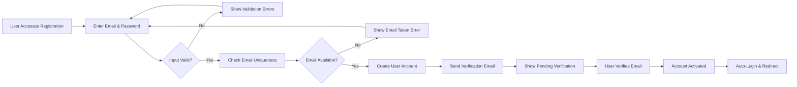
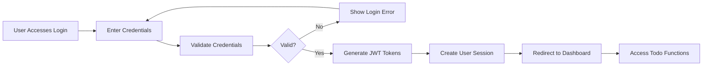
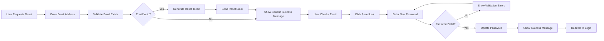

# User Actors and Authentication Requirements Specification

## 1. Introduction and Overview

This document defines the complete user authentication and authorization system for the Todo application. The system follows a minimal authentication approach designed specifically for a single-user Todo management application with JWT-based security.

### 1.1 System Purpose
The authentication system provides secure user access control while maintaining simplicity appropriate for a minimal Todo application. The system ensures that users can only access and modify their own todo items.

### 1.2 Authentication Philosophy
- **Minimal Complexity**: Designed for simplicity while maintaining security
- **Single-User Focus**: Optimized for individual todo management
- **JWT-Based Security**: Modern token-based authentication
- **Self-Contained**: No external authentication dependencies

## 2. User Actor Definitions

### 2.1 Primary User Actor

**Actor Name**: User
**Description**: Standard authenticated user who can create, view, update, and delete their own todo items. This actor represents the primary user of the Todo application with full CRUD operations on their personal todo list.

#### User Capabilities
- Create new todo items
- View all personal todo items
- Mark todo items as complete or incomplete
- Edit existing todo item content
- Delete todo items
- Organize todos by status (active/completed)

#### User Restrictions
- Cannot access other users' todo items
- Cannot modify system settings or configurations
- Limited to personal todo management only

### 2.2 Anonymous User (Pre-Authentication)

**Actor Name**: Guest
**Description**: Unauthenticated user who can access the login/registration interface but cannot perform any todo operations.

#### Guest Capabilities
- View login/registration screens
- Submit authentication credentials
- Access password recovery functionality

#### Guest Restrictions
- Cannot create, view, or modify any todo items
- Limited to authentication-related actions only

## 3. Authentication System Requirements

### 3.1 Core Authentication Functions

**WHEN** a guest attempts to register, **THE** system **SHALL** create a new user account with email verification.

**WHEN** a user submits login credentials, **THE** system **SHALL** validate credentials and issue authentication tokens.

**WHEN** a user logs out, **THE** system **SHALL** invalidate the current session and clear authentication tokens.

**WHEN** a user requests password reset, **THE** system **SHALL** send a secure reset link to the registered email.

### 3.2 User Registration Requirements

**THE** user registration process **SHALL** require:
- Valid email address format verification
- Password strength validation (minimum 8 characters)
- Email confirmation before full account activation
- Unique email constraint enforcement

**WHEN** registration is successful, **THE** system **SHALL** automatically log the user in and redirect to the todo dashboard.

### 3.3 Login and Session Management

**WHEN** a user provides valid credentials, **THE** system **SHALL**:
- Create a new authenticated session
- Issue JWT access and refresh tokens
- Record login timestamp and IP address
- Redirect to the user's todo dashboard

**WHILE** a user is authenticated, **THE** system **SHALL** maintain session state and provide access to todo management functions.

## 4. Permission Matrix and Access Controls

### 4.1 Todo Operation Permissions

| Operation | User | Guest |
|-----------|------|-------|
| Create Todo | ✅ Allowed | ❌ Denied |
| View Todos | ✅ Own todos only | ❌ Denied |
| Edit Todo | ✅ Own todos only | ❌ Denied |
| Delete Todo | ✅ Own todos only | ❌ Denied |
| Mark Complete | ✅ Own todos only | ❌ Denied |
| View Dashboard | ✅ Allowed | ❌ Denied |

### 4.2 Authentication Operation Permissions

| Operation | User | Guest |
|-----------|------|-------|
| Register Account | ❌ Already authenticated | ✅ Allowed |
| Login | ❌ Already authenticated | ✅ Allowed |
| Logout | ✅ Allowed | ❌ Not applicable |
| Reset Password | ✅ Allowed | ✅ Allowed (with email verification) |
| Change Password | ✅ Allowed | ❌ Denied |

### 4.3 Data Access Rules

**WHILE** a user is authenticated, **THE** system **SHALL** enforce that users can only access todo items belonging to their own user account.

**IF** a user attempts to access another user's data, **THEN THE** system **SHALL** return an authorization error and log the security violation.

## 5. User Registration and Management Flows

### 5.1 Registration Process Flow



### 5.2 Login Process Flow



### 5.3 Password Reset Flow



## 6. Security and Token Management

### 6.1 JWT Token Specifications

**THE** authentication system **SHALL** use JWT (JSON Web Tokens) for session management with the following specifications:

- **Token Type**: JWT (JSON Web Token)
- **Access Token Expiration**: 30 minutes
- **Refresh Token Expiration**: 7 days
- **Token Storage**: HTTP-only cookies for enhanced security
- **Algorithm**: HS256 (HMAC with SHA-256)

### 6.2 JWT Payload Structure

**THE** JWT payload **SHALL** contain the following claims:

```json
{
  "userId": "unique-user-identifier",
  "email": "user@example.com",
  "role": "user",
  "permissions": ["todo:create", "todo:read", "todo:update", "todo:delete"],
  "iat": 1234567890,
  "exp": 1234567890
}
```

### 6.3 Token Refresh Mechanism

**WHEN** an access token expires, **THE** system **SHALL**:
- Accept a valid refresh token
- Issue a new access token without requiring re-authentication
- Maintain the same user session context
- Update token issuance timestamp

**IF** a refresh token is invalid or expired, **THEN THE** system **SHALL** require the user to log in again.

### 6.4 Security Requirements

**THE** system **SHALL** implement the following security measures:
- Password hashing using bcrypt with salt
- HTTPS enforcement for all authentication endpoints
- Rate limiting on login attempts (max 5 attempts per minute)
- Session timeout after 30 minutes of inactivity
- Secure token generation with cryptographically strong secrets

## 7. Error Handling and Recovery

### 7.1 Authentication Error Scenarios

**IF** invalid credentials are provided during login, **THEN THE** system **SHALL**:
- Return generic error message "Invalid email or password"
- Increment failed login attempt counter
- Implement account lockout after 5 consecutive failures

**IF** an expired token is detected, **THEN THE** system **SHALL**:
- Return HTTP 401 Unauthorized status
- Provide clear error message "Session expired"
- Offer automatic token refresh when possible

**IF** unauthorized access is attempted, **THEN THE** system **SHALL**:
- Return HTTP 403 Forbidden status
- Log the security violation for monitoring
- Provide generic error message "Access denied"

### 7.2 Recovery Processes

**WHEN** a user forgets their password, **THE** system **SHALL** provide a secure password reset flow that:
- Verifies email ownership through confirmation links
- Allows password reset without knowing the current password
- Enforces the same password strength requirements as registration
- Invalidates all existing sessions after password change

**WHEN** a user's account is locked due to failed login attempts, **THE** system **SHALL**:
- Automatically unlock after 30 minutes
- Provide account recovery via email verification
- Clear failed attempt counter upon successful recovery

## 8. Performance and Reliability Requirements

### 8.1 Authentication Performance

**THE** authentication system **SHALL** meet the following performance standards:
- Login response time: Under 2 seconds for 95% of requests
- Token validation: Under 100 milliseconds
- User registration: Under 3 seconds including email verification
- Password reset: Under 5 seconds for the complete flow

### 8.2 System Availability

**THE** authentication service **SHALL** maintain 99.9% availability during business hours, ensuring users can reliably access their todo applications.

**WHILE** the system experiences maintenance or outages, **THE** system **SHALL** provide clear maintenance notifications and estimated recovery times.

## 9. Future Enhancement Considerations

While the current system is designed for minimal functionality, the following enhancements could be considered for future versions:

- Multi-factor authentication support
- Social login integration (Google, GitHub, etc.)
- Account deletion and data export functionality
- Session management across multiple devices
- Advanced security features like device fingerprinting

> *Developer Note: This document defines **business requirements only**. All technical implementations (architecture, APIs, database design, etc.) are at the discretion of the development team.*