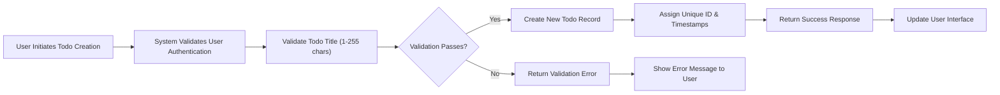

# Core Functionality Requirements - Todo List Minimal MVP

## 1. Introduction and Scope Definition

### Service Overview
The Todo List application provides users with a simple, intuitive system for managing personal tasks and to-do items. This document defines the **minimum viable functionality** required for a basic Todo list service, focusing exclusively on core features that deliver essential value to users.

### Scope Boundaries
- **IN SCOPE**: Basic CRUD operations for todo items, status tracking, and user-specific data management
- **OUT OF SCOPE**: Advanced features like categories, tags, due dates, reminders, sharing, or collaboration
- **FOCUS**: Minimal functionality that enables users to effectively manage their personal todo lists

### Business Justification
This minimal Todo list application solves the fundamental problem of task organization and tracking for individual users. By focusing on core functionality, the service provides immediate value while maintaining simplicity and ease of use.

## 2. Core Todo Item Management Requirements

### 2.1 Todo Item Creation
**WHEN** a user creates a new todo item, **THE** system **SHALL**:
- Accept a title for the todo item (required field)
- Accept an optional description for additional details
- Set the initial status to "pending"
- Assign a unique identifier to the todo item
- Record the creation timestamp
- Associate the todo item with the authenticated user

**Business Rule**: Todo titles **SHALL** be between 1 and 255 characters in length.

### 2.2 Todo Item Retrieval
**THE** system **SHALL** provide users with the ability to:
- View all their todo items in a list
- Filter todo items by status (pending/completed)
- Sort todo items by creation date (newest first)
- Access individual todo item details

**Performance Requirement**: Todo list loading **SHALL** feel instantaneous to users, with response times under 500ms for typical lists.

### 2.3 Todo Item Updates
**WHEN** a user updates a todo item, **THE** system **SHALL** support modification of:
- Todo title (with same validation as creation)
- Todo description (optional field)
- Todo status (toggle between pending and completed)

**Business Rule**: Users **SHALL** only be able to modify their own todo items.

### 2.4 Todo Item Deletion
**WHEN** a user deletes a todo item, **THE** system **SHALL**:
- Permanently remove the todo item from the system
- Provide confirmation of successful deletion
- Handle deletion requests securely and reliably

**Business Rule**: Deletion operations **SHALL** be irreversible without administrative intervention.

## 3. Todo Status Tracking and Workflow

### 3.1 Status Management
**THE** system **SHALL** support two todo statuses:
- **Pending**: Todo items that require action or completion
- **Completed**: Todo items that have been finished

**WHEN** a user marks a todo as completed, **THE** system **SHALL**:
- Update the status from "pending" to "completed"
- Record the completion timestamp
- Maintain the completed state until explicitly changed

**WHEN** a user marks a completed todo as pending, **THE** system **SHALL**:
- Update the status from "completed" to "pending"
- Clear the completion timestamp
- Return the todo to the active list

### 3.2 Status Transition Rules
**Business Rule**: Status transitions **SHALL** only occur between "pending" and "completed" states.
**Business Rule**: Completed todos **SHALL** remain visible to users unless explicitly deleted.

## 4. Basic CRUD Operations Specification

### 4.1 Create Operation Requirements

### 4.2 Read Operation Requirements
**WHEN** a user requests their todo list, **THE** system **SHALL**:
- Verify user authentication
- Retrieve all todo items belonging to the authenticated user
- Return the list in a structured format
- Include pagination support for large datasets

**Performance Requirement**: Todo list retrieval **SHALL** complete within 2 seconds for lists containing up to 1,000 items.

### 4.3 Update Operation Requirements
**WHEN** a user updates a todo item, **THE** system **SHALL**:
- Verify the user owns the todo item being modified
- Validate all updated fields against business rules
- Apply the changes to the todo record
- Return the updated todo item data
- Record the modification timestamp

### 4.4 Delete Operation Requirements
**WHEN** a user deletes a todo item, **THE** system **SHALL**:
- Verify the user owns the todo item being deleted
- Remove the todo item from persistent storage
- Return confirmation of successful deletion
- Ensure the deletion is atomic and reliable

## 5. Business Rules and Validation Requirements

### 5.1 Data Validation Rules
| Field | Validation Rule | Error Message |
|-------|-----------------|---------------|
| Todo Title | Required, 1-255 characters | "Todo title must be between 1 and 255 characters" |
| Todo Description | Optional, maximum 1000 characters | "Description cannot exceed 1000 characters" |
| User Ownership | User must own todo for modifications | "You can only modify your own todo items" |
| Status | Must be "pending" or "completed" | "Invalid todo status" |

### 5.2 Business Logic Constraints
**WHILE** processing todo operations, **THE** system **SHALL**:
- Enforce user authentication for all operations
- Maintain data integrity through transaction boundaries
- Ensure atomic operations for create, update, and delete
- Preserve data consistency across concurrent operations

### 5.3 Operational Limits
**THE** system **SHALL** support:
- Maximum of 10,000 todo items per user
- Concurrent access from multiple devices
- Reasonable API rate limiting to prevent abuse

## 6. Data Integrity and Constraints

### 6.1 Data Persistence Requirements
**THE** system **SHALL** ensure that:
- Todo items persist across user sessions
- Data is backed up regularly to prevent loss
- System failures do not result in data corruption
- Todo items maintain their state accurately

### 6.2 Consistency Requirements
**WHILE** the system is operational, **THE** system **SHALL**:
- Maintain consistent todo counts and statuses
- Prevent duplicate todo items with identical content
- Ensure timestamp accuracy for creation and modification
- Synchronize data correctly across user devices

## 7. Performance Expectations

### 7.1 Response Time Requirements
| Operation | Maximum Acceptable Response Time |
|-----------|----------------------------------|
| Todo List Retrieval | 2 seconds |
| Individual Todo Retrieval | 1 second |
| Todo Creation | 3 seconds |
| Todo Update | 2 seconds |
| Todo Deletion | 2 seconds |

### 7.2 Availability Requirements
**THE** system **SHALL** maintain:
- 99.5% uptime during business hours (8 AM - 10 PM local time)
- Graceful degradation during maintenance periods
- Clear communication of service interruptions

### 7.3 Scalability Considerations
**WHERE** user growth occurs, **THE** system **SHALL**:
- Scale horizontally to accommodate increased load
- Maintain performance standards under normal usage patterns
- Provide adequate resources for peak usage periods

## 8. Error Handling Scenarios

### 8.1 Common Error Scenarios
**IF** a user attempts to access a non-existent todo, **THEN THE** system **SHALL** return a "Todo not found" error.

**IF** a user attempts to modify another user's todo, **THEN THE** system **SHALL** return an "Access denied" error.

**IF** the system experiences database connectivity issues, **THEN THE** system **SHALL** return a "Service temporarily unavailable" message.

### 8.2 User Recovery Flows
**WHEN** an error occurs during todo creation, **THE** system **SHALL**:
- Preserve any entered data if possible
- Provide clear error messages with recovery instructions
- Allow users to retry the operation after addressing the issue

**WHEN** network connectivity is lost during operations, **THE** system **SHALL**:
- Queue operations for retry when connectivity returns
- Provide visual feedback about the connection status
- Synchronize data automatically when reconnected

### 8.3 Error Message Standards
**THE** system **SHALL** provide error messages that are:
- Clear and actionable for users
- Technical details logged for development team
- Consistent in tone and formatting
- Localized to the user's language preference

## 9. User Authentication Integration

### 9.1 Authentication Requirements
**THE** system **SHALL** require user authentication for all todo operations. **WHEN** a user attempts to access todo functionality without authentication, **THE** system **SHALL** redirect to the login process.

### 9.2 User Session Management
**THE** system **SHALL** maintain user sessions securely, with automatic session expiration after 24 hours of inactivity. **WHEN** a session expires, **THE** system **SHALL** require re-authentication.

### 9.3 Permission Enforcement
**THE** system **SHALL** enforce strict user ownership rules:
- Users can only view, modify, or delete their own todo items
- No cross-user data access is permitted
- Administrative functions are not included in minimal scope

## 10. Data Privacy and Security

### 10.1 Data Protection Requirements
**THE** system **SHALL** ensure that:
- Todo items are stored securely with appropriate encryption
- User data is accessible only to the authenticated owner
- Data transmission occurs over secure channels
- Regular security audits are conducted

### 10.2 Privacy Considerations
**THE** system **SHALL**:
- Not collect unnecessary personal information
- Provide clear privacy policy regarding data usage
- Allow users to delete their account and all associated data
- Comply with relevant data protection regulations

## 11. User Experience Standards

### 11.1 Interface Responsiveness
**THE** system **SHALL** provide:
- Immediate feedback for user actions (within 100ms)
- Clear loading indicators for operations taking longer than 500ms
- Intuitive error handling with actionable recovery steps
- Consistent interface behavior across all operations

### 11.2 Accessibility Requirements
**THE** system **SHALL** be designed to:
- Support keyboard navigation for all functionality
- Provide appropriate contrast ratios for text readability
- Include proper labeling for screen readers
- Maintain usability across different device sizes

## 12. Integration and Compatibility

### 12.1 API Standards
**THE** system **SHALL** provide:
- RESTful API endpoints for all todo operations
- Consistent error response formats
- Proper HTTP status code usage
- Clear documentation for API consumers

### 12.2 Cross-Platform Support
**THE** system **SHALL** support:
- Web browsers (Chrome, Firefox, Safari, Edge)
- Mobile devices through responsive design
- Standard HTTP/HTTPS protocols
- Common data formats (JSON for API responses)

## 13. Testing and Quality Assurance

### 13.1 Test Coverage Requirements
**THE** system **SHALL** include comprehensive testing for:
- All CRUD operations under normal conditions
- Error scenarios and edge cases
- Performance benchmarks
- Security vulnerability testing

### 13.2 Quality Standards
**THE** system **SHALL** maintain:
- Code coverage of at least 80% for critical paths
- Automated testing for regression prevention
- Performance monitoring for production deployment
- Regular security updates and patches

## Conclusion

This document defines the complete set of core functionality requirements for a minimal viable Todo list application. The requirements focus exclusively on essential features that enable users to effectively manage their personal tasks while maintaining simplicity and reliability.

All requirements are specified in natural language using EARS format where applicable, providing backend developers with clear, actionable specifications for implementation. The minimal scope ensures rapid development while delivering fundamental value to users.

> *Developer Note: This document defines **business requirements only**. All technical implementations (architecture, APIs, database design, etc.) are at the discretion of the development team.*