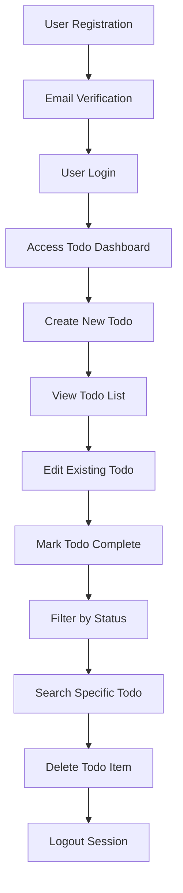
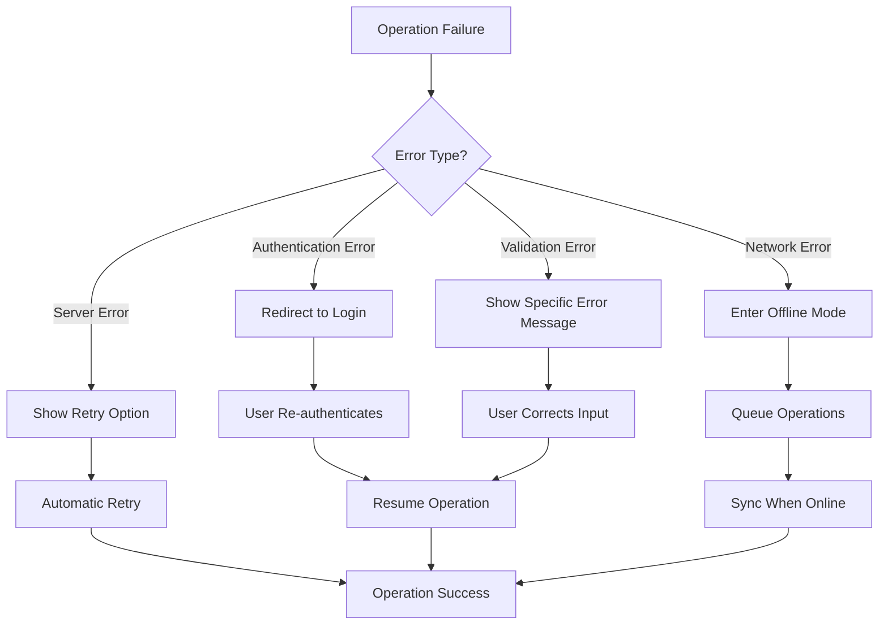

# Functional Requirements Specification - Todo Application

## Introduction

This document defines the complete functional requirements for the Todo application using natural language specifications. The requirements describe WHAT the system should do from a business perspective, without specifying HOW it should be implemented technically.

### Document Purpose
This specification serves as the definitive guide for backend developers to understand the complete business functionality required for the Todo application. All requirements are written in natural language using EARS (Easy Approach to Requirements Syntax) format where applicable.

### Scope
This document covers all core functionality for a minimal Todo application, including user authentication, todo item management, and basic organizational features.

## Core Todo Management Functions

### User Authentication Requirements

WHEN a user attempts to register for the Todo application, THE system SHALL create a new user account with email and password.

WHEN a user provides valid login credentials, THE system SHALL authenticate the user and establish a secure session.

WHEN a user logs out, THE system SHALL terminate the user session and clear authentication tokens.

WHILE a user is authenticated, THE system SHALL provide access to the user's personal todo list.

### Todo Creation Requirements

WHEN an authenticated user creates a new todo item, THE system SHALL store the todo with the following attributes:
- Todo title/text (required)
- Creation timestamp (automatically set)
- Completion status (default: incomplete)
- Unique identifier

THE system SHALL validate that todo titles are between 1 and 255 characters in length.

IF a user attempts to create a todo with an empty title, THEN THE system SHALL reject the creation and display an appropriate error message.

### Todo Viewing and Listing Requirements

WHEN an authenticated user views their todo list, THE system SHALL display all todo items belonging to that user.

THE system SHALL organize todo items by creation date, with newest items appearing first.

WHEN viewing the todo list, THE system SHALL clearly indicate the completion status of each item.

WHERE users have a large number of todos, THE system SHALL support pagination with 20 items per page.

### Todo Completion Requirements

WHEN a user marks a todo as complete, THE system SHALL update the completion status and record the completion timestamp.

WHEN a user marks a completed todo as incomplete, THE system SHALL revert the completion status and clear the completion timestamp.

THE system SHALL provide visual distinction between completed and incomplete todos.

### Todo Editing Requirements

WHEN a user edits an existing todo title, THE system SHALL validate the new title meets the same requirements as creation.

WHEN a todo is edited, THE system SHALL update the modification timestamp.

THE system SHALL only allow users to edit their own todo items.

### Todo Deletion Requirements

WHEN a user deletes a todo item, THE system SHALL permanently remove the item from the user's list.

THE system SHALL request confirmation before permanent deletion of todo items.

IF a user confirms deletion, THEN THE system SHALL remove the todo and update the todo list accordingly.

## User Interface Requirements (Business Perspective)

### Navigation Requirements

THE system SHALL provide clear navigation between the todo list view and individual todo details.

WHEN a user is viewing the todo list, THE system SHALL provide quick access to create new todos.

THE system SHALL maintain consistent navigation patterns throughout the application.

### Display Requirements

THE system SHALL display todo items in a clean, readable format that distinguishes between completed and incomplete items.

WHILE displaying the todo list, THE system SHALL show the total count of items and the number of completed items.

THE system SHALL provide visual feedback for user actions such as creating, editing, or deleting todos.

### Search and Filter Requirements

WHERE users need to find specific todos, THE system SHALL provide search functionality that matches todo titles.

THE system SHALL support filtering of todo items by completion status (all, active, completed).

WHEN searching or filtering, THE system SHALL display results instantly without noticeable delay.

## Data Validation Rules

### Todo Title Validation

THE system SHALL validate that todo titles contain only printable characters and basic punctuation.

THE system SHALL reject todo titles that consist only of whitespace characters.

THE system SHALL trim leading and trailing whitespace from todo titles before storage.

### User Input Validation

WHEN processing user input for todo operations, THE system SHALL sanitize input to prevent injection attacks.

THE system SHALL validate that users can only access and modify their own todo items.

### Data Integrity Rules

THE system SHALL ensure that each todo item has a unique identifier within the user's scope.

THE system SHALL maintain referential integrity between users and their todo items.

## Business Logic Specifications

### Ownership and Access Control

WHILE processing any todo operation, THE system SHALL verify that the authenticated user owns the target todo item.

IF a user attempts to access another user's todo, THEN THE system SHALL return an access denied error.

THE system SHALL enforce that users can only perform operations on their own todo items.

### State Management

THE system SHALL maintain the completion state of each todo item persistently.

WHEN a todo is marked complete, THE system SHALL record the exact timestamp of completion.

THE system SHALL support toggling completion status for any todo item.

### Data Persistence

THE system SHALL persist all todo items and user data between sessions.

WHEN a user logs out and logs back in, THE system SHALL restore their complete todo list.

THE system SHALL ensure data is not lost due to browser refresh or navigation.

## Error Handling Scenarios

### Authentication Errors

IF a user provides invalid login credentials, THEN THE system SHALL display a generic authentication error message.

IF a user session expires, THEN THE system SHALL redirect to the login page with an appropriate message.

WHEN authentication fails, THE system SHALL not reveal whether the email or password was incorrect.

### Todo Operation Errors

IF a user attempts to create a todo with invalid data, THEN THE system SHALL display specific validation error messages.

IF a todo operation fails due to server error, THEN THE system SHALL display a generic error message and allow retry.

WHEN a todo item cannot be found, THE system SHALL display a "not found" message and return to the todo list.

### Network and Connectivity Errors

IF the application loses connectivity, THEN THE system SHALL display an offline indicator.

WHEN connectivity is restored, THE system SHALL automatically sync any pending operations.

THE system SHALL handle network timeouts gracefully with appropriate user feedback.

## Performance Expectations

### Response Time Requirements

WHEN a user performs any todo operation (create, read, update, delete), THE system SHALL respond within 2 seconds.

THE system SHALL load the initial todo list within 3 seconds of user authentication.

WHEN searching or filtering todos, THE system SHALL display results instantly for lists up to 100 items.

### Scalability Expectations

THE system SHALL support up to 10,000 concurrent users without degradation of performance.

WHERE individual users have large todo lists (up to 10,000 items), THE system SHALL maintain responsive performance.

THE system SHALL handle peak usage during business hours without service interruption.

### Reliability Requirements

THE system SHALL maintain 99.9% uptime during normal operating conditions.

WHEN system maintenance is required, THE system SHALL provide advance notice to users.

THE system SHALL automatically recover from minor failures without data loss.

## Success Criteria and Acceptance Conditions

### Functional Acceptance Criteria

- Users can successfully register and authenticate with the system
- Authenticated users can create, view, edit, and delete their todo items
- Todo completion status can be toggled and persists between sessions
- Users can search and filter their todo list effectively
- All validation rules are enforced consistently

### Performance Acceptance Criteria

- All todo operations complete within specified time limits
- The system handles expected user load without performance degradation
- Data persistence works reliably across sessions and browser refreshes

### User Experience Acceptance Criteria

- Error messages are clear and helpful to users
- Navigation is intuitive and consistent throughout the application
- The interface provides appropriate feedback for all user actions
- The application remains usable during temporary connectivity issues

## Authentication System Requirements

### User Registration Process

WHEN a new user registers, THE system SHALL:
- Validate email format and uniqueness
- Enforce password complexity requirements
- Send email verification before account activation
- Create user profile with default preferences

### Login and Session Management

WHEN a user logs in successfully, THE system SHALL:
- Generate secure authentication tokens
- Establish user session with appropriate timeout
- Record login timestamp and IP address
- Redirect to user's todo dashboard

### Password Management

WHEN a user requests password reset, THE system SHALL:
- Validate email ownership through secure verification
- Generate time-limited reset tokens
- Enforce same password complexity as registration
- Invalidate all existing sessions after password change

### Session Security

WHILE a user is authenticated, THE system SHALL:
- Validate session tokens for every request
- Automatically refresh tokens before expiration
- Log security events for suspicious activities
- Provide secure logout functionality

## Permission and Access Control Requirements

### User Permission Matrix

| Operation | Standard User |
|-----------|---------------|
| Create todo items | ✅ Full access |
| View own todo items | ✅ Full access |
| Edit own todo items | ✅ Full access |
| Delete own todo items | ✅ Full access |
| Mark todos complete/incomplete | ✅ Full access |
| Access other users' data | ❌ Denied |
| Modify system settings | ❌ Denied |

### Data Access Rules

WHILE processing todo operations, THE system SHALL:
- Validate user ownership of target todo items
- Enforce data isolation between different users
- Log unauthorized access attempts for security monitoring
- Provide appropriate error messages for access violations

### Authorization Error Handling

IF a user attempts unauthorized access, THEN THE system SHALL:
- Return HTTP 403 Forbidden status
- Log the security violation event
- Provide generic error message without revealing details
- Maintain system security without compromising user experience

## Business Process Flows

### Complete Todo Management Workflow

### Error Recovery Workflow

## Comprehensive Error Scenarios

### Authentication Failure Scenarios

**Scenario 1: Invalid Credentials**
WHEN a user provides incorrect login credentials, THEN THE system SHALL:
- Return generic error message "Invalid email or password"
- Increment failed login attempt counter
- Implement account lockout after 5 consecutive failures
- Provide password recovery option

**Scenario 2: Expired Session**
WHEN a user's session expires during operation, THEN THE system SHALL:
- Return HTTP 401 Unauthorized status
- Provide clear "Session expired" message
- Offer automatic redirect to login page
- Preserve user's work context when possible

### Data Validation Error Scenarios

**Scenario 1: Invalid Todo Title**
WHEN a user attempts to create a todo with invalid title, THEN THE system SHALL:
- Validate title length (1-255 characters)
- Check for empty or whitespace-only titles
- Verify character set compatibility
- Provide specific error messages for each validation failure

**Scenario 2: Data Corruption**
WHEN system detects data integrity issues, THEN THE system SHALL:
- Isolate corrupted data to prevent system-wide issues
- Attempt automatic data recovery procedures
- Notify administrators of corruption events
- Provide user-friendly error messages

### Network Error Scenarios

**Scenario 1: Connection Loss**
WHEN the application loses network connectivity, THEN THE system SHALL:
- Detect offline state within 5 seconds
- Switch to offline mode with local data storage
- Queue operations for later synchronization
- Provide visual offline status indicator

**Scenario 2: Synchronization Conflict**
WHEN offline changes conflict with server data, THEN THE system SHALL:
- Detect conflicts during synchronization
- Apply conflict resolution rules (server wins/user wins)
- Notify user of resolved conflicts
- Maintain data consistency across devices

## Performance and Scalability Requirements

### Response Time Standards

| Operation | Maximum Response Time | Conditions |
|-----------|---------------------|------------|
| User registration | 3 seconds | Normal load |
| User login | 2 seconds | Normal load |
| Todo creation | 1 second | Up to 1000 items |
| Todo list loading | 1.5 seconds | Up to 1000 items |
| Todo search | 500 milliseconds | Up to 1000 items |
| Todo completion | 800 milliseconds | Normal operation |

### Scalability Benchmarks

THE system SHALL support the following scalability targets:
- **Concurrent Users**: 10,000 simultaneous authenticated sessions
- **Todo Items per User**: Up to 1,000 active todo items
- **Total System Capacity**: 10,000,000 todo items across all users
- **Peak Load Handling**: 100 requests per second per server instance

### Reliability Metrics

THE system SHALL achieve the following reliability standards:
- **Uptime**: 99.9% availability during business hours
- **Data Integrity**: Zero data loss incidents under normal operation
- **Error Recovery**: Automatic recovery within 30 seconds for transient errors
- **Backup Recovery**: Full data restoration within 4 hours of incident

## User Experience Requirements

### Interface Consistency

THE system SHALL maintain consistent user experience across:
- All application screens and workflows
- Different browser and device types
- Various screen sizes and resolutions
- Both online and offline operation modes

### Accessibility Standards

THE system SHALL comply with WCAG 2.1 Level AA accessibility requirements:
- Keyboard navigation support for all functions
- Screen reader compatibility with proper ARIA labels
- Sufficient color contrast for text readability
- Responsive design for mobile device usage

### User Guidance and Feedback

WHEN users interact with the system, THE system SHALL provide:
- Clear success confirmation for completed actions
- Specific error messages with actionable guidance
- Progress indicators for longer operations
- Contextual help for complex features

## Security Requirements

### Data Protection

THE system SHALL implement comprehensive data protection measures:
- Encryption of sensitive data in transit (TLS 1.2+)
- Secure storage of user passwords using bcrypt hashing
- Protection against common web vulnerabilities (XSS, CSRF, SQL injection)
- Regular security audits and penetration testing

### Access Control

THE system SHALL enforce strict access control policies:
- Role-based access control for different user types
- Session management with secure token handling
- Automatic session timeout after 30 minutes of inactivity
- Comprehensive audit logging for security monitoring

### Compliance Requirements

THE system SHALL comply with relevant data protection regulations:
- Data minimization principles for user information collection
- User rights to access, modify, and delete personal data
- Secure data handling procedures for sensitive information
- Regular compliance reviews and updates

## Monitoring and Maintenance Requirements

### System Monitoring

THE system SHALL include comprehensive monitoring capabilities:
- Real-time performance metrics collection
- Application health checks and status monitoring
- Security event logging and alerting
- User behavior analytics for improvement insights

### Maintenance Procedures

THE system SHALL support efficient maintenance operations:
- Zero-downtime deployment for application updates
- Database migration scripts for schema changes
- Backup and restoration procedures for disaster recovery
- Performance optimization based on usage patterns

## Future Enhancement Considerations

### Phase 2 Features (6-12 months)
- Todo categorization and tagging system
- Due dates and reminder functionality
- Advanced search and filtering options
- Bulk operation support for multiple todos

### Phase 3 Features (12-24 months)
- Mobile application development
- Team collaboration features
- Calendar integration capabilities
- Advanced reporting and analytics

### Technical Debt Management

THE development team SHALL:
- Regularly review and address technical debt
- Maintain code quality through automated testing
- Implement continuous integration and deployment
- Conduct periodic architecture reviews

This comprehensive functional requirements specification provides the complete business context needed for backend developers to implement a robust, user-focused Todo application that delivers on its core value proposition of simplicity, reliability, and excellent user experience.

> *Developer Note: This document defines **business requirements only**. All technical implementations (architecture, APIs, database design, etc.) are at the discretion of the development team.*