**multiUserTodo — What operations users can perform, use cases, business workflows**

What operations users can perform, use cases, business workflows

# Core Business Operations

What the system must do for each business concept.

## User Operations

Users can create accounts by providing an email address and password during registration. The email must be unique across all active user accounts to prevent duplicates. Users can authenticate themselves by logging in with their registered email and password credentials. Each user has a profile containing a display name that serves as their visible identity within the application. Users can update their profile information, specifically their display name, to reflect personal preferences. Password changes are supported through a dedicated update operation that requires current password verification. Account deletion permanently removes all user data including todos and associated edit histories. The system ensures complete privacy where users can only access and modify their own account information.

### User Registration

### User Registration

WHEN a guest requests to create an account, THE system SHALL:
1. Require a valid email address that is not already registered
2. Require a password that meets minimum security requirements
3. Create a new user account with the provided credentials
4. Set the user's display name to an initial value (such as the email username)
5. Automatically log the user in after successful registration

IF the email address is already registered, THE system SHALL reject the registration request.
IF the password does not meet security requirements, THE system SHALL reject the registration request.

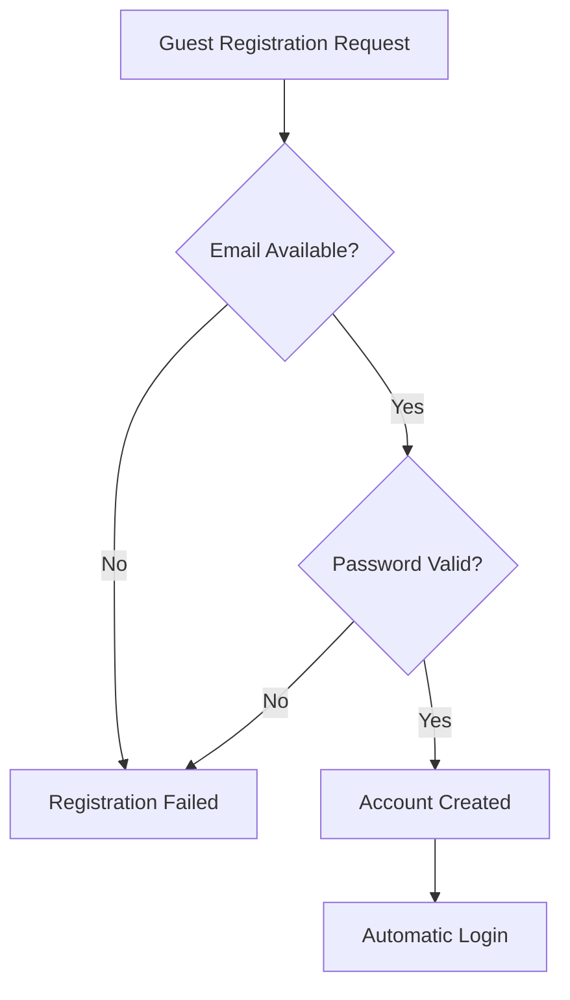

### Email Authentication

### Email Authentication

WHEN a user attempts to log in, THE system SHALL:
1. Require a registered email address
2. Require the correct password associated with that email
3. Authenticate the user credentials against stored values
4. Create a valid session for the authenticated user
5. Provide access to the user's private todo data

IF the email address is not registered, THE system SHALL reject the login attempt.
IF the password is incorrect, THE system SHALL reject the login attempt.

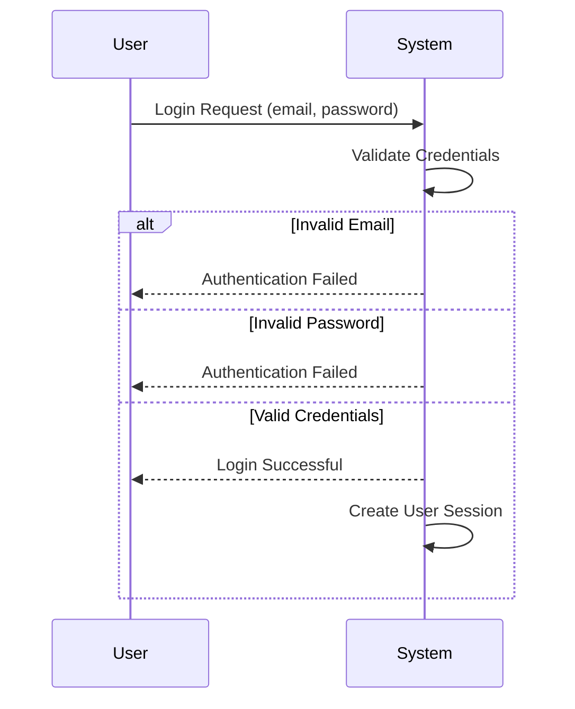

### Password Management

### Password Management

WHEN a logged-in user requests to change their password, THE system SHALL:
1. Require verification of the current password
2. Require a new password that meets security requirements
3. Update the user's password to the new value
4. Maintain the user's current session
5. Notify the user of successful password change

IF the current password verification fails, THE system SHALL reject the password change request.
IF the new password does not meet security requirements, THE system SHALL reject the password change request.

WHILE a user is logged in, THE system SHALL allow password changes at any time.

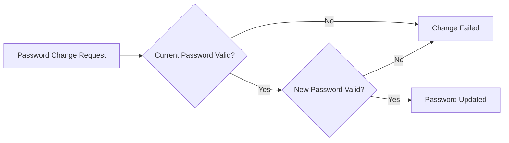

### Profile Updates

### Profile Updates

WHEN a logged-in user updates their display name, THE system SHALL:
1. Accept the new display name value
2. Validate that the display name is not empty
3. Update the user's profile with the new display name
4. Reflect the change immediately in the user interface
5. Preserve all other profile information unchanged

IF the display name is empty, THE system SHALL reject the update request.

THE system SHALL allow users to update their display name at any time while logged in.

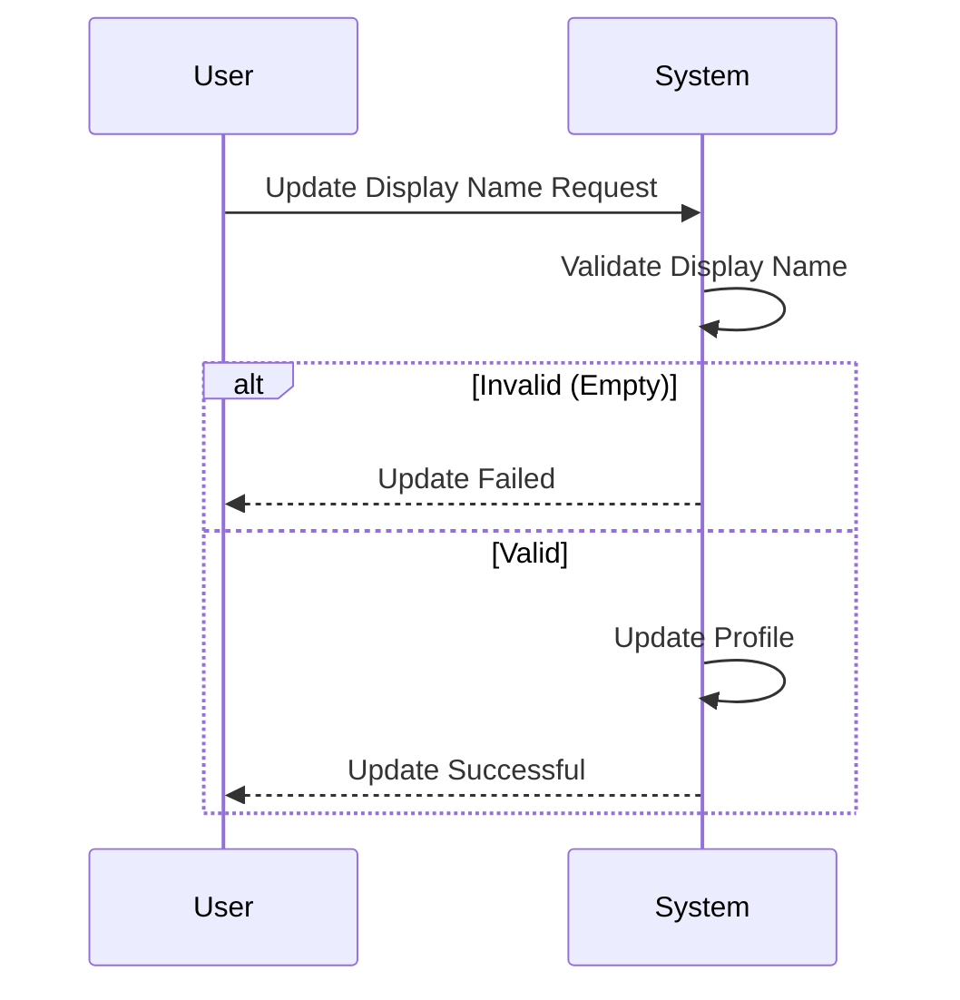

### Account Deletion

### Account Deletion

WHEN a logged-in user requests to delete their account, THE system SHALL:
1. Require confirmation of the deletion action
2. Permanently delete all user data including:
   - User profile information
   - All todos created by the user
   - All edit history associated with the user's todos
   - All trash items belonging to the user
3. Invalidate the user's current session
4. Remove the user account from the system

IF the user does not confirm the deletion, THE system SHALL cancel the account deletion process.

THE system SHALL ensure that account deletion is irreversible and permanent.

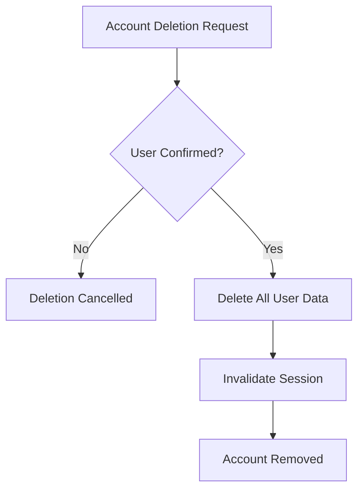

### Privacy Enforcement

### Privacy Enforcement

THE system SHALL enforce complete privacy between users by:
1. Ensuring users can only access their own account information
2. Preventing users from viewing other users' profiles
3. Restricting todo access to the creating user only
4. Maintaining data isolation between different user accounts

WHEN a user attempts to access another user's data, THE system SHALL reject the request.

WHILE a user is logged in, THE system SHALL only display data belonging to that user.

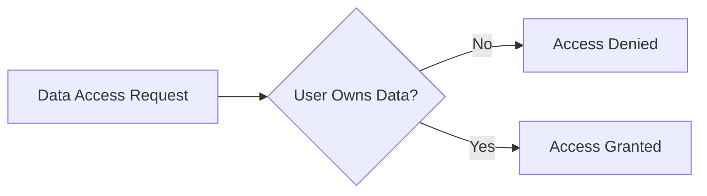

### Unique Email Validation

### Unique Email Validation

THE system SHALL ensure email uniqueness across all active user accounts by:
1. Checking email availability during user registration
2. Preventing duplicate email registrations
3. Maintaining email as the unique identifier for user accounts

WHEN a user attempts to register with an existing email, THE system SHALL reject the registration.

IF an email is already associated with an active account, THE system SHALL consider it unavailable for new registration.

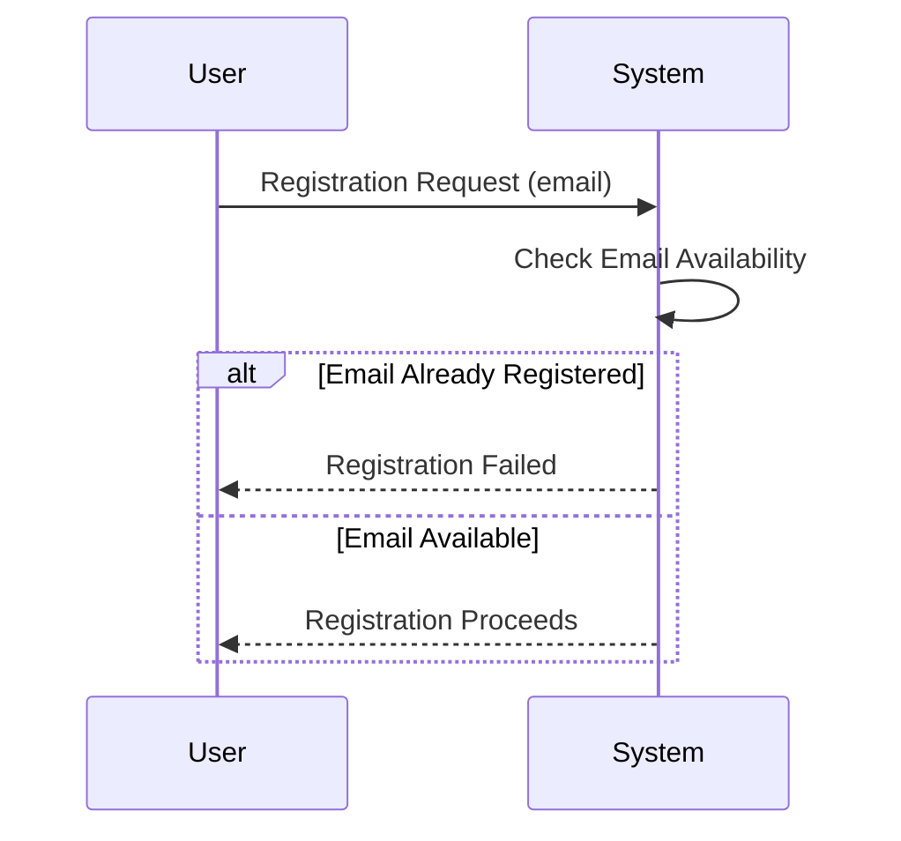

### Display Name Management

### Display Name Management

THE system SHALL manage user display names by:
1. Providing each user with a display name for identification
2. Allowing users to change their display name at any time
3. Validating that display names are not empty
4. Storing and displaying the current display name consistently

WHEN a user updates their display name, THE system SHALL immediately reflect the change across the application.

IF a display name update request contains an empty value, THE system SHALL reject the request.

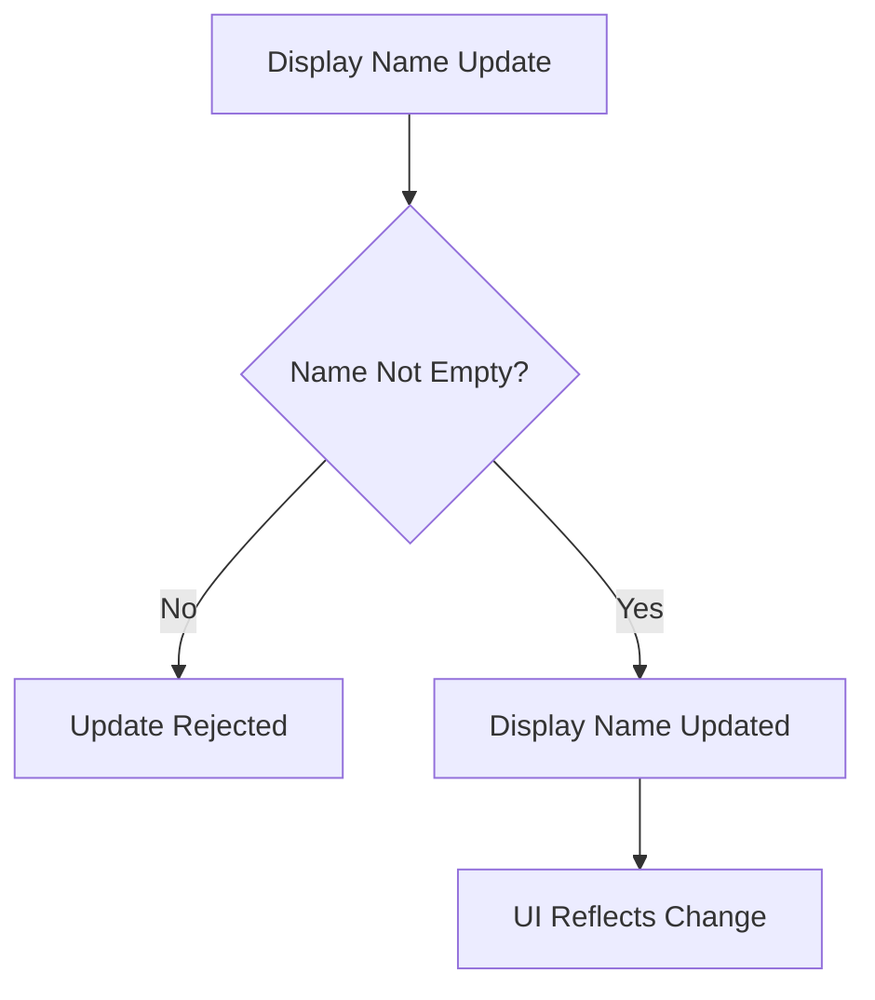

### Login Workflow

### Login Workflow

WHEN a user initiates the login process, THE system SHALL:
1. Present a login form requesting email and password
2. Validate the provided credentials against stored user data
3. Create an authenticated session upon successful validation
4. Redirect the user to their private todo dashboard
5. Maintain the session until the user logs out or the session expires

IF authentication fails, THE system SHALL return to the login form with an error message.

THE system SHALL allow users to log in at any time from the application's entry point.

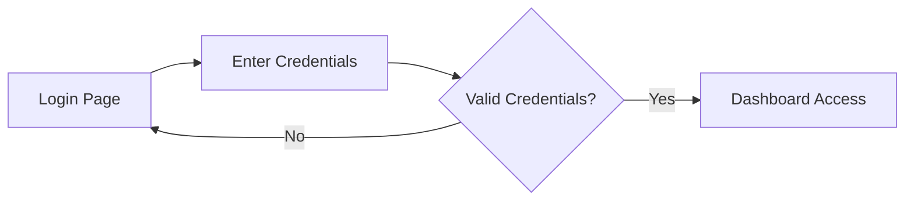

### Credential Verification

### Credential Verification

THE system SHALL verify user credentials during authentication by:
1. Comparing the provided email against registered user emails
2. Validating the provided password against the stored hash
3. Ensuring both email and password match an existing user account
4. Providing appropriate error messages for specific failure cases

WHEN credential verification fails, THE system SHALL indicate whether the email or password was incorrect.

IF the email is not found, THE system SHALL indicate "email not registered".
IF the password is incorrect, THE system SHALL indicate "invalid password".

```mermaid
sequenceDiagram
    participant U as User
    participant S as System
    U->>S: Login Credentials
    S->>S: Verify Email Existence
    alt Email Not Found
        S-->>U: "Email not registered"
    else Email Found
        S->>S: Verify Password
        alt Password Incorrect
            S-->>U: "Invalid password"
        else Password Correct
            S-->>U: Login Successful
        end
    end


## Todo Operations

Users can create todos with a required title and optional description, start date, and due date. New todos are automatically marked as incomplete upon creation. Users can view their todo list with pagination support for efficient browsing. Individual todo viewing provides access to all details including title, description, dates, and completion status. Todo completion status can be toggled between complete and incomplete states. Editing operations allow users to modify title, description, start date, and due date fields. Soft delete functionality moves todos to trash instead of permanent deletion. Todo restoration from trash returns items to the active todo list. Permanent deletion removes todos and their associated edit histories from the system.

### Todo Creation

### Todo Creation

WHEN a user creates a todo, THE system SHALL:
1. Require a title field to be provided
2. Allow an optional description field
3. Allow optional start date and due date fields
4. Set the completion status to incomplete by default
5. Associate the todo with the creating user
6. Record the creation timestamp

IF the title field is empty or missing, THE system SHALL reject the creation request.
IF the due date is earlier than the start date, THE system SHALL reject the creation request.

```mermaid
flowchart TD
    A["User initiates
    todo creation"] --> B{Title provided?}
    B -->|No| C["Reject request
    with error"]
    B -->|Yes| D{Date validation
    passes?}
    D -->|No| C
    D -->|Yes| E["Create todo
    with default values"]
    E --> F["Todo created
    successfully"]
```

### Completion Status Toggle

### Completion Status Toggle

WHEN a user toggles a todo's completion status, THE system SHALL:
1. Change the status from incomplete to complete
2. Change the status from complete to incomplete
3. Record the timestamp of the status change
4. Update the todo's last modified timestamp

THE system SHALL maintain exactly two completion states: incomplete and complete.

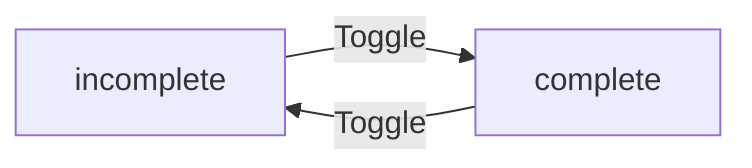

### Soft Deletion to Trash

### Soft Deletion to Trash

WHEN a user deletes a todo, THE system SHALL:
1. Mark the todo as deleted instead of permanent removal
2. Remove the todo from the normal todo list view
3. Preserve the todo's edit history
4. Record the deletion timestamp
5. Move the todo to the user's trash collection

DELETED todos SHALL NOT appear in standard todo list views or search results.
DELETED todos SHALL retain all their original data including title, description, dates, and completion status.

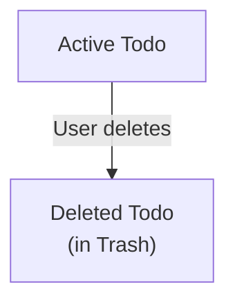

### Trash Management Operations

### Trash Management Operations

WHEN a user views their trash, THE system SHALL:
1. Display only the user's own deleted todos
2. Provide paginated results for efficient browsing
3. Show todo title, deletion date, and original creation date
4. Exclude permanently deleted todos from the trash view

THE trash view SHALL include options to restore or permanently delete each todo.
THE trash view SHALL NOT display todos deleted by other users.

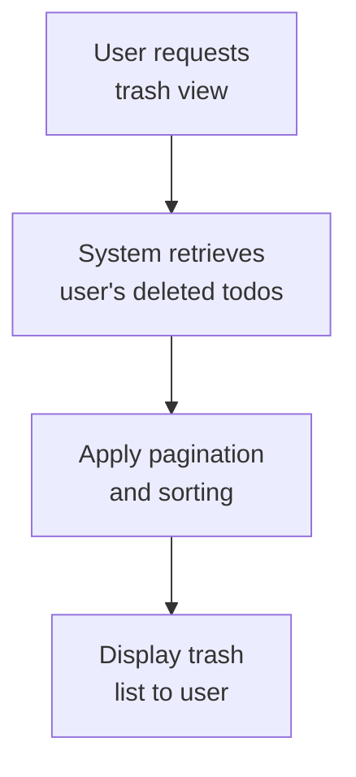

### Todo Restoration from Trash

### Todo Restoration from Trash

WHEN a user restores a todo from trash, THE system SHALL:
1. Remove the deleted status from the todo
2. Return the todo to the user's active todo list
3. Preserve all todo data including edit history
4. Record the restoration timestamp

RESTORED todos SHALL appear in normal todo list views and search results.
RESTORED todos SHALL retain their original completion status and all field values.

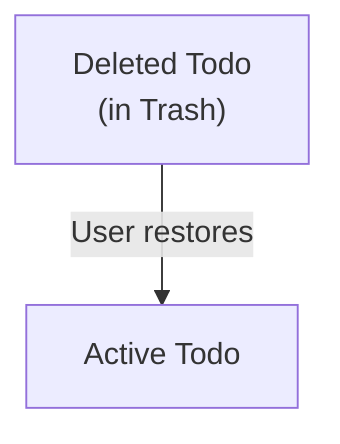

### Permanent Deletion from Trash

### Permanent Deletion from Trash

WHEN a user permanently deletes a todo from trash, THE system SHALL:
1. Remove the todo and all associated data from the system
2. Delete all edit history entries linked to the todo
3. Ensure the todo cannot be recovered
4. Remove the todo from all user views and search results

PERMANENTLY DELETED todos SHALL be completely removed from the database.
PERMANENTLY DELETED todos SHALL NOT appear in any user interface or search results.

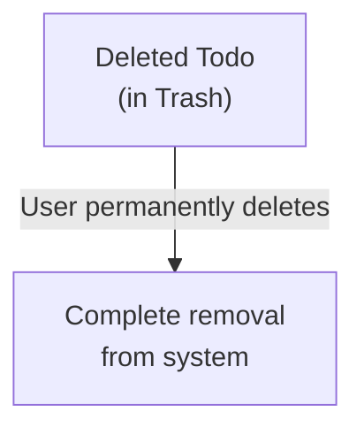

### Todo List Pagination

### Todo List Pagination

WHEN a user views their todo list, THE system SHALL:
1. Display todos in paginated batches
2. Provide navigation controls for moving between pages
3. Show the total number of todos and current page information
4. Maintain consistent page size across user sessions

THE system SHALL support pagination parameters including page number and page size.
THE system SHALL return empty results when no todos match the current page criteria.

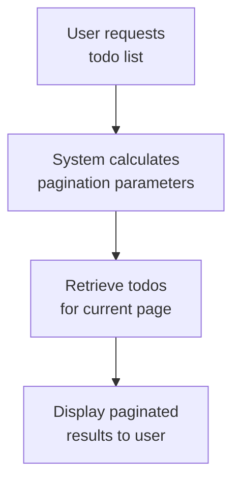

### Individual Todo View

### Individual Todo View

WHEN a user views an individual todo, THE system SHALL:
1. Display all todo details including title, description, start date, due date, and completion status
2. Show the creation date and last modification date
3. Provide access to the full edit history
4. Ensure the todo belongs to the viewing user

IF the requested todo does not exist or belongs to another user, THE system SHALL reject the view request.
THE individual todo view SHALL include all field values as they were at the time of viewing.

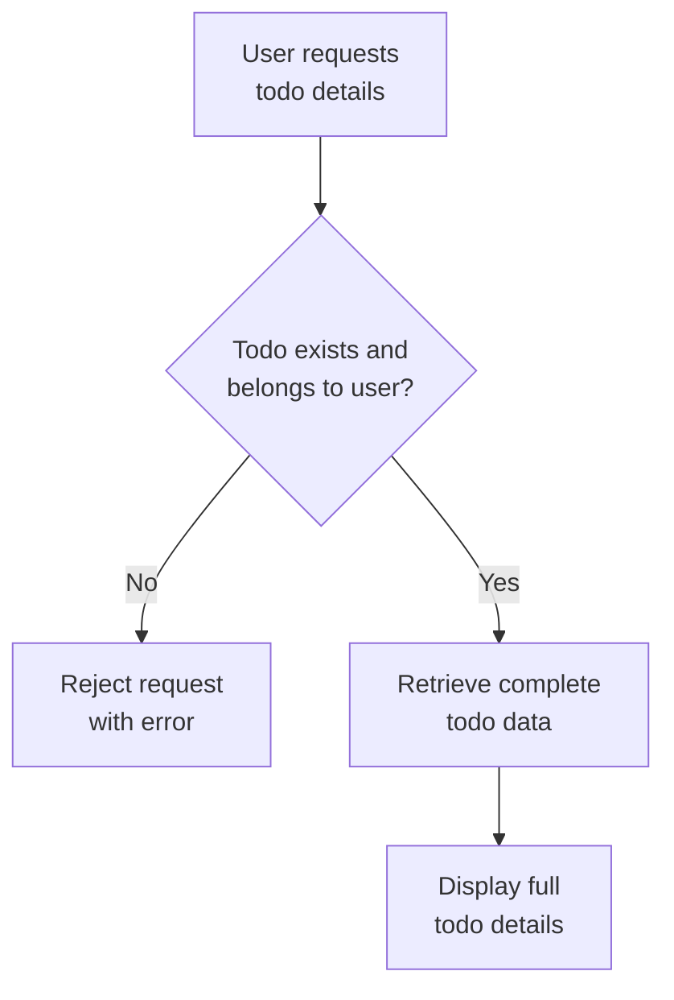

### Todo Field Editing

### Todo Field Editing

WHEN a user edits a todo, THE system SHALL:
1. Allow modification of title, description, start date, and due date fields
2. Create an edit history entry recording the changes
3. Update the last modification timestamp
4. Validate field constraints during editing

FOR EACH field change, THE system SHALL record the previous value in the edit history.
IF the edited todo has been deleted, THE system SHALL reject the edit request.

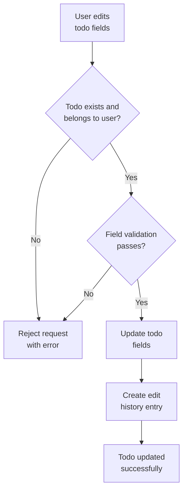

### Date Management Operations

### Date Management Operations

WHEN managing todo dates, THE system SHALL:
1. Allow start date and due date to be set independently
2. Validate that due date is not earlier than start date when both are set
3. Handle todos without dates by placing them at the end of date-based sorts
4. Support date formatting consistent with the user's locale

TODOS without start dates SHALL appear after todos with start dates when sorting by start date.
TODOS without due dates SHALL appear after todos with due dates when sorting by due date.

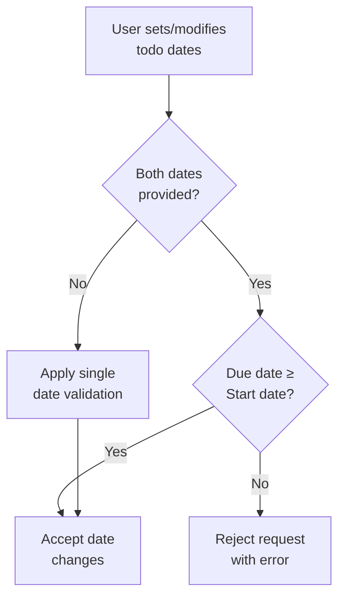

### Completion Status Tracking

### Completion Status Tracking

THE system SHALL maintain and track completion status for each todo.

WHEN filtering todos by completion status, THE system SHALL:
1. Support filtering for: all todos, only complete todos, only incomplete todos
2. Apply the filter to both active todo lists and trash views
3. Maintain filter state during user session navigation

COMPLETION STATUS SHALL be preserved during todo restoration from trash.
COMPLETION STATUS SHALL be included in all todo list views and individual todo displays.

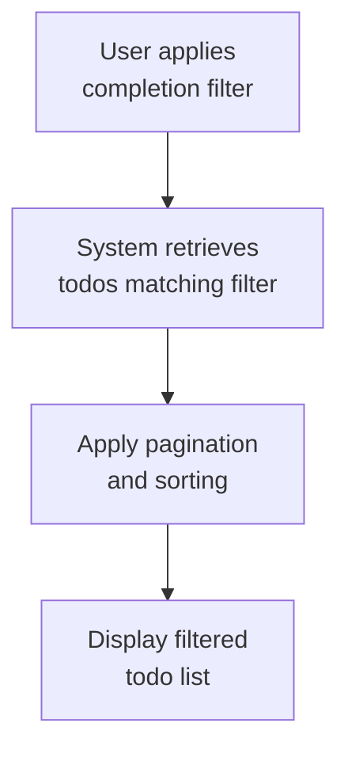

## EditHistory Operations

Edit history entries are automatically created whenever a todo is modified by the user. Each history record captures the timestamp of the edit operation for chronological tracking. Field-specific changes are recorded including title modifications, description updates, and date adjustments. The system maintains a complete audit trail showing the evolution of each todo over time. Users can view the full edit history for any of their todos in reverse chronological order. History entries provide transparency into how todos have been modified throughout their lifecycle. Edit history is permanently deleted when a todo is permanently removed from the trash. The history system operates automatically without requiring manual user intervention.

### Automatic History Creation

WHEN a user edits a todo, THE system SHALL automatically create an edit history entry.

THE system SHALL create an edit history entry for every modification made to a todo, including:
- Title changes
- Description changes  
- Start date changes
- Due date changes
- Completion status changes

IF a todo is edited multiple times in a single session, THE system SHALL create separate history entries for each distinct edit operation.

WHEN a todo is permanently deleted from trash, THE system SHALL permanently delete all associated edit history entries.

THE system SHALL associate each edit history entry with both the todo being edited and the user performing the edit.

```mermaid
flowchart TD
    A["User edits todo"] --> B["System creates history entry"]
    B --> C["Record timestamp and changes"]
    C --> D["Associate with todo and user"]
```

### Change Tracking and Field Modification Recording

WHEN creating an edit history entry, THE system SHALL record:
1. The timestamp when the edit occurred
2. The specific field(s) that were modified
3. The previous value(s) of the modified field(s)

FOR each modified field, THE system SHALL record:
- Title changes: the previous title value
- Description changes: the previous description value
- Start date changes: the previous start date value
- Due date changes: the previous due date value
- Completion status changes: the previous completion status

IF multiple fields are modified in a single edit, THE system SHALL record changes for all modified fields in the same history entry.

IF a field is not modified during an edit, THE system SHALL NOT record any change information for that field.

THE system SHALL maintain an accurate audit trail showing the complete evolution of each todo over time.

### History Viewing and Chronological Ordering

WHEN a user requests to view the edit history of their todo, THE system SHALL display all edit history entries for that todo.

THE system SHALL display edit history entries in reverse chronological order (most recent edits first).

FOR each history entry displayed, THE system SHALL show:
- The timestamp of the edit
- Which specific fields were modified
- The previous values of the modified fields

THE system SHALL only allow users to view edit history for their own todos.

IF a todo has no edit history, THE system SHALL display an appropriate message indicating no history exists.

```mermaid
sequenceDiagram
    participant U as User
    participant S as System
    U->>S: Request todo edit history
    S->>S: Verify user owns todo
    S->>S: Retrieve history entries
    S->>S: Sort by timestamp descending
    S-->>U: Display chronological history
```

### Audit Trail and Transparency Maintenance

THE system SHALL maintain a complete audit trail showing all modifications made to each todo throughout its lifecycle.

THE system SHALL ensure edit history provides transparency into how todos have been modified over time.

WHILE a todo exists (not permanently deleted), THE system SHALL preserve its complete edit history.

THE system SHALL document all modifications made to todos, creating a reliable record of changes for accountability and tracking purposes.

IF a todo is restored from trash, THE system SHALL preserve its edit history from before deletion.

THE system SHALL maintain edit history as an immutable record that cannot be modified or deleted by users.

### Lifecycle Tracking and Modification Documentation

THE system SHALL track the complete lifecycle of each todo through edit history entries.

WHEN a todo is created, THE system SHALL NOT create an initial edit history entry (creation is not considered an edit).

THE system SHALL document every modification made to a todo after its creation.

WHEN viewing edit history, THE system SHALL provide a chronological documentation of how the todo evolved from creation to current state.

THE system SHALL maintain modification documentation that shows the progression of todo content and status changes over time.

IF a todo is permanently deleted, THE system SHALL permanently remove all associated modification documentation.

# Business Actions and Workflows

Business actions and workflows beyond basic CRUD.

## User Actions

Users register for the application by providing an email and password during sign-up. The system validates that the email is unique among active accounts before creating the user profile. Users authenticate by logging in with their registered email and password combination. After successful authentication, users can change their password by providing their current password and a new password that meets security requirements. Users can edit their display name at any time to update how they appear within the application. Account deletion is a comprehensive workflow where users initiate deletion and confirm their intent, after which all their todos and associated data are permanently removed. The system ensures privacy by preventing users from viewing other users' profiles or accessing their data.

### User Registration Workflow

WHEN a guest initiates user registration, THE system SHALL:
1. Present a registration form requiring email and password
2. Validate that the email format is correct
3. Validate that the password meets security requirements
4. Check that the email is unique among all active user accounts
5. Create a new user account with the provided email and hashed password
6. Set the display name to a default value derived from the email
7. Create an initial user profile
8. Log the user in automatically upon successful registration

IF the email is already registered to an active account, THE system SHALL reject the registration and inform the user.
IF the password does not meet security requirements, THE system SHALL reject the registration and specify the requirements.
IF the email format is invalid, THE system SHALL reject the registration and indicate the format issue.

WHEN registration succeeds, THE system SHALL redirect the user to their todo dashboard.

### Login Authentication Process

WHEN a guest attempts to log in, THE system SHALL:
1. Present a login form requiring email and password
2. Validate the email format
3. Look up the user account by email
4. Verify the provided password against the stored hashed password
5. Create an authenticated session for the user
6. Redirect the user to their todo dashboard

IF the email does not match any registered account, THE system SHALL reject the login attempt.
IF the password is incorrect for the registered account, THE system SHALL reject the login attempt.
IF the user account has been deleted, THE system SHALL reject the login attempt.

WHILE a user is logged in, THE system SHALL maintain their authenticated session until they log out or the session expires.

THE system SHALL prevent logged-in users from accessing the login page.

### Password Change Procedure

WHEN a logged-in member requests to change their password, THE system SHALL:
1. Require entry of current password for verification
2. Require entry of new password
3. Require confirmation of new password
4. Validate that the new password meets security requirements
5. Verify that the current password matches the user's stored password
6. Update the user's password with the new hashed password
7. Maintain the user's current session
8. Notify the user of successful password change

IF the current password is incorrect, THE system SHALL reject the password change.
IF the new password does not meet security requirements, THE system SHALL reject the password change.
IF the new password confirmation does not match, THE system SHALL reject the password change.

THE system SHALL allow password changes only for authenticated members.

### Account Deletion Workflow

WHEN a logged-in member initiates account deletion, THE system SHALL:
1. Present a confirmation screen explaining the consequences
2. Require the user to confirm their intent to delete
3. Require entry of the user's current password for verification
4. Permanently delete all the user's todos, including those in trash
5. Permanently delete all the user's edit history entries
6. Permanently delete the user's profile
7. Permanently delete the user account
8. Log the user out and invalidate their session
9. Redirect to the application homepage

IF the user cancels the deletion process, THE system SHALL return them to their profile page.
IF the password verification fails, THE system SHALL reject the deletion request.

THE system SHALL provide a final confirmation step before irreversible account deletion.

### Profile Editing Actions

WHEN a logged-in member edits their profile, THE system SHALL:
1. Allow modification of the display name field
2. Validate that the display name meets format requirements
3. Update the user's profile with the new display name
4. Preserve all other profile information unchanged
5. Reflect the updated display name throughout the application

THE system SHALL NOT allow users to edit their email address.
THE system SHALL NOT allow users to view or edit other users' profiles.

IF the display name format is invalid, THE system SHALL reject the update and indicate the requirements.

### Privacy Enforcement Mechanism

THE system SHALL enforce complete data isolation between users.

WHEN any user attempts to access todo data, THE system SHALL:
1. Verify the user's authentication status
2. Filter all todo queries to include only todos belonging to the authenticated user
3. Reject any request attempting to access todos not owned by the authenticated user

WHEN any user attempts to access profile data, THE system SHALL:
1. Verify the user's authentication status
2. Allow access only to the authenticated user's own profile
3. Reject any request attempting to access other users' profiles

THE system SHALL provide no mechanism for users to view, access, or share another user's todos.
THE system SHALL provide no mechanism for users to view another user's profile information.

IF an unauthenticated user attempts to access user-specific data, THE system SHALL redirect to the login page.

### Email Uniqueness Validation

THE system SHALL ensure email uniqueness across all active user accounts.

WHEN validating email uniqueness during registration, THE system SHALL:
1. Check against all active user accounts
2. Consider an email unique if no active account uses it
3. Treat deleted accounts as inactive for uniqueness checks

WHEN validating email uniqueness during profile updates, THE system SHALL:
1. Allow the current user's email to remain unchanged
2. Reject any email change that conflicts with an active account's email

IF an email conflict is detected during registration, THE system SHALL prevent account creation.
IF an email conflict is detected during profile update, THE system SHALL reject the update.

THE system SHALL treat email addresses as case-insensitive for uniqueness validation.

## Todo Actions

Users create todos by providing a required title and optional description, start date, and due date. New todos are automatically marked as incomplete upon creation. Users can toggle the completion status of their todos between complete and incomplete states. Editing a todo involves updating any combination of title, description, start date, or due date, with each change triggering a history entry. When users delete a todo, it moves to the trash rather than being permanently removed. Users can restore deleted todos from the trash back to their active list. Permanent deletion from the trash removes the todo and its entire edit history. Users can filter their todo list to show all todos, only complete todos, or only incomplete todos. Sorting options allow users to organize todos by creation date, start date, or due date in ascending or descending order.

### Todo Creation Workflow

### Todo Creation Workflow

WHEN a member creates a todo, THE system SHALL:
1. Require a title for the todo
2. Allow an optional description
3. Allow an optional start date
4. Allow an optional due date
5. Set the completion status to incomplete by default
6. Associate the todo with the creating member
7. Record the creation timestamp

IF the title is missing or empty, THE system SHALL reject the creation request.
IF the due date precedes the start date, THE system SHALL reject the creation request.

WHEN a todo is successfully created, THE system SHALL make it available in the member's todo list.

```mermaid
flowchart TD
    A["Member initiates todo creation"] --> B{Title provided?}
    B -->|No| C["Reject creation request"]
    B -->|Yes| D{Date validation passed?}
    D -->|No| C
    D -->|Yes| E["Create todo with default incomplete status"]
    E --> F["Todo available in member's list"]
```

### Completion Status Toggle

### Completion Status Toggle

WHEN a member toggles the completion status of their todo, THE system SHALL:
1. Switch between complete and incomplete states
2. Update the todo's completion status immediately
3. Preserve all other todo attributes unchanged

THE system SHALL allow members to mark their own todos as complete.
THE system SHALL allow members to mark their own todos as incomplete.

IF a member attempts to toggle completion status of a todo they do not own, THE system SHALL reject the request.
IF a member attempts to toggle completion status of a todo in trash, THE system SHALL reject the request.

```mermaid
flowchart LR
    A["incomplete"] -->|"Mark complete"| B["complete"]
    B -->|"Mark incomplete"| A
```

### Todo Editing Process

### Todo Editing Process

WHEN a member edits their todo, THE system SHALL:
1. Allow updating the title
2. Allow updating the description
3. Allow updating the start date
4. Allow updating the due date
5. Create an edit history entry for each change
6. Record which fields were modified
7. Record the previous values of modified fields
8. Record the timestamp of the edit
9. Associate the edit history entry with both the todo and the member

THE system SHALL require that at least one field is modified for an edit to be processed.

IF the member attempts to edit a todo they do not own, THE system SHALL reject the request.
IF the member attempts to edit a todo in trash, THE system SHALL reject the request.
IF the new due date precedes the new start date, THE system SHALL reject the edit request.

```mermaid
sequenceDiagram
    participant M as Member
    participant S as System
    M->>S: Request todo edit
    S->>S: Validate ownership and dates
    S->>S: Update todo fields
    S->>S: Create edit history entry
    S-->>M: Return updated todo
```

### Soft Deletion to Trash

### Soft Deletion to Trash

WHEN a member deletes their todo, THE system SHALL:
1. Move the todo to trash instead of permanent deletion
2. Remove the todo from the normal todo list
3. Preserve all todo attributes including edit history
4. Record the deletion timestamp

THE system SHALL allow members to delete their own todos.

IF a member attempts to delete a todo they do not own, THE system SHALL reject the request.
IF a member attempts to delete a todo already in trash, THE system SHALL reject the request.

WHILE a todo is in trash, THE system SHALL exclude it from normal todo list operations.

```mermaid
flowchart TD
    A["Active Todo"] -->|"Member deletes"| B["Todo in Trash"]
    B -->|"Excluded from normal lists"| C["Hidden from main view"]
```

### Restoration from Trash

### Restoration from Trash

WHEN a member restores a todo from trash, THE system SHALL:
1. Return the todo to the normal todo list
2. Preserve all todo attributes and edit history
3. Make the todo available for normal operations
4. Remove the todo from the trash list

THE system SHALL allow members to restore their own todos from trash.

IF a member attempts to restore a todo they do not own, THE system SHALL reject the request.
IF a member attempts to restore a todo not in trash, THE system SHALL reject the request.

WHEN a todo is restored, THE system SHALL treat it as an active todo with its original completion status.

```mermaid
flowchart TD
    A["Todo in Trash"] -->|"Member restores"| B["Active Todo"]
    B -->|"Available in normal lists"| C["Visible in main view"]
```

### Permanent Deletion Workflow

### Permanent Deletion Workflow

WHEN a member permanently deletes a todo from trash, THE system SHALL:
1. Remove the todo permanently from the system
2. Delete all associated edit history entries
3. Remove the todo from the trash list
4. Make the deletion irreversible

THE system SHALL require explicit confirmation for permanent deletion.
THE system SHALL only allow permanent deletion from the trash view.

IF a member attempts to permanently delete a todo they do not own, THE system SHALL reject the request.
IF a member attempts to permanently delete a todo not in trash, THE system SHALL reject the request.

WHEN a member's account is deleted, THE system SHALL permanently delete all their todos and associated edit history.

```mermaid
sequenceDiagram
    participant M as Member
    participant S as System
    M->>S: Request permanent deletion
    S->>S: Validate ownership and trash status
    S->>S: Delete todo and all history
    S-->>M: Confirm permanent deletion
```

### Filtering by Completion Status

### Filtering by Completion Status

WHEN a member filters their todo list, THE system SHALL provide options for:
1. All todos (both complete and incomplete)
2. Only complete todos
3. Only incomplete todos

THE system SHALL apply the selected filter to the member's todo list.
THE system SHALL exclude todos in trash from all filtering operations.

WHEN filtering by completion status, THE system SHALL:
- For "All todos": Include both complete and incomplete active todos
- For "Only complete todos": Include only todos with completion status set to complete
- For "Only incomplete todos": Include only todos with completion status set to incomplete

THE system SHALL maintain the selected filter across pagination operations.

```mermaid
flowchart TD
    A["Member selects filter"] --> B{Filter type}
    B -->|All| C["Show complete + incomplete"]
    B -->|Complete only| D["Show only complete"]
    B -->|Incomplete only| E["Show only incomplete"]
    C --> F["Display filtered list"]
    D --> F
    E --> F
```

### Sorting by Date Attributes

### Sorting by Date Attributes

WHEN a member sorts their todo list, THE system SHALL provide options for:
1. Creation date (newest first or oldest first)
2. Start date (earliest first or latest first)
3. Due date (earliest first or latest first)

THE system SHALL apply the selected sort order to the member's todo list.
THE system SHALL exclude todos in trash from all sorting operations.

WHEN sorting by start date or due date, THE system SHALL:
- Place todos without the date attribute at the end of the list
- Apply the selected direction (ascending/descending) to todos with the date attribute

THE system SHALL maintain the selected sort order across pagination operations.

FOR each sort option, THE system SHALL provide both ascending and descending directions.

```mermaid
flowchart TD
    A["Member selects sort"] --> B{Sort attribute}
    B -->|Creation date| C["Apply creation date sort"]
    B -->|Start date| D["Apply start date sort"]
    B -->|Due date| E["Apply due date sort"]
    C --> F["Display sorted list"]
    D --> F
    E --> F
```

### Trash Management Actions

### Trash Management Actions

WHEN a member accesses their trash, THE system SHALL:
1. Display a paginated list of deleted todos
2. Show todo title, deletion date, and original completion status
3. Provide options to restore or permanently delete each todo

THE system SHALL allow members to view their trash contents.
THE system SHALL allow members to restore todos from trash.
THE system SHALL allow members to permanently delete todos from trash.

IF a member attempts to access another member's trash, THE system SHALL reject the request.

WHILE viewing trash, THE system SHALL:
- Display todos in reverse chronological order of deletion (newest first)
- Provide pagination for large trash collections
- Show the total count of items in trash

THE system SHALL require explicit confirmation for permanent deletion actions.

```mermaid
flowchart TD
    A["Member views trash"] --> B["Display paginated trash list"]
    B --> C{Member action}
    C -->|Restore| D["Return todo to active list"]
    C -->|Permanent delete| E["Remove todo and history permanently"]
    D --> F["Update trash view"]
    E --> F
```

## EditHistory Actions

The system automatically creates an edit history entry whenever a user modifies any field of a todo. Each history entry captures the timestamp of the edit and records the specific changes made to title, description, start date, or due date. Users can view the complete edit history for any of their todos, with entries displayed in reverse chronological order from most recent to oldest. The history provides a comprehensive audit trail showing how a todo has evolved over time. When a todo is permanently deleted from the trash, its entire edit history is also permanently removed. The history viewing workflow allows users to understand the progression of changes made to their todos.

### Automatic History Creation

### Automatic History Creation

WHEN a user edits any field of a todo, THE system SHALL automatically create an edit history entry.

THE system SHALL create a history entry for each individual edit operation, regardless of how many fields are modified in a single edit.

IF a user modifies multiple todo fields in a single edit operation, THE system SHALL record all changed fields in a single history entry.

WHEN a todo is created, THE system SHALL NOT create an edit history entry (creation is not considered an edit).

IF a user attempts to edit a todo but makes no actual changes to any field, THE system SHALL NOT create an edit history entry.

THE system SHALL create history entries only for valid edits that successfully update the todo.

IF the todo edit fails validation or encounters an error, THE system SHALL NOT create a history entry.

THE system SHALL record the timestamp of the edit operation at the moment the edit is committed to the system.

### Edit Change Tracking

### Edit Change Tracking

WHEN a user edits a todo's title, THE system SHALL record the previous title value in the history entry.

WHEN a user edits a todo's description, THE system SHALL record the previous description value in the history entry.

WHEN a user edits a todo's start date, THE system SHALL record the previous start date value in the history entry.

WHEN a user edits a todo's due date, THE system SHALL record the previous due date value in the history entry.

IF a user clears a previously set start date, THE system SHALL record the previous start date value as part of the change.

IF a user clears a previously set due date, THE system SHALL record the previous due date value as part of the change.

IF a user sets a start date where none existed previously, THE system SHALL record the change from null to the new start date value.

IF a user sets a due date where none existed previously, THE system SHALL record the change from null to the new due date value.

THE system SHALL track only field changes that actually modify the todo's content.

IF a user changes a field to the same value it already contained, THE system SHALL NOT record that field change in the history.

### History Entry Structure

### History Entry Structure

EACH edit history entry SHALL contain a timestamp indicating when the edit occurred.

EACH edit history entry SHALL record which user performed the edit operation.

EACH edit history entry SHALL contain fields for title change tracking, including the previous title value if the title was modified.

EACH edit history entry SHALL contain fields for description change tracking, including the previous description value if the description was modified.

EACH edit history entry SHALL contain fields for start date change tracking, including the previous start date value if the start date was modified.

EACH edit history entry SHALL contain fields for due date change tracking, including the previous due date value if the due date was modified.

IF a field was not modified during the edit, THE system SHALL indicate that no change occurred for that field.

EACH history entry SHALL be uniquely identifiable within the context of a specific todo.

THE system SHALL maintain the association between each history entry and the todo it belongs to.

THE system SHALL maintain the association between each history entry and the user who performed the edit.

### Reverse Chronological Display

### Reverse Chronological Display

WHEN a user views the edit history of a todo, THE system SHALL display history entries in reverse chronological order (most recent first).

THE system SHALL sort history entries by timestamp descending, with the most recent edit appearing at the top of the list.

THE system SHALL paginate the history display when there are more entries than can reasonably fit on a single page.

EACH page of history entries SHALL maintain the reverse chronological ordering.

WHEN navigating between pages of history, THE system SHALL preserve the chronological ordering across page boundaries.

THE system SHALL display the timestamp of each history entry in a user-readable format.

THE system SHALL clearly indicate which fields were changed in each history entry.

IF a history entry contains changes to multiple fields, THE system SHALL display all changed fields together for that entry.

THE system SHALL provide visual differentiation between consecutive history entries to help users distinguish individual edits.

### Todo Evolution Tracking

### Todo Evolution Tracking

THE system SHALL provide a complete timeline showing how a todo has evolved from creation to its current state.

WHEN viewing a todo's edit history, THE system SHALL allow users to understand the progression of changes made over time.

THE system SHALL enable users to see the sequence of modifications that led to the todo's current content.

EACH history entry SHALL represent a distinct point in the todo's evolution timeline.

THE system SHALL allow users to trace back through the history to understand why specific changes were made.

WHEN multiple edits occur in quick succession, THE system SHALL preserve the exact sequence and timing of those edits.

THE system SHALL maintain the integrity of the evolution timeline even when edits are made by the same user multiple times.

IF a todo has never been edited, THE system SHALL indicate that no evolution has occurred beyond the initial creation.

THE system SHALL provide context for each edit by showing what the todo looked like before and after each change.

### History Audit Trail

### History Audit Trail

THE system SHALL maintain an audit trail that captures every modification made to every todo.

EACH audit trail entry SHALL be immutable once created and cannot be modified or deleted by users.

THE system SHALL ensure the audit trail provides a reliable record of all todo modifications for accountability purposes.

WHEN a user views the audit trail, THE system SHALL display who made each change and when it was made.

THE system SHALL provide sufficient detail in the audit trail to reconstruct the state of the todo at any point in its history.

THE audit trail SHALL capture the complete context of each edit, including all fields that were modified.

THE system SHALL prevent tampering with the audit trail by ensuring history entries cannot be altered after creation.

IF a user attempts to access the audit trail of a todo they do not own, THE system SHALL deny access to maintain privacy.

THE audit trail SHALL be comprehensive enough to support review and analysis of todo modification patterns over time.

### Permanent History Deletion

### Permanent History Deletion

WHEN a todo is permanently deleted from the trash, THE system SHALL permanently delete all associated edit history entries.

THE system SHALL remove all history entries linked to a todo when that todo is permanently deleted.

PERMANENT deletion of a todo SHALL result in the complete removal of its entire edit history from the system.

THE system SHALL ensure that when a todo is permanently deleted, no trace of its edit history remains accessible.

IF a user permanently deletes a todo from the trash, THE system SHALL NOT preserve any part of its edit history.

THE system SHALL perform permanent history deletion as an atomic operation with the todo deletion.

ONCE a todo's history is permanently deleted, THE system SHALL make it impossible to recover or reconstruct the history.

THE system SHALL ensure that permanent deletion of history entries occurs only when the associated todo is permanently deleted.

IF a todo is restored from the trash before permanent deletion, THE system SHALL preserve its edit history intact.

THE system SHALL maintain referential integrity by ensuring history entries exist only for todos that have not been permanently deleted.

# Error Scenarios and Edge Cases

Business-level error scenarios, edge case coverage, and expected system behaviors for exceptional conditions.

## User Error Scenarios

When users register with an email that already exists in the system, they receive an error indicating the email is already taken. Password requirements must be enforced during registration and password changes, with clear error messages when requirements are not met. Users attempting to log in with incorrect credentials receive authentication failure messages without revealing whether the email exists or the password is wrong. Account deletion operations require confirmation to prevent accidental deletion, and users receive warnings about permanent data loss. When users attempt to edit profiles with invalid display names (such as empty strings or excessively long names), validation errors occur. Rate limiting prevents abuse of authentication endpoints like login and registration attempts from the same IP address. Email verification links expire after a set period, requiring users to request new verification emails if expired. Concurrent account modifications by the same user may result in conflict resolution favoring the most recent change. Users attempting to access other users' profiles receive permission denied errors consistent with the app's privacy model.

### Duplicate Email Registration Errors

### Duplicate Email Registration Errors

WHEN a user attempts to register with an email address, THE system SHALL:
1. Validate that the email address is not already registered in the system
2. Check the email format against standard email validation rules
3. Provide clear error messaging when a duplicate email is detected

IF the email address is already registered, THE system SHALL:
1. Reject the registration request immediately
2. Display an error message indicating "This email address is already registered"
3. Prevent account creation with the duplicate email
4. Allow the user to attempt registration with a different email address

WHILE processing registration requests, THE system SHALL:
1. Maintain data consistency by ensuring no duplicate email addresses exist
2. Perform email uniqueness validation before creating any user account
3. Handle concurrent registration attempts for the same email address appropriately

WHERE email validation fails due to duplication, THE system SHALL:
1. Not create any partial user account data
2. Roll back any temporary registration state
3. Preserve system integrity by preventing duplicate user creation

### Password Validation Errors

### Password Validation Errors

WHEN a user registers or changes their password, THE system SHALL:
1. Enforce minimum password complexity requirements
2. Validate password length and character composition
3. Provide immediate feedback on password validation failures

IF password requirements are not met, THE system SHALL:
1. Reject the password change or registration attempt
2. Display specific error messages indicating which requirements failed
3. Allow the user to correct and resubmit the password
4. Maintain security by not accepting weak passwords

WHILE processing password operations, THE system SHALL:
1. Validate passwords against current security standards
2. Prevent common weak password patterns
3. Ensure password validation occurs before any account modification

WHERE password validation fails, THE system SHALL:
1. Not update the user's password
2. Preserve the existing password if changing
3. Prevent account creation if registration password fails validation

### Authentication Failure Scenarios

### Authentication Failure Scenarios

WHEN a user attempts to log in, THE system SHALL:
1. Validate credentials without revealing whether the email exists
2. Provide generic authentication failure messages
3. Implement security measures to prevent credential enumeration

IF authentication fails due to incorrect credentials, THE system SHALL:
1. Return a generic "Invalid email or password" error message
2. Not indicate whether the email address exists in the system
3. Increment failed login attempt counters for security monitoring
4. Allow users to retry authentication with corrected credentials

WHILE handling authentication requests, THE system SHALL:
1. Maintain consistent response times regardless of failure reason
2. Prevent timing attacks that could reveal account existence
3. Log authentication failures for security analysis

WHERE authentication fails repeatedly, THE system SHALL:
1. Implement progressive security measures
2. Consider temporary account locking after excessive failures
3. Provide clear guidance on password recovery options

### Account Deletion Confirmation Requirements

### Account Deletion Confirmation Requirements

WHEN a user requests account deletion, THE system SHALL:
1. Require explicit confirmation before proceeding
2. Display clear warning about permanent data loss
3. List all data that will be permanently deleted

IF account deletion is initiated, THE system SHALL:
1. Present a confirmation dialog with destruction warnings
2. Require the user to acknowledge the irreversible nature
3. Prevent accidental deletion through multiple confirmation steps
4. Allow cancellation of the deletion process at any confirmation step

WHILE processing account deletion, THE system SHALL:
1. Maintain data integrity during the deletion process
2. Ensure all user data is properly removed according to privacy policies
3. Preserve system consistency by completing deletion atomically

WHERE account deletion is confirmed, THE system SHALL:
1. Permanently remove all user data including todos and edit history
2. Send confirmation of successful account deletion
3. Log the deletion event for audit purposes

### Profile Edit Validation Errors

### Profile Edit Validation Errors

WHEN a user attempts to edit their profile display name, THE system SHALL:
1. Validate the display name meets length and character requirements
2. Check for prohibited content or formatting in display names
3. Provide immediate validation feedback during editing

IF profile validation fails, THE system SHALL:
1. Reject the profile update request
2. Display specific error messages indicating validation failures
3. Highlight the specific fields that require correction
4. Allow the user to correct and resubmit the profile changes

WHILE processing profile edits, THE system SHALL:
1. Ensure display name changes do not violate system naming policies
2. Maintain consistency across user profile data
3. Validate all profile fields before applying changes

WHERE profile validation errors occur, THE system SHALL:
1. Preserve the user's existing profile data
2. Not apply partial profile updates
3. Allow users to cancel the edit operation if desired

### Rate Limiting Scenarios

### Rate Limiting Scenarios

WHEN users access authentication endpoints, THE system SHALL:
1. Implement rate limiting to prevent abuse and brute force attacks
2. Monitor request patterns from individual IP addresses
3. Apply progressive restrictions based on request frequency

IF rate limits are exceeded, THE system SHALL:
1. Return appropriate rate limit exceeded error responses
2. Provide clear information about when the limit will reset
3. Prevent further authentication attempts during the limit period
4. Log rate limit violations for security monitoring

WHILE enforcing rate limits, THE system SHALL:
1. Maintain service availability for legitimate users
2. Distinguish between normal usage patterns and potential abuse
3. Apply limits consistently across all authentication endpoints

WHERE rate limiting is triggered, THE system SHALL:
1. Gracefully handle the exceeded limit condition
2. Provide helpful guidance to legitimate users
3. Protect system resources from excessive load

### Verification Link Expiration Handling

### Verification Link Expiration Handling

WHEN email verification links are generated, THE system SHALL:
1. Assign expiration timestamps to all verification links
2. Define a reasonable validity period for verification links
3. Track link usage and expiration status

IF a verification link has expired, THE system SHALL:
1. Reject the verification attempt
2. Provide clear messaging indicating the link has expired
3. Offer the option to request a new verification email
4. Prevent account activation with expired links

WHILE handling verification requests, THE system SHALL:
1. Validate link expiration before processing verification
2. Maintain security by not accepting expired verification tokens
3. Provide clear pathways for obtaining new verification links

WHERE verification links expire, THE system SHALL:
1. Maintain account security by requiring fresh verification
2. Allow users to request new verification emails easily
3. Log expiration events for user assistance and system monitoring

### Concurrent Modification Conflicts

### Concurrent Modification Conflicts

WHEN multiple users attempt to modify the same resource concurrently, THE system SHALL:
1. Detect concurrent modification attempts
2. Implement conflict resolution mechanisms
3. Maintain data consistency across concurrent operations

IF concurrent modifications are detected, THE system SHALL:
1. Identify the nature of the conflict (data overwrite, state change, etc.)
2. Apply appropriate conflict resolution strategies
3. Notify users about the conflict and resolution outcome
4. Preserve data integrity by preventing corrupt states

WHILE handling concurrent operations, THE system SHALL:
1. Use optimistic locking or versioning where appropriate
2. Ensure that the most recent valid change takes precedence
3. Maintain audit trails of conflicting operations

WHERE concurrent conflicts occur, THE system SHALL:
1. Provide clear error messages explaining the conflict
2. Offer users options to resolve or retry their operations
3. Preserve system stability despite concurrent access patterns

### Permission Denied Error Scenarios

### Permission Denied Error Scenarios

WHEN users attempt to access resources they don't own, THE system SHALL:
1. Validate ownership and permissions before granting access
2. Implement strict data isolation between users
3. Prevent unauthorized access to other users' data

IF permission validation fails, THE system SHALL:
1. Return generic "Permission Denied" error messages
2. Not reveal existence or details of unauthorized resources
3. Log permission violation attempts for security monitoring
4. Maintain consistent privacy protection across all operations

WHILE enforcing permissions, THE system SHALL:
1. Apply the principle of least privilege consistently
2. Ensure users can only access their own todos and profiles
3. Prevent information leakage through error messages or timing

WHERE permission denied errors occur, THE system SHALL:
1. Maintain user privacy by not disclosing resource existence
2. Provide consistent error responses regardless of resource validity
3. Allow legitimate users to access their own resources without interruption

## Todo Error Scenarios

Creating todos without a title results in validation errors requiring users to provide this mandatory field. When users attempt to set invalid date ranges (such as due dates before start dates), the system prevents creation with appropriate error messages. Editing todos that have been recently deleted or permanently removed results in operation not allowed errors. Concurrent edits to the same todo by the same user may result in version conflicts requiring manual resolution. Filtering and sorting operations handle edge cases like todos without dates by placing them at the end of sorted lists. Pagination errors occur when users request pages beyond the available todo count, returning empty results gracefully. Attempting to mark non-existent todos as complete/incomplete results in resource not found errors. Date validation prevents users from setting start or due dates in invalid formats or unrealistic ranges. Restoring todos from trash that no longer exist or have been permanently deleted results in operation failures.

### Missing Title Validation

WHEN a user attempts to create a todo without a title, THE system SHALL reject the request.

WHEN a user attempts to edit a todo and removes the title, THE system SHALL reject the request.

IF a todo creation request lacks a title field, THE system SHALL return a validation error indicating the title is required.

IF a todo edit request attempts to set the title to an empty string, THE system SHALL return a validation error indicating the title cannot be empty.

WHERE title validation fails, THE system SHALL preserve all other valid field values from the request.

THE system SHALL provide clear error messages indicating that a title is mandatory for todo creation and editing.

### Invalid Date Range Handling

WHEN a user attempts to create a todo with a due date that precedes the start date, THE system SHALL reject the request.

WHEN a user attempts to edit a todo and sets a due date earlier than the start date, THE system SHALL reject the request.

IF a todo has both start date and due date set, THE system SHALL ensure the due date is not earlier than the start date.

WHERE date range validation fails, THE system SHALL provide specific error messages indicating the invalid date relationship.

THE system SHALL allow todos to have only start date set, only due date set, or both dates set with valid chronology.

IF a user sets a start date after the current date, THE system SHALL accept the future start date as valid.

### Deleted Todo Operations

WHEN a user attempts to edit a todo that has been soft-deleted, THE system SHALL reject the operation.

WHEN a user attempts to mark a soft-deleted todo as complete or incomplete, THE system SHALL reject the operation.

IF a user attempts to access a soft-deleted todo through normal todo list operations, THE system SHALL exclude it from results.

WHERE operations are attempted on soft-deleted todos, THE system SHALL provide appropriate error messages indicating the todo is in trash.

THE system SHALL only allow restoration and permanent deletion operations on soft-deleted todos.

WHEN a user attempts to view the edit history of a soft-deleted todo, THE system SHALL allow access if the todo exists in trash.

### Concurrent Edit Conflicts

WHEN multiple users attempt to edit the same todo simultaneously, THE system SHALL handle the requests sequentially.

IF a todo is modified between the time a user loads it and attempts to save changes, THE system SHALL detect the version conflict.

WHERE a version conflict is detected during todo editing, THE system SHALL reject the later edit request.

THE system SHALL provide conflict error messages indicating the todo has been modified by another operation.

WHEN a conflict occurs, THE system SHALL preserve the most recent valid changes to the todo.

IF a user encounters an edit conflict, THE system SHALL require them to reload the todo and reapply their changes.

### Empty Pagination Results

WHEN a user requests a page number beyond the available todo count, THE system SHALL return an empty result set.

IF a user applies filters that result in zero matching todos, THE system SHALL return an empty paginated list.

WHERE pagination returns empty results, THE system SHALL maintain consistent pagination metadata (total count, page size).

THE system SHALL provide appropriate messaging when no todos match the current filters or page criteria.

WHEN a user attempts to navigate to a non-existent page, THE system SHALL redirect to the last valid page or first page.

IF pagination parameters are invalid (negative page numbers, zero page size), THE system SHALL use default values or return validation errors.

### Non-Existent Todo Access

WHEN a user attempts to access a todo that does not exist, THE system SHALL return a not found error.

IF a user provides an invalid todo identifier, THE system SHALL validate the format before attempting access.

WHERE a todo access request fails due to non-existent resource, THE system SHALL provide appropriate error messaging.

THE system SHALL prevent users from accessing todos that belong to other users, treating them as non-existent from the requesting user's perspective.

WHEN a user attempts to perform operations on a non-existent todo (edit, delete, complete), THE system SHALL reject all operations.

IF a restored todo from trash is accessed after permanent deletion, THE system SHALL treat it as non-existent.

### Date Format Validation

WHEN a user provides a start date or due date in an invalid format, THE system SHALL reject the request.

IF a date value cannot be parsed as a valid date, THE system SHALL return a format validation error.

WHERE date format validation fails, THE system SHALL provide specific error messages indicating the expected date format.

THE system SHALL accept dates in ISO 8601 format (YYYY-MM-DD) for consistency.

WHEN a user provides a date that is logically impossible (e.g., February 30th), THE system SHALL reject it as invalid.

IF a date is provided without time component, THE system SHALL interpret it as the beginning of that day in the user's timezone.

### Trash Restoration Failures

WHEN a user attempts to restore a todo that has been permanently deleted from trash, THE system SHALL return a not found error.

IF a restoration operation fails due to system constraints, THE system SHALL provide appropriate error messaging.

WHERE a todo cannot be restored (e.g., associated user account deleted), THE system SHALL prevent the operation.

THE system SHALL validate that a todo exists in trash before attempting restoration.

WHEN restoration fails, THE system SHALL preserve the todo in its current state (remaining in trash).

IF multiple restoration attempts are made on the same todo, THE system SHALL handle duplicate operations gracefully.

## EditHistory Error Scenarios

When users attempt to view edit history for todos that have no history (newly created), the system displays an empty history list. Accessing edit history for todos that have been permanently deleted results in resource not found errors. History entries capture only changed fields, so unchanged fields show no modification in the history view. Concurrent history creation during rapid todo edits may result in timestamp resolution conflicts requiring system-level ordering. Viewing history for todos that users don't own results in permission denied errors consistent with privacy rules. When todos are permanently deleted, their associated edit history is also removed, preventing access to historical data. History pagination handles edge cases where users have extensive edit histories spanning multiple pages. The system maintains history integrity even when todo fields are repeatedly edited and reverted to previous values.

### Empty History Handling

WHEN a user views the edit history for a newly created todo, THE system SHALL display an empty history list.

WHEN a user views the edit history for a todo that has never been edited, THE system SHALL display an empty history list.

IF a todo has no edit history entries, THE system SHALL display a message indicating no history is available.

WHILE viewing an empty history list, THE system SHALL maintain consistent pagination controls with zero entries.

WHERE a todo has no edit history, THE system SHALL prevent navigation to non-existent history pages.

### Deleted Todo History Access

WHEN a user attempts to access edit history for a todo that has been permanently deleted, THE system SHALL reject the request.

IF a todo has been permanently deleted from the trash, THE system SHALL prevent access to its edit history.

WHEN a user attempts to view history for a todo that no longer exists, THE system SHALL indicate the resource is not found.

WHERE a todo has been soft-deleted but not permanently removed, THE system SHALL allow access to its edit history.

IF a todo is permanently deleted, THE system SHALL remove all associated edit history entries.

### Partial Field Change Recording

WHEN a user edits only the title of a todo, THE system SHALL create a history entry recording only the title change.

WHEN a user edits only the description of a todo, THE system SHALL create a history entry recording only the description change.

WHEN a user edits multiple fields simultaneously, THE system SHALL create a single history entry recording all changed fields.

IF a field remains unchanged during an edit, THE system SHALL not record any change information for that field.

WHERE partial field changes occur, THE system SHALL maintain accurate field-specific modification tracking.

### Timestamp Conflict Resolution

WHEN multiple users edit the same todo simultaneously, THE system SHALL create separate history entries with distinct timestamps.

IF timestamp conflicts occur due to rapid successive edits, THE system SHALL resolve conflicts using system-level ordering.

WHEN history entries have identical timestamps, THE system SHALL display them in the order they were processed.

WHERE concurrent edits occur, THE system SHALL maintain chronological accuracy in history display.

THE system SHALL ensure that history entries maintain proper sequencing regardless of edit frequency.

### Unauthorized History Access

WHEN a user attempts to view edit history for a todo they do not own, THE system SHALL reject the request.

IF a user attempts to access another user's todo history, THE system SHALL prevent access.

WHEN unauthorized history access is attempted, THE system SHALL return a permission denied error.

WHERE privacy rules are enforced, THE system SHALL ensure history access is restricted to todo owners.

THE system SHALL maintain consistent permission checks across all history viewing operations.

### History Deletion with Todos

WHEN a todo is permanently deleted from the trash, THE system SHALL delete all associated edit history entries.

IF a todo is permanently deleted, THE system SHALL remove its complete edit history.

WHEN history entries are deleted with their todo, THE system SHALL ensure no orphaned history records remain.

WHERE soft deletion occurs, THE system SHALL preserve edit history for potential restoration.

THE system SHALL maintain referential integrity between todos and their edit history.

### Extensive History Pagination

WHEN a user has more edit history entries than fit on a single page, THE system SHALL provide paginated navigation.

IF a todo has extensive edit history spanning multiple pages, THE system SHALL display entries in reverse chronological order.

WHEN viewing paginated history, THE system SHALL provide clear page navigation controls.

WHERE pagination is required, THE system SHALL maintain consistent page sizes across all history views.

THE system SHALL handle edge cases where users navigate to non-existent history pages.

### History Integrity Maintenance

WHEN a todo is edited multiple times with field reversions, THE system SHALL maintain complete history integrity.

IF a field is changed back to a previous value, THE system SHALL record both changes in the history.

WHEN history entries are created, THE system SHALL ensure they accurately reflect the state changes.

WHERE edit history is maintained, THE system SHALL prevent history tampering or modification.

THE system SHALL ensure that edit history provides an accurate audit trail of all todo modifications.

# End-to-End User Scenarios

Cross-domain user scenarios, multi-step business flows, and end-to-end use cases.

## User User Scenarios

New users begin their journey by registering with an email and password, which initiates the account creation workflow. After registration, users receive an email verification link to confirm their account ownership before gaining full access. Once verified, users can log in securely using their credentials to access their private todo workspace. Users may update their profile information by changing their display name to personalize their account identity. When users forget their passwords, they initiate a password recovery flow that sends reset instructions to their registered email. Account management scenarios include changing passwords for security purposes and deleting accounts when users no longer need the service. The account deletion workflow permanently removes all user data including todos and edit histories, ensuring complete privacy. Users navigate between different application sections while maintaining secure authentication throughout their session.

### User Registration and Verification Workflow

WHEN a guest initiates user registration, THE system SHALL:
1. Require a valid email address and password
2. Validate that the email format is correct
3. Ensure the password meets minimum security requirements
4. Create a user account with pending verification status
5. Send an email verification link to the provided email address

WHILE the user account has pending verification status, THE system SHALL:
1. Prevent the user from accessing todo management features
2. Allow the user to request verification email resend
3. Maintain the account in a temporary state

WHEN the user clicks the verification link, THE system SHALL:
1. Validate the verification token
2. Activate the user account
3. Grant full access to todo management features
4. Redirect the user to the application dashboard

IF the email address is already registered, THE system SHALL reject the registration request.
IF the verification link expires, THE system SHALL require the user to request a new verification email.

### Login Authentication Flow

WHEN a user attempts to log in, THE system SHALL:
1. Require a registered email address and password
2. Validate the credentials against stored user data
3. Create an authenticated session upon successful validation
4. Redirect the user to their private todo workspace

WHILE a user maintains an active session, THE system SHALL:
1. Provide access to all authorized features
2. Maintain session security through appropriate mechanisms
3. Allow session termination upon user request

IF the email address is not registered, THE system SHALL reject the login attempt.
IF the password is incorrect, THE system SHALL reject the login attempt.
IF the user account is not verified, THE system SHALL prevent login and prompt for verification.

### Password Recovery Scenario

WHEN a user requests password recovery, THE system SHALL:
1. Require a registered email address
2. Send a password reset link to the provided email
3. Allow the user to set a new password using the reset link

WHEN the user accesses the password reset link, THE system SHALL:
1. Validate the reset token authenticity
2. Require the user to enter a new password
3. Update the user's password upon successful validation
4. Invalidate all existing sessions for security

IF the email address is not registered, THE system SHALL not disclose this information.
IF the reset token expires, THE system SHALL require a new password recovery request.

### Account Management Operations

WHEN an authenticated user requests to change their password, THE system SHALL:
1. Require the current password for verification
2. Require a new password that meets security standards
3. Update the password upon successful validation
4. Invalidate existing sessions for security

WHEN an authenticated user views their account settings, THE system SHALL:
1. Display current profile information
2. Provide options for password change
3. Display account deletion option
4. Show account creation date and verification status

IF the current password is incorrect, THE system SHALL reject the password change request.
IF the new password doesn't meet security requirements, THE system SHALL reject the change.

### Profile Update Journey

WHEN an authenticated user updates their profile, THE system SHALL:
1. Allow modification of the display name
2. Require the display name to meet format requirements
3. Update the profile information immediately upon validation
4. Reflect the changes across all user interfaces

WHILE viewing the profile settings, THE system SHALL:
1. Display the current display name in an editable field
2. Provide clear instructions for profile updates
3. Show the last update timestamp

IF the display name format is invalid, THE system SHALL reject the update request.
THE system SHALL prevent users from viewing other users' profiles.

### Account Deletion Lifecycle

WHEN an authenticated user requests account deletion, THE system SHALL:
1. Require confirmation of the deletion request
2. Display the consequences of account deletion
3. Permanently delete all user data including todos and edit histories
4. Remove the user account from the system

BEFORE account deletion, THE system SHALL:
1. Warn the user about irreversible data loss
2. Require explicit confirmation
3. Verify the user's identity through re-authentication

AFTER account deletion, THE system SHALL:
1. Terminate all active sessions
2. Remove all user-related data
3. Prevent future access with the deleted account credentials

THE system SHALL ensure complete privacy by permanently removing all user data.

### Multi-Step Authentication Flows

WHEN a user performs sensitive operations, THE system SHALL:
1. Require re-authentication for account deletion
2. Verify identity through password confirmation
3. Maintain session integrity throughout multi-step processes

WHEN a user navigates between application sections, THE system SHALL:
1. Maintain authentication state consistently
2. Require re-authentication after session timeout
3. Provide seamless transitions between authenticated features

IF re-authentication fails, THE system SHALL cancel the sensitive operation.
IF session timeout occurs, THE system SHALL redirect to login page.

### Cross-Domain User Management

WHEN a user interacts with multiple domain entities, THE system SHALL:
1. Maintain data isolation between users
2. Ensure user actions only affect their own data
3. Provide consistent user experience across domains

WHEN user management operations affect todo data, THE system SHALL:
1. Cascade account deletion to remove all user todos
2. Maintain referential integrity between user and todo entities
3. Ensure edit history preservation until account deletion

THE system SHALL prevent cross-user data access at all times.
THE system SHALL maintain complete privacy between user accounts.

### End-to-End Account Setup

WHEN a new user completes the account setup journey, THE system SHALL:
1. Guide the user through registration, verification, and initial login
2. Provide onboarding instructions for todo management
3. Ensure seamless transition from guest to authenticated member

WHEN a user returns after account setup, THE system SHALL:
1. Provide quick access to previously created todos
2. Maintain consistent application state
3. Offer profile completion suggestions if needed

THE system SHALL provide a complete user journey from registration to productive todo management.
THE system SHALL maintain user preferences and settings throughout the account lifecycle.

### Session Management Workflows

WHEN a user logs in successfully, THE system SHALL:
1. Create a secure session with appropriate timeout
2. Maintain session state across application navigation
3. Provide session termination options

WHEN a user logs out, THE system SHALL:
1. Terminate the active session
2. Clear session-related data
3. Redirect to the login page

WHEN session timeout occurs, THE system SHALL:
1. Automatically terminate the session
2. Require re-authentication for continued access
3. Preserve unsaved work where possible

IF unauthorized access is detected, THE system SHALL immediately terminate the session.

## Todo User Scenarios

Users create new todos by providing required titles and optional details like descriptions and dates, initiating the todo lifecycle. The todo management workflow involves viewing paginated lists, filtering by completion status, and sorting by various date criteria. Completion scenarios include toggling todos between complete and incomplete states, updating their status in real-time. Editing workflows allow users to modify todo details while automatically recording changes in the edit history. Users can delete todos through soft deletion, moving them to the trash while preserving data for potential restoration. The trash management flow enables users to review deleted items, restore them to active status, or permanently remove them. Complex scenarios involve creating multiple todos, applying filters and sorting options, and managing them across different completion states. Users navigate between todo creation, editing, viewing, and deletion workflows while maintaining data consistency and privacy.

### Todo Creation Workflow

### Todo Creation Workflow

WHEN a user creates a new todo, THE system SHALL:
1. Require a title field to be provided
2. Allow optional description field to be left empty
3. Accept optional start date or allow it to be left empty
4. Accept optional due date or allow it to be left empty
5. Set the todo's completion status to incomplete by default
6. Associate the todo with the creating user
7. Record the creation timestamp
8. Initialize an empty edit history for the todo

IF the title field is empty, THE system SHALL reject the creation request.
IF the due date is earlier than the start date, THE system SHALL reject the creation request.

```mermaid
flowchart TD
    A["User initiates todo creation"] --> B["System validates title"]
    B --> C["System validates date ranges"]
    C --> D["System creates todo with default values"]
    D --> E["System associates todo with user"]
    E --> F["Todo appears in user's list"]
```

### Todo Management Lifecycle

### Todo Management Lifecycle

WHEN a user manages their todos, THE system SHALL:
1. Display paginated lists of todos belonging to the user
2. Show title, completion status, start date, due date, and creation date for each todo
3. Allow viewing individual todo details including full description
4. Support editing of title, description, start date, and due date
5. Record all edits in the todo's edit history
6. Maintain chronological ordering of edit history entries

WHILE a user is viewing their todo list, THE system SHALL display only their own todos.
WHERE pagination is implemented, THE system SHALL provide navigation controls.

```mermaid
sequenceDiagram
    participant U as User
    participant S as System
    U->>S: Request todo list
    S->>S: Filter by user ownership
    S->>S: Apply pagination
    S-->>U: Display paginated todo list
    U->>S: Select individual todo
    S-->>U: Show full todo details
```

### Completion Status Toggle

### Completion Status Toggle

WHEN a user toggles a todo's completion status, THE system SHALL:
1. Switch between complete and incomplete states
2. Update the todo's completion status immediately
3. Record the status change in the edit history
4. Reflect the change in all list views
5. Maintain the todo's other properties unchanged

IF the todo is in the trash, THE system SHALL prevent completion status changes.
WHERE multiple todos are selected, THE system SHALL apply the toggle to all selected todos.

```mermaid
flowchart LR
    A["Incomplete Todo"] -->|"Mark Complete"| B["Complete Todo"]
    B -->|"Mark Incomplete"| A
```

### Filtering and Sorting Scenarios

### Filtering and Sorting Scenarios

WHEN a user filters their todo list, THE system SHALL:
1. Provide options for: all todos, complete todos only, incomplete todos only
2. Apply filters to the current paginated view
3. Maintain pagination state after filtering
4. Display the active filter state clearly

WHEN a user sorts their todo list, THE system SHALL:
1. Sort by creation date (newest first or oldest first)
2. Sort by start date (earliest first or latest first)
3. Sort by due date (earliest first or latest first)
4. Place todos without start dates at the end when sorting by start date
5. Place todos without due dates at the end when sorting by due date

WHERE filtering and sorting are combined, THE system SHALL apply filtering first, then sorting.

```mermaid
flowchart TD
    A["User selects filter"] --> B["System applies filter"]
    B --> C["User selects sort option"]
    C --> D["System applies sort"]
    D --> E["Display filtered/sorted list"]
```

### Soft Deletion Process

### Soft Deletion Process

WHEN a user deletes a todo, THE system SHALL:
1. Move the todo to the trash instead of permanent deletion
2. Remove the todo from normal todo list views
3. Preserve all todo data including edit history
4. Record the deletion timestamp
5. Allow the todo to be restored later

IF a user attempts to access a deleted todo through normal channels, THE system SHALL redirect to the trash view.
WHERE multiple todos are selected for deletion, THE system SHALL move all selected todos to trash.

```mermaid
flowchart LR
    A["Active Todo"] -->|"User Deletes"| B["Trash Todo"]
    B -->|"User Restores"| A
    B -->|"Permanent Delete"| C["Permanently Deleted"]
```

### Trash Management Flow

### Trash Management Flow

WHEN a user views their trash, THE system SHALL:
1. Display paginated list of deleted todos
2. Show title, original deletion date, and completion status
3. Provide options to restore or permanently delete each todo
4. Maintain chronological ordering of deleted items

WHEN a user restores a todo from trash, THE system SHALL:
1. Return the todo to the normal todo list
2. Preserve all original todo data and edit history
3. Remove the todo from the trash view
4. Update the restoration timestamp

WHEN a user permanently deletes a todo from trash, THE system SHALL:
1. Remove the todo and all its edit history permanently
2. Remove the todo from the trash view
3. Make the deletion irreversible

```mermaid
sequenceDiagram
    participant U as User
    participant S as System
    U->>S: Request trash view
    S->>S: Filter deleted todos by user
    S-->>U: Display paginated trash list
    U->>S: Select restore action
    S->>S: Move todo to active state
    S-->>U: Confirm restoration
```

### Todo Restoration Journey

### Todo Restoration Journey

WHEN a user restores a todo from trash, THE system SHALL:
1. Validate that the todo belongs to the user
2. Return the todo to its pre-deletion state
3. Preserve all edit history entries
4. Maintain the original creation and modification dates
5. Return the todo to the normal todo list view

IF the todo was completed before deletion, THE system SHALL maintain the completion status.
WHERE multiple todos are selected for restoration, THE system SHALL restore all selected todos.

```mermaid
flowchart TD
    A["User views trash"] --> B["User selects todo to restore"]
    B --> C["System validates ownership"]
    C --> D["System restores todo"]
    D --> E["Todo appears in normal list"]
```

### Multi-Todo Operations

### Multi-Todo Operations

WHEN a user performs operations on multiple todos, THE system SHALL:
1. Allow selection of multiple todos in list views
2. Support batch completion status toggling
3. Enable batch deletion to trash
4. Provide visual feedback for selected items
5. Maintain individual todo integrity during batch operations

WHERE batch operations are performed, THE system SHALL apply the operation to all selected todos simultaneously.
IF any todo in the selection cannot undergo the operation, THE system SHALL skip that todo and continue with others.

```mermaid
sequenceDiagram
    participant U as User
    participant S as System
    U->>S: Select multiple todos
    S-->>U: Show selection state
    U->>S: Choose batch operation
    S->>S: Validate each todo
    S->>S: Apply operation to valid todos
    S-->>U: Show operation results
```

### Cross-Functional Todo Handling

### Cross-Functional Todo Handling

WHEN a user performs complex todo operations, THE system SHALL:
1. Maintain data consistency across all views
2. Synchronize completion status changes instantly
3. Update edit history for all modifications
4. Reflect soft deletion in both active and trash views
5. Handle concurrent operations without data loss

WHERE a todo is being edited while another user operation occurs, THE system SHALL prevent conflicting modifications.
IF a todo is deleted during an edit operation, THE system SHALL cancel the edit and notify the user.

```mermaid
flowchart TD
    A["User edits todo"] --> B["System records changes"]
    B --> C["System updates all views"]
    C --> D["User sees updated todo"]
    A --> E["Another user deletes todo"]
    E --> F["System cancels edit operation"]
    F --> G["User notified of deletion"]
```

### End-to-End Todo Lifecycle

### End-to-End Todo Lifecycle

WHEN a todo progresses through its complete lifecycle, THE system SHALL:
1. Support creation with required and optional fields
2. Allow multiple edits with comprehensive history tracking
3. Enable completion status toggling at any point
4. Provide soft deletion with preservation option
5. Support restoration from trash with full data recovery
6. Allow permanent deletion when no longer needed

WHILE a todo exists in the system, THE system SHALL maintain its association with the original creator.
WHERE a user deletes their account, THE system SHALL permanently delete all their todos and associated edit history.

```mermaid
flowchart LR
    A["Created"] --> B["Edited"]
    B --> C["Completed/Incomplete"]
    C --> D["Soft Deleted"]
    D --> E["Restored"]
    D --> F["Permanently Deleted"]
    E --> B
    F --> G["Lifecycle Ends"]
```

## EditHistory User Scenarios

Every time a user edits a todo, the system automatically creates an edit history entry capturing the changes made. The edit history workflow records timestamped changes to title, description, start date, and due date fields. Users can review the complete edit history of any todo, viewing changes in reverse chronological order from most recent to oldest. The history tracking scenario provides transparency into how a todo has evolved over time through multiple edits. When users permanently delete todos from trash, the associated edit history is also removed as part of the cleanup process. Complex editing scenarios involve multiple consecutive changes to a todo, with each modification creating a separate history entry. Users can trace the evolution of complex todos through their edit history, understanding how requirements or details changed over time. The edit history system works seamlessly across todo creation, modification, and deletion workflows, maintaining accurate audit trails.

### Automatic Edit History Creation

WHEN a user edits a todo, THE system SHALL automatically create an edit history entry.

THE system SHALL record the timestamp when the edit occurred.

IF the user changes the todo title, THE system SHALL record the previous title value in the history entry.

IF the user changes the todo description, THE system SHALL record the previous description value in the history entry.

IF the user changes the todo start date, THE system SHALL record the previous start date value in the history entry.

IF the user changes the todo due date, THE system SHALL record the previous due date value in the history entry.

WHEN a user makes multiple changes to different fields in a single edit session, THE system SHALL create a single history entry capturing all field changes.

THE system SHALL associate each edit history entry with both the todo being edited and the user who made the changes.

```mermaid
flowchart TD
    A["User edits todo"] --> B["System captures changes"]
    B --> C["Create history entry"]
    C --> D["Record timestamp"]
    D --> E["Store field changes"]
    E --> F["Associate with user & todo"]
```

### Edit History Review Process

WHEN a user requests to view a todo's edit history, THE system SHALL display all history entries for that todo.

THE system SHALL present history entries in reverse chronological order, showing the most recent edits first.

FOR EACH history entry, THE system SHALL display:
- The timestamp when the edit occurred
- Which fields were changed
- The previous values of changed fields
- The user who made the changes

WHEN a user views the edit history, THE system SHALL only show entries for todos they own.

IF a todo has no edit history, THE system SHALL display an appropriate message indicating no history exists.

THE system SHALL paginate the edit history display when there are more than 20 entries.

```mermaid
sequenceDiagram
    participant U as User
    participant S as System
    U->>S: Request todo edit history
    S->>S: Verify user owns todo
    S->>S: Retrieve history entries
    S->>S: Sort by timestamp descending
    S-->>U: Display paginated history
```

### Multi-Edit Scenario Management

WHEN a user makes consecutive edits to the same todo, THE system SHALL create separate history entries for each edit session.

THE system SHALL maintain the complete sequence of edits, allowing users to trace how a todo evolved over time.

WHEN viewing edit history for a todo with multiple edits, THE system SHALL clearly distinguish between different edit sessions.

IF a user makes rapid successive edits (within 5 minutes), THE system SHALL still create separate history entries to maintain granular tracking.

THE system SHALL allow users to understand the progression of changes through the chronological sequence of history entries.

```mermaid
flowchart LR
    A["Edit 1"] --> B["Edit 2"] --> C["Edit 3"] --> D["Edit N"]
    E["History Entry 1"] --> F["History Entry 2"] --> G["History Entry 3"] --> H["History Entry N"]
```

### Permanent Deletion Cleanup

WHEN a user permanently deletes a todo from trash, THE system SHALL also permanently delete all associated edit history entries.

THE system SHALL ensure that edit history cleanup occurs as part of the permanent deletion workflow.

IF a todo is permanently deleted, THE system SHALL remove all trace of its edit history from the system.

THE system SHALL NOT retain edit history for permanently deleted todos.

WHEN permanently deleting multiple todos from trash, THE system SHALL delete edit history for each todo individually.

```mermaid
sequenceDiagram
    participant U as User
    participant S as System
    U->>S: Request permanent deletion
    S->>S: Verify todo in trash
    S->>S: Delete todo
    S->>S: Delete associated history
    S-->>U: Confirm deletion
```

### Cross-Workflow History Integration

WHEN a user creates a new todo, THE system SHALL NOT create an edit history entry for the initial creation.

WHEN a user edits a todo after creation, THE system SHALL create history entries as part of the standard editing workflow.

WHEN a user restores a todo from trash, THE system SHALL resume edit history tracking for subsequent edits.

THE system SHALL maintain edit history consistency across todo creation, modification, and deletion workflows.

WHEN a user performs operations that don't modify todo content (such as marking complete/incomplete), THE system SHALL NOT create edit history entries.

```mermaid
flowchart TD
    A["Todo Creation"] --> B["No History Entry"]
    B --> C["Todo Editing"] --> D["History Entry Created"]
    C --> E["Todo Deletion"] --> F["History Preserved"]
    F --> G["Todo Restoration"] --> H["History Resumes"]
```

### End-to-End Change Management

THE system SHALL provide complete transparency into how todos evolve through their lifecycle.

WHEN users review edit history, THE system SHALL enable them to understand the complete change trajectory of any todo.

THE system SHALL maintain an unbroken audit trail from the first edit through all subsequent modifications.

WHEN users need to understand why a todo has specific content or dates, THE system SHALL provide the historical context through edit history.

THE system SHALL support compliance and accountability requirements by maintaining accurate change records.

IF discrepancies occur in todo content, THE system SHALL enable investigation through the comprehensive edit history.

```mermaid
flowchart LR
    A["Initial Creation"] --> B["First Edit"] --> C["Subsequent Edits"] --> D["Final State"]
    E["No History"] --> F["History Entry 1"] --> G["History Entry N"] --> H["Complete Audit Trail"]
```