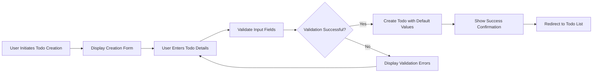

# Todo Creation and Management Requirements

## Introduction

This document defines the comprehensive business requirements for todo creation and management workflows in the multi-user Todo application. The system enables authenticated users to create, view, and manage their personal todo items with complete privacy and data isolation. Each user operates within their own isolated data environment, ensuring that todos are completely private and inaccessible to other users.

## Todo Creation Process

### User Workflow for Creating Todos

WHEN a user initiates todo creation, THE system SHALL present a creation interface with the following fields:

- **Title field** (required, text input with character limits)
- **Description field** (optional, text area with generous character allowance)
- **Start date field** (optional, date picker with validation)
- **Due date field** (optional, date picker with cross-validation)

WHEN the user submits the todo creation form, THE system SHALL validate all input fields according to the validation rules specified in this document.

### Creation Flow Diagram

## Required Fields and Validation

### Title Field Requirements

WHEN a user enters a todo title, THE system SHALL enforce the following validation rules:

- THE title field SHALL be required
- THE title SHALL accept a minimum of 1 character
- THE title SHALL accept a maximum of 255 characters
- THE title SHALL reject empty strings or whitespace-only content
- THE system SHALL trim leading and trailing whitespace from the title
- THE system SHALL provide real-time character count feedback

### Description Field Requirements

WHEN a user enters a todo description, THE system SHALL enforce the following validation rules:

- THE description field SHALL be optional
- THE description SHALL accept a maximum of 2000 characters
- THE system SHALL accept empty descriptions
- THE system SHALL trim leading and trailing whitespace from the description
- THE system SHALL provide character count feedback for non-empty descriptions

### Date Field Requirements

WHEN a user enters start or due dates, THE system SHALL enforce the following validation rules:

- THE start date field SHALL be optional
- THE due date field SHALL be optional
- THE system SHALL validate that dates are in valid ISO 8601 format
- THE system SHALL validate that start date is not after due date (if both are provided)
- THE system SHALL validate that dates are not in the past unless specifically allowed
- THE system SHALL use a consistent date format (YYYY-MM-DD) across the application
- THE system SHALL provide date picker controls with calendar interface

### Cross-Field Validation Requirements

WHEN both start date and due date are provided, THE system SHALL validate:
- THE start date SHALL be on or before the due date
- THE system SHALL provide clear error messages when date logic is violated
- THE validation SHALL occur both client-side and server-side

### Field Validation Error Handling

IF a user submits invalid todo data, THEN THE system SHALL display clear error messages indicating:

- Which field(s) contain errors
- What the specific validation requirements are
- How to correct the errors
- Preserve all valid data entered by the user

WHILE displaying validation errors, THE system SHALL preserve the user's entered data to avoid re-entry and provide field-level error highlighting.

## Default Values and States

### Initial Todo State

WHEN a todo is created, THE system SHALL set the following default values:

- THE completion status SHALL be set to "incomplete"
- THE creation date SHALL be set to the current UTC date and time
- THE last modified date SHALL be set to the creation date
- THE deletion status SHALL be set to "active" (not in trash)
- THE edit history SHALL be initialized with the creation entry

### Default Field Values

WHERE a field is optional and left empty, THE system SHALL store the following default values:

- THE description SHALL be stored as an empty string
- THE start date SHALL be stored as null
- THE due date SHALL be stored as null

### State Transition Rules

WHEN a todo is created, THE system SHALL ensure:
- THE todo SHALL be immediately available in the user's active todo list
- THE todo SHALL be excluded from trash views
- THE todo SHALL be included in filtering and sorting operations
- THE todo SHALL be accessible for editing and completion operations

## Todo Viewing Capabilities

### Individual Todo View

WHEN a user views a single todo, THE system SHALL display the following information:

- Todo title (full text without truncation)
- Completion status (with clear visual indicator and toggle control)
- Description (if provided, with full text display)
- Start date (if set, formatted as "Month Day, Year")
- Due date (if set, formatted as "Month Day, Year")
- Creation date and time (formatted relative or absolute)
- Last modified date and time (formatted relative or absolute)
- Edit history access link with entry count

### Individual Todo View Requirements

THE system SHALL provide a detailed view of individual todos that includes all stored information with appropriate formatting and accessibility.

WHEN viewing a todo, THE user SHALL see a complete representation of the todo's current state with options to edit, complete, or delete the todo.

### Accessibility Requirements

THE individual todo view SHALL meet the following accessibility standards:
- Screen reader compatibility for all displayed information
- Keyboard navigation support for all interactive elements
- High contrast visual design for status indicators
- Clear focus indicators for interactive controls

## List Display Requirements

### Todo List Display

WHEN a user views their todo list, THE system SHALL display the following information for each todo:

- Todo title (truncated to 60 characters with ellipsis)
- Completion status (with clear visual indicator)
- Start date (if set, formatted as "MMM DD")
- Due date (if set, formatted as "MMM DD")
- Creation date (formatted as relative time like "2 days ago")
- Visual indicators for overdue todos (when due date is in past)

### Pagination Requirements

WHERE the todo list contains more items than can be displayed on a single page, THE system SHALL implement pagination with the following characteristics:

- THE system SHALL display 20 todos per page by default
- THE system SHALL provide navigation controls (previous/next page buttons)
- THE system SHALL display the current page number and total page count
- THE system SHALL provide direct page number navigation for lists exceeding 5 pages
- THE system SHALL maintain consistent page sizes across user sessions
- THE system SHALL remember the current page during navigation

### Empty State Handling

IF a user has no todos, THEN THE system SHALL display an appropriate empty state message with:
- Guidance on how to create their first todo
- Visual illustration of the todo creation process
- Direct link to the todo creation interface
- Encouraging messaging for new users

### List Performance Optimization

WHEN displaying todo lists, THE system SHALL implement:
- Lazy loading for large datasets
- Efficient database queries with proper indexing
- Client-side caching for frequently accessed data
- Progressive loading indicators during data retrieval

## Performance Requirements

### Response Time Expectations

THE system SHALL provide the following performance characteristics:

- WHEN loading the todo list, THE system SHALL display results within 2 seconds for lists up to 100 items
- WHEN creating a new todo, THE system SHALL complete the operation within 1 second
- WHEN viewing an individual todo, THE system SHALL load the details within 1 second
- THE pagination controls SHALL respond instantly to user interactions
- THE filtering and sorting operations SHALL complete within 500 milliseconds

### Data Loading Performance

WHILE loading todo lists, THE system SHALL implement efficient data retrieval to ensure:
- Only necessary data is loaded for list display (title, status, dates)
- Large datasets are handled through proper pagination and indexing
- Sorting and filtering operations are performed at database level
- Client-side rendering optimizations for smooth scrolling

### Scalability Requirements

THE system SHALL support:
- Up to 10,000 todos per user without performance degradation
- Concurrent access by multiple users without data conflicts
- Rapid todo creation during peak usage periods
- Efficient storage and retrieval of todo edit history

## Business Rules

### Todo Ownership and Privacy

THE system SHALL enforce the following privacy rules:
- Users SHALL only see their own todos
- THERE SHALL be no mechanism to view, access, or share another user's todos
- Each user's todo data SHALL be completely isolated from other users
- API endpoints SHALL validate user ownership for all todo operations
- Database queries SHALL include user ID filters for all todo retrievals

### Data Integrity Rules

THE system SHALL maintain data integrity through the following rules:
- Each todo SHALL be associated with exactly one user
- Todo creation dates SHALL be immutable
- Completion status SHALL only be modified by the todo owner
- Edit history SHALL be append-only with timestamps
- Soft deletion SHALL preserve todo data for recovery

### Business Logic Constraints

THE system SHALL enforce:
- Todos cannot be modified while in trash state
- Completed todos remain in the active list unless deleted
- Edit history entries cannot be modified or deleted
- User account deletion triggers cascade todo deletion

## Error Handling Scenarios

### Creation Failure Scenarios

IF the system cannot create a todo due to technical issues, THEN THE system SHALL:
- Display a user-friendly error message explaining the issue
- Preserve the user's entered data for retry
- Provide retry functionality with exponential backoff
- Log the error with appropriate severity for technical analysis
- Offer alternative actions (save draft, contact support)

### Validation Error Scenarios

WHEN validation fails during todo creation, THE system SHALL:
- Highlight the problematic fields with visual indicators
- Provide specific, actionable error messages for each validation failure
- Allow the user to correct the errors without losing other entered data
- Maintain focus on the first field with validation errors
- Provide inline suggestions for correcting common errors

### Permission Denial Scenarios

IF a user attempts to perform an unauthorized action, THEN THE system SHALL:
- Display an appropriate permission denial message
- Redirect the user to an authorized page or their todo list
- Log the unauthorized access attempt with user context
- Provide guidance on proper authentication if needed

### Network Failure Scenarios

WHEN network connectivity is lost during todo operations, THE system SHALL:
- Detect the connectivity loss within 5 seconds
- Display appropriate offline status indicators
- Queue operations for retry when connectivity is restored
- Provide manual retry options for failed operations
- Maintain local data consistency during offline periods

## User Experience Requirements

### Form Usability

THE todo creation form SHALL provide:
- Clear labeling for all fields with required/optional indicators
- Appropriate input types (text inputs, text areas, date pickers)
- Real-time validation feedback with character counting
- Keyboard accessibility with tab navigation and enter submission
- Mobile-responsive design with touch-friendly controls
- Auto-save functionality for longer descriptions

### Visual Feedback

WHEN performing todo operations, THE system SHALL provide:
- Loading indicators with progress animation for asynchronous operations
- Success confirmations with brief display and auto-dismissal
- Clear visual distinction between complete and incomplete todos
- Intuitive icons and color coding for different todo states
- Smooth transitions between different todo views

### Navigation Experience

THE system SHALL provide:
- Consistent navigation patterns across all todo views
- Breadcrumb navigation for deep todo hierarchies
- Quick access to common actions (create, filter, sort)
- Keyboard shortcuts for power users
- Responsive design adapting to different screen sizes

## Success Criteria

### Todo Creation Success Metrics

The todo creation and management system SHALL be considered successful when:
- Users can create todos with all specified field types without errors
- Validation prevents 99% of invalid todo data from being saved
- Performance meets or exceeds the specified response time targets
- Users can reliably view their todo lists with proper pagination at scale
- Privacy and data isolation are maintained with zero cross-user data leaks
- Error handling provides clear guidance resolving 95% of user issues

### User Satisfaction Indicators

Success SHALL be measured by:
- Validation error rate below 2% of todo creation attempts
- Todo creation completion rate above 98%
- Positive user feedback on form usability and performance
- Support requests related to todo management below 1% of total requests
- User retention rates indicating satisfaction with todo functionality

### Technical Performance Metrics

THE system SHALL achieve:
- Average todo creation response time under 800 milliseconds
- Todo list loading time under 1.5 seconds for typical usage
- 99.9% uptime for todo management functionality
- Zero data loss incidents for properly submitted todos
- Scalability to support 10,000+ concurrent users

> *Developer Note: This document defines **business requirements only**. All technical implementations (architecture, APIs, database design, etc.) are at the discretion of the development team.*