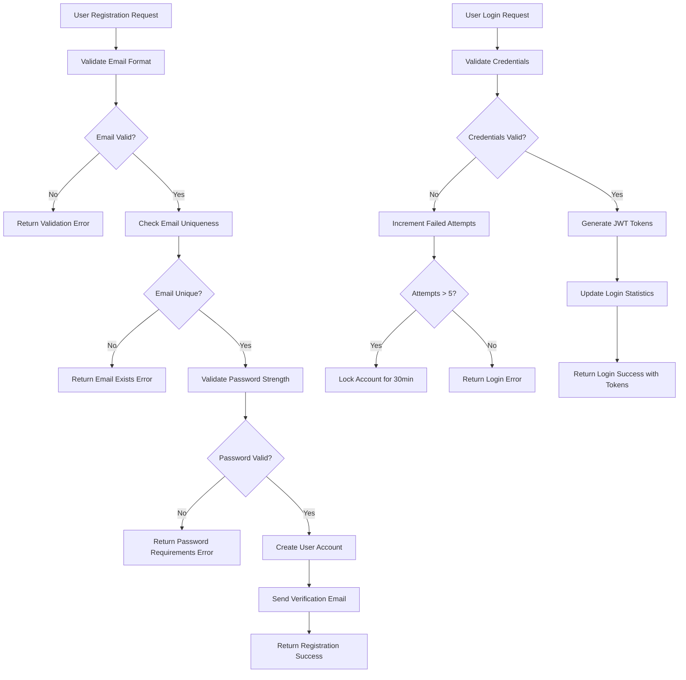

# User Actors and Authentication Requirements

## Introduction

This document defines the complete authentication system and user permission structure for the Todo list application. The system provides secure user authentication with minimal functionality focused exclusively on todo management operations.

## User Actor Definitions

### Primary User Actor: Authenticated User

**Actor Name**: user
**Description**: Authenticated users who can create, read, update, and delete their own todo items. Each user has their own private todo list.

**Core Capabilities**:
- Create personal todo items
- View their own todo list
- Update their own todo items
- Delete their own todo items
- Mark todo items as complete/incomplete
- Organize todos by basic categories

**Access Restrictions**:
- Cannot view or modify other users' todo items
- Cannot access administrative functions
- Cannot modify system settings

## Authentication System Requirements

### User Registration

WHEN a new user registers, THE system SHALL:
- Validate email format and uniqueness
- Require password with minimum security standards
- Create user account with unique identifier
- Send email verification request
- Set account status to "pending verification"

**Registration Process Details:**
- Email validation: Must be valid RFC 5322 email format
- Password requirements: Minimum 8 characters, at least one uppercase letter, one lowercase letter, one number, and one special character
- Account creation: Generate unique user ID, set default preferences
- Email verification: Send verification link valid for 24 hours
- Account activation: Only after email verification completion

### User Login Process

WHEN a user attempts to log in, THE system SHALL:
- Validate email and password combination
- Generate secure JWT access token
- Create refresh token for session persistence
- Update last login timestamp
- Return user profile information

**Login Validation Steps:**
1. Validate email format
2. Check if account exists and is active
3. Verify password against stored bcrypt hash
4. Check account lockout status
5. Generate JWT token with user claims
6. Create refresh token with longer expiration
7. Update login statistics and timestamps

### Session Management

THE system SHALL maintain user sessions with the following characteristics:
- Access token expiration: 30 minutes
- Refresh token expiration: 7 days
- Automatic token refresh mechanism
- Secure token storage requirements
- Session revocation capability

**Session Security Requirements:**
- Tokens stored in HTTP-only cookies
- Secure flag enabled for HTTPS-only transmission
- Same-site cookie policy to prevent CSRF attacks
- Token revocation upon logout or security events

### Logout Process

WHEN a user logs out, THE system SHALL:
- Invalidate current access token
- Remove refresh token from valid tokens list
- Clear session-related data
- Provide confirmation of successful logout

**Logout Implementation:**
- Add token to revocation list
- Clear client-side token storage
- Redirect to login page with success message
- Log logout event for security monitoring

## Permission Matrix

| Action | Authenticated User |
|--------|-------------------|
| Create todo item | ✅ |
| Read own todo items | ✅ |
| Update own todo items | ✅ |
| Delete own todo items | ✅ |
| Mark todo as complete | ✅ |
| View todo categories | ✅ |
| Set todo due dates | ✅ |
| Search own todos | ✅ |
| Filter todos by status | ✅ |
| View other users' todos | ❌ |
| Modify system settings | ❌ |
| Access admin functions | ❌ |
| Delete user accounts | ❌ |

## JWT Token Specifications

### Access Token Structure
```json
{
  "userId": "unique-user-identifier",
  "email": "user@example.com",
  "role": "user",
  "permissions": ["todo:create", "todo:read", "todo:update", "todo:delete"],
  "iat": 1731645070,
  "exp": 1731646870,
  "iss": "todo-application",
  "aud": "todo-users"
}
```

### Refresh Token Structure
```json
{
  "userId": "unique-user-identifier",
  "tokenId": "refresh-token-identifier",
  "iat": 1731645070,
  "exp": 1732257070
}
```

### Token Security Requirements
- Token signing algorithm: HS256 with 256-bit secret key
- Access token expiration: 30 minutes
- Refresh token expiration: 7 days
- Token transmission: HTTPS only
- Token storage: Secure HTTP-only cookies
- Token validation: Signature verification and expiration checks

## Authentication Flow



## Security Requirements

### Password Security
WHEN a user creates or updates a password, THE system SHALL:
- Require minimum 8 characters
- Enforce complexity: uppercase, lowercase, numbers, special characters
- Store passwords using bcrypt hashing with salt rounds 12
- Prevent password reuse from last 5 passwords
- Validate against common password dictionaries

### Account Protection
THE system SHALL implement:
- Account lockout after 5 failed login attempts within 15 minutes
- Automatic unlock after 30 minutes
- Suspicious activity monitoring (multiple locations, unusual patterns)
- Password reset functionality with secure token validation
- Session timeout after 30 minutes of inactivity

### Data Protection
WHILE processing user data, THE system SHALL:
- Encrypt sensitive data at rest using AES-256 encryption
- Use HTTPS for all communications with TLS 1.3
- Implement proper input validation and sanitization
- Follow OWASP security guidelines for web applications
- Regular security audits and vulnerability assessments

## Error Handling Scenarios

### Authentication Errors
IF login credentials are invalid, THEN THE system SHALL:
- Return HTTP 401 status code
- Provide generic error message: "Invalid email or password"
- Increment failed login counter
- Implement account lockout if threshold exceeded
- Log failed login attempts for security monitoring

### Token Validation Errors
IF an invalid or expired token is presented, THEN THE system SHALL:
- Return HTTP 403 status code
- Provide specific error message based on failure type
- Allow token refresh if refresh token is valid
- Clear invalid session data
- Log token validation failures

### Authorization Errors
IF a user attempts unauthorized access, THEN THE system SHALL:
- Return HTTP 403 status code
- Log the access attempt with user ID and resource
- Provide generic access denied message
- Maintain user session integrity for valid requests
- Notify security monitoring system of potential threats

## Session Management Details

### Token Refresh Mechanism
WHEN an access token nears expiration, THE system SHALL:
- Accept valid refresh token for new access token
- Validate refresh token authenticity and expiration
- Generate new access token with same permissions
- Maintain user session continuity
- Update token issuance timestamp

### Concurrent Session Handling
THE system SHALL support:
- Multiple simultaneous sessions per user
- Individual session management and termination
- Selective session revocation for security incidents
- Session activity tracking and monitoring
- Device-specific session management

## Implementation Considerations

### Minimal Authentication Features
THE authentication system SHALL focus on:
- Email/password authentication only
- Basic session management with JWT tokens
- Essential security measures appropriate for todo application
- No social login integrations in initial implementation
- No multi-factor authentication requirements

### Scalability Requirements
THE system SHALL be designed to handle:
- Initial capacity for 1,000 concurrent users
- Support for future user growth to 10,000 users
- Efficient token validation with minimal performance impact
- Horizontal scaling capability for authentication services
- Database performance optimization for user operations

## Success Criteria

### Authentication Success Metrics
- User registration success rate: >95%
- Login success rate: >98%
- Token validation accuracy: 100%
- Session timeout accuracy: 100%
- Password reset success rate: >90%

### Security Success Metrics
- Zero security breaches in authentication system
- Proper implementation of all security requirements
- Compliance with industry security standards
- Successful security audit results
- Minimal false positives in security monitoring

### Performance Metrics
- Authentication response time: <500ms
- Token validation time: <100ms
- Session creation time: <200ms
- System availability: >99.9% uptime
- Concurrent user capacity: 1,000+ users

## Compliance Requirements

### Data Privacy Compliance
THE system SHALL comply with:
- GDPR requirements for European users
- Data minimization principles
- User consent requirements for data processing
- Right to erasure and data portability
- Privacy by design principles

### Security Standards Compliance
THE system SHALL adhere to:
- OWASP Application Security Verification Standard
- Industry best practices for web application security
- Regular security patch management
- Secure development lifecycle practices
- Continuous security monitoring and improvement

> *Developer Note: This document defines **business requirements only**. All technical implementations (architecture, APIs, database design, etc.) are at the discretion of the development team.*