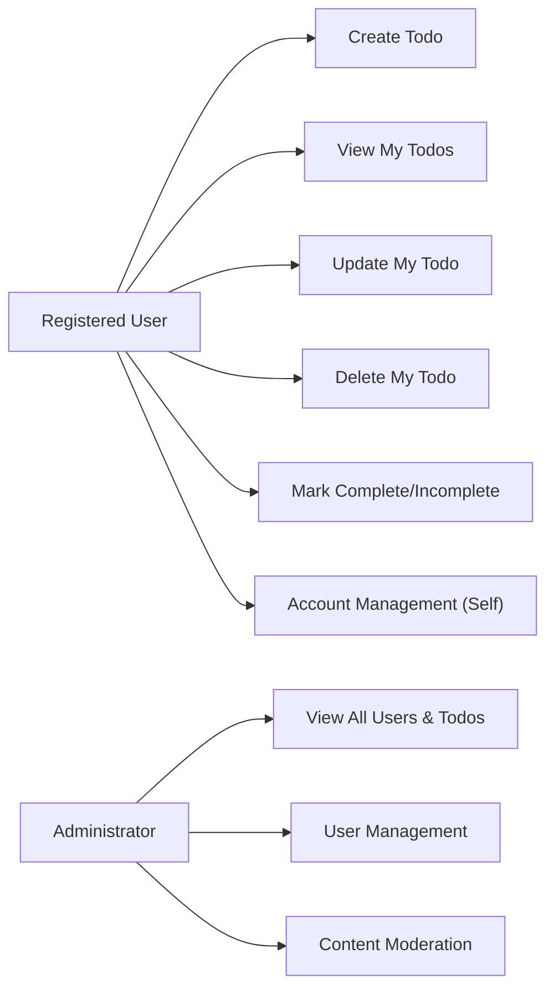

# Todo List Application: Minimum Requirements Analysis

## Introduction & Scope

The Todo List Application is designed exclusively for personal and administrative task management with zero feature bloat. The scope is strictly confined to what users absolutely need for managing their daily todos: create, view, edit, complete/incomplete, and delete. By policy, the application excludes secondary features like labels, reminders, sharing, or tagging to reduce cognitive load and privacy risks. Only registered, authenticated users or administrators may access the system. Unauthenticated users have no access.

## Actors & Roles

- **Registered User**: Any individual who has created an account and authenticated successfully. They interact solely with their own account and associated todos.
- **Administrator**: A privileged actor who manages user accounts, views todos globally, and enforces data protection, operational integrity, and acceptable use policies. Admins have no access to private user passwords and cannot impersonate users.

## Value Proposition

Focusing on the essential, the Todo List app offers:
- Absolute privacy (all data siloed by user)
- Effortless usage (no training or technical skill required)
- Reliable uptime and fast response for all operations
- Admin oversight for user support and operational stability

## Business Requirements (EARS Format)

- WHEN a user has authenticated, THE system SHALL allow access only to their own todo items, never to those of other users.
- WHEN a user creates a todo, THE system SHALL associate that todo with the user as sole owner.
- WHEN an authenticated user views todos, THE system SHALL display only todos owned by that user.
- WHEN a user updates a todo, THE system SHALL update that todo only if it belongs to that user.
- WHEN a user deletes a todo, THE system SHALL remove it only if it belongs to that user.
- WHEN a user marks a todo complete/incomplete, THE system SHALL update its status accordingly and only for that user's item.
- WHEN a user manages their account, THE system SHALL permit password changes and account information retrieval, but only for their own account.
- WHERE a user attempts any unauthorized action (access or modify others' data), THE system SHALL deny the operation and display an explicit access denied error message within 2 seconds.
- WHEN an administrator accesses the admin area, THE system SHALL allow review of all users and their associated todos without revealing user passwords.
- WHERE an admin creates, deactivates, or deletes user accounts, THE system SHALL restrict such operations to admins only, log all actions, and require confirmation.
- WHERE an admin identifies policy violation or exceptional content, THE system SHALL enable the admin to review and remove content, logging the incident and notifying the user within 1 hour.
- WHEN a system fault or error occurs, THE system SHALL present an understandable error message to the user/admin within 2 seconds and take no destructive action.

## Core Functional Scenarios

1. **User Authenticates and Manages Todos**
    - WHEN a user registers and logs in, THE system SHALL redirect to that user's todo list.
    - WHEN the user adds a todo, THE system SHALL persist the item immediately and confirm visibly in the UI.
    - WHEN the user edits, completes/incompletes, or deletes a todo, THE system SHALL process the action atomically, only affecting the user's own data, and confirm success or present errors in natural language within 2 seconds.
    - WHEN the user attempts to access any other user's todos, THE system SHALL refuse and present an access denied error immediately.

2. **Administrator Account Management**
    - WHEN an admin authenticates, THE system SHALL provide access to a complete user list and summary of total todos per user.
    - WHEN an admin creates a user, THE system SHALL trigger a confirmation flow and assign a temporary password that must be changed at first login.
    - WHEN an admin disables or removes a user, THE system SHALL log the event and ensure affected todos are either archived or deleted per retention policy.
    - WHEN an admin monitors reported items, THE system SHALL present actionable moderation tools and log all actions for audit.

## Authentication & Authorization

- All endpoints and UI routes are gated by authentication. Unauthenticated requests SHALL result in a forbidden access error with a reason.
- User authentication SHALL require unique username (or email) and password, transmitted securely.
- Passwords SHALL be stored salted & hashed; plaintext storage is forbidden.
- Password reset SHALL require explicit user action with a one-time secure code delivered via out-of-band method (e.g., email), expiring in 1 hour.
- Only admins SHALL access the user and todo management interfaces outside their own account scope.
- All user operations SHALL be available only after successful authentication and SHALL operate strictly on self-owned data.

## Mermaid Diagram: Actor-Feature Relationship

## Non-Functional Requirements

- **Performance**: WHEN a user or admin issues a valid request, THE system SHALL process and respond within 1 second under normal conditions.
- **Reliability**: THE system SHALL guarantee no data loss under normal operation. All changes SHALL be atomic and durable.
- **Security**: All data transmissions SHALL use encrypted channels (e.g., HTTPS). Data at rest SHALL be protected using industry-standard techniques.
- **Privacy**: No user data SHALL be used outside the authenticated session or visible to other users.
- **Auditability**: Admin actions and security-related events SHALL be logged with timestamp, actor, and change summary; logs SHALL be retained for at least 1 year.
- **Availability**: Target uptime is 99.9% measured monthly.

## Summary & Implementation Guidance

The Todo List Application is optimized for minimalism, privacy, and reliability. Every feature, requirement, and process is tightly scoped to these goals. Requirements here are actionable, measurable, and structured for direct implementation in a TypeScript + NestJS + Prisma backend. Developers must enforce strict per-user data isolation, fast and clear feedback at every user interaction, robust admin oversight, and security best practices by default. No features beyond the ones described are permitted in the MVP.