**multiUserTodo — Data isolation, business rules, data browsing expectations, error scenarios**

Data isolation, business rules, data browsing expectations, error scenarios

# Data Isolation and Ownership

Data ownership rules and tenant/user-level isolation policies.

## Ownership and Isolation Rules

Define data ownership semantics and isolation boundaries for multi-user access.

### Data Ownership Principles

### Data Ownership Principles

WHEN any data operation is performed, THE system SHALL enforce strict ownership semantics:

1. **User Data Ownership**: THE system SHALL associate all Todo entities and EditHistory entries with exactly one User entity
2. **Creator Ownership**: WHEN a Todo is created, THE system SHALL establish the creating User as the permanent owner
3. **Immutable Ownership**: THE system SHALL prevent ownership transfer between Users
4. **Cascading Ownership**: WHEN a User account is deleted, THE system SHALL permanently delete all associated Todo entities and EditHistory entries

IF a User attempts to access data they do not own, THE system SHALL reject the request.
IF ownership validation fails during any operation, THE system SHALL terminate the operation.

**Ownership Validation Flow**:
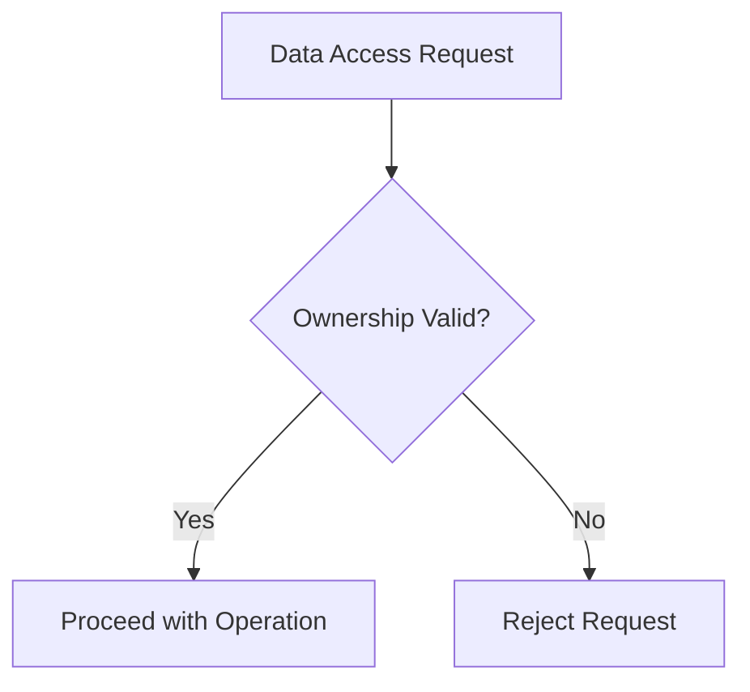
```mermaid
flowchart TD
    A["Data Access Request"] --> B{"Ownership Valid?"}
    B -->|Yes| C["Proceed with Operation"]
    B -->|No| D["Reject Request"]
```

### User-Level Data Isolation

### User-Level Data Isolation

THE system SHALL maintain complete data isolation between Users:

1. **Data Segregation**: THE system SHALL ensure each User's Todo list is completely isolated from other Users
2. **No Cross-User Access**: THE system SHALL prevent any User from viewing, accessing, or modifying another User's Todo entities
3. **Private Profile Access**: THE system SHALL restrict User profile access to the profile owner only
4. **Isolated Edit History**: THE system SHALL ensure EditHistory entries are only accessible to the Todo owner

WHEN a User requests their Todo list, THE system SHALL return only Todo entities owned by that User.
WHEN a User requests Todo details, THE system SHALL validate ownership before returning any data.

**Isolation Boundary**:
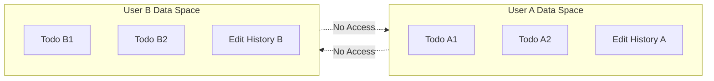
```mermaid
flowchart LR
    subgraph UserA [User A Data Space]
        A1["Todo A1"]
        A2["Todo A2"]
        A3["Edit History A"]
    end
    
    subgraph UserB [User B Data Space]
        B1["Todo B1"]
        B2["Todo B2"]
        B3["Edit History B"]
    end
    
    UserA -.->|No Access| UserB
    UserB -.->|No Access| UserA
```

### Multi-User Access Controls

### Multi-User Access Controls

THE system SHALL implement access controls that support multiple Users while maintaining isolation:

1. **Session-Based Access**: WHEN a User authenticates, THE system SHALL establish an access session scoped to that User's data
2. **Request Validation**: THE system SHALL validate every data access request against the authenticated User's identity
3. **No Shared Access**: THE system SHALL prevent any form of shared Todo access between Users
4. **Private Application Scope**: THE system SHALL maintain the application as strictly private with no collaboration features

IF an unauthenticated User attempts to access any Todo data, THE system SHALL reject the request.
IF an authenticated User attempts to access another User's data, THE system SHALL reject the request.

**Access Control Flow**:
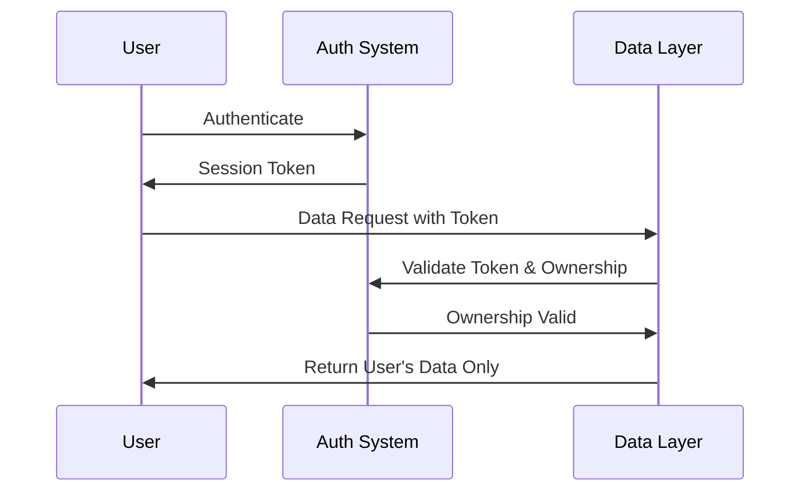
```mermaid
sequenceDiagram
    participant U as User
    participant A as Auth System
    participant D as Data Layer
    
    U->>A: Authenticate
    A->>U: Session Token
    U->>D: Data Request with Token
    D->>A: Validate Token & Ownership
    A->>D: Ownership Valid
    D->>U: Return User's Data Only
```

### Data Access Validation Rules

### Data Access Validation Rules

THE system SHALL enforce comprehensive data access validation:

1. **Ownership Pre-check**: BEFORE any data operation, THE system SHALL validate that the requesting User owns the target data
2. **Resource Existence Check**: THE system SHALL verify that requested Todo entities exist before attempting operations
3. **Consistent Error Responses**: WHEN access is denied, THE system SHALL return consistent error messages without revealing existence of other Users' data
4. **Audit Trail**: THE system SHALL log all access denial events for security monitoring

IF a User requests a Todo that does not exist, THE system SHALL return "resource not found" error.
IF a User requests a Todo they do not own, THE system SHALL return "access denied" error.

**Validation Rules Matrix**:

| Operation Type | Ownership Required | Resource Must Exist | Error on Failure |
|----------------|-------------------|-------------------|------------------|
| View Todo      | Yes               | Yes               | Access Denied    |
| Edit Todo      | Yes               | Yes               | Access Denied    |
| Delete Todo    | Yes               | Yes               | Access Denied    |
| View History   | Yes               | Yes               | Access Denied    |

### Tenant Isolation Implementation

### Tenant Isolation Implementation

THE system SHALL implement tenant isolation at the User level:

1. **User as Tenant**: THE system SHALL treat each User as an independent tenant with complete data isolation
2. **No Cross-Tenant Operations**: THE system SHALL prevent any operations that span multiple User tenants
3. **Independent Data Lifecycle**: THE system SHALL manage each User's data lifecycle independently
4. **Scalable Isolation**: THE system SHALL support isolation for an unlimited number of User tenants

WHEN a User creates data, THE system SHALL store it exclusively within that User's tenant boundary.
WHEN a User deletes their account, THE system SHALL remove all data within their tenant boundary.

**Tenant Isolation Architecture**:
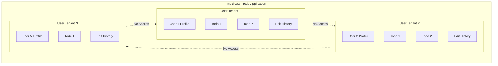
```mermaid
flowchart TB
    subgraph System [Multi-User Todo Application]
        subgraph Tenant1 [User Tenant 1]
            T1U["User 1 Profile"]
            T1T1["Todo 1"]
            T1T2["Todo 2"]
            T1H["Edit History"]
        end
        
        subgraph Tenant2 [User Tenant 2]
            T2U["User 2 Profile"]
            T2T1["Todo 1"]
            T2T2["Todo 2"]
            T2H["Edit History"]
        end
        
        subgraph TenantN [User Tenant N]
            TNU["User N Profile"]
            TNT1["Todo 1"]
            TNH["Edit History"]
        end
    end
    
    Tenant1 -.->|No Access| Tenant2
    Tenant2 -.->|No Access| TenantN
    TenantN -.->|No Access| Tenant1
```

# Domain Business Rules

Per-concept business rules, validation logic, and domain constraints.

## User Rules

Users must register with a unique email address that is not already associated with an active account. Passwords must meet security requirements during registration and password changes. User accounts remain unverified until email confirmation is completed, with verification links expiring after a set period. Registration attempts are rate-limited to prevent abuse and automated account creation. Users can change their password by providing their current password and meeting the same security requirements. Account deletion permanently removes all user data including todos and edit history with no recovery option. Each user has a display name that can be edited at any time without affecting other account properties. User profiles are completely private and cannot be viewed by other users. Authentication requires valid email and password combination with failed attempts tracked for security. All user actions are scoped to their own data with no cross-user visibility or access.

### Email Uniqueness Validation

### Email Uniqueness Validation

WHEN a user attempts to register with an email address, THE system SHALL:
1. Validate that the email format is correct
2. Check that the email is not already associated with an active account
3. Reject the registration if the email is already in use

IF the email address is already registered to an active account, THE system SHALL reject the registration attempt.
IF the email address format is invalid, THE system SHALL reject the registration attempt.

THE system SHALL ensure email uniqueness across all active user accounts.
THE system SHALL allow registration with an email that was previously associated with a deleted account.

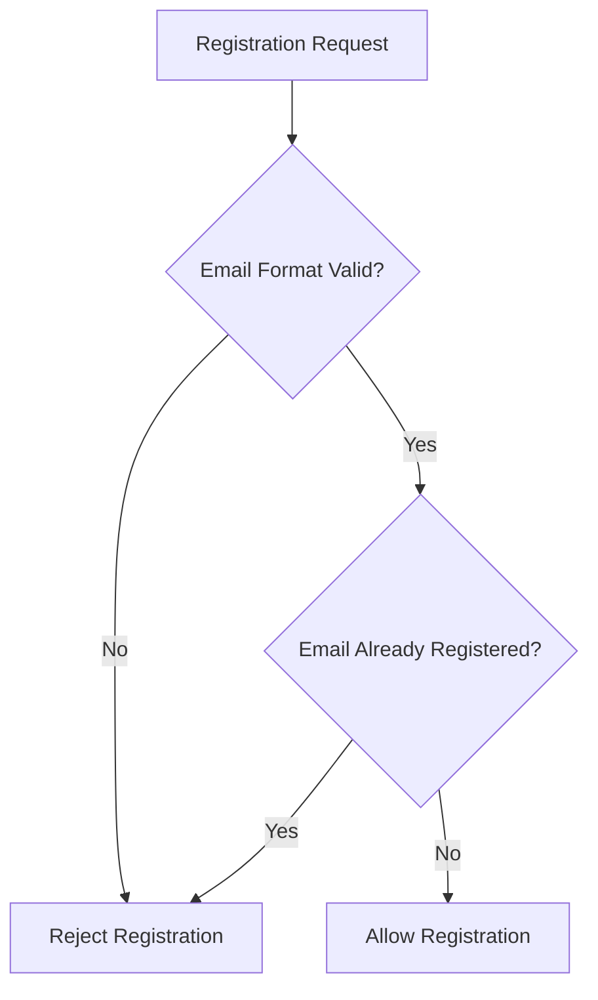
```mermaid
flowchart TD
    A["Registration Request"] --> B{Email Format Valid?}
    B -->|No| C["Reject Registration"]
    B -->|Yes| D{Email Already Registered?}
    D -->|Yes| C
    D -->|No| E["Allow Registration"]
```

### Password Security Requirements

### Password Security Requirements

WHEN a user registers or changes their password, THE system SHALL:
1. Require a minimum password length of 8 characters
2. Require at least one uppercase letter
3. Require at least one lowercase letter
4. Require at least one number
5. Require at least one special character
6. Reject passwords that match common patterns or dictionary words

IF the password does not meet security requirements, THE system SHALL reject the registration or password change.
IF the password is identical to the current password during a password change, THE system SHALL reject the request.

THE system SHALL never store passwords in plain text.
THE system SHALL use secure hashing algorithms for password storage.

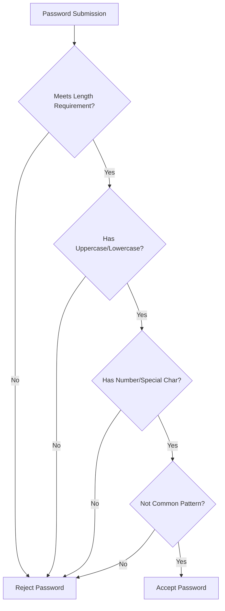
```mermaid
flowchart TD
    A["Password Submission"] --> B{Meets Length Requirement?}
    B -->|No| C["Reject Password"]
    B -->|Yes| D{Has Uppercase/Lowercase?}
    D -->|No| C
    D -->|Yes| E{Has Number/Special Char?}
    E -->|No| C
    E -->|Yes| F{Not Common Pattern?}
    F -->|No| C
    F -->|Yes| G["Accept Password"]
```

### Account Verification Flow

### Account Verification Flow

WHEN a user registers successfully, THE system SHALL:
1. Create an unverified account
2. Generate a unique verification token
3. Send a verification email to the registered address
4. Set the verification token to expire after 24 hours

WHEN a user clicks the verification link, THE system SHALL:
1. Validate the verification token
2. Mark the account as verified if the token is valid and not expired
3. Invalidate the used verification token
4. Allow the user to log in with full functionality

IF the verification token is expired, THE system SHALL reject the verification attempt.
IF the verification token is invalid, THE system SHALL reject the verification attempt.

THE system SHALL allow users to request a new verification email if the original expires.
THE system SHALL limit verification email requests to prevent abuse.

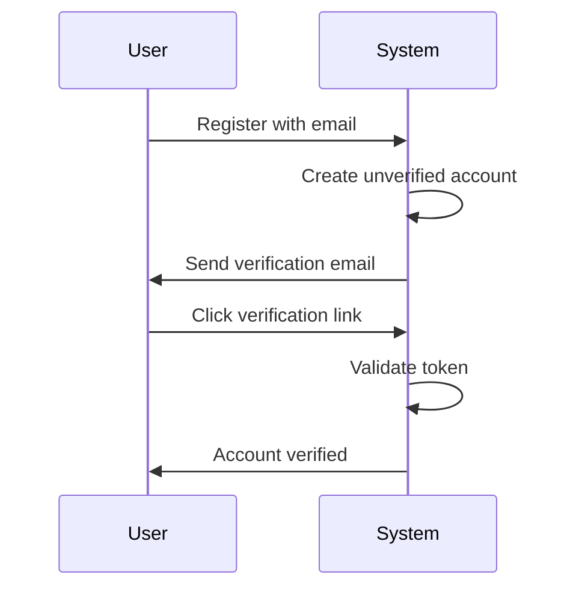
```mermaid
sequenceDiagram
    participant U as User
    participant S as System
    U->>S: Register with email
    S->>S: Create unverified account
    S->>U: Send verification email
    U->>S: Click verification link
    S->>S: Validate token
    S->>U: Account verified
```

### Registration Rate Limiting

### Registration Rate Limiting

WHEN a registration attempt occurs, THE system SHALL:
1. Track registration attempts per IP address
2. Limit registration attempts to 5 per hour from the same IP address
3. Track registration attempts per email domain
4. Limit registrations to 10 per hour from the same email domain

IF the rate limit is exceeded, THE system SHALL:
1. Reject the registration attempt
2. Return a rate limit exceeded error
3. Prevent further registration attempts for the specified time period

THE system SHALL reset rate limits after the time window expires.
THE system SHALL log rate limit violations for security monitoring.

WHILE rate limited, THE system SHALL reject all registration attempts from the affected source.

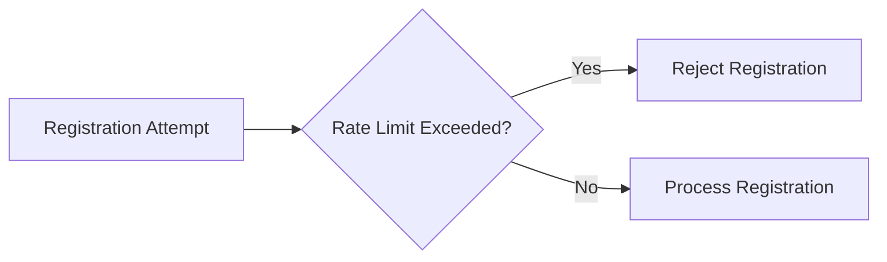
```mermaid
flowchart LR
    A["Registration Attempt"] --> B{Rate Limit Exceeded?}
    B -->|Yes| C["Reject Registration"]
    B -->|No| D["Process Registration"]
```

### Password Change Authentication

### Password Change Authentication

WHEN a user requests to change their password, THE system SHALL:
1. Require the user to provide their current password
2. Validate the current password matches the stored hash
3. Apply the same security requirements as registration
4. Update the password hash upon successful validation

IF the current password is incorrect, THE system SHALL reject the password change request.
IF the new password does not meet security requirements, THE system SHALL reject the password change request.
IF the new password is identical to the current password, THE system SHALL reject the password change request.

THE system SHALL invalidate all active sessions after a successful password change.
THE system SHALL require the user to log in again with the new password.

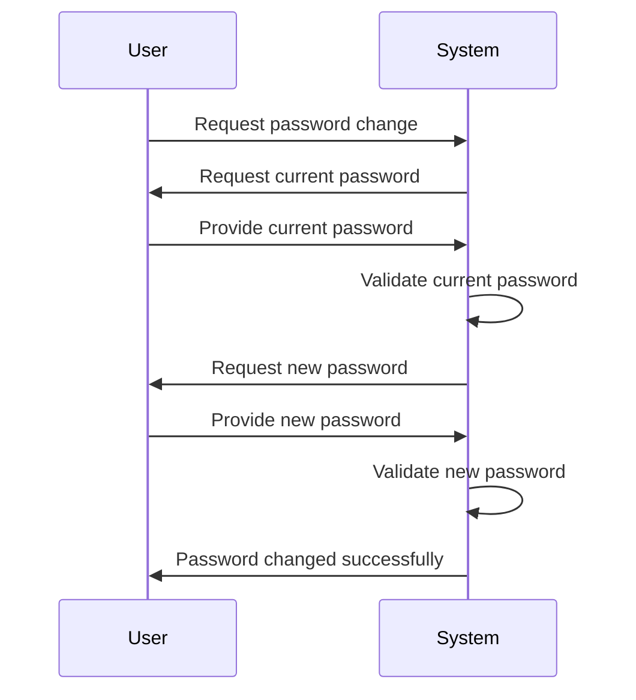
```mermaid
sequenceDiagram
    participant U as User
    participant S as System
    U->>S: Request password change
    S->>U: Request current password
    U->>S: Provide current password
    S->>S: Validate current password
    S->>U: Request new password
    U->>S: Provide new password
    S->>S: Validate new password
    S->>U: Password changed successfully
```

### Account Deletion Permanence

### Account Deletion Permanence

WHEN a user requests account deletion, THE system SHALL:
1. Require the user to confirm the deletion action
2. Permanently delete all user data including:
   - User profile information
   - All todos owned by the user
   - All edit history associated with user's todos
   - All trash entries for the user's todos
3. Remove the user account from the system
4. Ensure no data recovery is possible

IF the user cancels the deletion confirmation, THE system SHALL abort the deletion process.

THE system SHALL not provide any recovery option for deleted accounts.
THE system SHALL complete the deletion process within 24 hours of confirmation.

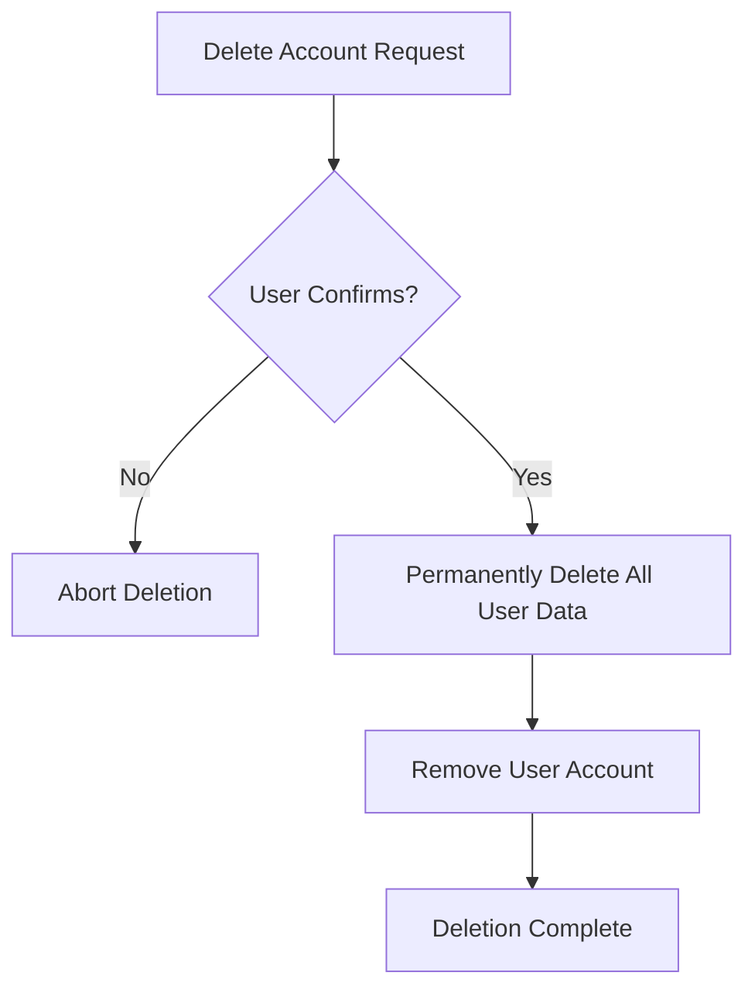
```mermaid
flowchart TD
    A["Delete Account Request"] --> B{User Confirms?}
    B -->|No| C["Abort Deletion"]
    B -->|Yes| D["Permanently Delete All User Data"]
    D --> E["Remove User Account"]
    E --> F["Deletion Complete"]
```

### Display Name Editing

### Display Name Editing

WHEN a user edits their display name, THE system SHALL:
1. Allow immediate editing without additional verification
2. Require the display name to be non-empty
3. Limit the display name to 100 characters maximum
4. Update the display name immediately upon save

IF the display name is empty, THE system SHALL reject the edit request.
IF the display name exceeds 100 characters, THE system SHALL reject the edit request.

THE system SHALL not require any specific format for display names.
THE system SHALL allow display names to contain any valid Unicode characters.

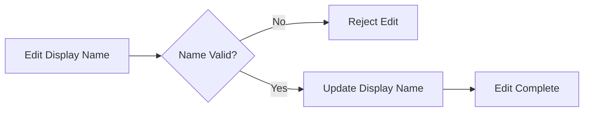
```mermaid
flowchart LR
    A["Edit Display Name"] --> B{Name Valid?}
    B -->|No| C["Reject Edit"]
    B -->|Yes| D["Update Display Name"]
    D --> E["Edit Complete"]
```

### Profile Privacy Enforcement

### Profile Privacy Enforcement

WHEN any user attempts to access another user's profile, THE system SHALL:
1. Reject the access attempt
2. Return an access denied error
3. Log the unauthorized access attempt

THE system SHALL ensure that users can only view their own profile information.
THE system SHALL not expose any user profile data through public APIs.
THE system SHALL enforce profile privacy at all access points.

IF a user is not authenticated, THE system SHALL reject all profile access attempts.
IF a user attempts to access a non-existent user profile, THE system SHALL return "not found" rather than revealing existence.

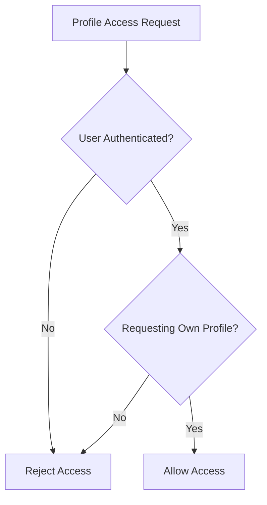
```mermaid
flowchart TD
    A["Profile Access Request"] --> B{User Authenticated?}
    B -->|No| C["Reject Access"]
    B -->|Yes| D{Requesting Own Profile?}
    D -->|No| C
    D -->|Yes| E["Allow Access"]
```

### Authentication Security

### Authentication Security

WHEN a user attempts to log in, THE system SHALL:
1. Require both email and password
2. Validate the email format
3. Validate the password meets security requirements
4. Track failed login attempts per account
5. Lock the account after 5 consecutive failed attempts

IF the email or password is incorrect, THE system SHALL:
1. Increment the failed attempt counter
2. Return a generic authentication error
3. Not specify whether email or password was incorrect

IF the account is locked due to failed attempts, THE system SHALL:
1. Reject all login attempts
2. Require password reset to unlock the account
3. Maintain the lock for 30 minutes

THE system SHALL use secure session management with expiration.
THE system SHALL invalidate sessions after password changes.

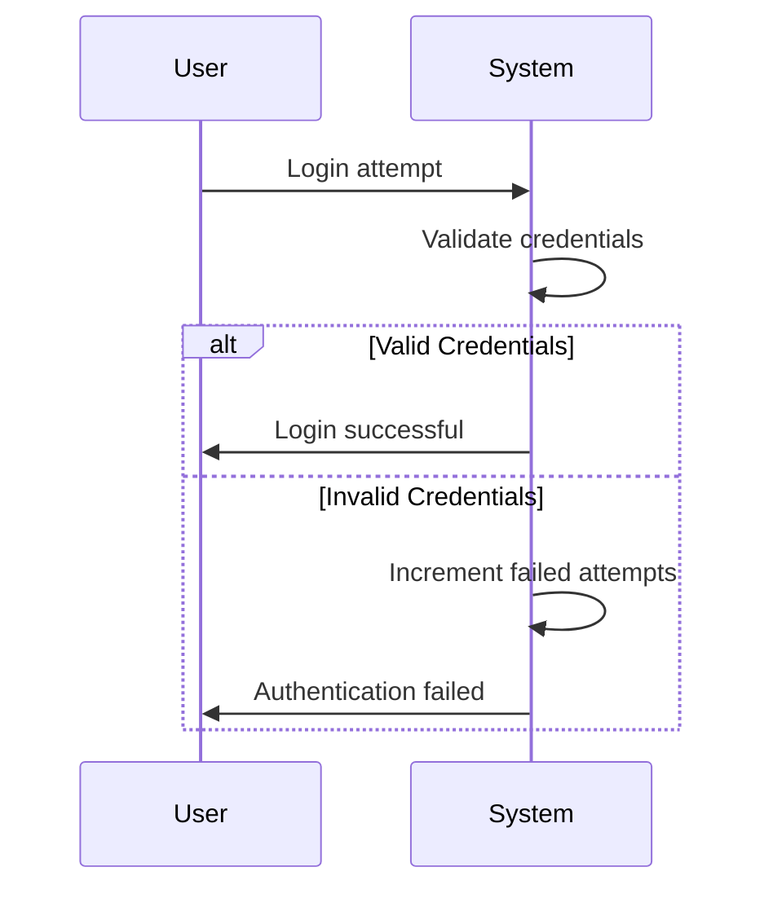
```mermaid
sequenceDiagram
    participant U as User
    participant S as System
    U->>S: Login attempt
    S->>S: Validate credentials
    alt Valid Credentials
        S->>U: Login successful
    else Invalid Credentials
        S->>S: Increment failed attempts
        S->>U: Authentication failed
    end
```

### User Data Isolation

### User Data Isolation

WHEN any data access operation occurs, THE system SHALL:
1. Scope all data queries to the authenticated user's ownership
2. Ensure users can only access their own todos and edit history
3. Prevent cross-user data visibility at all levels
4. Enforce data isolation in all API endpoints and data queries

THE system SHALL return empty results rather than errors when users query non-existent or unauthorized data.
THE system SHALL not leak information about other users' data existence.

IF a user attempts to access another user's todo by ID, THE system SHALL return "not found" regardless of whether the todo exists.
IF a user attempts to access the trash of another user, THE system SHALL return an empty list.

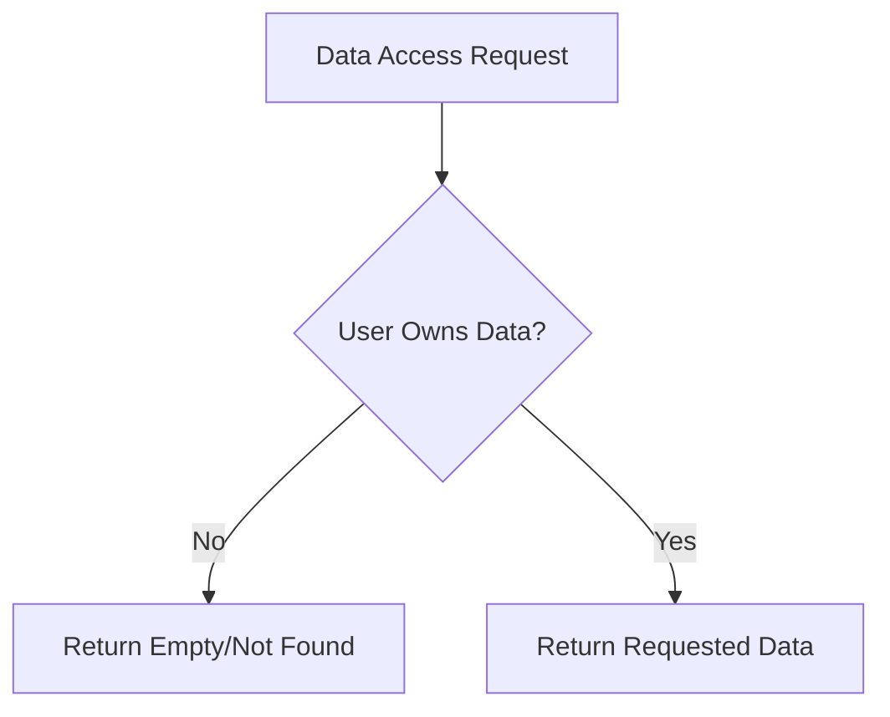
```mermaid
flowchart TD
    A["Data Access Request"] --> B{User Owns Data?}
    B -->|No| C["Return Empty/Not Found"]
    B -->|Yes| D["Return Requested Data"]
```

## Todo Rules

Todos require a title for creation and cannot be created without this mandatory field. Description, start date, and due date are optional fields that can be left empty during todo creation. New todos are created with incomplete status by default and can be toggled between complete and incomplete states. Editing a todo updates its title, description, start date, or due date while preserving the original values in history. Todos support soft deletion where they are moved to trash rather than being permanently removed. Restoring a todo from trash returns it to the normal todo list with all properties intact. Permanent deletion from trash removes the todo and its entire edit history irreversibly. Todos can be filtered by completion status showing all, only complete, or only incomplete items. Sorting options include creation date, start date, and due date with configurable ascending/descending order. Todos without dates appear at the end when sorting by those specific date fields.

### Title Requirement and Validation Rules

### Todo Creation Title Validation

WHEN a user creates a todo, THE system SHALL:
1. Require a title field to be provided
2. Reject the creation request if the title is empty or contains only whitespace
3. Accept the creation request if a valid title is provided

IF the title is missing during todo creation, THE system SHALL reject the request with a validation error.
IF the title contains only whitespace characters, THE system SHALL treat it as missing and reject the request.

### Title Field Business Rules

THE system SHALL enforce that:
- Every todo must have a non-empty title
- Title validation occurs before any todo creation operation
- Users receive clear feedback when title validation fails

WHEN editing a todo title, THE system SHALL:
1. Apply the same validation rules as creation
2. Reject the edit if the new title is invalid
3. Preserve the original title if validation fails

IF a title edit fails validation, THE system SHALL not create an edit history entry.

### Optional Field Handling and Business Rules

### Optional Field Acceptance Rules

WHEN creating a todo, THE system SHALL:
1. Accept empty or null values for description field
2. Accept empty or null values for start date field
3. Accept empty or null values for due date field
4. Process the creation successfully with any combination of optional field values

THE system SHALL NOT require:
- Description to be provided
- Start date to be set
- Due date to be set
- Any relationship between optional fields

### Optional Field Update Rules

WHEN editing optional fields, THE system SHALL:
1. Allow setting previously empty fields to valid values
2. Allow clearing previously set fields to empty/null
3. Accept any valid combination of optional field values
4. Create edit history entries only for fields that actually change

IF a user clears an optional field, THE system SHALL treat it as a valid update.
IF a user sets an optional field for the first time, THE system SHALL accept the change.

### Completion Status Default and State Management

### Default Completion Status

WHEN creating a new todo, THE system SHALL:
1. Set the completion status to incomplete by default
2. Not allow specification of completion status during creation
3. Ensure all new todos start in the incomplete state

THE system SHALL enforce that completion status cannot be set during todo creation.

### Completion Status Toggle Rules

WHEN a user marks a todo as complete, THE system SHALL:
1. Change the status from incomplete to complete
2. Record the completion timestamp
3. Update the todo's last modified date

WHEN a user marks a todo as incomplete, THE system SHALL:
1. Change the status from complete to incomplete
2. Clear the completion timestamp
3. Update the todo's last modified date

THE system SHALL provide a simple toggle mechanism between complete and incomplete states.

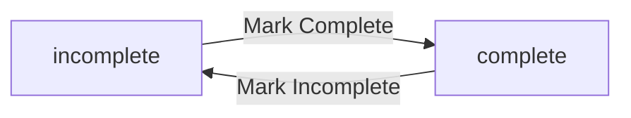
```mermaid
flowchart LR
    A["incomplete"] -->|"Mark Complete"| B["complete"]
    B -->|"Mark Incomplete"| A
```

### Todo Editing and Change Preservation

### Edit Operation Business Rules

WHEN editing a todo, THE system SHALL:
1. Allow modification of title, description, start date, and due date
2. Require title validation for any title changes
3. Accept valid changes to optional fields
4. Update the todo's last modified timestamp

THE system SHALL preserve the original values of changed fields in the edit history.

### Change Detection and History Creation

WHEN a todo is edited, THE system SHALL:
1. Compare current values with previous values for each field
2. Create edit history entries only for fields that actually change
3. Record the previous value of each changed field
4. Associate the edit history entry with the modifying user

IF a field value remains unchanged during editing, THE system SHALL not create a history entry for that field.
IF multiple fields change in a single edit operation, THE system SHALL create one history entry capturing all changes.

### Soft Deletion Mechanism and Trash Management

### Soft Deletion Process

WHEN a user deletes a todo, THE system SHALL:
1. Mark the todo as deleted rather than removing it permanently
2. Remove the todo from normal browsing lists
3. Preserve all todo properties and edit history
4. Record the deletion timestamp

THE system SHALL ensure soft-deleted todos are not visible in standard todo lists.

### Trash Visibility Rules

WHEN a user views their trash, THE system SHALL:
1. Display only soft-deleted todos belonging to that user
2. Apply pagination to the trash list
3. Show todo details including title, deletion date, and original properties
4. Exclude permanently deleted todos from trash view

THE system SHALL ensure users can only see their own deleted todos in trash.

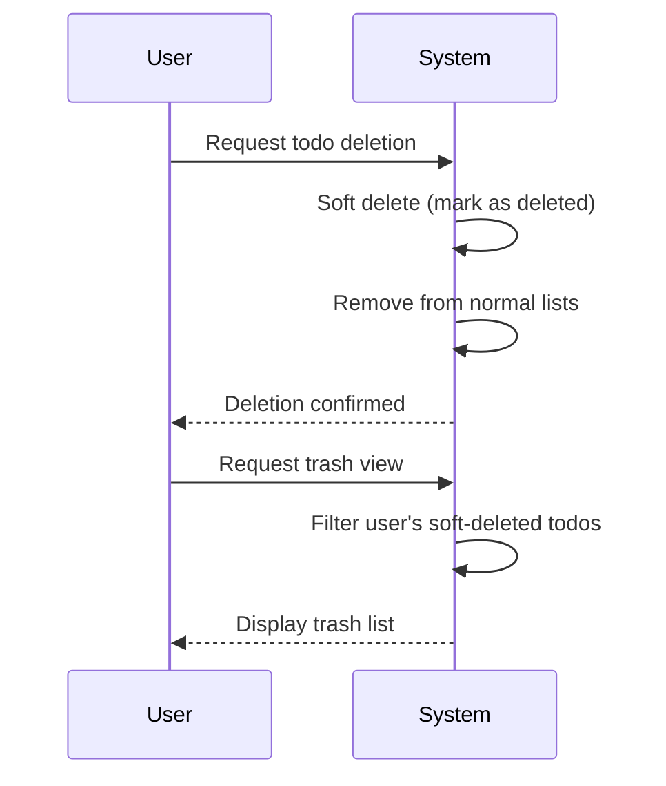
```mermaid
sequenceDiagram
    participant U as User
    participant S as System
    U->>S: Request todo deletion
    S->>S: Soft delete (mark as deleted)
    S->>S: Remove from normal lists
    S-->>U: Deletion confirmed
    U->>S: Request trash view
    S->>S: Filter user's soft-deleted todos
    S-->>U: Display trash list
```

### Trash Restoration Process

### Todo Restoration Rules

WHEN a user restores a todo from trash, THE system SHALL:
1. Remove the deleted marker from the todo
2. Return the todo to the normal todo list
3. Preserve all original properties and edit history
4. Record the restoration timestamp

THE system SHALL ensure restored todos are immediately visible in normal browsing.

### Restoration Validation

IF a user attempts to restore a todo that is not in trash, THE system SHALL reject the request.
IF a user attempts to restore a todo that belongs to another user, THE system SHALL reject the request.

WHEN restoring a todo, THE system SHALL verify:
1. The todo exists and is soft-deleted
2. The requesting user owns the todo
3. The restoration operation is valid

THE system SHALL provide clear feedback for successful restorations and rejection reasons.

### Permanent Deletion Consequences

### Permanent Deletion Process

WHEN a user permanently deletes a todo from trash, THE system SHALL:
1. Remove the todo entity completely from the system
2. Delete all associated edit history entries
3. Ensure the todo cannot be recovered or restored
4. Confirm the permanent deletion to the user

### Irreversible Deletion Rules

THE system SHALL enforce that permanent deletion is irreversible.
THE system SHALL ensure that permanently deleted todos:
- Are removed from all storage systems
- Cannot appear in any lists or searches
- Have all associated data completely erased

IF a user permanently deletes a todo, THE system SHALL not retain any backup or archive copies.

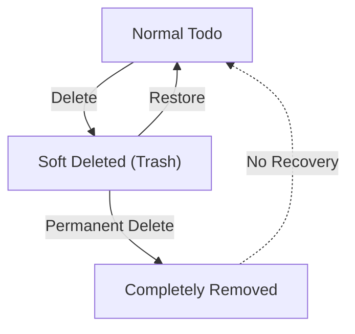
```mermaid
flowchart TD
    A["Normal Todo"] -->|"Delete"| B["Soft Deleted (Trash)"]
    B -->|"Restore"| A
    B -->|"Permanent Delete"| C["Completely Removed"]
    C -.->|"No Recovery"| A
```

### Completion Status Filtering Rules

### Filtering Business Rules

WHEN filtering todos by completion status, THE system SHALL:
1. Provide three filtering options: All, Complete, Incomplete
2. Apply the selected filter to the user's todo list
3. Maintain pagination across filtered results
4. Show accurate counts for each filter option

### Filter Application Logic

IF "All" filter is selected, THE system SHALL display todos regardless of completion status.
IF "Complete" filter is selected, THE system SHALL display only completed todos.
IF "Incomplete" filter is selected, THE system SHALL display only incomplete todos.

THE system SHALL ensure filtering applies only to non-deleted todos.
THE system SHALL exclude soft-deleted todos from all completion status filters.

WHEN switching between filters, THE system SHALL maintain the current pagination state.

### Date-Based Sorting Rules

### Sorting Option Availability

WHEN sorting the todo list, THE system SHALL provide sorting by:
1. Creation date (newest first or oldest first)
2. Start date (earliest first or latest first)
3. Due date (earliest first or latest first)

### Sort Direction Business Rules

FOR creation date sorting, THE system SHALL:
- Allow ascending order (oldest first)
- Allow descending order (newest first)
- Default to descending order (newest first)

FOR start date sorting, THE system SHALL:
- Allow ascending order (earliest first)
- Allow descending order (latest first)
- Apply consistent ordering logic

FOR due date sorting, THE system SHALL:
- Allow ascending order (earliest first)
- Allow descending order (latest first)
- Apply consistent ordering logic

THE system SHALL maintain the selected sort option across user sessions.

### Missing Date Sorting Behavior

### Handling Todos Without Dates

WHEN sorting by start date, THE system SHALL:
1. Place todos without a start date at the end of the list
2. Apply the selected sort direction to todos with start dates
3. Maintain consistent positioning for todos without dates

WHEN sorting by due date, THE system SHALL:
1. Place todos without a due date at the end of the list
2. Apply the selected sort direction to todos with due dates
3. Maintain consistent positioning for todos without dates

### Missing Date Sorting Logic

IF sorting by start date in ascending order, THE system SHALL display:
- Todos with start dates (earliest first)
- Todos without start dates (at the end)

IF sorting by start date in descending order, THE system SHALL display:
- Todos with start dates (latest first)
- Todos without start dates (at the end)

THE system SHALL apply the same logic for due date sorting.
THE system SHALL ensure consistent behavior across all sorting operations.

## EditHistory Rules

Edit history entries are automatically created every time a todo is modified, capturing the changes made. Each history entry records the timestamp of the edit and specifically tracks which fields were changed. For title changes, the history stores the previous title value that was replaced. Description changes are recorded by storing the previous description content. Start date modifications are tracked by capturing the previous start date value. Due date adjustments are logged by preserving the previous due date information. History entries only record fields that were actually modified during the edit operation. The edit history displays entries in reverse chronological order from most recent to oldest. Users can view the complete edit history for any of their own todos. Permanent todo deletion from trash also removes all associated edit history entries. Edit history provides a complete audit trail of all modifications made to a todo over time.

### Automatic History Creation

WHEN a todo is edited, THE system SHALL automatically create an EditHistory entry.

THE system SHALL create exactly one EditHistory entry per edit operation.
THE system SHALL record the timestamp of the edit operation.
THE system SHALL associate the EditHistory entry with the user who performed the edit.
THE system SHALL associate the EditHistory entry with the todo being edited.

IF the edit operation fails, THEN THE system SHALL NOT create an EditHistory entry.
IF the todo does not exist, THEN THE system SHALL reject the edit operation and NOT create an EditHistory entry.

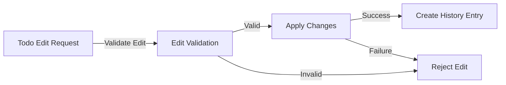
```mermaid
flowchart LR
    A["Todo Edit Request"] -->|"Validate Edit"| B["Edit Validation"]
    B -->|"Valid"| C["Apply Changes"]
    C -->|"Success"| D["Create History Entry"]
    B -->|"Invalid"| E["Reject Edit"]
    C -->|"Failure"| E
```

### Granular Change Tracking

THE system SHALL track changes at the field level for EditHistory entries.

WHEN a todo is edited, THE system SHALL record only the fields that were actually modified.
THE system SHALL preserve the previous value for each modified field.
THE system SHALL NOT record unchanged fields in the EditHistory entry.

IF a field value remains unchanged during an edit, THEN THE system SHALL NOT include it in the EditHistory entry.
IF multiple fields are modified in a single edit, THEN THE system SHALL record all modified fields in one EditHistory entry.

THE system SHALL detect field changes by comparing previous and new values.
THE system SHALL consider a field changed when its value differs from the previous value.

### Title Change Recording

WHEN a todo's title is modified, THE system SHALL record the previous title value.

THE system SHALL store the title value that was replaced by the edit.
THE system SHALL record the timestamp when the title change occurred.
THE system SHALL associate the title change with the user who made the modification.

IF the title is the only field modified, THEN THE system SHALL create an EditHistory entry containing only the title change.
IF the title is modified along with other fields, THEN THE system SHALL include the title change along with other field changes in the EditHistory entry.

THE system SHALL preserve the exact title text that was replaced.

### Description Change Preservation

WHEN a todo's description is modified, THE system SHALL preserve the previous description content.

THE system SHALL store the complete description content that was replaced.
THE system SHALL record whether the description was changed from empty to non-empty, non-empty to empty, or non-empty to different non-empty content.
THE system SHALL preserve the exact text content of the previous description.

IF the description is cleared (set to empty), THEN THE system SHALL record the previous non-empty description content.
IF an empty description is populated, THEN THE system SHALL record the empty state as the previous value.

THE system SHALL handle description changes of any length within system limits.

### Date Modification Logging

WHEN a todo's start date is modified, THE system SHALL log the previous start date value.
WHEN a todo's due date is modified, THE system SHALL log the previous due date value.

THE system SHALL record the exact date and time value that was replaced.
THE system SHALL handle date changes from null to specific dates and vice versa.
THE system SHALL preserve the timezone information of the previous date values.

IF a start date is removed (set to null), THEN THE system SHALL record the previous non-null start date.
IF a due date is added (set from null to specific date), THEN THE system SHALL record the null state as the previous value.

THE system SHALL validate that date sequences remain logical (start date ≤ due date) but record the previous values regardless of sequence validity.

### Selective Field Tracking

THE system SHALL employ selective field tracking for EditHistory entries.

WHEN creating an EditHistory entry, THE system SHALL include only fields that underwent actual modification.
THE system SHALL omit unchanged fields from the EditHistory record.
THE system SHALL detect modifications by comparing field values before and after the edit.

IF no fields are modified during an edit operation, THEN THE system SHALL NOT create an EditHistory entry.
IF only one field is modified, THEN THE system SHALL create an EditHistory entry containing only that field's change.

THE system SHALL track changes for: title, description, start date, and due date fields exclusively.

### Chronological Display Order

WHEN displaying EditHistory entries, THE system SHALL present them in reverse chronological order.

THE system SHALL sort EditHistory entries from most recent to oldest based on timestamp.
THE system SHALL ensure the most recent edit appears first in the history list.
THE system SHALL maintain consistent sorting across all history views.

IF multiple edits occur at the same timestamp, THEN THE system SHALL display them in the order they were processed.
IF the history contains entries from different timezones, THEN THE system SHALL normalize timestamps to a consistent timezone for display.

THE system SHALL provide paginated history views that maintain chronological order across pages.

### History Accessibility

WHEN a user requests to view a todo's edit history, THE system SHALL provide access to all EditHistory entries for that todo.

THE system SHALL allow users to view the complete edit history of their own todos.
THE system SHALL restrict EditHistory access to the todo owner only.
THE system SHALL prevent users from viewing EditHistory entries for todos they do not own.

IF a user attempts to access another user's todo history, THEN THE system SHALL reject the request.
IF a todo has no EditHistory entries, THEN THE system SHALL return an empty history list.

THE system SHALL provide the complete audit trail from todo creation to current state.

### Permanent Deletion Cascade

WHEN a todo is permanently deleted from trash, THE system SHALL cascade delete all associated EditHistory entries.

THE system SHALL permanently remove all EditHistory entries linked to the deleted todo.
THE system SHALL ensure no orphaned EditHistory entries remain after todo deletion.
THE system SHALL complete the deletion cascade atomically.

IF the todo deletion fails, THEN THE system SHALL NOT delete any EditHistory entries.
IF EditHistory deletion fails, THEN THE system SHALL roll back the todo deletion.

THE system SHALL NOT create backup copies of deleted EditHistory entries.
THE system SHALL NOT allow recovery of EditHistory entries after permanent todo deletion.

### Audit Trail Completeness

THE system SHALL maintain a complete audit trail for each todo's lifecycle.

THE system SHALL record every edit operation performed on a todo.
THE system SHALL preserve the complete sequence of changes from todo creation to deletion.
THE system SHALL ensure no edit operations are missing from the audit trail.

IF an edit operation is performed, THEN THE system SHALL include it in the audit trail.
IF the system experiences downtime during an edit, THEN THE system SHALL recover and record the edit upon restoration.

THE system SHALL provide an unbroken chain of EditHistory entries that document the todo's evolution over time.

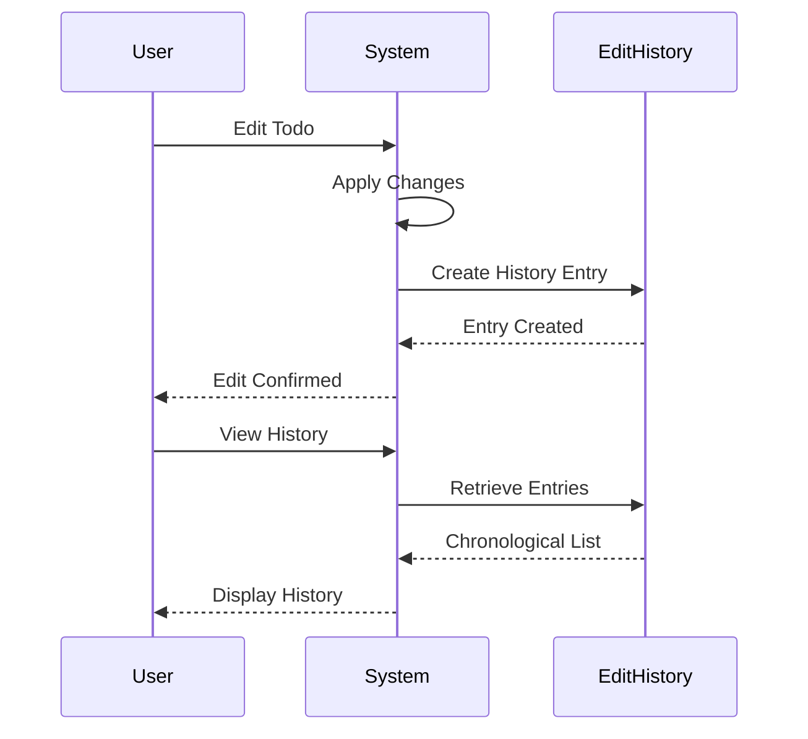
```mermaid
sequenceDiagram
    participant U as User
    participant S as System
    participant EH as EditHistory
    U->>S: Edit Todo
    S->>S: Apply Changes
    S->>EH: Create History Entry
    EH-->>S: Entry Created
    S-->>U: Edit Confirmed
    U->>S: View History
    S->>EH: Retrieve Entries
    EH-->>S: Chronological List
    S-->>U: Display History
```

# Business Validation Criteria

Business-level validation expectations and data quality criteria.

## User Validation Criteria

User email addresses must be unique across all active accounts to prevent duplicate registrations. Email format validation ensures proper email structure with username and domain components. Password requirements enforce minimum security standards for account protection. Display names must be non-empty and contain valid characters for user identification. Account deletion validation ensures all user data including todos and trash items are properly removed. Password change validation requires confirmation of current password before allowing new password setting. Email verification ensures account ownership before allowing full application access. Registration rate limiting prevents abuse by restricting how many accounts can be created from a single source.

### Email Uniqueness Validation

WHEN a user attempts to register with an email address, THE system SHALL:
1. Validate that the email address is not already associated with an active account
2. Reject the registration attempt if the email address is already in use
3. Allow registration to proceed only when the email address is unique

IF the email address is already registered to an active account, THE system SHALL reject the registration request with an appropriate error message.

WHEN a user attempts to change their email address, THE system SHALL:
1. Validate that the new email address is not already associated with any active account
2. Reject the email change request if the new email address is already in use
3. Allow the email change only when the new email address is unique across all active accounts

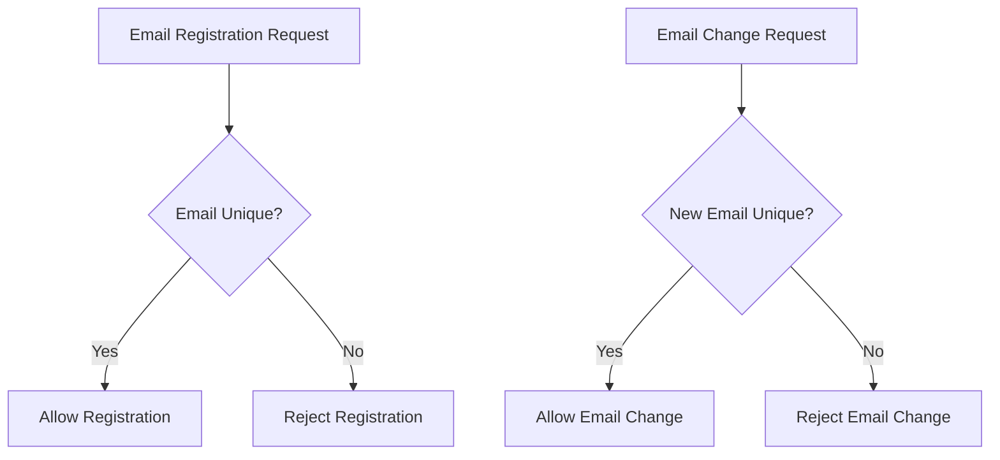
```mermaid
flowchart TD
    A["Email Registration Request"] --> B{"Email Unique?"}
    B -->|Yes| C["Allow Registration"]
    B -->|No| D["Reject Registration"]
    
    E["Email Change Request"] --> F{"New Email Unique?"}
    F -->|Yes| G["Allow Email Change"]
    F -->|No| H["Reject Email Change"]
```

### Password Security Requirements

WHEN a user creates or changes their password, THE system SHALL:
1. Require a minimum password length of 8 characters
2. Require at least one uppercase letter
3. Require at least one lowercase letter
4. Require at least one numeric digit
5. Require at least one special character from the set: !@#$%^&*
6. Reject passwords that match common patterns or dictionary words

IF a password does not meet the security requirements, THE system SHALL reject the password and provide specific feedback about which requirements were not met.

WHEN a user enters an incorrect password during login, THE system SHALL:
1. Track failed login attempts
2. Temporarily lock the account after 5 consecutive failed attempts
3. Require password reset after account lockout

THE system SHALL store passwords using industry-standard hashing algorithms with salt.

### Display Name Format Rules

WHEN a user sets or updates their display name, THE system SHALL:
1. Require the display name to be non-empty
2. Allow display names between 1 and 50 characters in length
3. Allow letters, numbers, spaces, and common punctuation marks
4. Prohibit display names containing only whitespace characters
5. Trim leading and trailing whitespace from display names
6. Normalize multiple consecutive spaces to single spaces

IF a display name contains prohibited characters or patterns, THE system SHALL reject the update and provide specific format requirements.

WHEN displaying user information, THE system SHALL:
1. Show the user's display name instead of their email address
2. Use the display name for all user-facing identification purposes
3. Maintain display name consistency across all application views

THE system SHALL allow users to change their display name at any time without affecting their account credentials.

### Account Deletion Verification

WHEN a user requests to delete their account, THE system SHALL:
1. Require the user to confirm their current password
2. Display a summary of data that will be permanently deleted
3. Require explicit confirmation of the deletion action
4. Provide a final warning about irreversible data loss

IF the password confirmation fails, THE system SHALL reject the deletion request and require re-authentication.

WHEN account deletion is confirmed, THE system SHALL:
1. Permanently remove all user data including todos and trash items
2. Delete all edit history associated with the user's todos
3. Remove the user account from the system
4. Send a confirmation email to the user's registered email address

```mermaid
sequenceDiagram
    participant U as User
    participant S as System
    U->>S: Request Account Deletion
    S->>U: Request Password Confirmation
    U->>S: Provide Password
    S->>S: Validate Password
    alt Password Valid
        S->>U: Show Deletion Summary
        U->>S: Confirm Deletion
        S->>S: Permanently Delete All Data
        S->>U: Send Confirmation Email
    else Password Invalid
        S->>U: Reject Deletion Request
    end
```

### Password Change Confirmation

WHEN a user requests to change their password, THE system SHALL:
1. Require confirmation of the current password
2. Validate that the new password meets security requirements
3. Require the user to enter the new password twice for confirmation
4. Prevent using the same password as the current one

IF the current password confirmation fails, THE system SHALL reject the password change request.

IF the new password does not meet security requirements, THE system SHALL reject the change and specify which requirements were not met.

WHEN the password change is successful, THE system SHALL:
1. Update the password hash in the system
2. Invalidate any existing active sessions for security
3. Require the user to log in again with the new password
4. Send a notification email to the user's registered email address

THE system SHALL allow password changes only for authenticated users with valid current session credentials.

### Email Verification Flow

WHEN a user registers a new account, THE system SHALL:
1. Send a verification email to the provided email address
2. Require email verification before granting full application access
3. Allow limited functionality (such as viewing verification instructions) until verified

WHEN a user clicks the verification link in the email, THE system SHALL:
1. Validate the verification token
2. Mark the email address as verified
3. Grant full application access to the user
4. Redirect the user to the main application interface

IF the verification token is invalid or expired, THE system SHALL:
1. Provide an error message explaining the issue
2. Offer to resend the verification email
3. Allow the user to request a new verification email

```mermaid
flowchart LR
    A["User Registration"] --> B["Send Verification Email"]
    B --> C["Limited Access Granted"]
    C --> D{"Email Verified?"}
    D -->|Yes| E["Full Access Granted"]
    D -->|No| F["Resend Verification Option"]
    F --> B
```

THE system SHALL allow users to request verification email resends if the original email was not received or the token expired.

### Registration Rate Limiting

WHEN processing registration requests, THE system SHALL:
1. Limit registration attempts to 5 per hour from the same IP address
2. Limit registration attempts to 10 per day from the same IP address
3. Track registration attempts across all users from the same source
4. Implement progressive delays for repeated registration attempts

IF the rate limit is exceeded, THE system SHALL:
1. Reject the registration request with a rate limit exceeded message
2. Provide information about when the rate limit will reset
3. Log the excessive registration attempt for security monitoring

WHEN a registration attempt is blocked due to rate limiting, THE system SHALL:
1. Maintain the same error message consistency as other validation failures
2. Not differentiate between legitimate users and potential abusers in the error message
3. Allow legitimate users to retry after the rate limit period expires

THE system SHALL apply rate limiting based on IP address, email domain patterns, and other abuse detection indicators.

### User Data Integrity Checks

WHEN performing user account operations, THE system SHALL:
1. Validate that user data remains consistent across all operations
2. Ensure that user ownership of todos is maintained during all transactions
3. Verify that edit history entries correctly reference both the user and the todo
4. Maintain referential integrity between users and their associated data

WHEN a user accesses their todo list, THE system SHALL:
1. Verify that only the authenticated user's todos are returned
2. Ensure that todos from other users are never visible to the current user
3. Validate that filtering and sorting operations respect user isolation

IF data integrity violations are detected, THE system SHALL:
1. Reject the operation with an integrity violation error
2. Log the integrity check failure for administrative review
3. Prevent partial data exposure or cross-user data leakage

WHEN performing account deletion, THE system SHALL:
1. Verify that all user data is completely removed
2. Ensure that no orphaned data remains in the system
3. Confirm that all deletion operations complete successfully before finalizing account removal

THE system SHALL perform periodic integrity checks to detect and correct any data consistency issues.

## Todo Validation Criteria

Todo titles are mandatory and cannot be empty strings to ensure meaningful task identification. Description fields are optional but must accept reasonable text length for detailed task information. Start dates must be valid calendar dates when provided, allowing users to schedule future tasks. Due dates must be valid calendar dates and should logically follow start dates when both are set. Date validation ensures start dates cannot be after due dates for logical task sequencing. Todo creation validation ensures only authenticated users can create personal todo items. Edit validation tracks all changes to todo fields including title, description, and dates. Completion status validation ensures todos can only toggle between complete and incomplete states.

### Title Requirement Validation

WHEN a user creates or edits a todo, THE system SHALL:
1. Require a title field to be provided
2. Validate that the title is not an empty string
3. Validate that the title contains at least one non-whitespace character
4. Reject requests where the title consists only of whitespace characters

IF the title is missing during todo creation, THE system SHALL reject the request and prevent todo creation.
IF the title is empty during todo editing, THE system SHALL reject the request and preserve the existing title.
IF the title contains only whitespace characters, THE system SHALL treat it as an empty title.

WHILE processing todo operations, THE system SHALL ensure that every todo in the system has a valid, non-empty title.

### Optional Description Handling

WHEN a user creates or edits a todo, THE system SHALL:
1. Allow the description field to be omitted
2. Accept an empty string as a valid description value
3. Accept null as a valid description value
4. Preserve the existing description when omitted during editing

IF the description field is provided, THE system SHALL accept any text content including empty strings.
IF the description field is not provided during todo creation, THE system SHALL set the description to null.
IF the description field is not provided during todo editing, THE system SHALL preserve the current description value.

WHERE description content is provided, THE system SHALL store the complete text without truncation.

### Date Format Verification

WHEN a user provides a start date or due date for a todo, THE system SHALL:
1. Validate that the date format conforms to ISO 8601 standard
2. Accept dates in YYYY-MM-DD format
3. Accept dates with time components in YYYY-MM-DDTHH:mm:ssZ format
4. Reject dates that cannot be parsed as valid calendar dates

IF a start date is provided but cannot be parsed as a valid date, THE system SHALL reject the request.
IF a due date is provided but cannot be parsed as a valid date, THE system SHALL reject the request.
IF an invalid date format is provided, THE system SHALL provide a clear error message indicating the expected format.

WHILE processing date fields, THE system SHALL normalize all dates to a consistent internal representation.

### Date Sequence Logic

WHEN a user provides both start date and due date for a todo, THE system SHALL:
1. Validate that the start date is not later than the due date
2. Allow start date and due date to be the same date
3. Reject requests where start date occurs after due date
4. Accept todos where only start date is provided without due date
5. Accept todos where only due date is provided without start date

IF both start date and due date are provided and start date is after due date, THE system SHALL reject the request.
IF only start date is provided, THE system SHALL accept the todo without due date validation.
IF only due date is provided, THE system SHALL accept the todo without start date validation.

WHERE date sequence validation fails, THE system SHALL provide a clear error message about the invalid date relationship.

### Todo Ownership Validation

WHEN a user attempts to perform any operation on a todo, THE system SHALL:
1. Validate that the todo exists in the system
2. Validate that the authenticated user owns the todo
3. Reject operations on todos that do not exist
4. Reject operations on todos owned by other users

IF a user attempts to access a todo that does not exist, THE system SHALL reject the request.
IF a user attempts to modify a todo owned by another user, THE system SHALL reject the request.
IF a user attempts to view a todo owned by another user, THE system SHALL reject the request.

WHILE processing todo operations, THE system SHALL enforce strict ownership validation for all todo-related actions.

### Edit Tracking Requirements

WHEN a user edits any field of a todo, THE system SHALL:
1. Create an edit history entry for the todo
2. Record the timestamp of the edit
3. Record which user made the edit
4. Capture the previous value of any changed field
5. Preserve the edit history even if the todo is permanently deleted

IF the title is changed during editing, THE system SHALL record the previous title value.
IF the description is changed during editing, THE system SHALL record the previous description value.
IF the start date is changed during editing, THE system SHALL record the previous start date value.
IF the due date is changed during editing, THE system SHALL record the previous due date value.

WHERE no fields are actually changed during an edit operation, THE system SHALL NOT create an edit history entry.

### Completion Status Rules

WHEN a user creates a new todo, THE system SHALL:
1. Set the completion status to incomplete by default
2. Ensure the completion status is properly initialized
3. Allow users to toggle the completion status

WHEN a user toggles a todo's completion status, THE system SHALL:
1. Change incomplete todos to complete
2. Change complete todos to incomplete
3. Update the completion status immediately
4. Create an edit history entry for the status change

IF a user marks a todo as complete, THE system SHALL update the status and record the change.
IF a user marks a todo as incomplete, THE system SHALL update the status and record the change.

THE system SHALL maintain exactly two completion states: complete and incomplete.

### Field Change Validation

WHEN a user edits a todo, THE system SHALL:
1. Validate that at least one field is being modified
2. Accept changes to title, description, start date, or due date individually
3. Accept changes to multiple fields simultaneously
4. Reject edit requests where no fields are actually changed

IF a user attempts to edit a todo but provides identical values for all fields, THE system SHALL reject the request.
IF a user provides new values that match the current values, THE system SHALL treat it as no change.
IF only some fields are provided during editing, THE system SHALL update only those fields while preserving others.

WHERE field changes are detected, THE system SHALL validate each changed field according to its specific validation rules.

## EditHistory Validation Criteria

Edit history entries must capture the exact timestamp of each modification for audit trail purposes. Title change tracking records the previous title value whenever a todo's title is modified. Description change tracking captures the previous description content when descriptions are updated. Start date change tracking records the previous start date value when start dates are modified. Due date change tracking captures the previous due date value when due dates are changed. Edit history validation ensures only actual changes create new history entries to avoid redundant records. History entry sorting must maintain chronological order from most recent to oldest edits. Edit history integrity ensures all field changes are properly recorded without data loss.

### Timestamp Accuracy Validation

WHEN an edit history entry is created, THE system SHALL record the exact timestamp of the modification.

THE system SHALL ensure timestamp accuracy by capturing the modification time at the moment the edit is processed.

IF the system clock is unavailable or inaccurate, THE system SHALL reject the edit operation.

WHILE processing edit history entries, THE system SHALL maintain chronological consistency across all timestamps.

### Title Change Tracking

WHEN a todo's title is modified, THE system SHALL create an edit history entry recording the previous title value.

IF the title remains unchanged during an edit operation, THE system SHALL NOT create a title change record.

THE system SHALL capture the exact title value that existed immediately before the modification.

WHEN viewing edit history, THE system SHALL display title changes with their corresponding timestamps.

### Description Change Recording

WHEN a todo's description is modified, THE system SHALL create an edit history entry recording the previous description content.

IF the description content remains unchanged during an edit operation, THE system SHALL NOT create a description change record.

THE system SHALL capture the complete description content that existed immediately before the modification.

WHEN the description is changed from a non-empty value to empty, THE system SHALL record the previous non-empty description.

### Date Change Capture

WHEN a todo's start date is modified, THE system SHALL create an edit history entry recording the previous start date value.

WHEN a todo's due date is modified, THE system SHALL create an edit history entry recording the previous due date value.

IF a date field is changed from a set value to empty, THE system SHALL record the previous date value.

IF a date field is changed from empty to a set value, THE system SHALL record the empty state as the previous value.

### Change Detection Logic

THE system SHALL create edit history entries only when actual field modifications occur.

IF an edit operation results in no changes to any tracked fields, THE system SHALL NOT create an edit history entry.

WHEN multiple fields are modified in a single edit operation, THE system SHALL create one edit history entry capturing all changes.

THE system SHALL compare field values before and after edits to determine if changes occurred.

### Chronological Sorting

WHEN displaying edit history for a todo, THE system SHALL sort entries from most recent to oldest.

THE system SHALL use timestamp values to establish chronological order for history entries.

WHILE processing edit history queries, THE system SHALL maintain consistent sorting across all display contexts.

IF multiple edits occur at the same timestamp, THE system SHALL maintain the order in which they were processed.

### History Integrity Checks

THE system SHALL ensure all field changes are properly recorded without data loss.

WHEN creating edit history entries, THE system SHALL validate that all modified fields are captured.

IF an edit history entry fails to capture required field changes, THE system SHALL reject the edit operation.

THE system SHALL maintain referential integrity between todos and their edit history entries.

### Field Modification Logging

WHEN any tracked field (title, description, start date, or due date) is modified, THE system SHALL log the change in the edit history.

THE system SHALL record field modifications independently, allowing partial change tracking.

IF a field modification cannot be logged due to system constraints, THE system SHALL prevent the edit operation.

WHILE processing edit operations, THE system SHALL ensure field modification logging occurs before committing the changes.

# Data Browsing Expectations

Business expectations for how users browse, find, and navigate through lists of data.

## List Browsing Expectations

Define business expectations for how users find, filter, and browse lists.

### Todo List Filtering

### Todo List Filtering

WHEN a member views their todo list, THE system SHALL provide filtering options by completion status.

THE system SHALL support the following filter options:
- All todos (showing both complete and incomplete todos)
- Only complete todos
- Only incomplete todos

WHEN a filter is applied, THE system SHALL:
1. Display only the todos matching the selected filter criteria
2. Maintain the filter selection across page navigation
3. Clear the filter when the user explicitly requests to show all todos

IF no filter is selected, THE system SHALL default to showing all todos.

THE system SHALL ensure that filtering respects data isolation rules - members can only filter their own todos.

```mermaid
flowchart TD
    A["Member requests todo list"] --> B{"Filter selected?"}
    B -->|No| C["Show all todos"]
    B -->|Complete only| D["Show completed todos"]
    B -->|Incomplete only| E["Show incomplete todos"]
    C --> F["Display filtered results"]
    D --> F
    E --> F
```

### Todo List Sorting

### Todo List Sorting

WHEN a member views their todo list, THE system SHALL provide sorting options.

THE system SHALL support sorting by:
- Creation date (newest first or oldest first)
- Start date (earliest first or latest first)
- Due date (earliest first or latest first)

WHEN sorting by start date or due date, THE system SHALL:
1. Place todos without a start date at the end when sorting by start date
2. Place todos without a due date at the end when sorting by due date
3. Maintain consistent ordering within each category

THE system SHALL:
- Preserve the selected sort order across page navigation
- Provide clear visual indicators of the current sort criteria and direction
- Allow users to change sort criteria without losing their current filter selection

IF multiple todos have the same value for the sort field, THE system SHALL use creation date as a secondary sort criterion.

```mermaid
flowchart LR
    A["Todo list displayed"] --> B{"Sort option selected"}
    B -->|Creation date| C["Sort by creation date"]
    B -->|Start date| D["Sort by start date"]
    B -->|Due date| E["Sort by due date"]
    C --> F["Apply secondary sort by creation date"]
    D --> F
    E --> F
    F --> G["Display sorted list"]
```

### Todo List Pagination

### Todo List Pagination

WHEN a member views their todo list, THE system SHALL implement pagination for large result sets.

THE system SHALL:
1. Display a limited number of todos per page
2. Provide navigation controls to move between pages
3. Show the current page number and total number of pages
4. Display the total number of todos matching the current filter criteria

WHEN paginating results, THE system SHALL:
- Maintain the current filter and sort selections across page changes
- Ensure consistent ordering when moving between pages
- Provide quick navigation options (first, previous, next, last pages)

THE system SHALL calculate page numbers based on the filtered and sorted result set.

IF there are no todos matching the current criteria, THE system SHALL display an appropriate empty state message.

WHEN a member permanently deletes a todo from trash, THE system SHALL recalculate pagination to reflect the updated todo count.

```mermaid
sequenceDiagram
    participant M as Member
    participant S as System
    M->>S: Request todo list page 1
    S->>S: Apply filters and sorting
    S->>S: Calculate pagination (total pages, item count)
    S-->>M: Display page 1 with navigation controls
    M->>S: Request page 2
    S->>S: Maintain filter/sort settings
    S-->>M: Display page 2 with same navigation
```

# Error Conditions

Business error scenarios and how the system should respond.

## Error Scenarios

Describe error conditions and expected system responses in natural language.

### Authentication and Authorization Error Scenarios

### Authentication and Authorization Error Scenarios

WHEN a guest attempts to access protected resources, THE system SHALL reject the request.

WHEN a user attempts to access another user's data, THE system SHALL reject the request.

IF authentication credentials are invalid or expired, THE system SHALL reject the request.

WHEN a user attempts to delete their account without proper authentication, THE system SHALL reject the request.

IF a user attempts to modify a todo they do not own, THE system SHALL reject the request.

WHEN a user attempts to view another user's profile, THE system SHALL reject the request.

IF a user attempts to restore a todo from trash that they do not own, THE system SHALL reject the request.

### Data Validation and Integrity Error Scenarios

### Data Validation and Integrity Error Scenarios

WHEN creating a todo with missing title, THE system SHALL reject the request.

IF a user attempts to set a due date earlier than the start date, THE system SHALL reject the request.

WHEN editing a todo with invalid date formats, THE system SHALL reject the request.

IF a user attempts to create an account with an email that already exists, THE system SHALL reject the request.

WHEN a user attempts to update their profile with invalid display name format, THE system SHALL reject the request.

IF a user attempts to access a todo that does not exist, THE system SHALL reject the request.

WHEN a user attempts to permanently delete a todo that has already been deleted, THE system SHALL reject the request.

### System and Resource Error Scenarios

### System and Resource Error Scenarios

WHEN pagination parameters exceed system limits, THE system SHALL reject the request.

IF filtering criteria are invalid or unsupported, THE system SHALL reject the request.

WHEN sorting parameters contain invalid field names, THE system SHALL reject the request.

IF the system encounters database connectivity issues during operation, THE system SHALL return a service unavailable error.

WHEN edit history creation fails due to system constraints, THE system SHALL preserve the todo but log the failure.

IF a user attempts to perform an operation on a todo that is being concurrently modified, THE system SHALL reject the request with a conflict error.

WHEN system resources are exhausted during heavy load, THE system SHALL implement rate limiting and reject excessive requests.

### Business Rule Violation Error Scenarios

### Business Rule Violation Error Scenarios

WHEN a user attempts to mark a permanently deleted todo as complete, THE system SHALL reject the request.

IF a user attempts to edit a todo that is in the trash, THE system SHALL reject the request.

WHEN a user attempts to view edit history of a permanently deleted todo, THE system SHALL reject the request.

IF a user attempts to create a todo with dates in the past without proper business justification, THE system SHALL reject the request.

WHEN a user attempts to restore a todo that has been permanently deleted, THE system SHALL reject the request.

IF a user attempts to access paginated results beyond available data, THE system SHALL return an empty result set.

WHEN sorting todos by start date or due date, todos without dates SHALL appear at the end of the list.