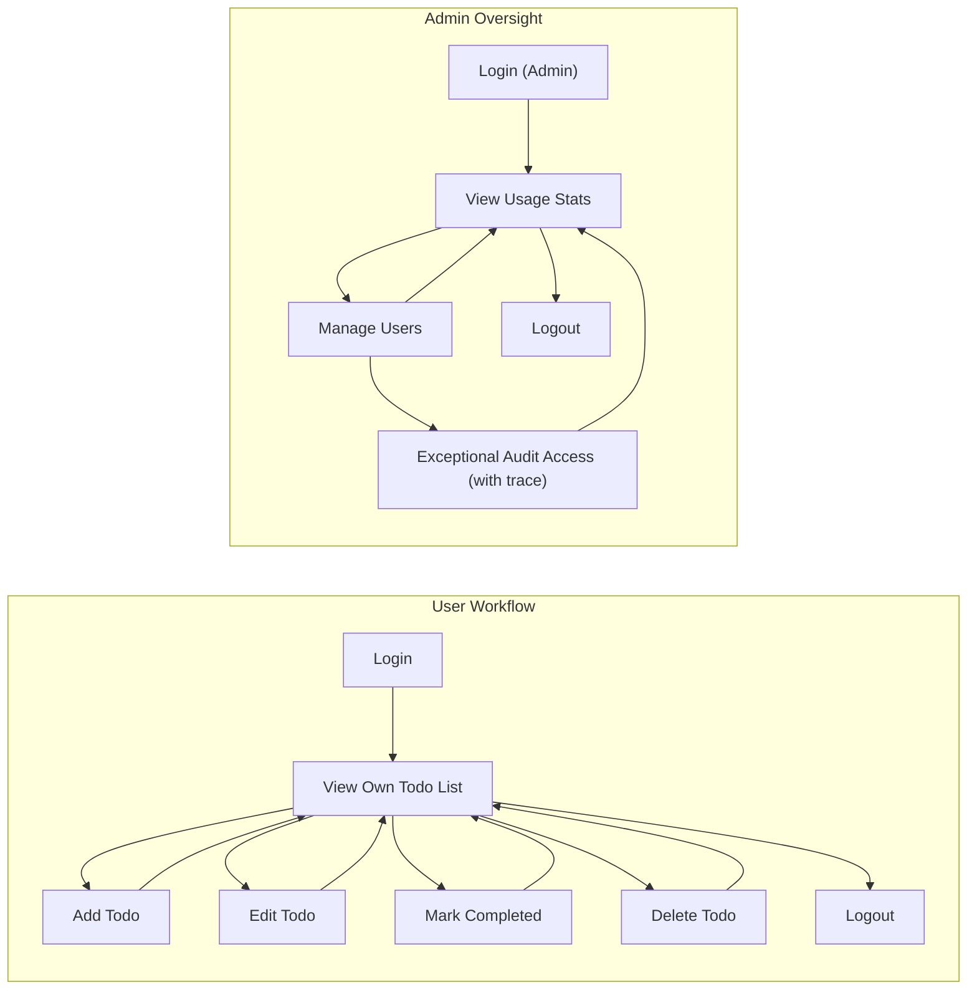

# Todo List Application Requirements Analysis (Minimal Core)

## 1. Introduction
The Todo List service enables registered users to efficiently manage their own task lists, with simplicity and privacy as guiding principles. The minimal feature focus ensures only strictly required functionalities for personal productivity are included, avoiding feature creep or complex integrations. The service supports two roles: User and Admin. Users interact solely with their own data, while Admins oversee system health, manage users in exceptional cases, and ensure reliability and security.

## 2. Actors
- **User**: Any registered user who can create, edit, complete, and delete their own todo items. Restricted from viewing or acting upon any other user's data.
- **Admin**: System overseer who manages user accounts and system compliance. Cannot access or edit any user's todos except in emergency or explicit data recovery/abuse cases; otherwise, all user data remains private.

## 3. Main Use Cases
- **User authentication:** Logging in and out to access personal todo data.
- **View own todo list:** Loading and displaying a user's own list after authentication.
- **Create todo:** Adding a single task with a required title and optional details or due date.
- **Edit todo:** Changing title, details, due date, or completion status for an owned todo.
- **Mark completed:** Switching an owned todo to 'done' or reverting.
- **Delete todo:** Removing an owned todo permanently.
- **User privacy enforcement:** All user actions are isolated; no cross-user visibility.

## 4. Business Requirements (EARS Format)
- THE system SHALL REQUIRE authentication before any todo operation is allowed.
- WHEN a user is authenticated, THE system SHALL DISPLAY only that user's own todo items.
- WHEN a user creates a new todo item, THE system SHALL ADD it to their list with IMMEDIATE feedback.
- WHEN a user edits their own todo item, THE system SHALL SAVE changes and UPDATE the display in real time.
- WHEN a user marks their own todo as completed or reverts it, THE system SHALL UPDATE the task's status instantly.
- WHEN a user deletes a todo item, THE system SHALL REMOVE it immediately from their view.
- IF a user attempts to view or change data belonging to another user, THEN THE system SHALL DENY the action, LOG the incident, and PREVENT data leakage.
- WHEN an admin manages users, THE system SHALL PERMIT viewing of system usage statistics and user account metadata, but SHALL NOT REVEAL any todo content unless EXPLICITLY AUTHORIZED for compliance, security, or support reasons.

## 5. User Journeys
**Normal User Example:**
1. User logs in using valid credentials.
2. Their active, incomplete, and completed todos are shown (and only theirs).
3. User adds a new todo: enters title (required), may include due date or note.
4. User completes a todo; it's instantly marked as done.
5. User edits a todo (title, note, or due date) and sees changes reflected right away.
6. User deletes a todo and it disappears immediately.
7. User logs out—ending session; no data persists client-side.

**Admin Example:**
1. Admin logs in using admin credentials.
2. Admin may view usage summaries or audit user activity statistics (not todo content)
3. To access todo data in an authorized audit/recovery event, explicit permissions are required and such access is logged for traceability.

## 6. Visual Workflow

## 7. Non-Functional Constraints
- Sessions expire after inactivity or upon logout; no background data persists client-side.
- All user data must remain private, accessible only by the owner, unless explicit, logged admin override occurs.
- Operations (create, update, complete, delete) for any task complete and visually reflect to user within 1 second unless exception occurs.
- Permissions must be enforced by business logic—no client-side validation alone is sufficient.
- System provides simple, reliable, and consistent user experience without performance tuning for scale or advanced features at this minimal stage.
- User and admin operations must be auditable for compliance.

## 8. Out of Scope
- No support for tags, attachments, reminders, notifications, project/task sharing, or collaborative/third-party app integrations.
- No delegation of todo items, color-coding, or batch/bulk actions.
- No user registration flows (manual admin creation or external registration handled separately if needed).
- No API endpoints, database schema or infrastructure specifics in this scope.

---
This strict minimal requirements document ensures all essential todo list business logic, privacy, and boundary conditions are clearly specified for backend developers. All additional functionality is explicitly excluded from the initial build to maintain focus and simplicity.