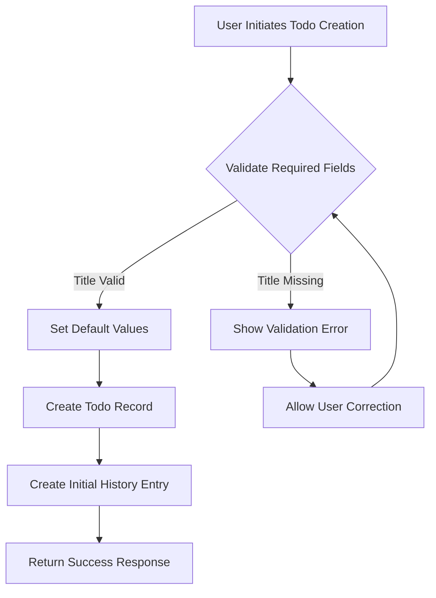
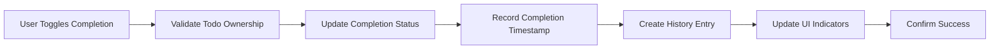
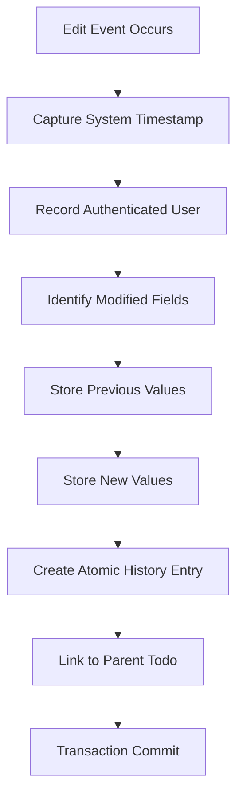
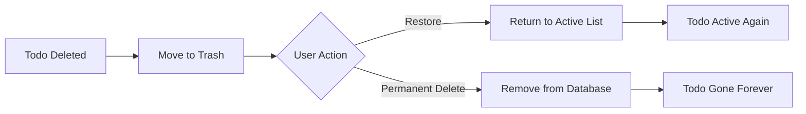

# Multi-User Todo Application Requirements Specification

## Document Overview

This document provides comprehensive business requirements for a multi-user Todo application that enables users to manage personal task lists with complete privacy and data isolation. The application supports user authentication, todo creation and management, edit history tracking, and comprehensive filtering and sorting capabilities.

## User Account Management

### User Registration Process

WHEN a new user registers for the application, THE system SHALL:
1. Collect email address and password from the user
2. Validate email format and ensure it is not already registered
3. Validate password meets security requirements (minimum 8 characters)
4. Create a new user account with default profile settings
5. Send confirmation email to verify email address
6. Log the user in automatically upon successful registration

### User Authentication Workflow

WHEN an existing user attempts to log in, THE system SHALL:
1. Validate email format and existence in the system
2. Verify password matches the stored hash
3. Create a secure session token (JWT)
4. Return authentication success with user profile data
5. Log authentication attempts for security monitoring

IF authentication fails due to incorrect credentials, THEN THE system SHALL:
1. Increment failed login attempt counter
2. Implement account lockout after 5 consecutive failures
3. Provide generic error message to prevent account enumeration
4. Log the failed attempt with IP address and timestamp

### Password Management

WHEN a user requests to change their password, THE system SHALL:
1. Require current password verification
2. Validate new password meets security standards
3. Ensure new password is different from previous passwords
4. Update password hash in the database
5. Invalidate all existing sessions for security
6. Send email notification of password change

### Account Deletion Process

WHEN a user requests to delete their account, THE system SHALL:
1. Require password confirmation for security
2. Permanently delete all user data including:
   - User profile information
   - All todos (including those in trash)
   - Complete edit history for all todos
   - User session data
3. Send confirmation email of account deletion
4. Provide 30-day grace period for account recovery
5. Log the deletion event for audit purposes

## User Profile Management

### Profile Structure

EACH user profile SHALL contain the following information:
- **Email Address**: Primary identifier (immutable after creation)
- **Display Name**: User's preferred name for display (editable)
- **Account Creation Date**: When the user registered
- **Last Login Date**: Most recent successful authentication
- **Profile Update Timestamp**: When profile was last modified

### Profile Editing Capabilities

WHEN a user edits their profile, THE system SHALL:
1. Allow modification of display name only
2. Validate display name meets length requirements (1-50 characters)
3. Prevent display of offensive or inappropriate content
4. Update profile timestamp upon successful modification
5. Propagate display name changes to existing history entries

### Privacy Enforcement

THE system SHALL ensure complete privacy between users:
- Users SHALL NOT be able to view other users' profiles
- No public profile information SHALL be accessible
- User search functionality SHALL NOT be implemented
- All user data SHALL be isolated by user ID

## Todo Creation Process

### Todo Data Structure

EACH todo SHALL contain the following fields:
- **Title**: Primary description (required, 1-255 characters)
- **Description**: Additional details (optional, max 2000 characters)
- **Start Date**: When work should begin (optional, date format)
- **Due Date**: When todo should be completed (optional, date format)
- **Completion Status**: Incomplete (default) or Complete
- **Creation Date**: When todo was created
- **Last Modified Date**: When todo was last edited
- **Owner ID**: User who created the todo

### Todo Creation Workflow

WHEN a user creates a new todo, THE system SHALL:
1. Validate that title field is provided and meets length requirements
2. Set default values: completion status = incomplete, creation date = current timestamp
3. Create the todo record in the database
4. Create initial history entry recording todo creation
5. Return the created todo with system-generated ID
6. Update user interface to reflect new todo

### Field Validation Rules

**Title Validation**:
- SHALL be required
- SHALL be between 1 and 255 characters
- SHALL not contain only whitespace
- SHALL allow standard text characters and punctuation

**Description Validation**:
- SHALL be optional
- SHALL allow up to 2000 characters when provided
- SHALL accept multi-line text
- SHALL allow empty string

**Date Validation**:
- Start date and due date SHALL be optional
- When both dates are provided, start date SHALL not be after due date
- Dates SHALL be valid ISO 8601 format
- Dates SHALL not be in distant future (max 10 years)

## Todo Viewing Capabilities

### Todo List Display

WHEN a user views their todo list, THE system SHALL display:
- Paginated list of todos (default 20 items per page)
- For each todo: title, completion status, start date (if set), due date (if set), creation date
- Visual indicators for completion status
- Sorting indicators based on current sort order
- Pagination controls for navigation

### Single Todo View

WHEN a user views a single todo, THE system SHALL display:
- Complete todo details including full description
- Edit history timeline
- Action buttons for editing, completing, deleting
- Related todos suggestions (if implemented)
- Creation and modification timestamps

### Pagination Implementation

THE system SHALL implement server-side pagination with the following characteristics:
- Default page size: 20 items
- Configurable page size (10, 20, 50, 100)
- Efficient database queries using limit/offset
- Total count of todos for pagination UI
- Next/previous page navigation
- Direct page number access

## Todo Completion Management

### Completion State Transitions

THE system SHALL support two completion states with simple toggle functionality:

**Marking Complete**:
WHEN a user marks a todo as complete, THE system SHALL:
1. Update completion status to "complete"
2. Record completion timestamp
3. Create history entry for status change
4. Update visual indicators in all views
5. Apply completion to filtering and sorting

**Marking Incomplete**:
WHEN a user marks a todo as incomplete, THE system SHALL:
1. Update completion status to "incomplete"
2. Clear completion timestamp
3. Create history entry for status change
4. Update visual indicators in all views
5. Apply status change to filtering and sorting

### Completion Workflow

## Todo Editing Process

### Editable Fields

Users SHALL be able to edit the following todo properties:
- **Title**: Main description (with validation)
- **Description**: Additional details (optional)
- **Start Date**: When to begin work (optional)
- **Due Date**: Completion deadline (optional)

### Editing Authorization

WHILE a user is authenticated, THE system SHALL allow editing of todos owned by that user.

IF a user attempts to edit a todo they do not own, THEN THE system SHALL:
1. Deny access with appropriate error message
2. Log the unauthorized attempt
3. Return HTTP 403 Forbidden status

### Edit Validation Requirements

WHEN editing a todo, THE system SHALL validate:
- Title is not empty and meets length requirements
- Description length does not exceed 2000 characters
- Date relationships are logical (start date ≤ due date)
- All dates are in valid format

### Edit Confirmation Process

WHEN a user saves edits to a todo, THE system SHALL:
1. Validate all edited fields according to business rules
2. If validation passes, update the todo with new values
3. Create comprehensive history entry recording all changes
4. Return success confirmation to the user
5. Update last modified timestamp

## Edit History Tracking

### History Entry Creation

WHEN any edit is made to a todo, THE system SHALL create a history entry containing:
- **Timestamp**: Precise time of the edit
- **User ID**: Who made the change
- **Changed Fields**: Specific fields modified
- **Previous Values**: State before editing
- **New Values**: State after editing
- **Edit Type**: Creation, modification, or completion change

### Field-Level Change Tracking

FOR each editable field, THE history tracking SHALL record:

**Title Changes**:
- Previous title value
- New title value
- Field change indicator

**Description Changes**:
- Previous description (distinguishing empty vs null)
- New description value
- Change type (added, removed, modified)

**Date Changes**:
- Previous date value
- New date value
- Change type (set, removed, modified)

**Completion Status Changes**:
- Previous completion status
- New completion status
- Completion timestamp

### History Entry Structure

### History Viewing Capabilities

WHEN a user views todo history, THE system SHALL:
- Display entries in reverse chronological order (newest first)
- Show date/time of each edit
- Display user who made the change (display name)
- List specific changes with previous and new values
- Provide pagination for large history sets
- Allow filtering by change type and date range

## Todo Deletion Process

### Soft Deletion Implementation

WHEN a user deletes a todo, THE system SHALL:
1. Mark the todo as deleted (soft delete)
2. Record deletion timestamp
3. Remove the todo from normal list views
4. Preserve all todo data including edit history
5. Move the todo to trash management system

### Deletion Authorization

WHILE a user is authenticated, THE system SHALL allow deletion of todos owned by that user.

IF a user attempts to delete a todo they do not own, THEN THE system SHALL deny access.

## Trash Management System

### Trash Viewing Capabilities

WHEN a user views their trash, THE system SHALL display:
- Paginated list of deleted todos
- Deletion date for each item
- Original todo information
- Options to restore or permanently delete
- Empty state when trash is empty

### Todo Restoration Process

WHEN a user restores a todo from trash, THE system SHALL:
1. Remove deletion marker from the todo
2. Return the todo to normal list views
3. Preserve all edit history and data
4. Record restoration timestamp
5. Update user interface to reflect restoration

### Permanent Deletion Process

WHEN a user permanently deletes a todo from trash, THE system SHALL:
1. Permanently remove the todo record from database
2. Delete all associated history entries
3. Remove any file attachments or related data
4. Log the permanent deletion event
5. Update trash view to reflect removal

### Trash Workflow

## Todo Filtering Capabilities

### Filtering Options

THE system SHALL provide filtering by completion status:
- **All Todos**: Show complete and incomplete todos
- **Complete Only**: Show only completed todos
- **Incomplete Only**: Show only incomplete todos

### Filter Implementation

WHEN a user applies a completion filter, THE system SHALL:
- Update database query to include only matching todos
- Maintain pagination within filtered results
- Show filter active state in UI
- Provide quick filter removal option
- Preserve filter state during navigation

## Todo Sorting Capabilities

### Sorting Options

THE system SHALL provide sorting by:
- **Creation Date**: Newest first or oldest first
- **Start Date**: Earliest first or latest first
- **Due Date**: Earliest first or latest first

### Sort Order Handling

FOR each sorting option, THE system SHALL provide:
- Ascending and descending order options
- Visual indicators of current sort order
- Persistent sort preferences per user
- Efficient database indexing for sort performance

### Handling Incomplete Dates

WHEN sorting by start date or due date, THE system SHALL:
- Place todos without dates at the end of the list
- Maintain consistent ordering for null values
- Provide clear visual indication of missing dates
- Allow users to filter by date presence/absence

## Privacy and Data Isolation

### Complete User Isolation

THE system SHALL ensure absolute privacy between users:
- Users SHALL only see their own todos
- No cross-user data access SHALL be possible
- API endpoints SHALL enforce user ownership
- Database queries SHALL always include user ID filter

### Privacy Enforcement Mechanisms

THE system SHALL implement multiple layers of privacy protection:
1. **Application Layer**: All API calls validate user ownership
2. **Database Layer**: Queries always filter by user ID
3. **Middleware**: Authentication ensures valid user context
4. **Business Logic**: All operations check user permissions

### Data Access Prevention

THE system SHALL prevent:
- Enumeration of other users' existence
- Access to other users' todo data
- Sharing of todo lists between users
- Public visibility of any user data

## Performance Expectations

### Response Time Requirements

THE system SHALL meet the following performance standards:
- Todo list loading: < 2 seconds for 1000 todos
- Single todo view: < 1 second
- Todo creation: < 1.5 seconds
- Todo editing: < 1 second
- Completion toggle: < 500 milliseconds
- History loading: < 2 seconds for 100 history entries

### Scalability Requirements

THE system SHALL support:
- 10,000 concurrent users
- 1,000,000 total todos
- 100 requests per second per user
- 99.9% uptime availability

### Database Performance

THE system SHALL implement:
- Proper indexing for user ID and date fields
- Efficient pagination queries
- Caching for frequently accessed data
- Connection pooling for database efficiency

## Error Handling Scenarios

### Authentication Errors

WHEN authentication fails, THE system SHALL:
- Provide generic error messages
- Log detailed error information
- Implement account lockout after multiple failures
- Support password reset functionality

### Validation Errors

WHEN todo validation fails, THE system SHALL:
- Provide specific, actionable error messages
- Preserve user input for correction
- Highlight problematic fields
- Suggest corrections when possible

### Permission Errors

WHEN user lacks permission for an operation, THE system SHALL:
- Return HTTP 403 Forbidden status
- Log the unauthorized attempt
- Provide generic error message to prevent information leakage

### System Errors

WHEN system errors occur, THE system SHALL:
- Provide user-friendly error messages
- Log detailed error information for debugging
- Maintain data integrity through transactions
- Support retry mechanisms for transient errors

## Business Rules and Validation

### Field Validation Rules

**Title Rules**:
- Required field
- 1-255 characters
- No leading/trailing whitespace
- Valid UTF-8 characters

**Description Rules**:
- Optional field
- Maximum 2000 characters
- Multi-line text support
- HTML sanitization if needed

**Date Rules**:
- Optional fields
- Valid ISO 8601 format
- Logical date relationships
- Reasonable date ranges

### Business Logic Constraints

THE system SHALL enforce:
- Users can only access their own data
- Completed todos remain editable
- Deleted todos are recoverable from trash
- History entries are immutable after creation
- User accounts are completely isolated

## Security Considerations

### Authentication Security

THE system SHALL implement:
- Secure password hashing (bcrypt)
- JWT token-based authentication
- Session timeout after 24 hours
- Secure HTTP headers
- CSRF protection

### Data Protection

THE system SHALL ensure:
- All data transmitted over HTTPS
- Database encryption at rest
- Regular security audits
- Vulnerability scanning
- Secure coding practices

### Privacy Compliance

THE system SHALL comply with:
- Data minimization principles
- User data access controls
- Audit trail requirements
- Data retention policies
- Privacy by design approach

## Success Criteria

THE application SHALL be considered successful when:
1. Users can reliably manage their todo lists
2. All privacy requirements are met
3. Performance expectations are achieved
4. Error handling provides good user experience
5. Data integrity is maintained across all operations
6. Security measures protect user data effectively

This comprehensive requirements specification provides the foundation for development of the multi-user Todo application. All technical implementation decisions are at the discretion of the development team based on these business requirements.