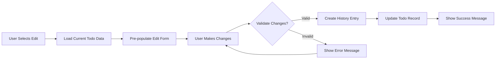
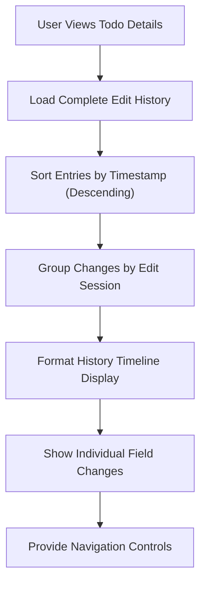

# Todo Editing and History Management Requirements

## Introduction

This document specifies the comprehensive requirements for todo editing functionality and complete edit history tracking in the multi-user Todo application. The system maintains a detailed audit trail of all changes made to todos, enabling users to review the complete evolution of their tasks over time while ensuring data integrity and privacy.

## Editing Capabilities Requirements

### Basic Editing Functions

**WHEN a user wishes to modify an existing todo, THE system SHALL provide editing capabilities for all editable fields.**

**THE system SHALL allow users to edit the title of their existing todos with validation ensuring 1-200 character limits.**

**THE system SHALL allow users to edit the description of their existing todos with validation ensuring maximum 2000 character limits.**

**THE system SHALL allow users to edit the start date of their existing todos with date validation and logical consistency checks.**

**THE system SHALL allow users to edit the due date of their existing todos with validation ensuring due dates occur after start dates when both are set.**

**WHEN a user accesses the edit interface for a todo, THE system SHALL pre-populate all editable fields with current values to facilitate efficient modification.**

**WHEN a user saves edits to a todo, THE system SHALL validate all modified fields according to the same validation rules applied during todo creation.**

### Editing Workflows

**WHEN a user attempts to edit a todo they do not own, THE system SHALL deny access and show appropriate privacy error message indicating insufficient permissions.**

**THE system SHALL maintain the completion status of todos during editing operations, allowing users to modify content regardless of completion state.**

**WHEN a todo is marked as complete, THE system SHALL still allow editing of all fields including title, description, and dates to accommodate task refinement.**

## Edit History Recording

### History Entry Creation

**WHEN any field of a todo is successfully edited, THE system SHALL create a new comprehensive history entry capturing the change details.**

**WHERE multiple fields are edited in a single operation, THE system SHALL create a single history entry capturing all changes made during that edit session.**

**THE system SHALL record the exact timestamp with millisecond precision when each edit was made, storing timestamps in UTC format.**

### History Entry Structure

Each history entry SHALL contain the following information:

| Field | Requirement | Description |
|-------|-------------|-------------|
| **Edit Timestamp** | REQUIRED | Exact date and time when the edit occurred in UTC format |
| **Previous Title** | CONDITIONAL | Original title before edit, captured only if title was changed |
| **New Title** | CONDITIONAL | Updated title after edit, captured only if title was changed |
| **Previous Description** | CONDITIONAL | Original description before edit, captured only if description was changed |
| **New Description** | CONDITIONAL | Updated description after edit, captured only if description was changed |
| **Previous Start Date** | CONDITIONAL | Original start date before edit, captured only if start date was changed |
| **New Start Date** | CONDITIONAL | Updated start date after edit, captured only if start date was changed |
| **Previous Due Date** | CONDITIONAL | Original due date before edit, captured only if due date was changed |
| **New Due Date** | CONDITIONAL | Updated due date after edit, captured only if due date was changed |

### Field Change Detection

**THE system SHALL accurately detect and record only the fields that were actually modified during an edit session.**

**WHERE a field value is changed to the same value it already contained, THE system SHALL NOT create a history entry for that specific field.**

**WHERE a previously empty field is populated with a value, THE system SHALL record this as a meaningful change in the history.**

**WHERE a populated field is cleared to empty, THE system SHALL record this as a significant change in the history.**

## History Viewing and Audit

### History Access

**WHEN a user views a single todo, THE system SHALL provide access to view the complete edit history for that specific todo.**

**THE system SHALL display edit history entries sorted chronologically from most recent to oldest edits.**

**WHERE a history entry contains multiple field changes, THE system SHALL display all changes within that single entry grouped by edit session.**

### History Display Format

Each history entry SHALL be displayed with the following comprehensive information:

- Edit timestamp converted to user's local timezone for readability
- Clear visual indication of which specific fields were changed during the edit
- Previous and new values for each changed field with appropriate formatting
- Visual distinction between different edit sessions using timeline markers

### History Navigation

**THE system SHALL allow users to navigate through edit history seamlessly with intuitive controls.**

**WHERE extensive edit history exists spanning multiple pages, THE system SHALL implement efficient pagination for history viewing.**

**THE system SHALL display a clear chronological timeline of edits with appropriate markers indicating significant changes.**

## Change Tracking Specifications

### Timestamp Accuracy

**THE system SHALL record edit timestamps with millisecond precision to ensure accurate chronological ordering.**

**ALL timestamps SHALL be stored in UTC format to maintain consistency across time zones.**

**WHEN displaying timestamps to users, THE system SHALL convert UTC timestamps to the user's local timezone for improved readability.**

### Change Detection Logic

**THE system SHALL compare field values using exact matching algorithms to determine if a meaningful change occurred.**

**WHERE date fields are compared, THE system SHALL consider both date and time components to detect precise modifications.**

**WHERE empty values are involved, THE system SHALL treat null/empty as distinct from any non-empty value for change detection purposes.**

### Multi-Edit Sessions

**WHEN a user makes multiple rapid edits to the same todo through separate save operations, THE system SHALL create separate history entries for each distinct save operation.**

**THE system SHALL NOT combine edits from different save operations into a single history entry to maintain edit session integrity.**

## Data Integrity and Preservation

### History Preservation

**THE system SHALL preserve complete edit history even when todos are moved to trash through soft deletion.**

**WHILE a todo exists in trash, THE system SHALL maintain its complete edit history for potential restoration.**

**WHEN a todo is restored from trash, THE system SHALL preserve all edit history created before, during, and after the trash period.**

### Permanent Deletion Impact

**WHEN a todo is permanently deleted from trash, THE system SHALL permanently delete all associated edit history records.**

**IF a user chooses to permanently delete a todo, THEN THE system SHALL remove all history entries for that todo to maintain data cleanliness.**

### Data Consistency

**THE system SHALL ensure that edit history entries remain perfectly synchronized with their corresponding todo records.**

**WHERE a todo is deleted, THE system SHALL prevent orphaned history entries from remaining in the database through proper cascade deletion.**

## Error Handling and Edge Cases

### Edit Validation Failures

**WHEN field validation fails during editing operations, THE system SHALL NOT create any history entry to maintain data integrity.**

**IF editing operations fail due to system errors or validation issues, THEN THE system SHALL NOT create incomplete or corrupted history entries.**

### Concurrent Editing Protection

**WHILE a user is actively editing a todo, THE system SHALL prevent other users from editing the same todo through appropriate locking mechanisms.**

**WHERE concurrent edit attempts occur, THE system SHALL implement appropriate locking mechanisms to prevent data conflicts and maintain consistency.**

### History Corruption Prevention

**THE system SHALL implement robust safeguards to prevent history entry corruption during system failures or crashes.**

**WHERE system crashes occur during history recording, THE system SHALL maintain data integrity through comprehensive transaction management.**

## Performance Expectations

### History Loading Performance

**WHEN loading edit history for a todo, THE system SHALL display the initial page of history entries within 2 seconds under normal load conditions.**

**WHERE extensive history exists spanning hundreds of entries, THE system SHALL implement efficient pagination to prevent performance degradation.**

### History Recording Performance

**THE system SHALL record edit history entries without noticeable impact on editing operation performance, completing within 100 milliseconds.**

**WHEN creating history entries during todo edits, THE system SHALL complete the operation efficiently to maintain responsive user experience.**

### Scalability Considerations

**THE system SHALL efficiently handle edit history for users with thousands of todos and extensive editing activity.**

**WHERE large edit histories exist, THE system SHALL implement optimized query patterns and indexing strategies to maintain performance.**

## Implementation Considerations

### Data Storage Requirements

Edit history data shall be stored in a manner that supports:
- Efficient querying by todo ID and timestamp for quick retrieval
- Strong referential integrity maintenance with todo records
- Bulk operations capability during permanent deletion scenarios
- Paginated retrieval optimization for history viewing interfaces

### Audit Trail Completeness

The edit history system shall provide a complete audit trail that enables:
- Comprehensive tracking of every meaningful change to todo records
- Accurate chronological maintenance of edit sequences
- Data preservation through soft delete and restoration cycles
- Effective user review and accountability for task evolution

### Privacy and Security Integration

**THE system SHALL integrate edit history functionality with the application's privacy framework, ensuring users can only access history for their own todos.**

**WHERE history data is accessed, THE system SHALL enforce strict ownership validation to prevent cross-user data exposure.**

## Business Rules and Constraints

### Ownership Enforcement

**THE system SHALL enforce that users can only view and modify edit history for todos they own, with no exceptions for administrative access.**

**WHERE history queries are executed, THE system SHALL automatically filter results by user ownership to maintain privacy.**

### Data Retention Policies

**THE system SHALL maintain edit history data for the entire lifecycle of a todo, from creation through permanent deletion.**

**WHERE account deletion occurs, THE system SHALL remove all associated edit history as part of comprehensive data cleanup.**

### Performance Optimization Rules

**THE system SHALL implement appropriate indexing strategies for edit history tables to ensure efficient query performance.**

**WHERE history data grows extensively, THE system SHALL consider archiving strategies for very old edit records while maintaining core functionality.**

## Success Criteria

### Functional Success Metrics

The edit history system shall be considered functionally successful when:
- Users can reliably view complete edit timelines for all their todos
- History entries accurately reflect every meaningful change made
- Edit sessions are properly grouped and displayed chronologically
- Performance meets specified response time requirements consistently

### User Experience Success Metrics

The system shall provide excellent user experience through:
- Intuitive history navigation and timeline visualization
- Clear presentation of field changes within edit sessions
- Responsive performance during history loading and viewing
- Effective integration with core todo management functionality

> *Developer Note: This document defines comprehensive business requirements for todo editing and history management functionality. All technical implementations including architecture, APIs, database design, and interface specifications are at the discretion of the development team based on these business requirements.*