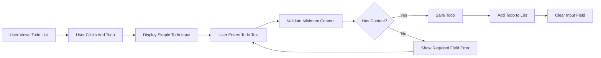
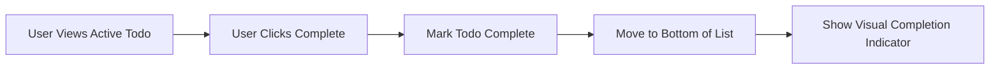
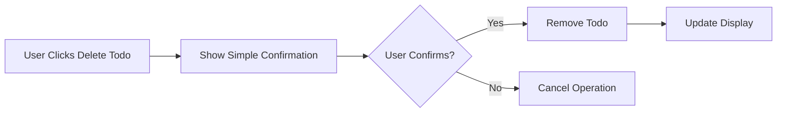
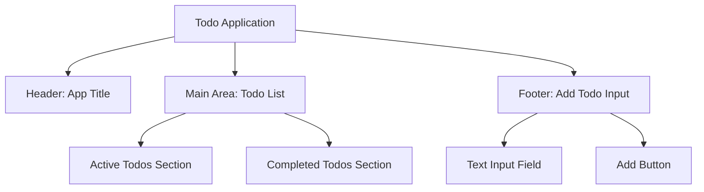
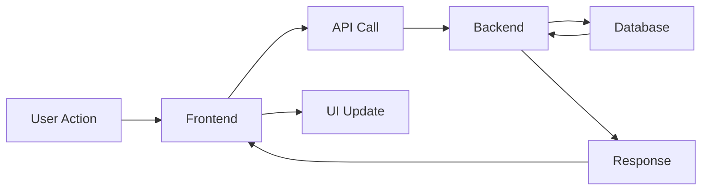

# User Journey Documentation for Minimal Todo Application

## Executive Summary

This document defines the complete user journey and interaction flows for a minimal Todo application, focusing on delivering the simplest possible user experience that meets core functionality requirements. The application follows an extremely streamlined approach where users can efficiently manage their personal todo items through intuitive workflows with zero unnecessary features.

## Core User Flows

### Todo Creation Process

The todo creation workflow enables users to quickly add new tasks with minimal steps:

### Todo Management Requirements

**WHEN** a user views their todo list, **THE** system **SHALL** display all todos in creation order.

**WHEN** a user creates a new todo, **THE** system **SHALL** require only text content.

**WHILE** a todo is being created, **THE** system **SHALL** prevent duplicate submission attempts.

### Todo Completion Workflow

The process for marking todos as complete focuses on absolute simplicity:

**WHEN** a user marks a todo as complete, **THE** system **SHALL** immediately update the todo status.

**WHILE** a todo status update is processing, **THE** system **SHALL** provide visual feedback.

### Todo Deletion Workflow

The deletion process is straightforward with basic confirmation:

**WHEN** a user attempts to delete a todo, **THE** system **SHALL** require basic confirmation.

## Application Structure

### Single Page Interface

The application uses a single-page design for maximum simplicity:

**WHEN** a user accesses the application, **THE** system **SHALL** display all functionality on a single page.

**THE** interface **SHALL** contain only essential elements: todo list display and add functionality.

## Core Functionality Requirements

### Minimum Feature Set

**THE** application **SHALL** provide the following minimal features:
- Create new todo items
- Mark todo items as complete/incomplete
- Delete todo items
- View all todo items in a simple list

**THE** application **SHALL NOT** include:
- User registration or authentication
- Due dates or priority levels
- Categories or tags
- Sorting or filtering
- Notifications or reminders
- Multiple todo lists

### Data Requirements

**EACH** todo item **SHALL** contain:
- Unique identifier
- Text content (required)
- Completion status (boolean)
- Creation timestamp

**THE** system **SHALL** store todos persistently between sessions.

## User Interaction Patterns

### Adding Todos

**WHEN** a user wants to add a todo, **THE** system **SHALL** provide a simple text input at the bottom of the interface.

**WHEN** the user submits a todo, **THE** system **SHALL** add it to the top of the active todos list.

### Managing Todos

**WHEN** a user completes a todo, **THE** system **SHALL** move it to the completed section.

**WHEN** a user deletes a todo, **THE** system **SHALL** remove it completely from storage.

### Error Handling

**IF** a todo operation fails, **THE** system **SHALL** display a simple error message.

**WHEN** network connectivity is lost, **THE** system **SHALL** attempt to sync when connection is restored.

## Performance Expectations

### Responsiveness Requirements

**WHEN** a user performs any todo operation, **THE** system **SHALL** provide immediate visual feedback.

**THE** interface **SHALL** remain responsive during all operations.

### Data Persistence

**THE** system **SHALL** automatically save todos after each operation.

**WHEN** the application loads, **THE** system **SHALL** restore the previous todo state.

## Implementation Guidelines

### Technical Constraints

**THE** application **SHALL** be built as a single-page web application.

**THE** backend **SHALL** provide RESTful API endpoints for todo operations.

**THE** frontend **SHALL** use modern web technologies with minimal dependencies.

### Data Flow

**WHEN** a user performs an action, **THE** system **SHALL** follow this data flow pattern.

## Success Criteria

### User Experience Goals

**THE** application **SHALL** allow users to manage todos with minimal cognitive load.

**THE** interface **SHALL** be intuitive enough for first-time users without training.

**THE** application **SHALL** perform all core todo operations reliably.

### Technical Success Metrics

**THE** system **SHALL** handle typical user loads without performance degradation.

**THE** application **SHALL** maintain data integrity across sessions.

**THE** system **SHALL** provide adequate error handling for common failure scenarios.

## Conclusion

This minimal Todo application specification focuses exclusively on core functionality without any unnecessary features. The design prioritizes simplicity, reliability, and ease of use above all else. By implementing only the essential todo management operations, the application delivers maximum value with minimal complexity.

The defined user journeys ensure that even non-technical users can successfully accomplish their todo management tasks through straightforward, predictable interactions. Each workflow has been optimized for simplicity while maintaining robust error handling and data persistence.

> *Developer Note: This document defines **business requirements only** for a minimal Todo application. All technical implementations should prioritize simplicity and maintainability.*