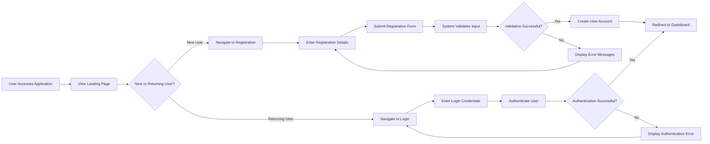
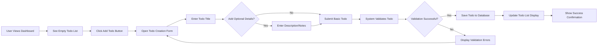
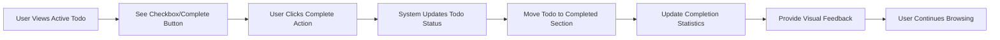
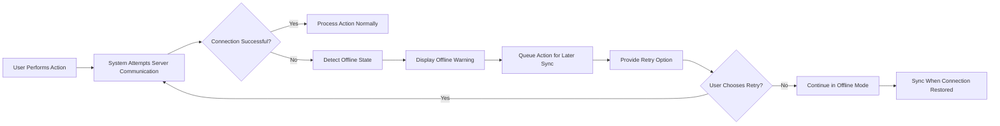

# Todo Application User Journey Documentation

## Executive Summary

This document defines the complete user journey for the Todo application, outlining how users interact with the system from initial registration through daily todo management activities. The journey focuses on providing a seamless, intuitive experience for users to manage their personal task lists efficiently.

## User Registration and Onboarding Journey

### Account Creation Flow

### Registration Requirements

**WHEN** a new user accesses the application, **THE** system **SHALL** present a registration form with email and password fields.

**WHEN** a user submits registration information, **THE** system **SHALL** validate that the email format is correct and the password meets security requirements.

**IF** registration validation fails, **THEN THE** system **SHALL** display clear error messages indicating what needs correction.

**WHEN** registration is successful, **THE** system **SHALL** automatically log the user in and redirect to the main dashboard.

### Registration Error Scenarios

**IF** a user attempts to register with an existing email address, **THEN THE** system **SHALL** display an error message indicating the email is already registered.

**IF** a user provides a password that doesn't meet security requirements, **THEN THE** system **SHALL** specify the requirements that weren't met.

**WHEN** network connectivity issues occur during registration, **THE** system **SHALL** provide clear error messages and allow retry.

## Core Todo Management Flow

### Todo Creation Process

### Todo Creation Requirements

**WHEN** a user accesses their dashboard, **THE** system **SHALL** display their current todo list with options to add new items.

**WHEN** a user initiates todo creation, **THE** system **SHALL** provide a simple form requiring only a title, with optional fields for additional details.

**THE** system **SHALL** validate that todo titles are not empty and do not exceed reasonable length limits.

**WHEN** a todo is successfully created, **THE** system **SHALL** immediately display it in the user's active todo list.

### Todo Creation Error Handling

**IF** a user attempts to create a todo with an empty title, **THEN THE** system **SHALL** display a validation error and prevent creation.

**IF** the system experiences storage issues during todo creation, **THEN THE** system **SHALL** preserve the user's input and allow retry.

**WHEN** a todo creation fails due to network issues, **THE** system **SHALL** queue the operation and synchronize when connectivity is restored.

### Todo Viewing and Organization

**WHILE** a user is viewing their todo list, **THE** system **SHALL** display todos in chronological order with the most recent items first.

**THE** system **SHALL** clearly distinguish between active and completed todos using visual indicators.

**WHERE** todos have due dates or priorities, **THE** system **SHALL** sort and display them according to these attributes.

## Todo Completion and Status Management

### Marking Todos Complete

### Status Management Requirements

**WHEN** a user marks a todo as complete, **THE** system **SHALL** immediately update its status and move it to the completed section.

**THE** system **SHALL** provide a clear visual indication that a todo has been completed (strikethrough text, different color, etc.).

**WHEN** a user wants to reactivate a completed todo, **THE** system **SHALL** allow marking it as active again.

### Completion Error Scenarios

**IF** a todo completion operation fails due to server error, **THEN THE** system **SHALL** revert the visual status and allow retry.

**WHEN** multiple users attempt to modify the same todo simultaneously, **THE** system **SHALL** handle conflicts gracefully.

### Todo Editing and Deletion

**WHEN** a user needs to modify a todo, **THE** system **SHALL** provide an edit function that allows updating the title and any additional details.

**WHEN** a user deletes a todo, **THE** system **SHALL** request confirmation before permanent removal.

**IF** a user confirms deletion, **THEN THE** system **SHALL** remove the todo completely from the database.

### Editing and Deletion Error Handling

**IF** a todo edit operation fails, **THEN THE** system **SHALL** preserve the original todo content and display an error message.

**WHEN** a user attempts to delete a todo that no longer exists, **THE** system **SHALL** handle the situation gracefully.

## Search and Organization Scenarios

### Basic Search Functionality

**WHEN** a user has many todos, **THE** system **SHALL** provide a search function to quickly find specific items.

**THE** search functionality **SHALL** match todo titles and descriptions against the search query.

**WHILE** searching, **THE** system **SHALL** display results instantly as the user types.

### Search Error Scenarios

**IF** the search index becomes corrupted, **THEN THE** system **SHALL** rebuild it automatically.

**WHEN** search results are empty, **THE** system **SHALL** provide helpful suggestions.

### Filtering by Status

**WHERE** users want to view only active or completed todos, **THE** system **SHALL** provide filter options for different statuses.

**THE** filtering mechanism **SHALL** be easily accessible and provide clear visual feedback on the current filter state.

## Error Handling and Recovery Flows

### Network and Connectivity Issues

### Error Recovery Requirements

**IF** the system cannot connect to the server, **THEN THE** system **SHALL** inform the user and provide options to retry or work offline.

**WHEN** working in offline mode, **THE** system **SHALL** queue actions and synchronize when connectivity is restored.

**IF** an action fails due to validation errors, **THEN THE** system **SHALL** provide specific, actionable error messages.

### Data Integrity Scenarios

**WHEN** data synchronization conflicts occur, **THE** system **SHALL** prioritize the most recent changes and inform the user of any conflicts.

**THE** system **SHALL** automatically recover from minor errors without requiring user intervention.

### Authentication Error Recovery

**IF** a user's authentication token expires during a session, **THE** system **SHALL** automatically attempt token refresh.

**WHEN** token refresh fails, **THE** system **SHALL** redirect the user to the login page with an appropriate message.

## Alternative User Paths and Edge Cases

### Empty State Management

**WHEN** a user has no todos, **THE** system **SHALL** display helpful guidance on how to create their first todo.

**THE** empty state **SHALL** include clear calls-to-action and examples of todo usage.

### Bulk Operations

**WHERE** users want to perform actions on multiple todos, **THE** system **SHALL** provide selection mechanisms for bulk operations.

**WHEN** performing bulk actions, **THE** system **SHALL** request confirmation for irreversible operations like mass deletion.

### Long Todo Lists

**WHILE** displaying large numbers of todos, **THE** system **SHALL** implement pagination or virtual scrolling to maintain performance.

**THE** system **SHALL** provide quick navigation options for users with extensive todo collections.

### Accessibility Scenarios

**WHEN** users with visual impairments access the application, **THE** system **SHALL** provide proper screen reader support.

**WHERE** keyboard navigation is required, **THE** system **SHALL** ensure all functionality is accessible via keyboard.

## Performance and Usability Expectations

### Response Time Standards

**THE** system **SHALL** respond to user actions within 2 seconds for standard operations.

**WHEN** loading the initial application, **THE** system **SHALL** display the interface within 3 seconds.

**THE** search functionality **SHALL** provide results instantly as the user types.

### User Experience Guidelines

**THE** interface **SHALL** be intuitive enough for users to accomplish basic tasks without training.

**WHEN** users perform common actions, **THE** system **SHALL** provide clear feedback confirming the action was completed.

**THE** application **SHALL** maintain consistency in interaction patterns across all features.

### Accessibility Considerations

**THE** system **SHALL** be usable with keyboard navigation for users who cannot use a mouse.

**WHERE** visual elements are used, **THE** system **SHALL** provide sufficient color contrast for readability.

**THE** application **SHALL** support screen readers and other assistive technologies.

## Success Criteria for User Journeys

### Registration Success Metrics
- Users can create an account within 2 minutes
- Registration error rate below 5%
- 95% of new users successfully complete their first todo within 10 minutes of registration

### Todo Management Success Metrics
- Users can create a new todo in under 30 seconds
- Todo completion rate tracking shows consistent usage patterns
- Search functionality successfully helps users find todos within 5 seconds

### Error Recovery Success Metrics
- 90% of connectivity issues resolved automatically
- User-reported error incidents below 1 per 1000 sessions
- Data loss incidents effectively eliminated through proper synchronization

### Performance Metrics
- Page load time consistently under 2 seconds
- Todo operations complete within 500ms
- Search results display instantly for typical todo lists

## Integration with Authentication System

### Authentication Flow Integration

**WHEN** a user attempts to access protected todo functionality, **THE** system **SHALL** validate authentication status.

**IF** authentication validation fails, **THEN THE** system **SHALL** redirect to the appropriate authentication flow.

**WHILE** a user is authenticated, **THE** system **SHALL** maintain secure access to their todo data.

### Session Management

**THE** system **SHALL** handle session expiration gracefully, preserving user data and state.

**WHEN** a session expires during todo operations, **THE** system **SHALL** provide clear re-authentication prompts.

### Permission Enforcement

**THE** system **SHALL** enforce that users can only access their own todo items.

**IF** unauthorized access is attempted, **THEN THE** system **SHALL** log the security event and deny access.

This user journey documentation provides the complete picture of how users will interact with the Todo application, ensuring that developers understand the intended user experience and can build a system that meets these expectations.

> *Developer Note: This document defines **user journey requirements only**. All technical implementations (API design, database structure, frontend components) are at the discretion of the development team.*