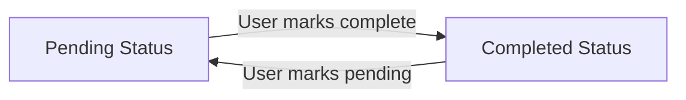
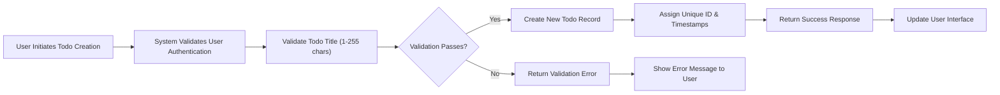
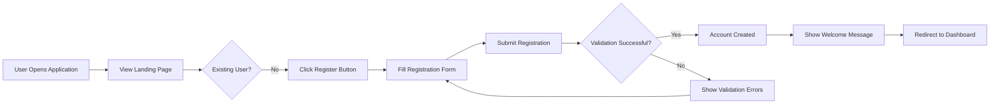
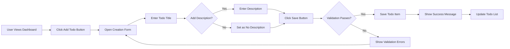
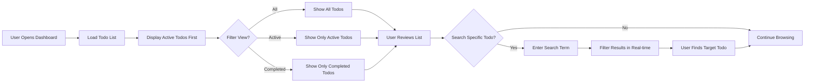
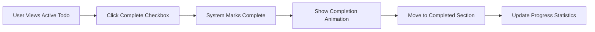
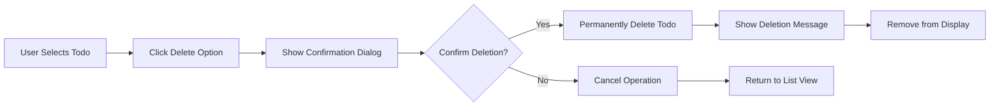
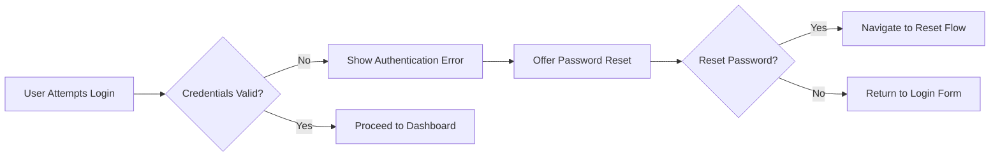

# Todo List Application - Requirements Analysis Report

## 1. Service Overview

### 1.1 Business Justification
The Todo List application provides users with a simple, intuitive system for managing personal tasks and to-do items. This minimal viable product focuses exclusively on core functionality that delivers essential value to users while maintaining simplicity and ease of use.

### 1.2 Target Audience
The primary users are individuals seeking a straightforward task management solution without complex features like categories, tags, due dates, or collaboration capabilities.

### 1.3 Core Value Proposition
- **Simplicity**: Minimal feature set focused on essential todo management
- **Reliability**: Consistent performance for basic CRUD operations
- **Accessibility**: Intuitive interface requiring minimal technical expertise
- **Privacy**: User-specific data isolation and security

### 1.4 Scope Definition
**IN SCOPE**: Basic todo item management, status tracking, user authentication, and simple list organization
**OUT OF SCOPE**: Advanced features like categories, tags, due dates, reminders, sharing, collaboration, or complex filtering

## 2. Core Functionality Requirements

### 2.1 Todo Item Management

#### 2.1.1 Todo Creation
**WHEN** a user creates a new todo item, **THE** system **SHALL**:
- Accept a title for the todo item (required field, 1-255 characters)
- Accept an optional description for additional details (maximum 1000 characters)
- Set the initial status to "pending"
- Assign a unique identifier to the todo item
- Record the creation timestamp
- Associate the todo item with the authenticated user

**Performance Requirement**: Todo creation **SHALL** complete within 500 milliseconds.

#### 2.1.2 Todo Retrieval
**THE** system **SHALL** provide users with the ability to:
- View all their todo items in a list
- Filter todo items by status (pending/completed)
- Sort todo items by creation date (newest first)
- Access individual todo item details

**Performance Requirement**: Todo list loading **SHALL** complete within 2 seconds for lists containing up to 1,000 items.

#### 2.1.3 Todo Updates
**WHEN** a user updates a todo item, **THE** system **SHALL** support modification of:
- Todo title (with same validation as creation)
- Todo description (optional field)
- Todo status (toggle between pending and completed)

**Business Rule**: Users **SHALL** only be able to modify their own todo items.

#### 2.1.4 Todo Deletion
**WHEN** a user deletes a todo item, **THE** system **SHALL**:
- Permanently remove the todo item from the system
- Provide confirmation of successful deletion
- Handle deletion requests securely and reliably

**Business Rule**: Deletion operations **SHALL** be irreversible without administrative intervention.

### 2.2 Status Tracking and Workflow

#### 2.2.1 Status Management
**THE** system **SHALL** support two todo statuses:
- **Pending**: Todo items that require action or completion
- **Completed**: Todo items that have been finished

**WHEN** a user marks a todo as completed, **THE** system **SHALL**:
- Update the status from "pending" to "completed"
- Record the completion timestamp
- Maintain the completed state until explicitly changed

**WHEN** a user marks a completed todo as pending, **THE** system **SHALL**:
- Update the status from "completed" to "pending"
- Clear the completion timestamp
- Return the todo to the active list

### 2.3 Basic CRUD Operations Specification

#### 2.3.1 Create Operation Flow

#### 2.3.2 Read Operation Requirements
**WHEN** a user requests their todo list, **THE** system **SHALL**:
- Verify user authentication
- Retrieve all todo items belonging to the authenticated user
- Return the list in a structured format
- Include pagination support for large datasets

#### 2.3.3 Update Operation Requirements
**WHEN** a user updates a todo item, **THE** system **SHALL**:
- Verify the user owns the todo item being modified
- Validate all updated fields against business rules
- Apply the changes to the todo record
- Return the updated todo item data
- Record the modification timestamp

#### 2.3.4 Delete Operation Requirements
**WHEN** a user deletes a todo item, **THE** system **SHALL**:
- Verify the user owns the todo item being deleted
- Remove the todo item from persistent storage
- Return confirmation of successful deletion
- Ensure the deletion is atomic and reliable

## 3. User Scenarios and Journeys

### 3.1 User Registration and Onboarding

#### 3.1.1 New User Registration Flow

**Business Requirements**:
- WHEN a user submits registration information, THE system SHALL validate email format and password strength
- IF email is already registered, THEN THE system SHALL display appropriate error message
- WHERE password confirmation fails, THE system SHALL highlight the mismatch and prevent submission

#### 3.1.2 First-Time User Onboarding
**WHEN** a user logs in for the first time, **THE** system **SHALL**:
- Display a brief onboarding tutorial
- Offer to create a sample todo item to demonstrate functionality
- Provide option to proceed directly to empty dashboard

### 3.2 Todo Creation Workflow

#### 3.2.1 Basic Todo Creation

**Business Requirements**:
- WHEN a user creates a todo, THE system SHALL require a non-empty title
- THE system SHALL allow optional description field with character limit of 1000
- IF title is empty, THEN THE system SHALL prevent submission and highlight the error

#### 3.2.2 Quick Todo Creation
**THE** system **SHALL** provide a quick-add input field on the main dashboard for rapid todo creation without detailed forms.

### 3.3 Todo Management Scenarios

#### 3.3.1 Viewing and Organizing Todos

**Business Requirements**:
- THE system SHALL display todos in order of creation (newest first) by default
- WHEN a user wants to filter, THE system SHALL provide options for "All", "Active", and "Completed" views
- WHERE search functionality is used, THE system SHALL filter todos by title and description content

#### 3.3.2 Editing Existing Todos
**WHEN** a user edits a todo, **THE** system **SHALL**:
- Pre-fill the form with current values
- Validate edits with the same rules as creation
- Preserve user input and highlight errors if validation fails

#### 3.3.3 Marking Todos Complete

**Business Requirements**:
- WHEN a user marks a todo complete, THE system SHALL immediately update its status
- THE system SHALL provide visual feedback (animation or status change)
- WHERE todos are completed, THE system SHALL move them to the completed section

#### 3.3.4 Deleting Todos

**Business Requirements**:
- WHEN a user attempts to delete a todo, THE system SHALL require confirmation
- IF deletion is confirmed, THEN THE system SHALL permanently remove the todo
- THE system SHALL provide undo functionality for a brief period after deletion

### 3.4 Completion Tracking Workflows

#### 3.4.1 Progress Visualization
**THE** system **SHALL** display completion statistics (e.g., "5 of 10 todos completed") and update progress indicators in real-time.

#### 3.4.2 Bulk Operations
**THE** system **SHALL** allow selection of multiple todos for bulk complete or bulk delete operations.

## 4. Business Rules and Constraints

### 4.1 Data Validation Rules

#### 4.1.1 Todo Item Validation
| Field | Validation Rule | Error Message |
|-------|-----------------|---------------|
| Todo Title | Required, 1-255 characters | "Todo title must be between 1 and 255 characters" |
| Todo Description | Optional, maximum 1000 characters | "Description cannot exceed 1000 characters" |
| User Ownership | User must own todo for modifications | "You can only modify your own todo items" |
| Status | Must be "pending" or "completed" | "Invalid todo status" |

#### 4.1.2 User Input Validation
- **THE** system **SHALL** accept and properly handle UTF-8 encoded text for all user inputs
- **THE** system **SHALL** sanitize all user inputs to prevent injection attacks
- **WHILE** processing user inputs, **THE** system **SHALL** maintain data integrity without altering intended meaning

### 4.2 Business Logic Constraints

#### 4.2.1 Todo Creation Rules
- **WHEN** creating a todo, **THE** system **SHALL** require only the title field
- **THE** system **SHALL** automatically assign the current timestamp as the creation date
- **WHEN** a todo is created, **THE** system **SHALL** associate it with the authenticated user's account
- **THE** system **SHALL** not allow creation of todos for other users

#### 4.2.2 Status Transition Rules
- **WHILE** a todo is in "pending" status, **THE** user **SHALL** be able to transition it to "completed"
- **WHILE** a todo is in "completed" status, **THE** user **SHALL** be able to transition it to "pending"
- **THE** system **SHALL** record the timestamp of each status change

#### 4.2.3 Todo Modification Rules
- **WHEN** updating a todo, **THE** system **SHALL** validate all modified fields against the same rules as creation
- **THE** system **SHALL** only allow the todo owner to modify their own todos
- **WHEN** a todo is updated, **THE** system **SHALL** update the last modified timestamp
- **THE** system **SHALL** preserve the original creation timestamp during updates

#### 4.2.4 Deletion Constraints
- **WHEN** deleting a todo, **THE** system **SHALL** require user confirmation
- **THE** system **SHALL** perform a permanent deletion
- **THE** system **SHALL** not allow recovery of deleted todos

### 4.3 Operational Limits and Boundaries

#### 4.3.1 System Capacity Limits
- **THE** system **SHALL** support a minimum of 1000 concurrent authenticated users
- **EACH** user **SHALL** be able to create up to 10,000 active todo items
- **THE** system **SHALL** handle a minimum of 100 todo creation requests per minute per user

#### 4.3.2 Performance Boundaries
- **WHEN** loading todo lists, **THE** system **SHALL** return results within 2 seconds for lists up to 1000 items
- **THE** system **SHALL** support pagination with a default page size of 20 items
- **THE** system **SHALL** maintain 99.5% uptime during business hours (9 AM - 6 PM local time)

### 4.4 Data Integrity Requirements

#### 4.4.1 Consistency Rules
- **WHEN** performing todo operations, **THE** system **SHALL** ensure atomicity (all-or-nothing execution)
- **THE** system **SHALL** maintain referential integrity between users and their todos
- **WHILE** updating multiple fields, **THE** system **SHALL** apply changes atomically

#### 4.4.2 Data Validation
- **THE** system **SHALL** validate data integrity before committing changes
- **WHEN** validation fails, **THE** system **SHALL** roll back the entire operation
- **THE** system **SHALL** provide clear error messages for validation failures

## 5. Authentication and Authorization Requirements

### 5.1 User Authentication

#### 5.1.1 Registration Process
**WHEN** a new user registers, **THE** system **SHALL**:
- Collect email address and password
- Validate email format and password strength
- Create user account with unique identifier
- Send confirmation email (optional)

#### 5.1.2 Login Process
**WHEN** a user logs in, **THE** system **SHALL**:
- Validate credentials against stored user data
- Create authenticated session
- Return secure authentication token
- Redirect to user dashboard

### 5.2 Authorization Rules

#### 5.2.1 User Isolation
- **THE** system **SHALL** ensure that users can only access their own todos
- **WHEN** retrieving todo lists, **THE** system **SHALL** filter by the authenticated user's ID
- **THE** system **SHALL** not expose todo IDs or metadata from other users

#### 5.2.2 Permission Enforcement
- **WHEN** performing any todo operation, **THE** system **SHALL** verify user ownership
- **IF** a user attempts to access another user's todo, **THEN THE** system **SHALL** return access denied error

## 6. Error Handling and Recovery

### 6.1 Common Error Scenarios

#### 6.1.1 Authentication Errors

**Business Requirements**:
- IF authentication fails, THEN THE system SHALL display clear error message without revealing security details
- THE system SHALL offer password reset option after failed authentication attempts
- WHEN password reset is initiated, THE system SHALL guide user through secure recovery process

#### 6.1.2 Data Validation Errors
**WHEN** validation fails, **THE** system **SHALL**:
- Highlight specific fields with errors
- Provide clear and actionable error messages
- Preserve user input during validation errors to avoid retyping

#### 6.1.3 Network Connectivity Issues
**WHILE** offline, **THE** system **SHALL**:
- Indicate connectivity status clearly
- Queue actions for retry when connectivity returns
- Provide option to work offline with local storage when possible

### 6.2 Error Recovery Flows

#### 6.2.1 User Recovery Procedures
**WHEN** an error occurs during todo creation, **THE** system **SHALL**:
- Preserve any entered data if possible
- Provide clear error messages with recovery instructions
- Allow users to retry the operation after addressing the issue

#### 6.2.2 System Recovery Procedures
**WHEN** system failures occur, **THE** system **SHALL**:
- Recover from failures within 5 minutes
- Preserve all user data during recovery
- Provide status updates during recovery procedures

## 7. Performance and Scalability Requirements

### 7.1 Response Time Standards

| Operation | Maximum Acceptable Response Time |
|-----------|----------------------------------|
| Todo List Retrieval | 2 seconds |
| Individual Todo Retrieval | 1 second |
| Todo Creation | 500 milliseconds |
| Todo Update | 300 milliseconds |
| Todo Deletion | 2 seconds |

### 7.2 Availability Requirements
- **THE** system **SHALL** maintain 99.5% uptime during business hours (9 AM - 6 PM local time)
- **THE** system **SHALL** provide graceful degradation during maintenance periods
- **THE** system **SHALL** provide clear communication of service interruptions

### 7.3 Scalability Considerations
**WHERE** user growth occurs, **THE** system **SHALL**:
- Scale horizontally to accommodate increased load
- Maintain performance standards under normal usage patterns
- Provide adequate resources for peak usage periods

## 8. Implementation Guidelines

### 8.1 Development Standards

All business rules and constraints defined in this document must be enforced consistently across the entire application. Developers should implement these rules at both the application logic layer and database constraint layer where appropriate.

### 8.2 Testing Requirements

Each business rule should have corresponding test cases that verify:
- Rule compliance under normal conditions
- Proper error handling when rules are violated
- Edge cases and boundary conditions
- Performance under load

### 8.3 Monitoring and Metrics

The system should track key metrics related to business rule compliance:
- Validation failure rates
- Performance against response time standards
- System availability percentages
- Data integrity check results

## Conclusion

This requirements analysis report defines the complete set of specifications for a minimal viable Todo list application. The document focuses exclusively on core functionality that enables users to effectively manage their personal tasks while maintaining simplicity and reliability.

All requirements are specified in natural language using EARS format where applicable, providing backend developers with clear, actionable specifications for implementation. The minimal scope ensures rapid development while delivering fundamental value to users.

The requirements cover user authentication, todo management, status tracking, error handling, and performance standards - providing a comprehensive foundation for building a production-ready Todo list application.