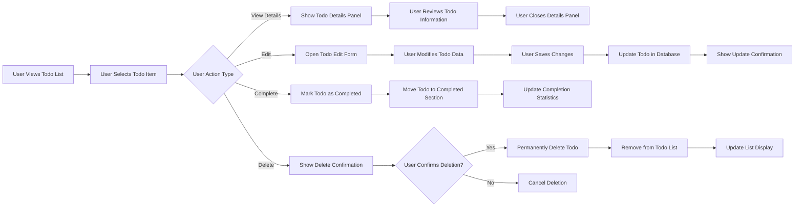
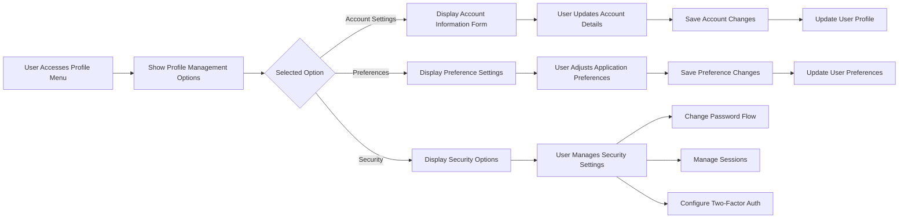

# User Scenarios Documentation

## Introduction

This document describes the primary user journeys and interaction flows for the Todo list application. These scenarios represent the core user experiences that define how individuals interact with the application to manage their daily tasks and organize their productivity.

Each scenario includes detailed step-by-step interactions, visual flow diagrams using Mermaid syntax, and comprehensive coverage of both success and error handling paths. These scenarios provide product managers with a clear understanding of user behavior patterns and system responses.

## User Registration Journey

### New User Onboarding Flow

This journey describes the complete process for a new user to create an account and access the Todo application for the first time.

```mermaid
graph LR
  A["User Opens Application"] --> B["Landing Page Displayed"]
  B --> C["User Clicks Register Button"]
  C --> D["Registration Form Displayed"]
  D --> E["User Enters Registration Details"]
  E --> F["System Validates Input"]
  F --> G{"Input Valid?"}
  G -->|"Yes"| H["Create User Account"]
  G -->|"No"| I["Show Validation Errors"]
  I --> E
  H --> J["Send Email Verification"]
  J --> K["Show Verification Message"]
  K --> L["User Checks Email"]
  L --> M["User Clicks Verification Link"]
  M --> N["Account Activated"]
  N --> O["Redirect to Login Page"]
  O --> P["User Logs In"]
  P --> Q["Show Empty Todo Dashboard"]
  Q --> R["Display Welcome Tutorial"]
```

### Success Path Details

**Step 1: Initial Access**
- User navigates to the Todo application URL
- System displays landing page with registration and login options
- User selects "Create Account" or "Register" option

**Step 2: Registration Form Completion**
- User provides email address
- User creates password (meeting complexity requirements)
- User confirms password entry
- User optionally provides display name

**Step 3: Account Creation Process**
- System validates email format and uniqueness
- System validates password complexity requirements
- System creates user account with pending verification status
- System sends verification email with secure link

**Step 4: Email Verification**
- User receives verification email
- User clicks verification link within 24 hours
- System activates user account
- System redirects user to login page

**Step 5: First Login Experience**
- User logs in with newly created credentials
- System displays empty todo dashboard
- System shows brief welcome tutorial explaining basic features
- User can now create their first todo item

### Error Handling Scenarios

**Invalid Email Format**
- WHEN user enters invalid email format, THE system SHALL display specific error message
- IF email already exists in system, THEN THE system SHALL indicate account already exists

**Weak Password**
- IF password does not meet complexity requirements, THEN THE system SHALL show password strength requirements
- THE system SHALL prevent account creation until password requirements are met

**Email Verification Failure**
- IF verification link expires (after 24 hours), THEN THE system SHALL allow user to request new verification email
- IF verification link is invalid, THEN THE system SHALL provide option to resend verification

## Todo Creation Flow

### Adding New Todo Items

This scenario describes how users create new todo items within their personal task list.

```mermaid
graph LR
  A["User Views Todo Dashboard"] --> B["User Clicks Add Todo Button"]
  B --> C["Todo Creation Form Appears"]
  C --> D["User Enters Todo Title"]
  D --> E["User Optionally Adds Description"]
  E --> F["User Sets Optional Due Date"]
  F --> G["User Clicks Save Button"]
  G --> H["System Validates Todo Data"]
  H --> I{"Validation Successful?"}
  I -->|"Yes"| J["Save Todo to Database"]
  I -->|"No"| K["Display Validation Errors"]
  K --> D
  J --> L["Add Todo to User's List"]
  L --> M["Show Success Confirmation"]
  M --> N["Update Todo Count Display"]
  N --> O["Clear Creation Form"]
  O --> P["Show Ready for Next Todo"]
```

### Success Path Details

**Step 1: Access Creation Interface**
- User navigates to todo dashboard
- User clicks "Add Todo" button or similar creation trigger
- System displays todo creation form

**Step 2: Todo Information Entry**
- User enters required todo title (minimum 1 character, maximum 255 characters)
- User optionally adds detailed description (maximum 2000 characters)
- User optionally sets due date using date picker
- User can set priority level if supported

**Step 3: Validation and Submission**
- System validates todo title presence and length
- System validates description length if provided
- System validates due date is in future if set
- User confirms creation by clicking "Save" or "Add"

**Step 4: Successful Creation**
- System saves todo item to user's personal list
- System displays success confirmation message
- System updates todo count display
- System clears creation form for next todo
- New todo appears in user's active todo list

### Error Handling Scenarios

**Empty Title Submission**
- IF user attempts to save todo with empty title, THEN THE system SHALL highlight title field as required
- THE system SHALL prevent todo creation until title is provided

**Title Too Long**
- IF todo title exceeds 255 characters, THEN THE system SHALL truncate or require shortening
- THE system SHALL show character count and limit indicator

**Invalid Due Date**
- IF user sets due date in the past, THEN THE system SHALL warn about past dates
- THE system SHALL optionally auto-correct to current date or require future date

## Todo Management Flow

### Complete Todo Lifecycle Management

This scenario covers the full lifecycle of a todo item from creation to completion or deletion.

### Viewing Todo Details

**Step 1: Todo Selection**
- User clicks on todo item in list view
- System displays todo details in side panel or modal
- Details include title, description, creation date, due date (if set), completion status

**Step 2: Information Review**
- User reviews complete todo information
- User can see creation timestamp and last modification time
- User closes details panel to return to list view

### Editing Existing Todos

**Step 1: Initiate Edit**
- User selects "Edit" option from todo context menu or button
- System opens edit form with current todo data pre-filled
- Form maintains same validation rules as creation form

**Step 2: Modification Process**
- User updates todo title, description, or due date
- System validates changes in real-time
- User saves changes or cancels edit operation

**Step 3: Update Confirmation**
- System saves updated todo information
- System displays update success message
- Updated todo appears in list with modification timestamp

### Completing Todos

**Step 1: Mark as Complete**
- User clicks completion checkbox or "Mark Complete" button
- System immediately moves todo to completed section
- System updates completion statistics and progress indicators

**Step 2: Completion Feedback**
- Completed todos are visually distinguished (strikethrough, different color)
- System may show celebration animation for motivation
- Completion count increments in statistics display

### Deleting Todos

**Step 1: Delete Initiation**
- User selects "Delete" option for specific todo
- System displays confirmation dialog warning about permanent deletion
- Confirmation includes todo title for verification

**Step 2: Confirmation Process**
- User confirms deletion or cancels operation
- IF user confirms, THEN THE system SHALL permanently remove todo from database
- System updates todo list display to reflect deletion

### Error Handling Scenarios

**Edit Conflict**
- IF multiple devices attempt to edit same todo simultaneously, THEN THE system SHALL detect conflict
- THE system SHALL show conflict resolution options or use last-write-wins strategy

**Network Issues During Update**
- IF network connection fails during todo update, THEN THE system SHALL queue changes for retry
- THE system SHALL show offline status and retry when connection restored

**Delete Accidental Confirmation**
- WHERE undo functionality is available, THE system SHALL provide brief undo period after deletion
- THE system SHALL confirm permanent deletion after undo period expires

## User Profile Management

### Account Settings and Preferences

This scenario covers user management of their account settings and application preferences.

### Account Information Management

**Step 1: Access Profile Settings**
- User navigates to profile or account section
- System displays account management dashboard
- Options include personal information, preferences, and security settings

**Step 2: Update Personal Information**
- User can update display name
- User can change email address (requires re-verification)
- User can update timezone and date format preferences
- System validates changes and requires confirmation for sensitive updates

**Step 3: Save Changes**
- User confirms changes
- System updates user profile information
- System shows success confirmation
- Email changes trigger verification process

### Application Preferences

**Step 1: Access Preferences**
- User selects preferences section
- System displays customizable application settings
- Options may include theme (light/dark), default view, notification preferences

**Step 2: Adjust Settings**
- User selects preferred theme (light mode/dark mode/auto)
- User sets default todo view (list/board/calendar)
- User configures notification preferences (email/push/both)
- User sets default sorting method for todos

**Step 3: Apply Preferences**
- Changes apply immediately or after confirmation
- System saves preference settings to user profile
- Interface updates reflect new preferences

### Security Management

**Step 1: Password Change**
- User accesses password change form
- User enters current password for verification
- User creates new password meeting complexity requirements
- User confirms new password
- System updates password and logs out other sessions

**Step 2: Session Management**
- User can view active sessions across devices
- User can log out specific sessions remotely
- System shows session details (device, location, last activity)

**Step 3: Security Enhancements**
- User can enable two-factor authentication if supported
- System guides user through 2FA setup process
- User receives backup codes for account recovery

### Error Handling Scenarios

**Invalid Current Password**
- IF user enters incorrect current password during change, THEN THE system SHALL show authentication error
- THE system SHALL prevent password change until correct current password provided

**Weak New Password**
- IF new password does not meet complexity requirements, THEN THE system SHALL show password requirements
- THE system SHALL prevent password update until requirements met

**Email Already in Use**
- IF user attempts to change to email already registered, THEN THE system SHALL indicate email unavailable
- THE system SHALL require unique email address for account

## Error Handling Scenarios

### Comprehensive Error Recovery Flows

This section details common error scenarios and how users can recover from them.

### Authentication Errors

**Invalid Login Credentials**
- WHEN user enters incorrect username or password, THE system SHALL display generic error message
- THE system SHALL provide password reset option after multiple failed attempts
- IF account is locked due to security concerns, THEN THE system SHALL provide account recovery instructions

**Session Expiration**
- WHEN user session expires during active work, THE system SHALL detect expired session
- THE system SHALL preserve unsaved work if possible
- THE system SHALL redirect to login page with message about session expiration
- AFTER successful re-login, THE system SHALL restore user to previous context

### Data Synchronization Errors

**Offline Mode Operations**
- WHILE user is offline, THE system SHALL allow todo creation and modification
- THE system SHALL queue changes for synchronization when connection restored
- WHEN connection restored, THE system SHALL automatically sync queued changes
- IF sync conflicts occur, THEN THE system SHALL provide conflict resolution options

**Server Unavailable**
- IF server is unreachable, THEN THE system SHALL show server status indicator
- THE system SHALL attempt automatic reconnection with exponential backoff
- THE system SHALL allow limited offline functionality
- WHEN server available again, THEN THE system SHALL resume normal operations

### Data Validation Errors

**Invalid Todo Data**
- WHEN user submits invalid todo data, THE system SHALL highlight specific validation errors
- THE system SHALL provide clear error messages explaining required corrections
- THE system SHALL preserve user input to minimize re-entry effort

**Duplicate Todo Detection**
- IF system detects potential duplicate todos, THEN THE system SHALL warn user about duplication
- THE system SHALL offer option to proceed or cancel creation
- WHERE duplicate prevention is enabled, THE system SHALL suggest merging similar todos

### Performance-Related Errors

**Slow Response Handling**
- WHEN system response is slow, THE system SHALL show loading indicators
- THE system SHALL provide estimated wait time if possible
- IF operation times out, THEN THE system SHALL offer retry option
- THE system SHALL maintain responsive UI during slow operations

**Large Dataset Handling**
- WHEN user has large number of todos, THE system SHALL implement pagination or virtual scrolling
- THE system SHALL provide search and filtering options for large datasets
- THE system SHALL show performance optimizations to maintain responsiveness

## Success Metrics

### Key Performance Indicators for User Journeys

**Registration Journey Success Rate**
- Percentage of users who complete registration process successfully
- Average time from first visit to completed registration
- Email verification completion rate
- First todo creation rate after registration

**Todo Creation Efficiency**
- Average time to create a new todo item
- Percentage of todos created with additional details (description, due dates)
- Abandonment rate during todo creation process
- Most common todo creation patterns

**Todo Management Effectiveness**
- Todo completion rate (percentage of created todos marked complete)
- Average time from creation to completion
- Todo modification frequency
- Deletion rate vs completion rate

**User Engagement Metrics**
- Daily active users
- Average session duration
- Frequency of application usage
- Feature adoption rates across user base

**Error Recovery Effectiveness**
- Success rate of error recovery processes
- User satisfaction with error messaging
- Reduction in support requests through effective error handling
- Time to recovery from common error scenarios

These metrics provide quantitative measures of how well the user scenarios are performing and where improvements may be needed to enhance the overall user experience.

> *Developer Note: This document defines **business requirements only**. All technical implementations (architecture, APIs, database design, etc.) are at the discretion of the development team.*