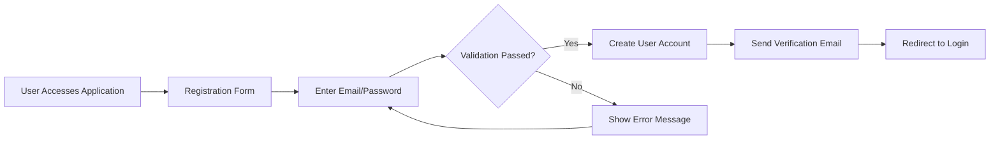
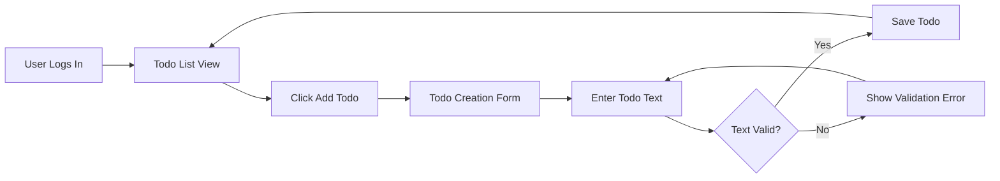
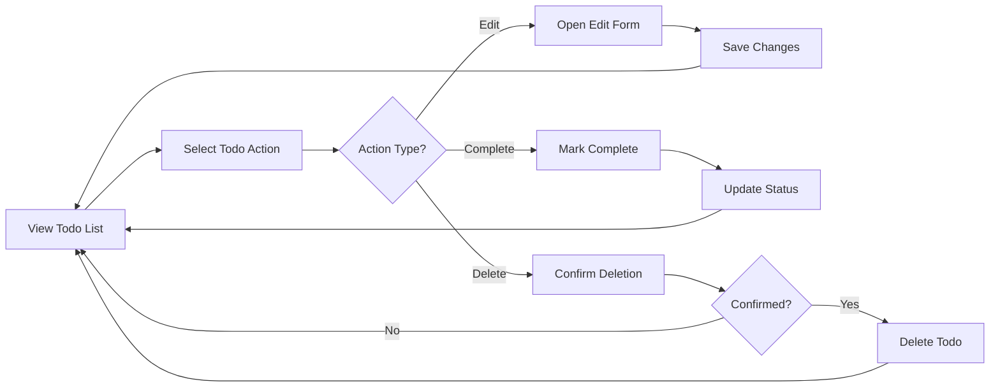

# Todo Application Requirements Analysis Report

## Executive Summary

This document provides comprehensive business requirements for a minimal Todo list application designed for personal productivity management. The application focuses on core functionality while maintaining simplicity and ease of use for non-technical users.

### Business Problem
Individuals struggle with task organization and prioritization in their daily lives. Traditional todo applications often include unnecessary complexity that overwhelms users seeking simple task management.

### Solution Overview
The Todo application provides a streamlined approach to personal task management with essential features only. By eliminating unnecessary complexity, users can focus on what matters most: capturing and completing tasks efficiently.

### Target Market
The application targets individuals seeking simple, distraction-free task management without the overhead of complex project management features.

## Business Model

### Revenue Strategy
As a minimal functionality application, the initial focus is on user adoption and engagement. Potential revenue streams include:
- Freemium model with basic features free
- Premium subscription for advanced organization features
- Enterprise licensing for team deployments

### Cost Structure
- Infrastructure costs for data storage and hosting
- Development and maintenance resources
- Customer support and documentation

### Growth Plan
- Focus on user experience and simplicity as key differentiators
- Word-of-mouth marketing through satisfied users
- Gradual feature expansion based on user feedback

### Success Metrics
- Monthly Active Users (MAU) growth
- Task completion rate
- User retention metrics
- Feature adoption rates

## User Actors & Authentication

### User Actor Definitions

#### Standard User
- **Description**: Individual user who creates and manages personal todo items
- **Permissions**: Full CRUD operations on own todos
- **Authentication**: Email/password registration and login

### Authentication Requirements

#### Core Authentication Functions
- Users can register with email and password
- Users can log in to access their personal todo list
- Users can log out to end their session
- System maintains user sessions securely
- Users can reset forgotten passwords
- Users can change their password when logged in

#### Token Management
- **Token Type**: JWT (JSON Web Tokens)
- **Access Token Expiration**: 30 minutes
- **Refresh Token Expiration**: 30 days
- **Token Storage**: localStorage for convenience
- **JWT Payload**: userId, role="user", permissions=["todo:create", "todo:read", "todo:update", "todo:delete"]

#### Permission Matrix
| Action | Standard User |
|--------|---------------|
| Create todo | ✅ |
| Read own todos | ✅ |
| Update own todos | ✅ |
| Delete own todos | ✅ |
| View other users' todos | ❌ |
| Modify other users' todos | ❌ |

## Functional Requirements

### Core Todo Management

#### Todo Creation
WHEN a user creates a new todo item, THE system SHALL store the todo with the following properties:
- Text description (required, 1-500 characters)
- Creation timestamp (auto-generated)
- Completion status (default: incomplete)
- Unique identifier

WHEN a user submits a todo with empty text, THE system SHALL reject the creation and display an appropriate error message.

#### Todo Reading
THE system SHALL display all of the user's todo items in a list format.
THE system SHALL show incomplete todos separately from completed todos.
THE system SHALL display todos in creation order (newest first or oldest first based on user preference).

#### Todo Updating
WHEN a user marks a todo as complete, THE system SHALL update the completion status and record the completion timestamp.
WHEN a user edits the text of a todo, THE system SHALL validate the new text and update the todo if valid.
WHEN a user attempts to edit a non-existent todo, THE system SHALL display an appropriate error message.

#### Todo Deletion
WHEN a user deletes a todo, THE system SHALL remove the todo permanently from the user's list.
WHEN a user deletes a todo, THE system SHALL request confirmation to prevent accidental deletion.

### User Interface Requirements

#### Todo List Display
THE system SHALL display a clear distinction between completed and incomplete todos.
THE system SHALL provide visual indicators for todo status (e.g., checkboxes for completion).
THE system SHALL show the total count of todos and completed todos.

#### Navigation
THE system SHALL provide easy access to create new todos from any screen.
THE system SHALL allow users to filter todos by completion status.
THE system SHALL provide a search function to find specific todos by text content.

### Data Management

#### Data Persistence
THE system SHALL persist todo data securely between sessions.
THE system SHALL automatically save changes to prevent data loss.
THE system SHALL provide data backup capabilities.

#### Data Validation
WHEN creating or updating a todo, THE system SHALL validate that the text is between 1 and 500 characters.
WHEN processing todo operations, THE system SHALL verify that the user owns the todo being modified.

## User Journey Flows

### User Registration Flow

### Todo Creation Process

### Todo Management Flow

## Data Flow Requirements

### Data Creation Process
WHEN a user creates a todo, THE system SHALL:
1. Validate user authentication
2. Validate todo text format
3. Generate unique todo identifier
4. Store todo in user's personal collection
5. Return success confirmation

### Data Access Patterns
THE system SHALL provide efficient access to:
- All user todos for list display
- Specific todos for editing
- Completed/incomplete todos for filtering
- Todo search results

### Data Modification Flow
WHEN updating a todo, THE system SHALL:
1. Verify user ownership of the todo
2. Validate the updated content
3. Apply the changes
4. Update the modification timestamp
5. Return updated todo data

### Data Deletion Process
WHEN deleting a todo, THE system SHALL:
1. Verify user ownership
2. Request confirmation
3. Permanently remove the todo
4. Update the todo list display

## Error Handling Specifications

### Authentication Errors
IF user authentication fails, THEN THE system SHALL redirect to login page with appropriate error message.
IF session expires, THEN THE system SHALL automatically redirect to login page.
IF invalid credentials are provided, THEN THE system SHALL display "Invalid email or password" message.

### Data Validation Errors
IF todo text exceeds 500 characters, THEN THE system SHALL reject the operation and show "Todo text too long" error.
IF todo text is empty, THEN THE system SHALL reject the operation and show "Todo text required" error.
IF user attempts to modify non-existent todo, THEN THE system SHALL show "Todo not found" error.

### System Errors
IF database connection fails, THEN THE system SHALL display "Service temporarily unavailable" message.
IF unexpected error occurs, THEN THE system SHALL log the error and show generic error message to user.

### User Recovery Flows
WHEN an error occurs, THE system SHALL provide clear recovery instructions.
WHEN data validation fails, THE system SHALL highlight the specific field with the error.
WHEN network issues occur, THE system SHALL automatically retry the operation.

## Performance Expectations

### Response Time Expectations
THE system SHALL load the todo list within 2 seconds under normal conditions.
THE system SHALL process todo operations (create, update, delete) within 1 second.
THE system SHALL provide instant feedback for user interactions.

### Concurrent User Support
THE system SHALL support at least 1,000 concurrent users.
THE system SHALL maintain performance during peak usage periods.

### Data Volume Limits
THE system SHALL efficiently handle users with up to 10,000 todo items.
THE system SHALL provide pagination for large todo lists.

### System Availability
THE system SHALL maintain 99.9% uptime.
THE system SHALL provide graceful degradation during maintenance.

## Security Requirements

### Authentication Security
THE system SHALL store passwords using secure hashing algorithms.
THE system SHALL implement rate limiting for login attempts.
THE system SHALL use HTTPS for all communications.

### Data Protection
THE system SHALL encrypt sensitive user data at rest.
THE system SHALL implement proper access controls for user data.
THE system SHALL regularly backup user data.

### Privacy Requirements
THE system SHALL not share user data with third parties without consent.
THE system SHALL provide data export capabilities for users.
THE system SHALL allow users to delete their account and all associated data.

### Access Controls
WHILE user is authenticated, THE system SHALL only allow access to that user's todos.
THE system SHALL validate ownership on every todo operation.
THE system SHALL implement proper session management.

## Implementation Roadmap

### Development Priorities
1. **Phase 1**: Core authentication and basic todo CRUD operations
2. **Phase 2**: User interface and experience improvements
3. **Phase 3**: Advanced features (search, filtering, categories)
4. **Phase 4**: Performance optimization and scalability

### Implementation Timeline
- **Week 1-2**: Authentication system and basic todo operations
- **Week 3-4**: User interface development and testing
- **Week 5-6**: Advanced features implementation
- **Week 7-8**: Performance optimization and deployment

### Testing Strategy
- Unit testing for all business logic
- Integration testing for user workflows
- Performance testing under load
- Security testing for authentication and data protection

### Deployment Plan
- Staging environment for testing
- Gradual rollout to production
- Monitoring and performance tracking
- User feedback collection and iteration

### Maintenance Requirements
- Regular security updates
- Performance monitoring
- User support and bug fixes
- Feature updates based on user feedback

### Future Enhancements
- Mobile application development
- Team collaboration features
- Integration with calendar systems
- Advanced organization features

> *Developer Note: This document defines **business requirements only**. All technical implementations (architecture, APIs, database design, etc.) are at the discretion of the development team.*