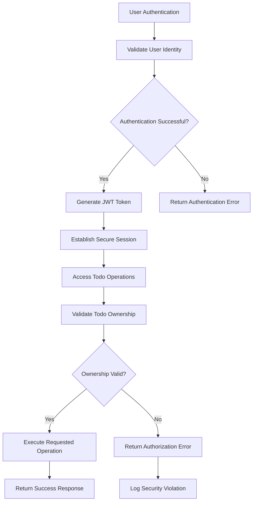
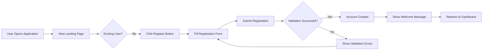
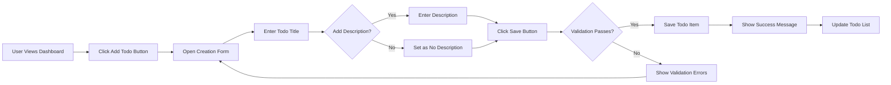
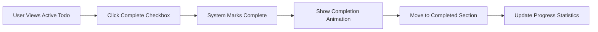

# Todo List Application - Requirements Analysis Report

## Executive Summary

This document provides a comprehensive requirements analysis for a minimal viable Todo list application. The application focuses exclusively on core functionality that enables users to effectively manage personal tasks while maintaining simplicity and reliability.

### Business Value Proposition
The Todo list application solves the fundamental problem of task organization and tracking for individual users. By focusing on minimal functionality, the service provides immediate value while ensuring rapid development and ease of use.

### Scope Definition
- **IN SCOPE**: Basic CRUD operations, status tracking, user authentication, data isolation
- **OUT OF SCOPE**: Advanced features like categories, tags, due dates, reminders, sharing
- **FOCUS**: Essential features that deliver core value without complexity

## Core Functional Requirements

### Todo Item Management

#### Creation Requirements
**WHEN** a user creates a new todo item, **THE** system **SHALL**:
- Accept a title for the todo item (required field, 1-255 characters)
- Accept an optional description for additional details (maximum 1000 characters)
- Set the initial status to "pending" by default
- Assign a unique identifier to the todo item
- Record the creation timestamp
- Associate the todo item exclusively with the authenticated user

**Business Rule**: Todo creation **SHALL** require only the title field, with all other fields optional.

#### Retrieval Requirements
**THE** system **SHALL** provide users with the ability to:
- View all their todo items in a comprehensive list
- Filter todo items by status (pending/completed)
- Sort todo items by creation date (newest first by default)
- Access individual todo item details with full information
- Search todo items by title and description content

**Performance Requirement**: Todo list loading **SHALL** complete within 2 seconds for lists containing up to 1,000 items.

#### Update Requirements
**WHEN** a user updates a todo item, **THE** system **SHALL** support modification of:
- Todo title (with same validation rules as creation)
- Todo description (optional field with character limits)
- Todo status (toggle between pending and completed states)

**Business Rule**: Users **SHALL** only be able to modify their own todo items, with strict ownership validation.

#### Deletion Requirements
**WHEN** a user deletes a todo item, **THE** system **SHALL**:
- Permanently remove the todo item from the system
- Provide clear confirmation of successful deletion
- Handle deletion requests securely and atomically
- Ensure data integrity throughout the deletion process

**Business Rule**: Deletion operations **SHALL** be irreversible without administrative intervention.

### Status Tracking System

#### Status Management
**THE** system **SHALL** support two primary todo statuses:
- **Pending**: Todo items that require action or completion
- **Completed**: Todo items that have been finished

**WHEN** a user marks a todo as completed, **THE** system **SHALL**:
- Update the status from "pending" to "completed" immediately
- Record the precise completion timestamp
- Maintain the completed state until explicitly changed by the user
- Provide visual feedback confirming the status change

**WHEN** a user marks a completed todo as pending, **THE** system **SHALL**:
- Update the status from "completed" to "pending"
- Clear the completion timestamp
- Return the todo to the active list for user action
- Update progress statistics accordingly

#### Status Transition Rules
**Business Rule**: Status transitions **SHALL** only occur between "pending" and "completed" states.
**Business Rule**: Completed todos **SHALL** remain visible to users unless explicitly deleted.
**Business Rule**: Status changes **SHALL** be recorded with accurate timestamps for tracking.

### User Authentication and Authorization

#### Authentication Requirements
**THE** system **SHALL** implement secure user authentication with:
- User registration with email verification
- Secure login with credential validation
- JWT token-based session management
- Automatic token refresh mechanisms
- Secure password reset functionality

**Performance Requirement**: Authentication requests **SHALL** complete within 500 milliseconds.

#### Authorization Rules
**Business Rule**: Users **SHALL** only access their own todo items with complete data isolation.
**Business Rule**: Ownership validation **SHALL** occur on every todo operation request.
**Business Rule**: Cross-user data access **SHALL** be strictly prohibited.

## Business Rules and Constraints

### Data Validation Rules

#### Title Validation
- **WHEN** creating a new todo item, **THE** system **SHALL** validate that the title is present and not empty
- **THE** todo title **SHALL** have a minimum length of 1 character and maximum length of 255 characters
- **WHEN** a todo title exceeds 255 characters, **THE** system **SHALL** truncate it to 255 characters and proceed with creation
- **THE** system **SHALL** strip leading and trailing whitespace from todo titles before validation

#### Description Validation
- **THE** todo description **SHALL** be optional and accept null values
- **WHEN** a description is provided, **THE** system **SHALL** limit it to 1000 characters maximum
- **THE** system **SHALL** automatically trim whitespace from description inputs

#### Status Validation
- **THE** todo status **SHALL** be one of the predefined values: "pending", "completed"
- **WHEN** creating a new todo, **THE** system **SHALL** default the status to "pending"
- **THE** system **SHALL** not allow manual setting of status to null or undefined

### Operational Limits

#### System Capacity
- **THE** system **SHALL** support a minimum of 1000 concurrent authenticated users
- **EACH** user **SHALL** be able to create up to 10,000 active todo items
- **THE** system **SHALL** implement pagination with a default page size of 20 items

#### Performance Standards
- **WHEN** creating a new todo, **THE** system **SHALL** respond within 500 milliseconds
- **WHEN** retrieving a single todo, **THE** system **SHALL** respond within 200 milliseconds
- **WHEN** loading a user's todo list, **THE** system **SHALL** respond within 1000 milliseconds
- **WHEN** updating a todo, **THE** system **SHALL** respond within 300 milliseconds

### Data Integrity Requirements

#### Consistency Rules
- **WHEN** performing todo operations, **THE** system **SHALL** ensure atomicity (all-or-nothing execution)
- **THE** system **SHALL** maintain referential integrity between users and their todos
- **WHILE** updating multiple fields, **THE** system **SHALL** apply changes atomically

#### Validation Enforcement
- **THE** system **SHALL** validate data integrity before committing changes
- **WHEN** validation fails, **THE** system **SHALL** roll back the entire operation
- **THE** system **SHALL** provide clear error messages for validation failures

## User Workflows and Scenarios

### New User Registration and Onboarding

**Scenario**: A new user discovers the Todo list application and wants to create an account.

**Business Requirements**:
- **WHEN** a user submits registration information, **THE** system **SHALL** validate email format and password strength
- **IF** email is already registered, **THEN THE** system **SHALL** display appropriate error message
- **WHERE** password confirmation fails, **THE** system **SHALL** highlight the mismatch and prevent submission

### Todo Creation Workflow

**Scenario**: User wants to add a new todo item to their list.

**Business Requirements**:
- **WHEN** a user creates a todo, **THE** system **SHALL** require a non-empty title
- **THE** system **SHALL** allow optional description field with character limit of 1000
- **IF** title is empty, **THEN THE** system **SHALL** prevent submission and highlight the error

### Todo Completion Workflow

**Scenario**: User completes a todo item.

**Business Requirements**:
- **WHEN** a user marks a todo complete, **THE** system **SHALL** immediately update its status
- **THE** system **SHALL** provide visual feedback confirming the status change
- **WHERE** todos are completed, **THE** system **SHALL** move them to the completed section

## Error Handling and Recovery

### Common Error Scenarios

**Authentication Errors**
- **IF** authentication fails, **THEN THE** system **SHALL** display clear error message without revealing security details
- **THE** system **SHALL** offer password reset option after failed authentication attempts
- **WHEN** password reset is initiated, **THE** system **SHALL** guide user through secure recovery process

**Data Validation Errors**
- **WHEN** validation fails, **THE** system **SHALL** highlight specific fields with errors
- **THE** error messages **SHALL** be clear and actionable (e.g., "Title cannot be empty")
- **THE** system **SHALL** preserve user input during validation errors to avoid retyping

**Authorization Errors**
- **IF** a user attempts to access another user's todo, **THEN THE** system **SHALL** return access denied error
- **THE** system **SHALL** log all unauthorized access attempts for security monitoring
- **WHEN** authorization fails, **THE** system **SHALL** provide generic error message to prevent information leakage

### User Recovery Flows

**Network Connectivity Issues**
- **WHILE** offline, **THE** system **SHALL** indicate connectivity status clearly
- **IF** network error occurs during operation, **THEN THE** system **SHALL** queue actions for retry
- **THE** system **SHALL** provide option to work offline with local storage when possible

**Operation Failure Recovery**
- **WHEN** an error occurs during todo creation, **THE** system **SHALL** preserve any entered data if possible
- **THE** system **SHALL** provide clear error messages with recovery instructions
- **THE** system **SHALL** allow users to retry the operation after addressing the issue

## Performance and Scalability

### Response Time Standards
| Operation | Maximum Response Time | Performance Target |
|-----------|----------------------|-------------------|
| User Authentication | 500 ms | Immediate feedback |
| Todo List Retrieval | 2 seconds | Perceived as fast |
| Individual Todo Retrieval | 1 second | Instantaneous feel |
| Todo Creation | 3 seconds | Acceptable for user action |
| Todo Update | 2 seconds | Responsive interaction |
| Todo Deletion | 2 seconds | Confirmation within reasonable time |

### Availability Requirements
- **THE** system **SHALL** maintain 99.5% uptime during business hours (8 AM - 10 PM local time)
- **THE** system **SHALL** provide graceful degradation during maintenance periods
- **THE** system **SHALL** communicate service interruptions clearly to users

### Scalability Considerations
- **WHERE** user growth occurs, **THE** system **SHALL** scale horizontally to accommodate increased load
- **THE** system **SHALL** maintain performance standards under normal usage patterns
- **THE** system **SHALL** provide adequate resources for peak usage periods

## Security and Compliance

### Data Protection
- **THE** system **SHALL** encrypt passwords using industry-standard hashing algorithms
- **THE** system **SHALL** never store passwords in plain text
- **THE** system **SHALL** implement proper salt techniques for password storage

### Transmission Security
- **THE** system **SHALL** use HTTPS for all communications
- **THE** system **SHALL** implement CSRF protection for state-changing operations
- **THE** system **SHALL** validate JWT signatures on every authenticated request

### Compliance Requirements
- **THE** system **SHALL** follow OWASP authentication security guidelines
- **THE** system **SHALL** implement RFC-compliant JWT token handling
- **THE** system **SHALL** adhere to privacy regulations for user data protection

## Implementation Guidelines

### Development Priorities
1. **Core Authentication**: Implement secure user registration and login
2. **Basic CRUD Operations**: Create, read, update, delete functionality for todos
3. **Status Management**: Pending/completed status tracking system
4. **Data Isolation**: Ensure complete user data separation
5. **Error Handling**: Comprehensive error management and user feedback

### Testing Requirements
Each business rule should have corresponding test cases that verify:
- Rule compliance under normal conditions
- Proper error handling when rules are violated
- Edge cases and boundary conditions
- Performance under load conditions

### Monitoring and Metrics
The system should track key metrics related to:
- User registration and authentication success rates
- Todo operation performance and response times
- System availability and error rates
- Data integrity and validation compliance

## Conclusion

This requirements analysis report provides a complete specification for a minimal viable Todo list application. The document defines all necessary business requirements, user workflows, performance expectations, and security considerations for successful implementation.

By focusing exclusively on core functionality, the application delivers fundamental value to users while maintaining simplicity and reliability. The requirements are specified in natural language using EARS format where applicable, providing backend developers with clear, actionable specifications for implementation.

All technical implementation decisions (architecture, APIs, database design, etc.) remain at the discretion of the development team, with this document serving as the authoritative business requirements specification.