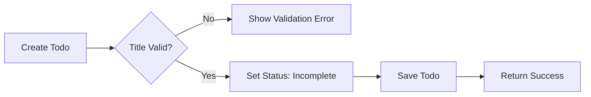
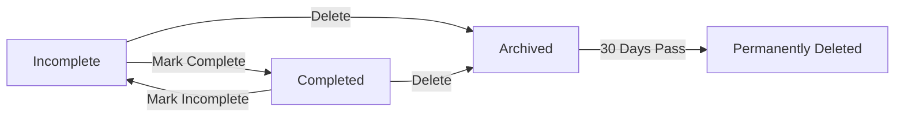

# Business Rules and Validation Requirements

## Introduction
This document defines the complete set of business rules, validation requirements, and operational constraints that govern the Todo application. These rules ensure consistent behavior and data integrity throughout the system lifecycle.

## Core Data Validation Rules

### Todo Title Validation
- **WHEN** creating a new todo, **THE** system **SHALL** validate that the title is not empty
- **WHEN** updating a todo title, **THE** system **SHALL** validate that the title contains between 1 and 255 characters
- **THE** todo title **SHALL** accept Unicode characters including spaces, punctuation, and special characters
- **THE** system **SHALL** trim leading and trailing whitespace from todo titles
- **IF** a todo title exceeds 255 characters, **THEN THE** system **SHALL** reject the creation with an appropriate error message

### Todo Description Validation (Optional)
- **WHERE** a description is provided, **THE** system **SHALL** accept descriptions up to 2000 characters
- **THE** todo description **SHALL** be optional and can be null
- **WHEN** a description is provided, **THE** system **SHALL** validate it contains valid Unicode characters

### Completion Status Rules
- **WHEN** creating a new todo, **THE** system **SHALL** automatically set the completion status to "incomplete"
- **WHEN** marking a todo as complete, **THE** system **SHALL** record the completion timestamp
- **WHEN** marking a completed todo as incomplete, **THE** system **SHALL** clear the completion timestamp

## Business Logic Constraints

### Todo Ownership Rules
- **THE** system **SHALL** ensure that users can only access, modify, or delete their own todos
- **WHEN** a user requests todo operations, **THE** system **SHALL** validate todo ownership before processing
- **IF** a user attempts to access another user's todo, **THEN THE** system **SHALL** return an access denied error

### Todo Lifecycle Management
- **WHEN** a todo is created, **THE** system **SHALL** assign a unique identifier and creation timestamp
- **WHEN** a todo is updated, **THE** system **SHALL** update the modification timestamp
- **WHEN** a todo is deleted, **THE** system **SHALL** perform a soft delete by marking it as archived
- **THE** system **SHALL** permanently delete archived todos after 30 days of archival

### Completion Workflow Constraints
- **THE** system **SHALL** allow users to toggle completion status for any todo
- **WHEN** marking a todo complete, **THE** system **SHALL** not require any additional validation
- **THE** system **SHALL** display completed todos separately from active todos
- **THE** system **SHALL** maintain the original completion order of todos

## State Management Rules

### Todo Status States
- **THE** system **SHALL** support two primary states: "incomplete" and "completed"
- **THE** system **SHALL** support an additional "archived" state for deleted todos
- **WHEN** a todo is created, **THE** system **SHALL** automatically set the state to "incomplete"

### State Transition Rules

### Valid State Transitions
- **THE** system **SHALL** allow transition from "incomplete" to "completed"
- **THE** system **SHALL** allow transition from "completed" to "incomplete"
- **THE** system **SHALL** allow transition from any state to "archived" (deletion)
- **THE** system **SHALL** automatically transition from "archived" to permanent deletion after 30 days

## Workflow Restrictions

### Creation Restrictions
- **THE** system **SHALL** impose a limit of 1000 active todos per user
- **WHEN** a user reaches the 1000 todo limit, **THE** system **SHALL** prevent creation of new todos
- **THE** system **SHALL** display a clear message when the todo limit is reached

### Modification Restrictions
- **THE** system **SHALL** allow users to modify their own todos at any time
- **THE** system **SHALL** preserve the original creation timestamp when modifying a todo
- **WHEN** modifying a todo, **THE** system **SHALL** update the modification timestamp

### Deletion Workflow
- **WHEN** deleting a todo, **THE** system **SHALL** move it to the archived state
- **THE** system **SHALL** provide users with the ability to view archived todos
- **THE** system **SHALL** allow users to restore archived todos within 30 days
- **THE** system **SHALL** permanently delete todos that have been archived for more than 30 days

## Permission-Based Business Rules

### User Permission Matrix
| Action | User Permission |
|--------|-----------------|
| Create Todo | ✅ Full access to create todos in their own account |
| Read Todos | ✅ Full access to read their own todos |
| Update Todos | ✅ Full access to update their own todos |
| Delete Todos | ✅ Full access to delete their own todos |
| View Archived | ✅ Access to view their own archived todos |
| Restore Archived | ✅ Ability to restore their own archived todos |

### Authentication Requirements
- **WHEN** performing any todo operation, **THE** system **SHALL** require valid user authentication
- **THE** system **SHALL** validate user session for every API request
- **IF** authentication fails, **THEN THE** system **SHALL** return an authentication error

## Exception Handling Policies

### Input Validation Exceptions
- **IF** a todo title is empty, **THEN THE** system **SHALL** return error code "VALIDATION_TITLE_EMPTY"
- **IF** a todo title exceeds 255 characters, **THEN THE** system **SHALL** return error code "VALIDATION_TITLE_TOO_LONG"
- **IF** a description exceeds 2000 characters, **THEN THE** system **SHALL** return error code "VALIDATION_DESCRIPTION_TOO_LONG"

### Authorization Exceptions
- **IF** a user attempts to access another user's todo, **THEN THE** system **SHALL** return error code "AUTHORIZATION_ACCESS_DENIED"
- **IF** authentication credentials are invalid, **THEN THE** system **SHALL** return error code "AUTHENTICATION_INVALID_CREDENTIALS"
- **IF** user session has expired, **THEN THE** system **SHALL** return error code "AUTHENTICATION_SESSION_EXPIRED"

### Business Rule Exceptions
- **IF** a user attempts to create a todo when they have reached the 1000 todo limit, **THEN THE** system **SHALL** return error code "BUSINESS_TODO_LIMIT_REACHED"
- **IF** a user attempts to restore an archived todo after 30 days, **THEN THE** system **SHALL** return error code "BUSINESS_ARCHIVE_EXPIRED"

## Error Scenario Definitions

### Validation Error Scenarios
- **Scenario**: User attempts to create a todo with empty title
  - **Expected Behavior**: System rejects creation with clear error message
  - **Recovery Action**: User must provide a valid title
  - **Error Code**: VALIDATION_TITLE_EMPTY

- **Scenario**: User attempts to create a 256-character title
  - **Expected Behavior**: System rejects creation with character limit message
  - **Recovery Action**: User must shorten the title to 255 characters or less
  - **Error Code**: VALIDATION_TITLE_TOO_LONG

### Authorization Error Scenarios
- **Scenario**: User attempts to access todo belonging to another user
  - **Expected Behavior**: System returns access denied error
  - **Recovery Action**: User can only access their own todos
  - **Error Code**: AUTHORIZATION_ACCESS_DENIED

### Business Rule Error Scenarios
- **Scenario**: User has 1000 active todos and attempts to create another
  - **Expected Behavior**: System prevents creation and informs user of limit
  - **Recovery Action**: User must delete or archive existing todos
  - **Error Code**: BUSINESS_TODO_LIMIT_REACHED

## Recovery and Graceful Degradation

### Soft Delete Recovery
- **WHEN** a user accidentally deletes a todo, **THE** system **SHALL** provide a 30-day recovery window
- **THE** system **SHALL** maintain archived todos in a separate view
- **WHEN** restoring an archived todo, **THE** system **SHALL** preserve all original data

### Error Message Standards
- **THE** system **SHALL** provide user-friendly error messages for all business rule violations
- **THE** system **SHALL** include actionable guidance in error messages
- **THE** system **SHALL** maintain consistent error code patterns

### Data Integrity Rules
- **THE** system **SHALL** ensure that todos cannot be duplicated with identical content
- **THE** system **SHALL** maintain referential integrity for all todo relationships
- **THE** system **SHALL** prevent data corruption through proper transaction handling

> *Developer Note: This document defines **business requirements only**. All technical implementations (architecture, APIs, database design, etc.) are at the discretion of the development team.*