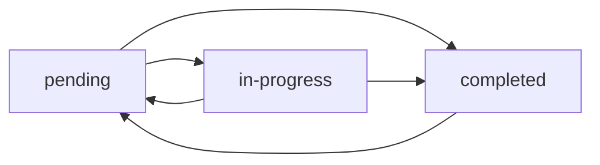
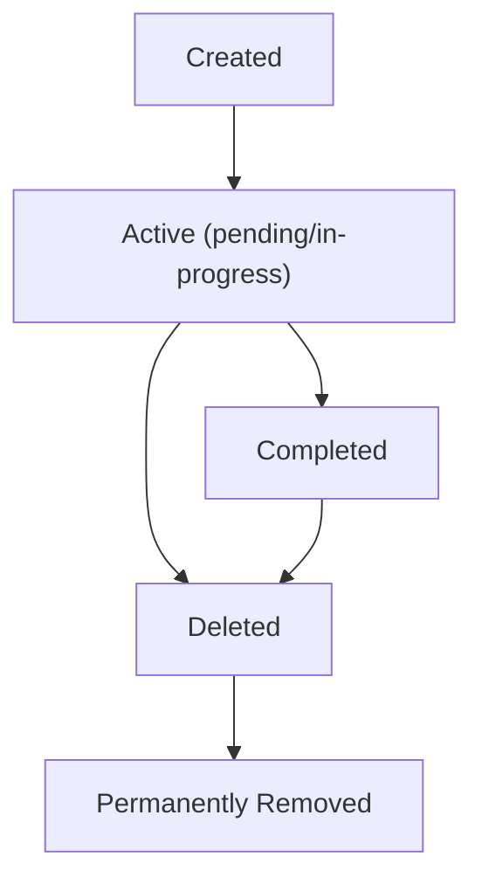

# Business Rules Specification for Todo Application

## Document Overview

This document defines the core business rules, validation logic, and data integrity constraints for the Todo application. These rules govern how the system should behave at the business logic level, ensuring consistent and predictable application behavior.

## 1. Todo Validation Rules

### 1.1 Todo Title Validation

**WHEN creating a new todo item, THE system SHALL validate the title according to the following rules:**

- **Minimum Length**: THE todo title SHALL contain at least 1 character
- **Maximum Length**: THE todo title SHALL not exceed 255 characters
- **Content Restrictions**: THE todo title SHALL not contain only whitespace characters
- **Uniqueness Constraint**: WHERE a user creates multiple todos, THE system SHALL allow duplicate titles within the same user's todo list

**WHEN updating an existing todo item, THE system SHALL apply the same validation rules as creation.**

### 1.2 Todo Description Validation

**WHERE a todo item includes a description, THE system SHALL validate the description according to the following rules:**

- **Optional Field**: THE description field SHALL be optional
- **Maximum Length**: THE description SHALL not exceed 1000 characters
- **Content Format**: THE description SHALL accept any UTF-8 characters

### 1.3 Todo Status Management

**THE system SHALL support the following todo status values:**
- "pending" - Todo item has been created but not started
- "in-progress" - Todo item is currently being worked on
- "completed" - Todo item has been finished

**WHEN creating a new todo item, THE system SHALL automatically set the status to "pending".**

**WHEN updating a todo status, THE system SHALL enforce the following transition rules:**

**Status Transition Rules:**
- **FROM "pending"**: THE user SHALL be able to transition to "in-progress" or "completed"
- **FROM "in-progress"**: THE user SHALL be able to transition to "completed" or back to "pending"
- **FROM "completed"**: THE user SHALL be able to transition back to "pending"

## 2. User Account Rules

### 2.1 User Registration Rules

**WHEN a new user registers, THE system SHALL enforce the following rules:**

- **Email Validation**: THE email address SHALL be in valid email format
- **Email Uniqueness**: THE email address SHALL be unique across all registered users
- **Password Requirements**: THE password SHALL meet minimum security requirements:
  - Minimum 8 characters in length
  - At least one uppercase letter
  - At least one lowercase letter
  - At least one number
  - At least one special character

### 2.2 User Authentication Rules

**WHEN a user attempts to log in, THE system SHALL:**

- **Validate Credentials**: THE system SHALL verify the email and password combination
- **Account Status Check**: THE system SHALL only allow login for active accounts
- **Session Creation**: THE system SHALL create a new session upon successful authentication

**WHILE a user is authenticated, THE system SHALL maintain their session for 30 days of inactivity.**

**IF a user fails authentication 5 times within 15 minutes, THEN THE system SHALL temporarily lock the account for 30 minutes.**

### 2.3 User Data Ownership Rules

**THE system SHALL enforce strict data ownership rules:**

- **Todo Access**: Users SHALL only be able to access their own todo items
- **Data Isolation**: THE system SHALL ensure complete data isolation between users
- **No Cross-User Access**: Users SHALL not be able to view, modify, or delete other users' todo items

## 3. Data Integrity Constraints

### 3.1 Todo Data Consistency

**THE system SHALL maintain data consistency through the following constraints:**

- **Required Fields**: Every todo item SHALL have:
  - A unique identifier
  - A title
  - A status
  - A creation timestamp
  - An owner (user ID)

- **Optional Fields**: Todo items MAY have:
  - A description
  - A due date
  - A completion timestamp
  - A last updated timestamp

### 3.2 Data Validation Rules

**WHEN processing todo data, THE system SHALL validate:**

- **Timestamps**: All timestamp fields SHALL be in ISO 8601 format
- **Due Dates**: WHERE a due date is provided, THE system SHALL ensure it is in the future
- **Completion Logic**: THE completion timestamp SHALL only be set when status is "completed"

### 3.3 Data Deletion Rules

**WHEN a user deletes a todo item, THE system SHALL:**

- **Soft Delete**: THE system SHALL mark the item as deleted rather than removing it permanently
- **Data Retention**: Deleted items SHALL be retained for 30 days before permanent removal
- **Recovery Option**: Users SHALL be able to restore deleted items within the 30-day retention period

## 4. Business Logic Specifications

### 4.1 Todo Creation Logic

**WHEN a user creates a new todo item, THE system SHALL execute the following business logic:**

1. **Validate Input**: Check title length and content rules
2. **Set Defaults**: Assign "pending" status and current timestamp
3. **Assign Ownership**: Associate the todo with the authenticated user
4. **Generate ID**: Create a unique identifier for the todo
5. **Persist Data**: Save the todo item to the database
6. **Return Result**: Provide confirmation of successful creation

### 4.2 Todo Update Logic

**WHEN a user updates a todo item, THE system SHALL:**

1. **Verify Ownership**: Confirm the user owns the todo item
2. **Validate Changes**: Apply validation rules to updated fields
3. **Update Timestamp**: Set the last updated timestamp
4. **Handle Status Changes**: If status changes to "completed", set completion timestamp
5. **Persist Changes**: Save updated todo item
6. **Return Updated Item**: Provide the updated todo data

### 4.3 Todo Deletion Logic

**WHEN a user deletes a todo item, THE system SHALL:**

1. **Verify Ownership**: Confirm the user owns the todo item
2. **Soft Delete**: Mark the item as deleted with deletion timestamp
3. **Maintain Data**: Keep the item in the database with deleted flag
4. **Update User Interface**: Remove the item from active todo lists
5. **Provide Confirmation**: Notify user of successful deletion

## 5. Error Handling Rules

### 5.1 Validation Error Scenarios

**IF a user attempts to create a todo with an invalid title, THEN THE system SHALL:**

- Return HTTP 400 Bad Request status
- Provide specific error message indicating the validation failure
- Include details about which rule was violated

**IF a user attempts to update a todo they don't own, THEN THE system SHALL:**

- Return HTTP 403 Forbidden status
- Provide generic error message to avoid information disclosure
- Log the unauthorized access attempt

### 5.2 Business Logic Error Scenarios

**IF a user attempts an invalid status transition, THEN THE system SHALL:**

- Return HTTP 422 Unprocessable Entity status
- Provide clear error message explaining valid transitions
- Suggest appropriate alternative actions

**IF the system encounters data inconsistency, THEN THE system SHALL:**

- Return HTTP 500 Internal Server Error status
- Log detailed error information for debugging
- Provide user-friendly error message

## 6. Data Lifecycle Management

### 6.1 Todo Lifecycle Rules

**THE system SHALL manage todo items through the following lifecycle:**

**Lifecycle Rules:**
- **Creation**: Todos are created with "pending" status
- **Active Phase**: Todos remain active while in "pending" or "in-progress" status
- **Completion**: Todos move to "completed" status when finished
- **Deletion**: Todos are soft-deleted when user chooses to remove them
- **Permanent Removal**: Soft-deleted todos are permanently removed after 30 days

### 6.2 User Account Lifecycle

**THE system SHALL manage user accounts through the following lifecycle:**

- **Registration**: Account created with email verification required
- **Active**: Account is fully functional after email verification
- **Inactive**: Account becomes inactive after 365 days of no login
- **Archived**: Inactive accounts are archived after additional 90 days
- **Deleted**: Archived accounts are permanently deleted after 180 days

## 7. Performance and Scalability Rules

### 7.1 Data Retrieval Limits

**WHERE a user requests their todo list, THE system SHALL:**

- Return maximum of 50 todo items per page
- Support pagination for large todo collections
- Sort todos by creation date (newest first) by default
- Allow sorting by due date, status, or title as optional parameters

### 7.2 Rate Limiting Rules

**THE system SHALL implement rate limiting to prevent abuse:**

- **Todo Creation**: Maximum 100 todos per hour per user
- **Todo Updates**: Maximum 500 updates per hour per user
- **Authentication Attempts**: Maximum 10 login attempts per minute per IP address

## 8. Compliance and Data Protection Rules

### 8.1 Data Privacy Rules

**THE system SHALL adhere to the following privacy rules:**

- **Data Minimization**: Only collect necessary user data for todo functionality
- **Purpose Limitation**: User data SHALL only be used for todo management
- **Storage Limitation**: User data SHALL be deleted according to retention policies
- **Confidentiality**: Todo data SHALL be accessible only to the owning user

### 8.2 Audit and Logging Rules

**THE system SHALL maintain audit logs for the following actions:**

- User registration and authentication
- Todo creation, updates, and deletions
- Security-related events (failed logins, permission violations)
- System errors and exceptions

**Audit logs SHALL be retained for 365 days for security monitoring and troubleshooting.**

> *Developer Note: This document defines **business requirements only**. All technical implementations (architecture, APIs, database design, etc.) are at the discretion of the development team.*