**multiUserTodo — Performance SLOs, security policies, data integrity, storage requirements**

Performance SLOs, security policies, data integrity, storage requirements

# Performance Requirements

Performance SLOs and scalability targets.

## Performance SLOs

Define response time targets, throughput limits, and scalability requirements.

### Response Time Service Level Objectives

WHEN a user performs any todo operation, THE system SHALL:
1. Respond within 200ms for 95% of requests
2. Respond within 500ms for 99% of requests
3. Respond within 1000ms for 99.9% of requests

WHEN viewing a paginated todo list, THE system SHALL:
1. Load the first page within 300ms for 95% of requests
2. Load subsequent pages within 200ms for 95% of requests

WHEN accessing edit history for a todo, THE system SHALL:
1. Load up to 50 history entries within 500ms for 95% of requests
2. Load larger history sets within 1000ms for 99% of requests

IF the system experiences high load, THE system SHALL maintain response times within acceptable degradation limits.

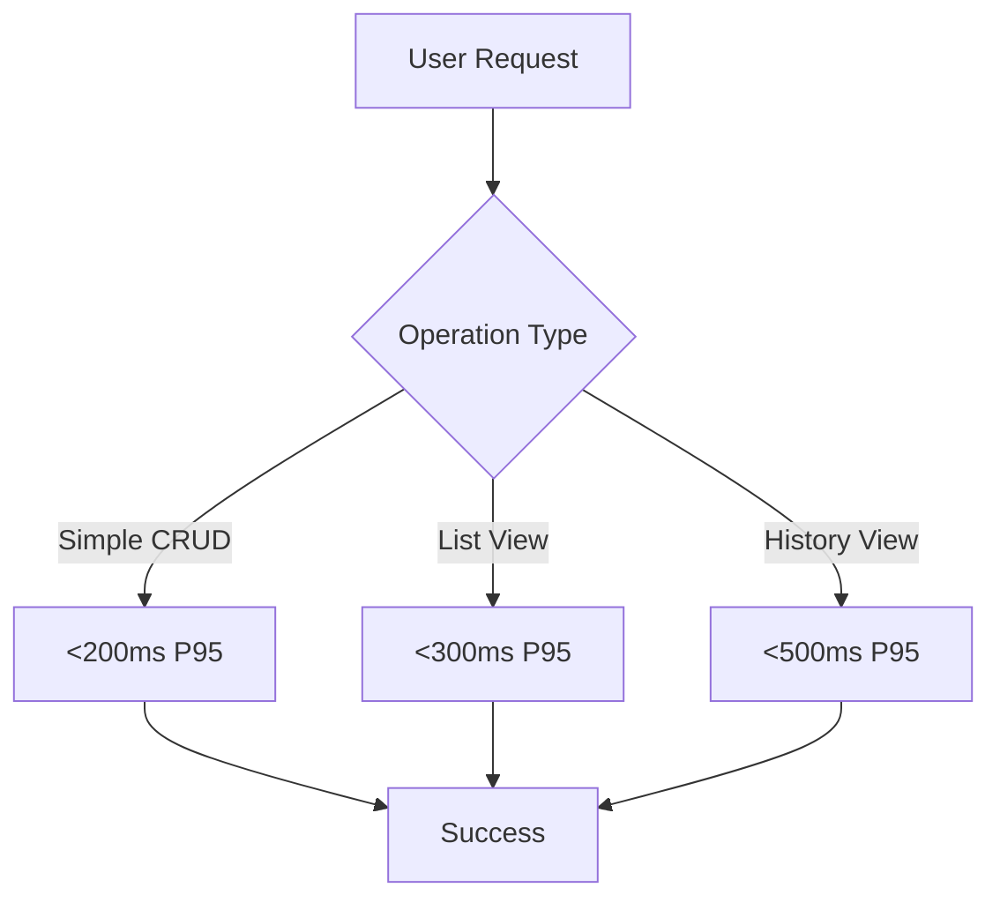

### Throughput and Concurrent User Capacity

THE system SHALL support:
1. 1000 concurrent authenticated users
2. 5000 requests per minute during peak usage
3. 100 new user registrations per minute
4. 2000 todo operations per minute

WHEN operating at maximum capacity, THE system SHALL:
1. Maintain response time SLOs for 95% of requests
2. Gracefully degrade performance rather than rejecting requests
3. Provide queueing for high-priority operations

IF throughput limits are exceeded, THE system SHALL implement rate limiting to protect system stability.

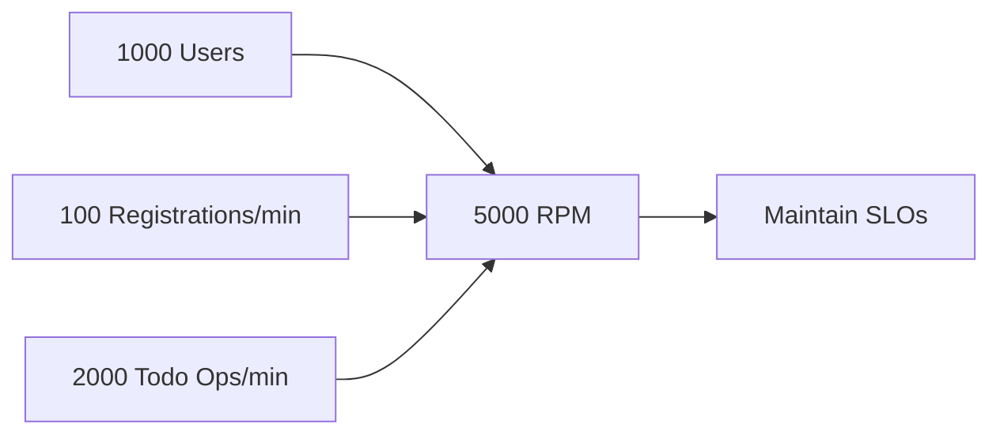

### Scalability Requirements

THE system SHALL scale horizontally to support:
1. Up to 10,000 registered users
2. Up to 100,000 todos across all users
3. Up to 500,000 edit history entries

WHEN user growth exceeds current capacity, THE system SHALL:
1. Scale without service interruption
2. Maintain data consistency across scaled instances
3. Preserve all performance SLOs

IF storage capacity approaches limits, THE system SHALL provide early warning and capacity planning guidance.

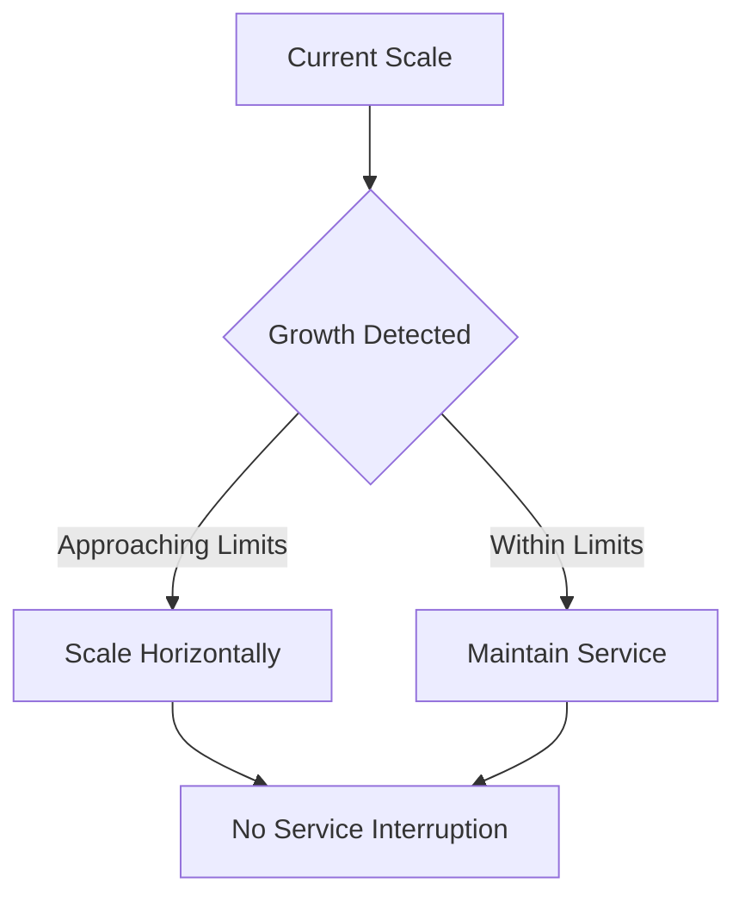

### Resource Utilization Targets

THE system SHALL maintain:
1. CPU utilization below 70% during normal operation
2. Memory utilization below 80% of allocated capacity
3. Database connection pool utilization below 75%

WHEN resource utilization approaches limits, THE system SHALL:
1. Trigger automatic scaling
2. Implement resource optimization measures
3. Provide operational alerts

IF critical resource thresholds are breached, THE system SHALL prioritize core functionality over secondary features.

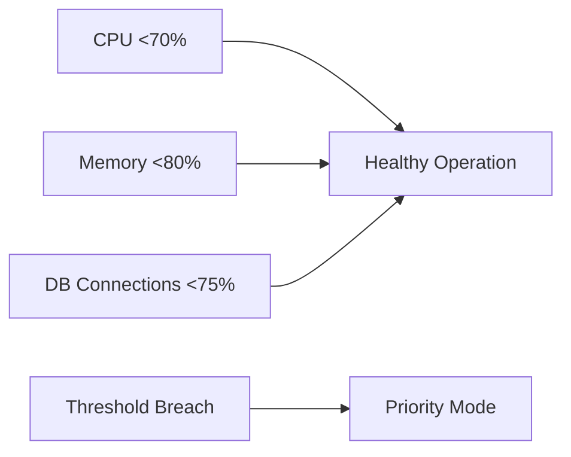

### Performance Monitoring and Reporting

THE system SHALL:
1. Continuously monitor all performance metrics
2. Generate performance reports hourly and daily
3. Alert operations team when SLOs are at risk
4. Provide historical performance trending

WHEN performance degradation is detected, THE system SHALL:
1. Identify the root cause category (database, application, network)
2. Provide detailed diagnostic information
3. Suggest remediation actions

IF SLO violations occur, THE system SHALL track them against error budget consumption.

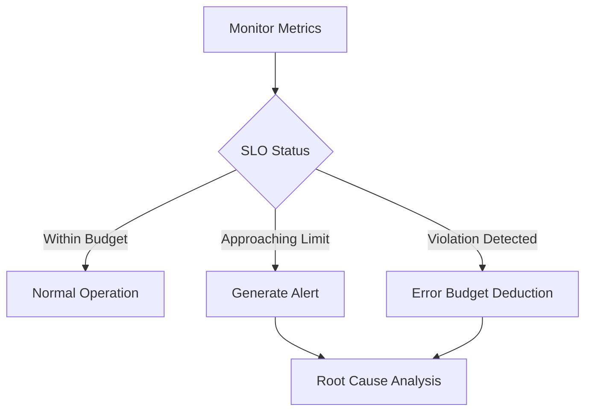

## Rate Limiting and Throttling

Define rate limiting policies and abuse prevention requirements.

### API Rate Limiting Policies

WHEN a user makes API requests, THE system SHALL enforce rate limiting to prevent service abuse.

### Authentication Endpoints
WHEN a user attempts to authenticate, THE system SHALL:
- Limit login attempts to 5 per minute per IP address
- Limit password reset requests to 3 per hour per email address
- Limit account creation attempts to 2 per hour per IP address

### Todo Operations
WHEN a user performs todo operations, THE system SHALL:
- Limit todo creation to 100 per minute per user
- Limit todo updates to 200 per minute per user
- Limit todo deletions to 50 per minute per user
- Limit bulk operations to 10 per minute per user

### Edit History Access
WHEN a user accesses edit history, THE system SHALL:
- Limit history retrieval to 50 requests per minute per user
- Limit pagination requests to 100 per minute per user

IF a user exceeds rate limits, THE system SHALL return a rate limit exceeded error.
WHILE rate limited, THE system SHALL block further requests until the time window resets.

### Request Throttling Mechanisms

WHEN the system detects unusual request patterns, THE system SHALL apply throttling to protect service availability.

### Adaptive Throttling
WHEN a user's request rate exceeds normal usage patterns, THE system SHALL:
- Gradually increase response times for high-frequency requests
- Prioritize read operations over write operations during high load
- Implement exponential backoff for repeated failed requests

### Resource-Based Throttling
WHEN system resources approach capacity limits, THE system SHALL:
- Throttle non-essential operations first
- Maintain core functionality (authentication, basic todo operations)
- Reduce pagination limits during high load
- Temporarily disable complex filtering and sorting operations

### Concurrent Request Management
WHEN multiple requests arrive simultaneously from the same user, THE system SHALL:
- Queue requests to prevent resource contention
- Limit concurrent operations to 10 per user
- Reject requests that would exceed concurrent limits

IF throttling is applied, THE system SHALL provide clear feedback about the temporary restrictions.

### Abuse Prevention Measures

WHEN the system detects potential abusive behavior, THE system SHALL implement prevention measures.

### Account Protection
WHEN multiple failed login attempts occur, THE system SHALL:
- Temporarily lock the account after 10 consecutive failures
- Require email verification for account unlock
- Monitor for credential stuffing attacks
- Detect and block automated registration attempts

### Data Manipulation Protection
WHEN unusual data modification patterns are detected, THE system SHALL:
- Flag rapid todo creation/deletion cycles
- Monitor for mass edit operations
- Detect and prevent data corruption attempts
- Implement transaction limits for bulk operations

### Privacy Enforcement
WHEN attempts to access other users' data are detected, THE system SHALL:
- Immediately block the request
- Log the security violation
- Notify system administrators of potential breaches
- Implement progressive penalties for repeated violations

IF abuse is confirmed, THE system SHALL escalate to permanent account suspension.

### Cooldown Period Enforcement

WHEN users trigger security measures, THE system SHALL enforce cooldown periods before allowing resumed activity.

### Failed Authentication Cooldown
WHEN a user exceeds login attempt limits, THE system SHALL:
- Implement a 15-minute cooldown after 5 failed attempts
- Extend cooldown to 1 hour after 10 failed attempts
- Require password reset after 15 failed attempts
- Clear cooldown counters upon successful authentication

### Rate Limit Cooldown
WHEN a user hits rate limits, THE system SHALL:
- Enforce a 1-minute cooldown for minor violations
- Extend cooldown to 5 minutes for repeated violations
- Implement 1-hour cooldown for persistent abuse
- Reset cooldown periods after compliant behavior

### Account Recovery Cooldown
WHEN an account is temporarily locked, THE system SHALL:
- Require a 24-hour waiting period before unlock attempts
- Limit unlock attempts to 3 per day
- Implement progressive waiting periods for repeated locks
- Clear cooldown upon successful administrator review

WHILE in cooldown, THE system SHALL prevent the specific restricted activity but allow other normal operations.

# Security Requirements

Security policies, encryption, and compliance requirements.

## Security Policies

Define security policies including encryption, input validation, and compliance.

### Security Requirements

### Authentication Security

WHEN a user attempts to authenticate, THE system SHALL:
1. Require both email and password for login
2. Implement secure session management with expiration
3. Invalidate sessions after password changes
4. Limit failed login attempts to prevent brute force attacks

WHEN a user logs out, THE system SHALL immediately invalidate the session.
IF a user session expires due to inactivity, THE system SHALL require re-authentication.

### Data Protection

THE system SHALL ensure that user data is accessible only to the authenticated user who owns it.
WHEN processing any user request, THE system SHALL verify that the user has permission to access the requested todo data.

### Account Security

WHEN a user changes their password, THE system SHALL:
1. Require verification of the current password
2. Enforce password complexity requirements
3. Invalidate all existing sessions for that user

IF a user deletes their account, THE system SHALL permanently remove all associated data including todos and edit history.

### Encryption Requirements

### Password Encryption

WHEN storing user passwords, THE system SHALL:
1. Use industry-standard cryptographic hashing algorithms
2. Apply appropriate salt and iteration counts
3. Never store passwords in plain text
4. Ensure passwords are encrypted during transmission

### Data Transmission Security

WHEN transmitting sensitive data between client and server, THE system SHALL use encrypted channels.
THE system SHALL protect authentication tokens and session identifiers during transmission.

### Data-at-Rest Protection

WHEN storing user data including todos and edit history, THE system SHALL implement appropriate encryption measures based on sensitivity.

### Compliance Requirements

### Data Privacy Compliance

THE system SHALL comply with relevant data protection regulations regarding user data handling.
WHEN processing personal data, THE system SHALL implement privacy-by-design principles.

### Data Retention Compliance

WHEN a user deletes their account, THE system SHALL permanently remove all associated data within specified timeframes.
THE system SHALL maintain audit trails for security incidents as required by compliance standards.

### Security Standards Compliance

THE system SHALL adhere to industry security standards for authentication, encryption, and data protection.

### Input Validation Requirements

### Email Validation

WHEN a user provides an email address during registration or login, THE system SHALL:
1. Validate email format correctness
2. Reject invalid email formats
3. Normalize email addresses to prevent duplicate accounts

### Password Validation

WHEN a user sets or changes a password, THE system SHALL:
1. Enforce minimum password length requirements
2. Validate password complexity rules
3. Reject commonly used or compromised passwords

### Todo Field Validation

WHEN creating or editing a todo, THE system SHALL:
1. Validate title length and character restrictions
2. Validate description length limits
3. Validate date formats for start and due dates
4. Reject malformed or invalid date values

### Pagination and Filter Validation

WHEN processing pagination requests, THE system SHALL:
1. Validate page number and size parameters
2. Enforce reasonable limits on page sizes
3. Validate filter and sort parameter formats

### OWASP Security Requirements

### Injection Prevention

THE system SHALL implement measures to prevent SQL injection and other code injection attacks.
WHEN processing user input, THE system SHALL use parameterized queries and input sanitization.

### Cross-Site Scripting (XSS) Protection

THE system SHALL implement Content Security Policy headers to prevent XSS attacks.
WHEN displaying user-generated content, THE system SHALL properly escape and sanitize output.

### Authentication and Session Management

THE system SHALL implement secure authentication mechanisms following OWASP guidelines.
WHEN managing user sessions, THE system SHALL:
1. Use secure, random session identifiers
2. Implement proper session timeout
3. Protect against session fixation attacks

### Access Control

THE system SHALL enforce proper access control checks on all user data access requests.
WHEN a user requests todo data, THE system SHALL verify ownership before granting access.

### Security Misconfiguration Prevention

THE system SHALL implement secure default configurations and avoid exposing sensitive information in error messages.

## Availability and Reliability

Define availability targets, reliability expectations, and failover policies.

### Service Availability Targets

THE system SHALL maintain availability targets for all user-facing services.

WHEN measuring service availability over a calendar month, THE system SHALL:
1. Achieve 99.9% uptime for authentication services (user signup, login, password changes)
2. Achieve 99.95% uptime for todo management services (create, view, edit, delete operations)
3. Achieve 99.9% uptime for profile management services

IF service availability falls below targets for two consecutive months, THE system SHALL trigger operational review procedures.

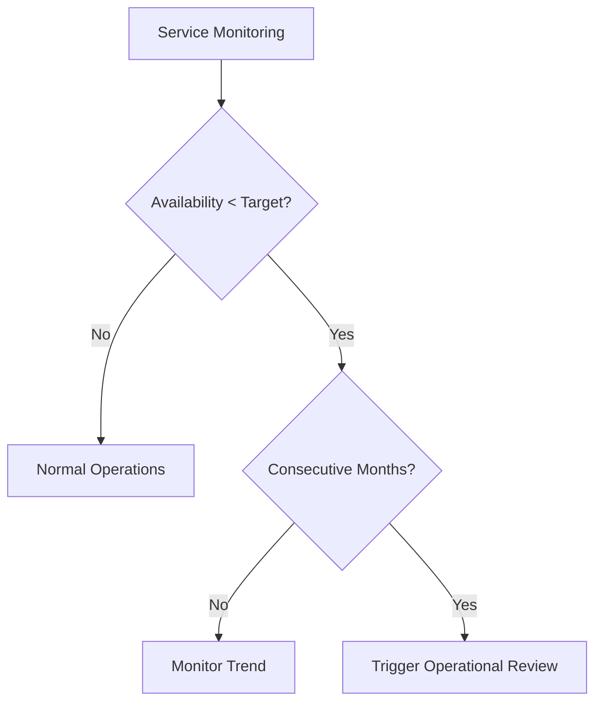

### Uptime Monitoring and Reporting

THE system SHALL continuously monitor service uptime and generate availability reports.

WHEN monitoring service health, THE system SHALL:
1. Track uptime for each major service component separately
2. Calculate availability percentages on a rolling 30-day basis
3. Generate weekly availability reports for operational teams
4. Provide real-time uptime dashboards for system administrators

IF uptime drops below 95% for any service component, THE system SHALL trigger immediate alerting.

WHILE service is operational, THE system SHALL maintain uptime metrics with at least 1-minute granularity.

### Error Budget Management

THE system SHALL implement error budget policies to balance reliability with feature development.

WHEN calculating error budgets, THE system SHALL:
1. Allocate monthly error budgets based on availability targets
2. Track error budget consumption across all services
3. Freeze feature deployments when error budget is exhausted
4. Reset error budgets at the start of each calendar month

IF error budget consumption exceeds 50% in the first half of the month, THE system SHALL trigger reliability-focused development cycles.

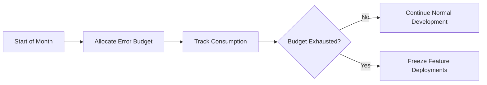

### Core Operation Reliability

THE system SHALL maintain high reliability for essential user operations.

WHEN users perform critical operations, THE system SHALL:
1. Achieve 99.99% success rate for todo creation operations
2. Achieve 99.99% success rate for todo viewing operations
3. Achieve 99.95% success rate for authentication operations
4. Achieve 99.9% success rate for batch operations (pagination, filtering)

IF operation failure rates exceed established thresholds, THE system SHALL implement reliability improvements.

WHILE processing user requests, THE system SHALL maintain data consistency guarantees even during partial failures.

### Service Level Objectives

THE system SHALL define and monitor Service Level Objectives (SLOs) for key user workflows.

WHEN measuring user experience, THE system SHALL:
1. Maintain 99.9% SLO for end-to-end todo creation workflow
2. Maintain 99.9% SLO for end-to-end todo viewing workflow
3. Maintain 99.8% SLO for authentication workflow
4. Monitor SLO compliance through synthetic user transactions

IF SLO compliance drops below target for any workflow, THE system SHALL prioritize reliability enhancements.

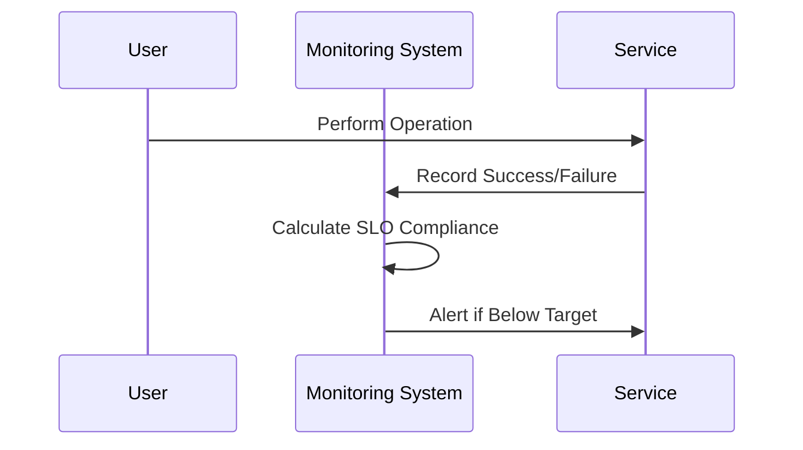

### Failure Recovery and Redundancy

THE system SHALL implement redundancy and recovery mechanisms to maintain availability.

WHEN component failures occur, THE system SHALL:
1. Automatically failover to redundant components within 5 minutes
2. Maintain data consistency during failover operations
3. Provide read-only access during recovery procedures
4. Complete full service restoration within 30 minutes for planned maintenance

IF catastrophic failure occurs, THE system SHALL restore service from backups within 4 hours.

WHILE in recovery mode, THE system SHALL prevent data loss and maintain transactional integrity.

### Capacity Planning and Scalability

THE system SHALL ensure sufficient capacity to handle expected load while maintaining reliability.

WHEN planning for capacity, THE system SHALL:
1. Maintain 50% headroom above peak expected load
2. Scale horizontally to handle 3x current user base without degradation
3. Monitor resource utilization and trigger scaling before reaching 80% capacity
4. Conduct quarterly load testing to validate capacity assumptions

IF resource utilization consistently exceeds 70%, THE system SHALL trigger capacity expansion procedures.

WHILE operating at scale, THE system SHALL maintain consistent performance and availability targets.

# Data Integrity and Storage

Data integrity constraints and storage requirements.

## Data Integrity and Storage

Define backup policies, data retention, and storage tier requirements.

### Data Integrity Constraints

### Data Integrity Constraints

THE system SHALL maintain referential integrity between todos and their owners.

WHEN a user account is deleted, THE system SHALL permanently delete all associated todos and edit history records.

THE system SHALL ensure that every todo has exactly one owner.

THE system SHALL ensure that every edit history entry is associated with exactly one todo.

THE system SHALL prevent creation of todos without a valid user account.

THE system SHALL validate that start dates precede due dates when both are provided.

THE system SHALL maintain consistency between todo completion status and edit history timestamps.

IF a todo is permanently deleted from trash, THE system SHALL remove all associated edit history entries.

THE system SHALL ensure that edit history entries maintain chronological order from most recent to oldest.

THE system SHALL prevent modification of edit history records after creation.

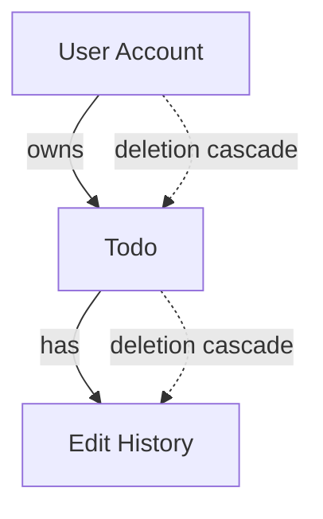

### Backup Policies

### Backup Policies

THE system SHALL perform automated daily backups of all user data.

THE system SHALL retain backup data for a minimum of 30 days.

THE system SHALL encrypt all backup data using industry-standard encryption.

WHEN a backup operation fails, THE system SHALL retry the backup within 4 hours.

THE system SHALL verify backup integrity after each backup operation.

THE system SHALL provide capability to restore user data from backups within 24 hours of request.

THE system SHALL maintain separate backup storage in a geographically distinct location.

THE system SHALL backup user accounts, todos, and edit history as a consistent unit.

IF a user requests account deletion, THE system SHALL remove their data from subsequent backups.

THE system SHALL maintain backup logs for audit purposes.

### Data Retention Policies

### Data Retention Policies

THE system SHALL retain active user accounts indefinitely while the account remains active.

THE system SHALL retain todos in trash for a maximum of 30 days before automatic permanent deletion.

THE system SHALL retain edit history for todos indefinitely while the todo exists.

THE system SHALL permanently delete all user data within 7 days of account deletion request.

THE system SHALL retain system logs for a minimum of 90 days.

THE system SHALL retain backup data for 30 days before automated deletion.

THE system SHALL provide users with capability to manually empty their trash before the 30-day retention period.

THE system SHALL notify users 7 days before automatic permanent deletion of items in trash.

THE system SHALL maintain audit trails of data retention operations.

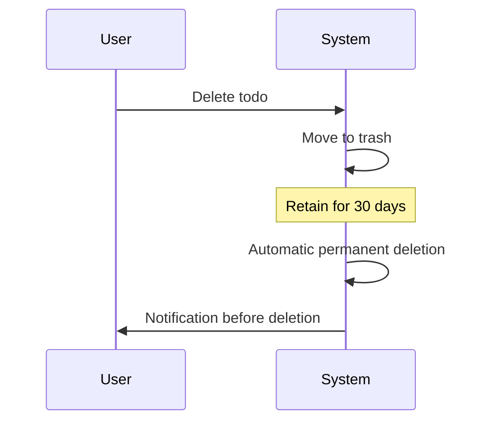

### Storage Requirements

### Storage Requirements

THE system SHALL support storage of user profile data including display name.

THE system SHALL support storage of todos with title, description, start date, due date, and completion status.

THE system SHALL support storage of edit history with timestamp and field change records.

THE system SHALL allocate storage capacity sufficient for 10,000 todos per user.

THE system SHALL support storage of todo titles up to 255 characters in length.

THE system SHALL support storage of todo descriptions up to 10,000 characters in length.

THE system SHALL support storage requirements for paginated todo lists with filtering and sorting capabilities.

THE system SHALL maintain separate storage for active todos and trash items.

THE system SHALL scale storage capacity automatically based on user growth.

THE system SHALL monitor storage usage and provide alerts when approaching capacity limits.

### Data Consistency Guarantees

### Data Consistency Guarantees

THE system SHALL ensure that todo completion status changes are immediately visible to the user.

THE system SHALL maintain consistency between todo list views and individual todo details.

THE system SHALL ensure that edit history entries are created atomically with todo modifications.

THE system SHALL guarantee that paginated todo lists display consistent results across pages.

THE system SHALL ensure that filtering and sorting operations return consistent results.

THE system SHALL maintain consistency between user account status and todo accessibility.

THE system SHALL guarantee that trash operations (restore/permanent delete) are atomic.

THE system SHALL ensure that concurrent edits to the same todo are handled with last-write-wins semantics.

THE system SHALL maintain consistency between backup data and live data.

THE system SHALL provide read-after-write consistency for all todo operations.

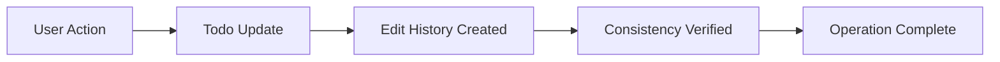

## Audit and Observability

Define audit logging, monitoring, alerting, and observability requirements.

### Audit Trail Requirements

### Audit Trail Requirements

WHEN a user performs any account-related operation, THE system SHALL create an audit trail entry recording:
1. The user identifier
2. The operation type (signup, login, password change, account deletion)
3. The timestamp of the operation
4. The IP address from which the operation originated

WHEN a user performs any todo-related operation, THE system SHALL create an audit trail entry recording:
1. The user identifier
2. The todo identifier (if applicable)
3. The operation type (create, view, edit, delete, restore, permanent delete)
4. The timestamp of the operation
5. The specific fields modified (for edit operations)

THE system SHALL retain audit trail entries for a minimum of 7 years from the date of creation.

THE system SHALL provide administrators with the ability to search and filter audit trail entries by:
1. User identifier
2. Operation type
3. Date range
4. IP address

IF an audit trail entry cannot be created due to system failure, THE system SHALL:
1. Log the failure with detailed error information
2. Prevent the operation from completing successfully
3. Return an error to the user indicating the operation could not be recorded

WHILE audit trail functionality is enabled, THE system SHALL ensure all audit entries are written to persistent storage before confirming operation success to the user.

### Application Logging Specifications

### Application Logging Specifications

THE system SHALL log all authentication attempts with:
1. Email address used
2. Timestamp
3. Success/failure status
4. IP address
5. User agent information

WHEN a user performs a sensitive operation (account deletion, permanent todo deletion), THE system SHALL log:
1. User identifier
2. Operation type
3. Timestamp
4. Resource identifiers affected
5. IP address

THE system SHALL log all system errors and exceptions with:
1. Stack trace
2. Error message
3. Timestamp
4. User identifier (if authenticated)
5. Request details

WHEN the system experiences performance degradation, THE system SHALL log:
1. Response time metrics
2. Database query performance
3. Memory usage
4. CPU utilization
5. Concurrent user count

THE system SHALL implement structured logging with consistent log levels:
- ERROR for system failures and security violations
- WARN for potential issues requiring attention
- INFO for normal operational events
- DEBUG for detailed troubleshooting information

IF log storage reaches 90% capacity, THE system SHALL:
1. Trigger an alert to administrators
2. Automatically archive older logs
3. Continue logging critical events only

### System Monitoring Capabilities

### System Monitoring Capabilities

THE system SHALL monitor and expose metrics for:
1. User authentication success/failure rates
2. API endpoint response times (p95, p99)
3. Database connection pool utilization
4. Memory usage and garbage collection statistics
5. Todo creation, completion, and deletion rates

WHEN monitoring metrics exceed predefined thresholds, THE system SHALL:
1. Record the metric deviation
2. Calculate the duration of the anomaly
3. Correlate with system load and concurrent users

THE system SHALL provide real-time dashboards showing:
1. Current active user sessions
2. Todo operations per minute
3. System health status
4. Error rate trends
5. Performance degradation indicators

WHILE the system is operational, THE system SHALL continuously monitor:
1. Application availability (uptime)
2. Database responsiveness
3. External service dependencies
4. Certificate expiration dates

IF a monitoring agent becomes unresponsive, THE system SHALL:
1. Log the agent failure
2. Attempt to restart the agent
3. Escalate to higher-level monitoring systems
4. Notify administrators of the monitoring gap

### Alerting Mechanisms

### Alerting Mechanisms

WHEN authentication failure rate exceeds 10% within a 5-minute window, THE system SHALL:
1. Trigger a security alert
2. Log the suspicious activity pattern
3. Notify administrators via configured channels
4. Optionally implement temporary rate limiting

WHEN system error rate exceeds 5% for any API endpoint, THE system SHALL:
1. Trigger a performance alert
2. Capture relevant diagnostic information
3. Notify development team
4. Escalate if unresolved after 15 minutes

WHEN storage utilization exceeds 80% capacity, THE system SHALL:
1. Trigger a capacity alert
2. Calculate time to full capacity based on growth rate
3. Notify operations team
4. Provide recommendations for capacity expansion

WHEN audit trail creation failures occur consecutively for 3 operations, THE system SHALL:
1. Trigger a data integrity alert
2. Halt non-critical operations if necessary
3. Notify database administrators
4. Escalate to highest priority if unresolved

THE system SHALL provide configurable alert thresholds for:
1. Response time degradation
2. Error rate increases
3. Resource utilization
4. Security event patterns
5. Data consistency issues

IF an alert condition persists for more than 30 minutes, THE system SHALL:
1. Escalate the alert severity
2. Notify additional team members
3. Create an incident report
4. Initiate automated recovery procedures if configured

### Observability Features

### Observability Features

THE system SHALL provide distributed tracing for todo operations that:
1. Track requests across service boundaries
2. Correlate logs and metrics with specific user actions
3. Measure latency at each processing stage
4. Identify performance bottlenecks

WHEN investigating system issues, administrators SHALL be able to:
1. Query logs by trace ID to reconstruct request flow
2. View correlated metrics for the time period of interest
3. Access audit trails for affected users
4. Analyze error patterns across similar requests

THE system SHALL expose health check endpoints that:
1. Verify database connectivity
2. Check external service availability
3. Validate authentication service status
4. Report overall system readiness

WHILE processing todo operations, THE system SHALL maintain observability by:
1. Propagating correlation IDs across asynchronous operations
2. Recording timing information for background tasks
3. Monitoring queue depths for deferred operations
4. Tracking resource consumption per user session

IF observability data becomes inconsistent or incomplete, THE system SHALL:
1. Log the data quality issue
2. Continue processing with best-effort observability
3. Trigger an alert for data integrity concerns
4. Provide fallback monitoring mechanisms

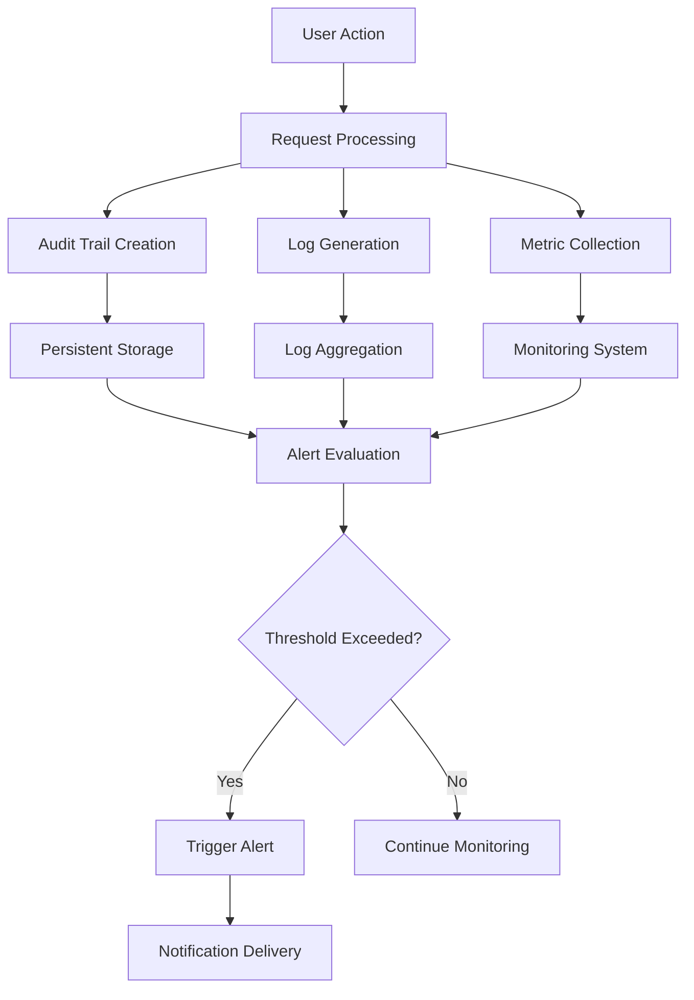

# Concurrency and Data Consistency

Concurrency control policies, race condition handling, and data consistency guarantees.

## Concurrency Control Policies

Define optimistic/pessimistic locking strategies, conflict resolution, and retry semantics for concurrent operations.

### Concurrency Control Mechanisms

### Concurrency Control Mechanisms

WHEN multiple users perform operations concurrently, THE system SHALL:
1. Ensure data consistency across all concurrent operations
2. Prevent data corruption from simultaneous modifications
3. Maintain proper isolation between user sessions
4. Provide predictable behavior under concurrent load

IF concurrent operations attempt to modify the same todo, THE system SHALL:
1. Detect the conflict and prevent data loss
2. Ensure only one modification succeeds at a time
3. Provide clear feedback to users about concurrent modification attempts

WHILE processing concurrent todo operations, THE system SHALL:
1. Maintain transactional integrity for all data modifications
2. Ensure edit history entries are created atomically with todo changes
3. Prevent partial updates that could leave data in inconsistent states

THE system SHALL handle concurrent user registration and authentication requests without data corruption or session conflicts.

### Locking Strategies

### Locking Strategies

WHEN a user begins editing a todo, THE system SHALL:
1. Acquire an exclusive lock on the todo entity for the duration of the edit operation
2. Prevent other users from modifying the same todo during the edit session
3. Release the lock immediately after the edit operation completes

IF a todo is locked by another operation, THE system SHALL:
1. Return an immediate error indicating the resource is currently unavailable
2. Provide a retry mechanism with exponential backoff
3. Maintain the lock for a maximum duration of 30 seconds to prevent deadlocks

WHILE a todo is being permanently deleted from trash, THE system SHALL:
1. Lock both the todo and its associated edit history entries
2. Prevent concurrent restore operations during permanent deletion
3. Ensure atomic deletion of todo and all related history entries

THE system SHALL implement optimistic locking for high-concurrency read operations to minimize performance impact.

### Conflict Resolution Policies

### Conflict Resolution Policies

WHEN concurrent edits to the same todo are detected, THE system SHALL:
1. Apply a last-write-wins policy for non-conflicting field changes
2. For conflicting changes to the same field, preserve the most recent modification
3. Create comprehensive edit history entries documenting all attempted changes

IF a user attempts to edit a todo that has been modified since they last viewed it, THE system SHALL:
1. Present the user with the current state of the todo
2. Highlight the differences between their proposed changes and the current state
3. Allow the user to choose whether to overwrite or merge changes

WHILE resolving edit conflicts, THE system SHALL:
1. Preserve all valid edit history entries
2. Ensure no user data is lost during conflict resolution
3. Maintain the chronological integrity of the edit history

THE system SHALL reject concurrent password change attempts for the same user account to prevent authentication conflicts.

### Race Condition Prevention

### Race Condition Prevention

WHEN processing todo creation requests, THE system SHALL:
1. Use atomic operations to prevent duplicate todo creation
2. Ensure unique constraints are enforced during concurrent creation attempts
3. Prevent race conditions in todo ID generation and assignment

IF multiple users attempt to delete the same todo simultaneously, THE system SHALL:
1. Ensure only one deletion operation succeeds
2. Prevent duplicate soft-delete operations
3. Maintain consistent trash state across all concurrent operations

WHILE handling concurrent todo completion status changes, THE system SHALL:
1. Use atomic toggle operations to prevent inconsistent completion states
2. Ensure the final completion status reflects the last successful operation
3. Prevent race conditions in completion status tracking

THE system SHALL implement idempotent operations for all critical workflows to mitigate race condition impacts.

### Retry Semantics

### Retry Semantics

WHEN a concurrency-related operation fails due to resource contention, THE system SHALL:
1. Automatically retry the operation with exponential backoff strategy
2. Implement a maximum of 3 retry attempts before returning failure
3. Provide clear error messages indicating the retry status

IF a retry attempt exceeds the maximum allowed attempts, THE system SHALL:
1. Return a specific error code indicating concurrency limit exceeded
2. Provide guidance on when to retry the operation manually
3. Log the failure for monitoring and analysis

WHILE implementing retry logic, THE system SHALL:
1. Ensure retries do not create duplicate operations or data
2. Maintain operation idempotency across all retry attempts
3. Prevent infinite retry loops through proper timeout mechanisms

THE system SHALL provide configurable retry policies for different operation types based on their criticality and concurrency requirements.

## Data Consistency Guarantees

Define consistency models, transactional boundary requirements, and idempotency guarantees.

### Consistency Models

THE system SHALL provide eventual consistency for all read operations after write operations.

WHEN a user performs a write operation (create, update, delete), THE system SHALL ensure that subsequent read operations reflect the changes within 500 milliseconds.

WHILE the system is operating under normal load conditions, THE system SHALL maintain strong consistency for single-entity operations.

IF multiple users attempt to modify the same todo simultaneously, THE system SHALL apply last-write-wins semantics.

WHERE read-after-write consistency is required for user-facing operations, THE system SHALL guarantee immediate visibility of changes.

### Transaction Boundary Requirements

WHEN a user creates a new todo, THE system SHALL execute the operation within a single database transaction that includes:
1. Creating the todo record
2. Creating the initial edit history entry
3. Updating user todo count statistics

WHEN a user edits a todo, THE system SHALL execute the operation within a single database transaction that includes:
1. Updating the todo fields
2. Creating the edit history entry
3. Validating date consistency (due date not earlier than start date)

WHEN a user deletes a todo (soft delete), THE system SHALL execute the operation within a single database transaction that includes:
1. Marking the todo as deleted
2. Removing it from normal todo lists
3. Preserving edit history

WHEN a user permanently deletes a todo from trash, THE system SHALL execute the operation within a single database transaction that includes:
1. Deleting the todo record
2. Deleting all associated edit history records
3. Updating user statistics

IF any step within a transaction boundary fails, THE system SHALL roll back all changes and return an error.

### Atomicity Guarantees

THE system SHALL guarantee atomicity for all todo creation operations.

WHEN a user creates a todo, THE system SHALL ensure that either:
- Both the todo and its initial edit history are created successfully, OR
- Neither the todo nor its edit history are created

WHEN a user edits a todo, THE system SHALL ensure that either:
- Both the todo updates and the edit history entry are applied successfully, OR
- Neither the todo updates nor the edit history entry are applied

WHEN a user deletes a todo, THE system SHALL ensure that either:
- The todo is marked as deleted and removed from normal lists, OR
- The todo remains unchanged

WHEN a user permanently deletes a todo from trash, THE system SHALL ensure that either:
- Both the todo and all its edit history are deleted, OR
- Both the todo and its edit history remain intact

IF atomicity cannot be guaranteed due to system failure, THE system SHALL provide mechanisms for administrators to resolve inconsistent states.

### Idempotency Guarantees

THE system SHALL provide idempotent behavior for all todo state modification operations.

WHEN a user marks a todo as complete multiple times, THE system SHALL ensure the todo remains in the complete state without creating duplicate history entries.

WHEN a user marks a todo as incomplete multiple times, THE system SHALL ensure the todo remains in the incomplete state without creating duplicate history entries.

WHEN a user restores a deleted todo multiple times, THE system SHALL ensure the todo is restored only once and appears in the normal todo list.

WHEN a user permanently deletes a todo multiple times, THE system SHALL ensure the operation succeeds only once and subsequent attempts return success without side effects.

WHERE operations include client-generated request IDs, THE system SHALL deduplicate requests based on these IDs to prevent duplicate processing.

IF an idempotent operation is retried after a network failure, THE system SHALL return the same result as the original successful operation.