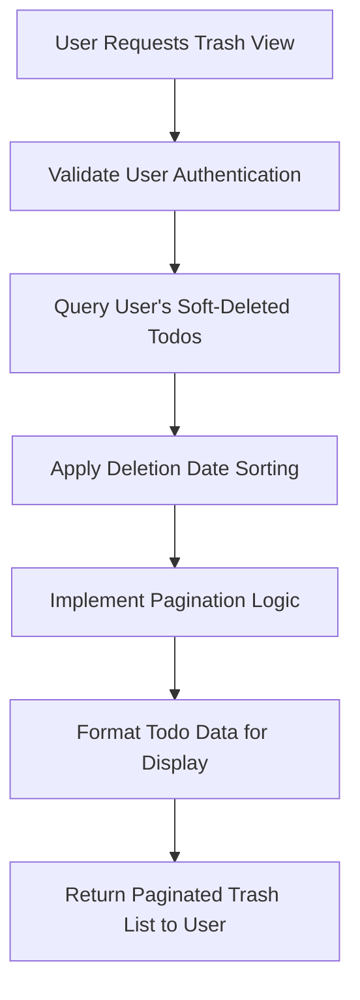
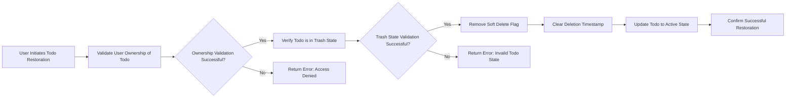
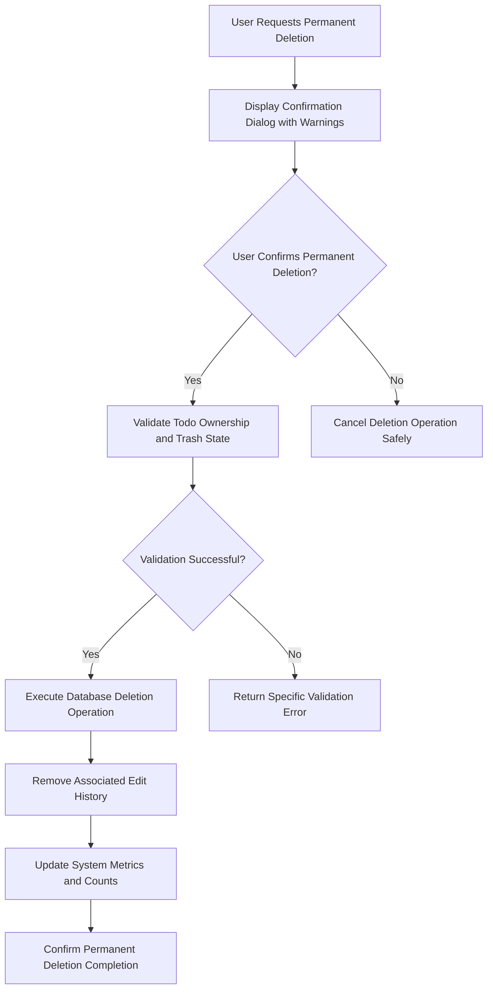

# Todo Application - Trash Management Requirements

## Document Purpose

This document defines the comprehensive requirements for trash management functionality in the multi-user Todo application. It specifies how soft delete operations work, how users interact with their trash, and the processes for restoring or permanently deleting todos. The trash management system provides users with data safety mechanisms while maintaining complete privacy and data integrity.

## Soft Delete Implementation

### Core Soft Delete Mechanism

**WHEN** a user initiates todo deletion from their active todo list, **THE** system **SHALL** perform a soft delete operation that moves the todo to the trash while preserving all data.

**THE** soft delete process **SHALL** implement the following business logic:
- Mark the todo with a deletion flag without removing it from the database
- Record the exact timestamp when deletion occurred
- Remove the todo from all normal todo list views and queries
- Preserve all todo attributes including title, description, dates, and completion status
- Maintain the complete edit history for audit purposes

**WHEN** a soft delete operation completes successfully, **THE** system **SHALL** provide visual confirmation to the user that the todo has been moved to trash.

### Soft Delete Business Rules

**WHEN** performing soft delete operations, **THE** system **SHALL** enforce the following business rules:

**WHEN** a todo is soft deleted, **THE** system **SHALL** maintain data integrity by:
- Preserving all original todo attributes exactly as they were at deletion time
- Recording the user who performed the deletion for audit purposes
- Ensuring the todo remains accessible only through trash-specific endpoints
- Preventing the todo from appearing in standard todo list queries

**IF** a user attempts to access a soft-deleted todo through normal todo management endpoints, **THEN THE** system **SHALL** return an appropriate error indicating the todo cannot be found in active lists.

**THE** system **SHALL** ensure that soft-deleted todos remain completely private to their original owner, with no visibility to other users under any circumstances.

## Trash Viewing and Management

### Trash List Access Requirements

**WHEN** a user navigates to their trash management interface, **THE** system **SHALL** provide a paginated view of all soft-deleted todos belonging to that user.

**THE** trash list display **SHALL** present the following information for each todo:
- Todo title in its original form
- Original creation date and timestamp
- Deletion timestamp indicating when it was moved to trash
- Completion status as it was at the time of deletion
- Start date if previously set by the user
- Due date if previously set by the user
- Visual indicators distinguishing between completed and incomplete todos

**THE** trash list **SHALL** be organized with most recently deleted items appearing first, providing users with chronological context for their deletion activities.

### Trash List Pagination Specifications

**WHERE** pagination is implemented for trash management, **THE** system **SHALL** meet the following requirements:

**WHEN** displaying trash contents, **THE** system **SHALL**:
- Default to showing 20 items per page for optimal user experience
- Provide intuitive navigation controls including previous/next page buttons
- Display the total count of items currently in the user's trash
- Indicate the current page position relative to total pages available
- Support direct page number selection for efficient navigation

**WHEN** the trash contains no items, **THE** system **SHALL** display an appropriate empty state message encouraging todo management rather than showing an empty list.

### Individual Trash Item Viewing Capabilities

**WHEN** a user selects a specific todo from their trash list for detailed viewing, **THE** system **SHALL** display comprehensive todo information including:

- Complete todo title and description in read-only format
- Full chronological information: creation date, start date, due date, deletion date
- Current completion status at the time of viewing
- Complete edit history showing all modifications made before deletion
- Clear restoration and permanent deletion action buttons
- Visual indicators showing the todo's current trash state

**THE** detailed trash view **SHALL** provide users with sufficient context to make informed decisions about restoration or permanent deletion.

## Restore Functionality

### Todo Restoration Process

**WHEN** a user chooses to restore a todo from trash back to their active todo list, **THE** system **SHALL** execute a comprehensive restoration process:

**THE** restoration operation **SHALL**:
- Remove the soft delete marker from the todo
- Clear the deletion timestamp to indicate active status
- Return the todo to normal visibility in standard todo lists
- Maintain all original todo attributes exactly as they were before deletion
- Preserve the complete edit history including the deletion event

**WHEN** restoration completes successfully, **THE** system **SHALL**:
- Provide visual confirmation that the todo has been restored
- Redirect the user to the active todo list showing the restored item
- Update any relevant metrics or user interface elements

### Restoration Business Rules and Validation

**WHEN** processing restoration requests, **THE** system **SHALL** implement robust validation:

**THE** system **SHALL** verify that:
- The todo belongs to the authenticated user making the request
- The todo is currently in a soft-deleted state eligible for restoration
- The user has appropriate permissions to restore the specific todo
- No conflicts exist that would prevent successful restoration

**IF** any validation check fails during restoration, **THEN THE** system **SHALL**:
- Return a specific error message explaining the failure reason
- Maintain the todo in its current trash state
- Provide guidance on resolving the issue if possible

## Permanent Deletion Process

### Permanent Deletion from Trash

**WHEN** a user decides to permanently remove a todo from the system, **THE** system **SHALL** execute an irreversible deletion process:

**THE** permanent deletion operation **SHALL**:
- Completely remove the todo and all associated data from the database
- Delete the entire edit history linked to that specific todo
- Ensure no traces of the todo remain in any system backups or archives
- Update user interface elements to reflect the reduced trash count

**THE** system **SHALL** treat permanent deletion as a destructive operation with no recovery mechanisms available.

### Permanent Deletion Confirmation Workflow

**WHEN** a user initiates permanent deletion, **THE** system **SHALL** implement a multi-step confirmation process:

**THE** confirmation workflow **SHALL**:
- Display a prominent warning about irreversible data loss
- Show the complete todo details being considered for deletion
- Require explicit user confirmation through dedicated action
- Provide a cancellation option with clear exit pathways
- Implement timeout protections against accidental confirmations

**WHILE** the permanent deletion confirmation is active, **THE** system **SHALL** prevent accidental data loss through:
- Modal dialog interfaces that require deliberate action
- Clear destructive action labeling and warnings
- Secondary confirmation steps for critical operations
- User activity timeouts that cancel pending deletions

### Permanent Deletion Business Rules

**THE** system **SHALL** enforce strict rules governing permanent deletion operations:

**WHEN** processing permanent deletion requests, **THE** system **SHALL** ensure that:
- The operation can only be performed on todos currently in trash state
- The requesting user owns the todo being permanently deleted
- Explicit confirmation has been received through the proper workflow
- No external constraints prevent the deletion from proceeding

**IF** a user attempts to permanently delete a todo that is not in trash, **THEN THE** system **SHALL** return a specific error explaining the invalid operation.

## Data Recovery Scenarios

### Accidental Deletion Recovery Mechanisms

**WHEN** users accidentally delete todos they intended to keep, **THE** system **SHALL** provide comprehensive recovery options through:

**THE** trash management system **SHALL** serve as a safety net by:
- Preserving deleted todos indefinitely until manual cleanup
- Providing clear restoration workflows for recovery
- Maintaining data integrity during the deletion recovery process
- Ensuring users can easily identify and restore accidentally deleted items

**THE** system **SHALL** distinguish clearly between soft deletion (recoverable) and permanent deletion (irreversible) to prevent user confusion.

### Data Retention Policies and Constraints

**WHILE** todos remain in the trash state, **THE** system **SHALL** adhere to the following retention policies:

**THE** system **SHALL**:
- Maintain all trash items indefinitely without automatic purging
- Preserve complete todo data including attachments and metadata
- Allow users full control over their trash management timeline
- Provide adequate storage for reasonable trash accumulation

**THE** system **SHALL** NOT implement automatic trash cleanup mechanisms that could lead to unintended data loss.

### Recovery Limitations and Boundaries

**WHERE** permanent deletion operations are concerned, **THE** system **SHALL** establish clear limitations:

**WHEN** a todo is permanently deleted, **THE** system **SHALL**:
- Remove all database references to the deleted todo
- Not maintain any backup copies or recovery archives
- Treat the deletion as final with no possibility of reversal
- Update all system indicators to reflect the permanent loss

**IF** users inquire about recovery after permanent deletion, **THEN THE** system **SHALL** provide clear communication about the irreversible nature of the operation.

## Business Rules and Constraints

### Privacy Enforcement Requirements

**THE** trash management system **SHALL** enforce stringent privacy protections:

**WHEN** managing trash contents, **THE** system **SHALL** ensure that:
- Users can only access and manage their own trash items
- Trash contents are never visible or accessible to other users
- Deleted todos maintain their original privacy boundaries
- All trash operations respect user data sovereignty

**THE** system **SHALL** implement row-level security ensuring that trash queries automatically filter by user ownership.

### Data Integrity Maintenance

**THE** system **SHALL** maintain robust data integrity throughout trash operations:

**WHEN** performing soft delete operations, **THE** system **SHALL**:
- Use transactional database operations to prevent partial states
- Preserve relational integrity between todos and their history
- Maintain consistent data across all system components

**WHEN** executing restoration processes, **THE** system **SHALL**:
- Ensure complete data recovery to original state
- Maintain all historical relationships and references
- Validate data consistency after restoration completion

**WHEN** performing permanent deletion, **THE** system **SHALL**:
- Clean up all associated data completely
- Maintain database consistency after removal
- Update all relevant system indexes and counters

### Performance Requirements and Standards

**THE** trash management system **SHALL** meet specific performance benchmarks:

**WHEN** users access their trash lists, **THE** system **SHALL**:
- Load paginated results within 2 seconds under normal load
- Handle trash collections containing thousands of items efficiently
- Provide smooth scrolling and navigation between pages
- Maintain responsive interface during filtering and sorting operations

**WHEN** performing restore or delete operations, **THE** system **SHALL**:
- Complete individual operations within 1 second
- Handle multiple concurrent operations without degradation
- Provide immediate visual feedback to users
- Maintain system stability during batch operations

## Error Handling Scenarios

### Invalid Trash Operation Scenarios

**WHEN** users attempt invalid trash operations, **THE** system **SHALL** provide appropriate error handling:

**IF** a user attempts to restore a todo that doesn't exist in their trash, **THEN THE** system **SHALL** return a clear "Todo not found in trash" error message.

**IF** a user tries to permanently delete a todo that's not in trash state, **THEN THE** system **SHALL** return an "Invalid operation: todo not in trash" error.

**IF** permission validation fails during any trash operation, **THEN THE** system **SHALL** return an "Access denied" error with appropriate security logging.

### System Failure Scenarios

**WHILE** performing critical trash operations, **THE** system **SHALL** implement robust failure handling:

**THE** system **SHALL** use transactional operations to ensure that:
- Partial failures do not leave data in inconsistent states
- Failed operations can be safely rolled back
- Users receive clear error messages for recovery actions
- System administrators receive appropriate failure notifications

**WHEN** network or database failures occur during trash operations, **THE** system **SHALL**:
- Attempt graceful recovery where possible
- Provide users with status information about the failure
- Maintain audit trails of attempted operations
- Support retry mechanisms for transient failures

## Success Criteria

### Functional Success Metrics

**THE** trash management system **SHALL** be considered functionally successful when:

**WHEN** evaluated against user requirements, **THE** system **SHALL** demonstrate:
- Reliable soft delete functionality that preserves todo data
- Effective trash viewing with proper pagination and sorting
- Smooth restoration workflows that return todos to active state
- Secure permanent deletion that completely removes data
- Consistent performance meeting all response time requirements

### User Experience Success Metrics

**THE** system **SHALL** deliver excellent user experience through:

**WHEN** measuring user satisfaction, **THE** system **SHALL** achieve:
- Intuitive navigation between active todos and trash
- Clear visual distinction between soft and permanent deletion options
- Effective prevention of accidental data loss through confirmation workflows
- Smooth and predictable restoration processes
- Minimal user confusion about trash management concepts

### System Reliability Metrics

**THE** trash management system **SHALL** maintain high reliability standards:

**WHEN** monitoring system performance, **THE** system **SHALL** maintain:
- 99.9% availability for trash management functionality
- Sub-second response times for core operations
- Zero data loss incidents during normal operation
- Proper error handling for all exceptional conditions

> *Developer Note: This document defines **business requirements only**. All technical implementations (architecture, APIs, database design, etc.) are at the discretion of the development team.*