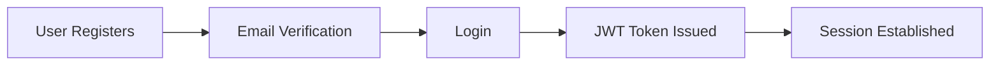
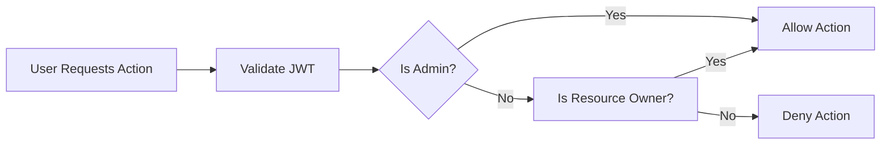

# Todo List Minimum Requirements Analysis

## Application Purpose
A Todo List application enables users to manage personal task lists digitally. The primary business goal is to provide a simple, reliable, and secure way for users to record, update, complete, and remove personal tasks. The application is built for individual productivity with minimal distraction and maximum privacy.

## User Actors and Business Model
The system supports two user actor types:

- **User**: A registered member with a personal account. Users create, read, update, and delete (“CRUD”) their own todo items. Users cannot interact with or view others’ todos.
- **Admin**: An administrator who can access all users’ todo items for support or moderation. Admins may manage user accounts and enforce compliance and safety. Admin privileges include full CRUD on any user’s todos and access to user management features.

### Permission Matrix
| Action                          | User | Admin |
|----------------------------------|:----:|:-----:|
| Register an account              | ✅   | ✅    |
| Login                            | ✅   | ✅    |
| Create todo item                 | ✅   | ✅    |
| View own todo items              | ✅   | ✅    |
| Update own todo item             | ✅   | ✅    |
| Delete own todo item             | ✅   | ✅    |
| View all users’ todos            | ❌   | ✅    |
| Update/delete any user’s todos   | ❌   | ✅    |
| User account management          | ❌   | ✅    |
| Moderate inappropriate content   | ❌   | ✅    |

## Functional Requirements
All business requirements follow EARS (Easy Approach to Requirements Syntax):

- WHEN a visitor wants to use the app, THE system SHALL require registration with unique email and strong password.
- WHEN a user registers, THE system SHALL verify email address before granting access.
- WHEN a user logs in and their credentials are correct, THE system SHALL issue a JWT token containing userId, role, and permissions array.
- WHEN a user with a valid token requests to create a todo, THE system SHALL allow creation with task title, description (optional), completion status, and due date (optional).
- WHEN a user requests to view, update, or delete a todo item, THE system SHALL validate that the user is owner of the todo item.
- WHERE the user is not owner of the todo item, THE system SHALL deny all modification or delete requests.
- WHERE the user is Admin, THE system SHALL permit them to view, update or delete any user’s todo items.
- THE system SHALL allow users to mark todos as completed/uncompleted.
- THE system SHALL store each todo item with a creation date, last modified date, and completion status.
- WHEN a user requests their list of todos, THE system SHALL return only their own todo items, sorted by creation or due date.
- WHEN a user attempts to access features requiring authentication without being logged in, THE system SHALL deny access with a specific error message.
- WHEN a user attempts an unauthorized action (e.g., deleting another’s todo), THE system SHALL deny the action and log a violation.

## Authentication and Permission Scenarios
### Authentication Flow (Mermaid)

### Authorization Flow (Mermaid)

### JWT-based Security
- Access tokens are short-lived (approx. 30 min), refresh tokens long-lived (e.g. 30 days).
- Every protected endpoint checks token validity and permissions.
- Token payload includes userId, role, permissions.

### Permission Enforcement Rules (EARS)
- THE system SHALL enforce least-privilege access for all roles.
- THE system SHALL record all authorization failures and permission violations with timestamps and actor ID.
- THE system SHALL require additional authentication (e.g. re-login) for security-critical admin actions.

## Error Handling Requirements
- WHEN an unauthenticated user requests a protected resource, THE system SHALL return HTTP 401 with an explanation.
- WHEN a user provides invalid credentials, THE system SHALL return HTTP 401 with no sensitive details.
- WHEN a user requests a resource they are not authorized to access, THE system SHALL return HTTP 403 with clear reason.
- WHEN a JWT token is malformed or expired, THE system SHALL require token renewal and deny access to protected endpoints.
- WHEN a user attempts to perform actions beyond allowed permissions, THE system SHALL return specific error messages.

## Non-Functional Requirements (Minimal)
- THE system SHALL respond to all user actions within 2 seconds under normal operating conditions.
- THE system SHALL store todos securely and prevent unauthorized access or data leakage.
- THE system SHALL comply with security and privacy best practices for token management and storage.
- THE system SHALL provide audit logging for all admin actions that affect user data integrity or privacy.

## Out-of-Scope (Explicitly Excluded)
- No shared todos between users (collaboration is out of scope).
- No complex priority/recurrence/collaboration features (keep minimal/atomic).
- No explicit notifications or reminders in the minimum product.

## Summary
This document defines all roles, authentication, permission boundaries, business requirements, and error handling flows for a production-grade, minimal Todo List backend application. All requirements are specified to be concrete, testable, and implementation-ready for backend developers.