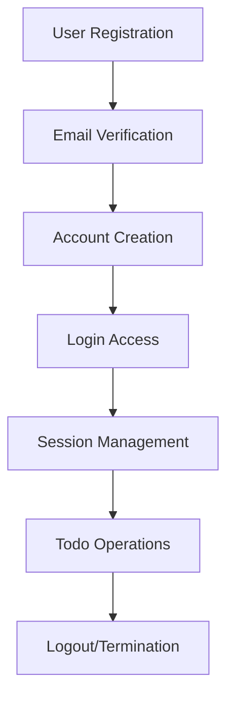
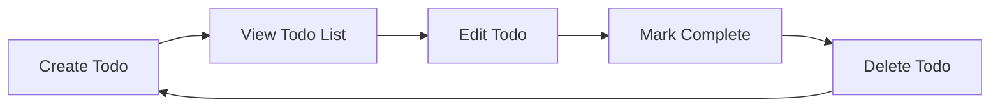
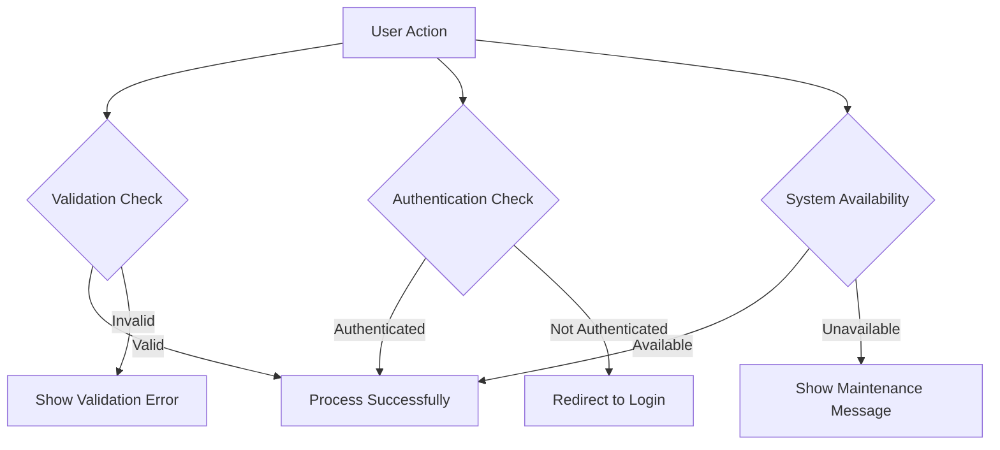

# Todo List Application - Service Overview

## Service Vision and Mission

**Vision**: Create the simplest, most intuitive Todo list application that helps users organize their tasks efficiently without unnecessary complexity.

**Mission**: Provide users with a clean, distraction-free environment to manage their daily tasks, enabling better productivity and task completion through minimal, focused functionality.

## Business Justification

The Todo list application addresses the fundamental human need for organization and task management. In today's fast-paced world, individuals struggle with information overload and task fragmentation. This application provides a centralized, simple solution for personal task management without the feature bloat common in many productivity tools.

### Problem Statement

Users face several challenges with existing task management solutions:
- Overly complex interfaces with unnecessary features
- Steep learning curves that hinder adoption
- Feature bloat that distracts from core task management
- Privacy concerns with cloud-based solutions
- Lack of customization for personal workflow preferences

### Solution Approach

Our Todo application solves these problems through:
- **Minimalist Design**: Focus on core functionality only
- **Intuitive Interface**: Zero learning curve for basic operations
- **Privacy-First**: Optional cloud synchronization with local storage priority
- **Customizable Workflow**: Adaptable to individual preferences without complexity

## Core Value Proposition

### Primary Value
**Simplicity in Task Management**: Users can immediately start organizing tasks without configuration or learning. The application does one thing well - managing todos - without distractions.

### Secondary Values
- **Time Efficiency**: Quick task entry and management saves users valuable time
- **Mental Clarity**: Organized task lists reduce cognitive load and stress
- **Reliability**: Consistent performance with minimal downtime
- **Accessibility**: Works across devices with synchronized data

## Target Audience

### Primary Users
- **Individual Professionals**: People who need to organize work tasks and personal responsibilities
- **Students**: Individuals managing academic assignments and deadlines
- **Homemakers**: People organizing household chores and family schedules

### User Characteristics
- **Technical Comfort**: Basic computer literacy
- **Task Volume**: Moderate number of daily tasks (5-20 items)
- **Priority**: Value simplicity over advanced features
- **Device Usage**: Primarily mobile and desktop browsers

## Key Differentiators

### 1. Extreme Simplicity
Unlike competitors that offer calendars, reminders, and project management, we focus exclusively on the core todo functionality.

### 2. Zero Configuration
Users can start using the application immediately without setup or customization requirements.

### 3. Privacy-First Approach
Local storage as default with optional cloud synchronization, giving users control over their data.

### 4. Performance Focus
Optimized for speed with sub-second response times for all operations.

## Success Metrics

### User Engagement Metrics
- **Daily Active Users**: Target: 1,000+ users within first 6 months
- **Task Completion Rate**: Target: 70% of created tasks marked as completed
- **User Retention**: Target: 60% of users active after 30 days

### Technical Performance Metrics
- **Response Time**: All operations under 500ms
- **Uptime**: 99.9% availability target
- **Error Rate**: Less than 0.1% of requests resulting in errors

### Business Metrics
- **User Satisfaction**: Target: 4.5/5 average rating
- **Feature Adoption**: 95% of users utilizing core todo functionality
- **Support Requests**: Less than 1 request per 100 users monthly

## Core Functionality Requirements

### User Authentication System

**WHEN a new user registers, THE system SHALL require email verification before granting full access to todo functionality.**

**IF a user forgets their password, THEN THE system SHALL provide a secure password reset process via email verification.**

**WHERE multiple failed login attempts occur, THE system SHALL implement temporary account lockout to prevent brute force attacks.**

### Todo Management Core Features

**WHEN a user creates a new todo, THE system SHALL require a title and allow optional description and due date fields.**

**IF a user marks a todo as completed, THEN THE system SHALL move it to a completed tasks section while preserving the completion timestamp.**

**WHERE a user edits an existing todo, THE system SHALL preserve the original creation date and track modification history.**

### Basic Organization Features

**WHEN viewing the todo list, THE system SHALL display todos in creation order by default with options for due date sorting.**

**IF a user has more than 10 active todos, THEN THE system SHALL provide pagination or infinite scrolling for better usability.**

**WHERE todos have due dates, THE system SHALL highlight overdue items and provide visual indicators for upcoming deadlines.**

## User Authentication and Authorization

### Authentication Requirements

**THE system SHALL support email/password authentication with secure password requirements (minimum 8 characters).**

**WHEN a user logs in successfully, THE system SHALL create a secure session token valid for 24 hours.**

**IF a session expires due to inactivity, THEN THE system SHALL require re-authentication while preserving unsaved work.**

### Authorization Rules

**THE system SHALL ensure users can only access and modify their own todo items.**

**WHEN a user attempts to access another user's data, THE system SHALL return an authorization error without revealing existence of the data.**

**WHERE administrative functions exist, THE system SHALL implement role-based access control with clear permission boundaries.**

## Error Handling Scenarios

### Common Error Types

**WHEN network connectivity is lost during todo operations, THE system SHALL provide offline capability with automatic synchronization when connection is restored.**

**IF the system encounters an unexpected error, THEN THE system SHALL display a user-friendly error message while logging technical details for debugging.**

**WHERE data validation fails, THE system SHALL provide specific, actionable error messages indicating how to correct the issue.**

### Recovery Processes

**THE system SHALL implement automatic retry mechanisms for failed network requests with exponential backoff.**

**WHEN a todo operation fails due to temporary conditions, THE system SHALL preserve user input and offer retry options.**

**IF persistent errors occur, THEN THE system SHALL provide clear guidance for troubleshooting or contacting support.**

## Performance Expectations

### Response Time Standards

**THE system SHALL respond to todo creation requests within 200 milliseconds under normal load conditions.**

**WHEN loading todo lists, THE system SHALL display the first 10 items within 300 milliseconds.**

**IF searching through todos, THEN THE system SHALL return results within 500 milliseconds for lists up to 1,000 items.**

### Scalability Requirements

**THE system SHALL support up to 10,000 concurrent users with linear performance scaling.**

**WHEN user load increases, THE system SHALL maintain consistent response times through horizontal scaling.**

**IF database size grows beyond 1 million todos, THEN THE system SHALL implement efficient indexing and query optimization.**

### Availability Targets

**THE system SHALL maintain 99.9% uptime during business hours (8 AM - 10 PM local time).**

**WHEN performing maintenance, THE system SHALL provide at least 24 hours notice to users.**

**IF unexpected downtime occurs, THEN THE system SHALL provide status updates every 15 minutes until service is restored.**

## User Experience Standards

### Interface Guidelines

**THE application interface SHALL follow consistent design patterns across all screens and interactions.**

**WHEN displaying todo lists, THE system SHALL use clear visual hierarchy to distinguish between active, completed, and overdue items.**

**IF the interface requires user input, THEN THE system SHALL provide clear labels, helpful placeholder text, and immediate validation feedback.**

### Accessibility Requirements

**THE system SHALL support keyboard navigation for all core functionality without requiring mouse interaction.**

**WHEN displaying error messages, THE system SHALL use high contrast colors and clear typography for readability.**

**IF screen reader technology is detected, THEN THE system SHALL provide appropriate ARIA labels and semantic HTML structure.**

## Data Management and Privacy

### Data Storage Requirements

**THE system SHALL store todo data securely with encryption at rest for sensitive information.**

**WHEN users delete todos, THE system SHALL implement soft deletion with 30-day retention before permanent removal.**

**IF data backup is performed, THEN THE system SHALL ensure backup integrity through verification checks.**

### Privacy and Security

**THE system SHALL not share user data with third parties without explicit user consent.**

**WHEN transmitting data over networks, THE system SHALL use secure HTTPS protocols with strong encryption.**

**IF security vulnerabilities are discovered, THEN THE system SHALL implement patches within 24 hours of identification.**

## Implementation Constraints

### Technical Constraints

**THE application SHALL be built using modern web technologies with responsive design for mobile and desktop compatibility.**

**WHEN choosing technology stack, THE system SHALL prioritize stability and maintainability over cutting-edge features.**

**IF third-party libraries are used, THEN THEY SHALL be well-maintained with active community support and security updates.**

### Business Constraints

**THE development timeline SHALL not exceed 3 months for initial MVP release.**

**WHEN prioritizing features, THE team SHALL focus on core todo functionality before considering enhancements.**

**IF scope changes are requested, THEN THEY SHALL be evaluated against the principle of minimal functionality.**

## Success Validation Criteria

### Functional Validation

**THE system SHALL pass all acceptance tests for core todo functionality before production deployment.**

**WHEN users report bugs, THE development team SHALL address critical issues within 48 hours.**

**IF performance benchmarks are not met, THEN THE team SHALL implement optimization before release.**

### User Acceptance Testing

**THE application SHALL achieve 90% user satisfaction in initial usability testing with the target audience.**

**WHEN new features are added, THEY SHALL undergo user testing to ensure they maintain the application's simplicity.**

**IF user feedback indicates confusion or complexity, THEN THE team SHALL simplify the interface accordingly.**

> *This document defines the complete business requirements for a minimal Todo list application. All technical implementation details will be developed in subsequent phases based on these requirements.*