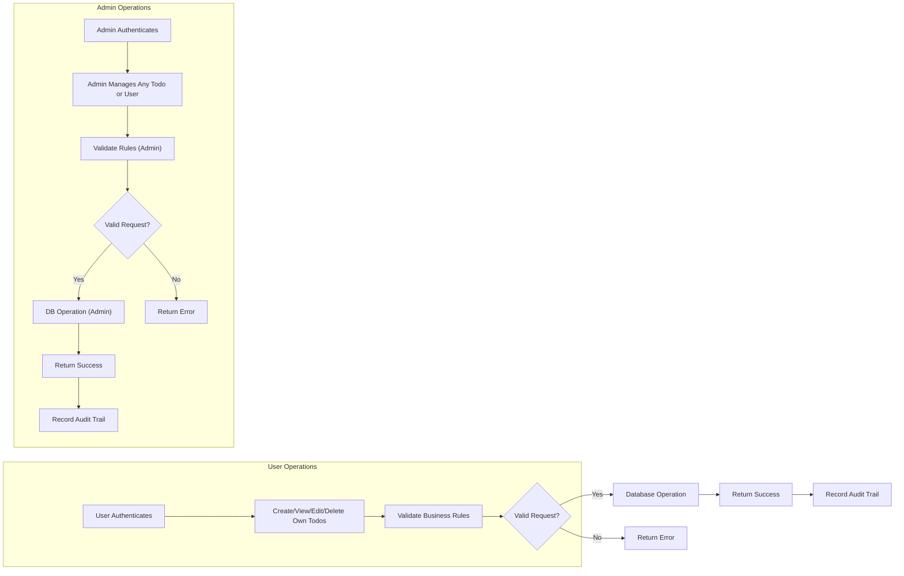

# Functional Requirements for the Todo List Service

## Requirement Writing Methodology
All requirements below are specified using the EARS (Easy Approach to Requirements Syntax) methodology and business-oriented, non-technical language to ensure clarity, unambiguous understanding, and full testability. Each business behavior, permission, and error scenario is described from an actor-centric viewpoint, explicitly defining the scope and boundary of responsibility. Performance, error behavior, authorization, and audit requirements are encompassed to allow direct handover to backend engineering without further refinement.

## Functional Requirements (EARS Format)

### General System Scope
- THE Todo List service SHALL provide registered users with the minimum essential functionality: users SHALL be able to register with email/password, authenticate, create, view, edit, and delete their own todo items, and update their personal account info.
- THE system SHALL prevent any unauthenticated access except for registration and login.
- THE system SHALL define two distinct user actors: "user" and "admin". Each SHALL have strictly separated permissions.
- WHEN an admin is authenticated, THE service SHALL permit admins to view and manage any user account and all todo items.
- WHEN a non-admin user is authenticated, THE service SHALL allow them to manage only their own profile and todo items.
- THE system SHALL strictly prohibit all users from accessing, reading, modifying, or deleting todo items or accounts they do not own (admin excepted).

### User Account Management
- WHEN a user provides a valid email and password and requests registration, THE system SHALL create a new user account. Emails MUST be globally unique and passwords stored securely per security best practices.
- WHEN a user completes registration, THE service SHALL require authentication on all future requests except registration or login.
- WHEN login is requested with valid credentials, THE service SHALL issue a signed JWT access token (30 min lifetime) and a refresh token (14 days lifetime), and allow operation for the session.
- IF a user provides invalid credentials, THEN THE system SHALL deny access, return an actionable error, and record the failed attempt.
- WHEN a user requests password reset, THE system SHALL validate the identity (e.g., email code), permitting password change if authorized.
- WHEN a user requests change of email or password, THE system SHALL require entry of the current password for verification.
- WHEN a user deletes their account, THE system SHALL also delete all their todo items in a single operation.

### Todo List Management
- WHEN a user is authenticated, THE system SHALL permit them to:
    - Create a new todo with required title (non-empty, <=100 characters), optional description (<=500 characters), optional due date (ISO 8601, >=now). Defaults: completed=false.
    - View a list of their own todos, paginated (20 per page, newest first).
    - See all metadata for a todo: id, title, description, completed status, creation/updated timestamps, due date, completed timestamp.
    - Update a todo (fields: title, description, due date, completed status); editing a completed todo retains completed timestamp unless toggled.
    - Delete a todo, which SHALL permanently remove the entry.
- THE system SHALL always record created/updated timestamps using Asia/Seoul timezone for display (store internally as UTC).
- THE system SHALL enforce that only the owner (or admin) may create, read, update, or delete any given todo item.
- IF a user tries to set a title to empty or over 100 characters, THEN THE system SHALL reject the change and notify the user of the reason.
- IF input data violates contract (e.g., description >500 characters, due date before now, invalid status), THEN THE service SHALL not create/update the item and SHALL respond with a precise error.
- WHEN a todo is completed, THE system SHALL record a completed timestamp. WHEN toggled incomplete, timestamp SHALL reset to null.
- WHEN a user deletes their account, THE system SHALL also delete all their todos atomically.

### Permissions and Actor Boundaries
- THE "user" role SHALL only access, view, create, update, or delete their own account and todos.
- THE "admin" role SHALL access, update, or delete any user's account or todo, with full oversight capabilities.
- IF a user (not admin) tries to access another's resources, THEN THE system SHALL deny access and give a standard permission error.
- THE system SHALL include user id, role (user/admin), iat, and exp in every JWT payload.
- THE system SHALL enforce permission checks for every endpoint touching todo or user data.
- WHEN deleting a user, admin SHALL also delete that user's todos, atomically.

### Completion and Editing Logic
- WHEN completion status is toggled, THE system SHALL update the completed status accordingly and set/clear the completion timestamp.
- Editing a completed todo SHALL NOT alter the completion timestamp unless completion status changes, and ANY allowed field may be updated by the owner or admin.
- THE system SHALL allow updating/removal of due date at any time.

### Validation and Acceptance Criteria
- THE system SHALL enforce these for each todo:
    - Title: required, non-empty, <=100 chars
    - Description: optional, <=500 chars
    - Due date: optional, ISO 8601, >=now (Asia/Seoul timezone applied to user-facing)
    - Completed: boolean, default false on creation
    - Completed timestamp: null unless completed
    - Timestamps: created/updated, always set
- THE system SHALL validate emails for uniqueness and format and securely hash passwords.
- Any invalid data, malformed, missing, or policy-violating input SHALL be rejected with an explicit error, and SHALL never modify persistent state if validation fails.
- Every error response SHALL clearly indicate cause and how to correct it.

### Business-Level Error Handling
- IF a request targets missing or unauthorized resource, THEN THE system SHALL return not-found (without leaking information about resource owner).
- IF a user's token is expired, THEN THE system SHALL respond with token expiry, refuse the operation, and require login or refresh.
- WHEN a user is locked out (after >5 failures in 30 min), account access SHALL be blocked for 15 minutes with a log entry.
- IF registration email is already used, THEN THE system SHALL reject and return a specific duplicate error.

### Performance and Responsiveness
- CRUD operations on todos by any actor SHALL complete and return within 2 seconds under normal load.
- LIST requests SHALL support pagination, default 20 items per page, show most recent first.
- IF system cannot respond in 4 seconds, THEN operation SHALL time out, send error, and log the event.

### User Experience & Auditability
- Every successful create/update/complete/delete operation SHALL generate a user-friendly confirmation, sufficient for clients to update visible state in a single round-trip.
- Actions affecting todos or accounts (completion, deletion, update) SHALL be audit-logged, including actor id and timestamps.
- For timezone handling, users specify their preferred timezone, but all persistence is in UTC; outputs to users are always shifted to Asia/Seoul.

### Permission Matrix
| Action                        | User | Admin |
|-------------------------------|:----:|:-----:|
| Register/Login                |  ✅  |  ✅   |
| Create own todos              |  ✅  |  ✅   |
| View own todos                |  ✅  |  ✅   |
| Edit own todos                |  ✅  |  ✅   |
| Delete own todos              |  ✅  |  ✅   |
| View all users' todos         |  ❌  |  ✅   |
| Edit any user's todos         |  ❌  |  ✅   |
| Delete any user's todos       |  ❌  |  ✅   |
| Delete user accounts          |  ❌  |  ✅   |
| Moderate content              |  ❌  |  ✅   |

### Functional Workflow Diagram

## Validation and Acceptance Criteria
- Every requirement above SHALL be covered by acceptance and integration tests. Testing must confirm full compliance for all roles, operations, boundaries, error behaviors, validations, and business workflows.
- No functional changes are permitted unless this requirements document is formally updated and reviewed by all stakeholders.
