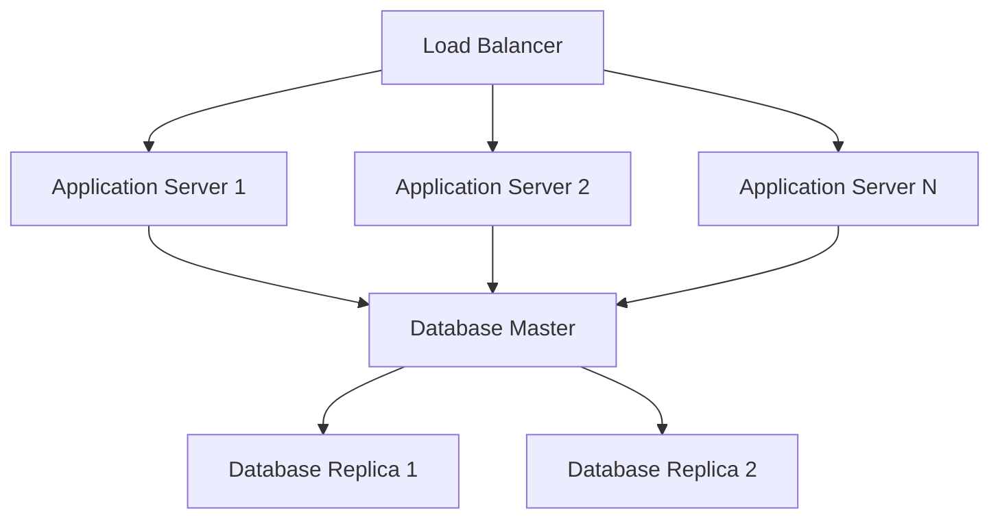
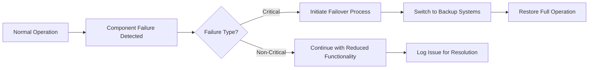

# Non-Functional Requirements Specification for Todo Application

## Performance Requirements

### Response Time Expectations

**WHEN** a user accesses the application, **THE** system **SHALL** display the main interface within 2 seconds for 95% of requests.

**WHEN** a user creates, updates, or deletes a todo item, **THE** system **SHALL** complete the operation within 1 second for 99% of requests.

**WHEN** a user views their todo list, **THE** system **SHALL** display all items within 1.5 seconds regardless of list size, with pagination support for lists exceeding 100 items.

**WHERE** search functionality is implemented, **THE** system **SHALL** return search results within 500 milliseconds for queries against up to 1,000 todo items.

### Throughput Requirements

**THE** system **SHALL** support up to 1,000 concurrent users performing typical todo operations without performance degradation.

**IF** the system receives more than 100 requests per minute from a single user, **THEN THE** system **SHALL** implement rate limiting with appropriate HTTP 429 responses.

**WHILE** under peak load conditions, **THE** system **SHALL** maintain response times within 150% of normal performance thresholds.

### Resource Utilization

**THE** system **SHALL** maintain memory usage below 500MB under normal operating conditions with 1,000 concurrent users.

**THE** system **SHALL** not exceed 70% CPU utilization during peak usage periods with sustained load.

**WHEN** monitoring system performance, **THE** application **SHALL** maintain disk I/O operations below 1000 IOPS under normal load.

## Security Specifications

### Authentication Security

**WHERE** users create accounts, **THE** system **SHALL** enforce password complexity requirements including:
- Minimum 8 characters
- At least one uppercase letter
- At least one lowercase letter  
- At least one numeric digit
- At least one special character

**WHEN** managing user sessions, **THE** system **SHALL** invalidate user sessions after 30 minutes of inactivity.

**WHERE** JWT tokens are used, **THE** system **SHALL** implement token expiration (30 minutes for access tokens, 7 days for refresh tokens) with secure refresh mechanisms.

### Data Protection

**THE** system **SHALL** encrypt sensitive user data at rest using AES-256 encryption.

**WHILE** transmitting data over networks, **THE** system **SHALL** use TLS 1.2 or higher for all communications.

**THE** system **SHALL** ensure that users can only access their own todo items through proper access control validation.

### Security Monitoring

**WHEN** authentication attempts occur, **THE** system **SHALL** log all attempts including success/failure status, timestamp, and IP address.

**IF** security-related events occur, **THEN THE** system **SHALL** generate alerts for suspicious activities including:
- Multiple failed login attempts from same IP
- Unusual access patterns
- Potential brute force attacks

**THE** system **SHALL** not expose sensitive system information in error messages, providing only generic error responses to users.

## Scalability Expectations

### User Growth Projections

**THE** system **SHALL** support up to 10,000 registered users with typical usage patterns.

**THE** system architecture **SHALL** allow for scaling to support 100,000 users with minimal architectural changes through horizontal scaling.

**WHERE** user growth exceeds projections, **THE** system **SHALL** maintain performance through load balancing and database optimization.

### Data Scalability

**THE** system **SHALL** handle up to 1,000,000 todo items across all users while maintaining performance standards.

**WHILE** individual users maintain large todo collections (up to 10,000 items), **THE** system **SHALL** provide efficient pagination and search capabilities.

**THE** database architecture **SHALL** support read replicas for improved read performance during high-load periods.

### Infrastructure Scalability

**THE** system **SHALL** be designed to support horizontal scaling through load balancers distributing traffic across multiple application instances.

**WHERE** database performance becomes a bottleneck, **THE** system **SHALL** support database sharding based on user distribution.

## Usability Standards

### User Experience

**THE** system **SHALL** provide an intuitive interface that allows new users to create their first todo within 30 seconds of registration.

**THE** system **SHALL** maintain consistent design patterns throughout the application, ensuring predictable user interactions.

**WHERE** user actions occur, **THE** system **SHALL** provide immediate visual feedback confirming the action was received.

### Error Handling Usability

**WHEN** errors occur, **THE** system **SHALL** provide clear, actionable error messages that help users understand and resolve issues.

**THE** system **SHALL** guide users through error recovery processes with step-by-step instructions where applicable.

**WHERE** user actions can cause data loss, **THE** system **SHALL** provide undo capabilities or confirmation dialogs to prevent accidental data loss.

### Mobile Compatibility

**THE** system **SHALL** provide a responsive design that works effectively on mobile devices with screen widths from 320px to 768px.

**WHERE** touch interactions are used, **THE** system **SHALL** ensure touch targets are at least 44px × 44px for accessibility.

**THE** system **SHALL** support touch gestures including swipe, tap, and long-press where appropriate for mobile usability.

### Accessibility Standards

**THE** system **SHALL** comply with WCAG 2.1 Level AA accessibility standards, ensuring usability for users with disabilities.

**WHERE** visual elements are used, **THE** system **SHALL** provide sufficient color contrast ratio of at least 4.5:1 for normal text.

**THE** application **SHALL** support screen readers and provide appropriate ARIA labels for all interactive elements.

## Reliability Requirements

### Availability

**THE** system **SHALL** maintain 99.9% uptime excluding scheduled maintenance windows.

**WHEN** scheduled maintenance is required, **THE** system **SHALL** provide at least 24 hours notice to users through in-app notifications.

**THE** system **SHALL** implement health checks that monitor critical services and automatically failover when issues are detected.

### Data Integrity

**THE** system **SHALL** ensure data consistency across all operations through proper transaction management.

**WHERE** data modifications occur, **THE** system **SHALL** implement proper locking mechanisms to prevent race conditions.

**THE** system **SHALL** perform regular automated backups with point-in-time recovery capability, retaining backups for 30 days.

### Fault Tolerance

**IF** system components fail, **THEN THE** system **SHALL** continue to operate with reduced functionality rather than complete failure.

**THE** system **SHALL** automatically recover from transient errors without requiring user intervention or system administrator action.

**WHERE** distributed systems are involved, **THE** system **SHALL** handle network partitions gracefully through appropriate consistency models.

## Maintenance Considerations

### Monitoring and Alerting

**THE** system **SHALL** include comprehensive performance monitoring capabilities tracking:
- Response times for all key operations
- Resource utilization (CPU, memory, disk, network)
- Error rates and types
- User activity patterns

**THE** system **SHALL** provide health check endpoints that return HTTP 200 when systems are healthy and appropriate error codes when issues are detected.

**WHEN** critical system events occur, **THE** system **SHALL** generate alerts through multiple channels (email, SMS, dashboard notifications) based on severity.

### Update Procedures

**THE** system **SHALL** support zero-downtime deployments for application updates through blue-green deployment strategies.

**WHERE** database schema changes are required, **THE** system **SHALL** provide migration scripts that can be applied without service interruption.

**THE** system **SHALL** maintain version history for all deployments, allowing rollback to previous versions if issues are detected.

### Operational Requirements

**THE** system **SHALL** maintain comprehensive application logs including:
- Request/response cycles with timing information
- User authentication events
- System errors and exceptions
- Performance metrics

**THE** system **SHALL** include up-to-date operational documentation covering:
- Deployment procedures
- Monitoring and alerting configuration
- Troubleshooting guides
- Disaster recovery procedures

**WHERE** support is required, **THE** system **SHALL** include defined support procedures with escalation paths for different issue severities.

## Compliance and Standards

### Regulatory Compliance

**THE** system **SHALL** comply with applicable data privacy regulations including GDPR for European users and CCPA for California users.

**WHERE** personal data is processed, **THE** system **SHALL** provide mechanisms for users to exercise their rights including data access, modification, and deletion.

**THE** system **SHALL** follow industry-standard security practices including OWASP Top 10 recommendations for web application security.

### Technical Standards

**THE** system **SHALL** follow RESTful API design principles for all external interfaces, using appropriate HTTP methods and status codes.

**WHERE** code quality is concerned, **THE** system **SHALL** maintain high standards with comprehensive unit test coverage (target: 80%+).

**THE** system **SHALL** follow consistent documentation standards with API documentation, architectural diagrams, and operational runbooks.

### Performance Standards

**THE** system **SHALL** undergo regular load testing to verify performance requirements under expected and peak load conditions.

**WHERE** security is critical, **THE** system **SHALL** undergo regular security testing including vulnerability assessments and penetration testing.

**THE** system **SHALL** pass user acceptance testing with real users before production deployment, ensuring all functional and non-functional requirements are met.

## Success Metrics and Monitoring

### Performance Metrics
- **Average Response Time**: Target < 1.5 seconds for all operations
- **P95 Response Time**: Target < 2.5 seconds for 95% of requests
- **Error Rate**: Target < 0.1% of all requests
- **Uptime**: Target 99.9% availability

### User Experience Metrics
- **Task Success Rate**: Target 95% of user actions completing successfully
- **Time to Complete Task**: Target < 30 seconds for common todo operations
- **User Satisfaction**: Target 4.5/5.0 in user satisfaction surveys
- **Adoption Rate**: Target 70% of registered users active weekly

### Operational Metrics
- **Mean Time to Recovery (MTTR)**: Target < 30 minutes for service issues
- **Deployment Frequency**: Target weekly deployments with zero downtime
- **Change Failure Rate**: Target < 5% of deployments requiring rollback
- **Security Incident Rate**: Target zero successful security breaches

> *Developer Note: This document defines **business requirements only**. All technical implementations (architecture, APIs, database design, etc.) are at the discretion of the development team.*