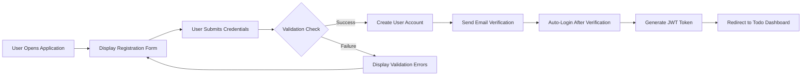

# API Integration Requirements for Todo List Application

## Introduction

This document defines the comprehensive API integration requirements for the Todo list application, focusing on the minimal functionality needed for a complete Todo management system. The requirements specify how clients interact with the backend API, authentication flows, data exchange patterns, and integration scenarios that ensure a seamless user experience.

## API Authentication Flow

### User Authentication Requirements

**WHEN** a user attempts to access protected API endpoints, **THE** system **SHALL** require valid authentication credentials.

**WHEN** a user provides valid email and password credentials, **THE** system **SHALL** issue a JSON Web Token (JWT) for session management.

**THE** authentication system **SHALL** support the following complete authentication flows:
- User registration with email address and password confirmation
- User login with email and password validation
- Token-based authentication for all API requests requiring user context
- Secure logout and token invalidation processes
- Password reset functionality with email verification

**WHILE** a user session remains active, **THE** system **SHALL** maintain authentication state through JWT tokens with appropriate expiration policies.

**IF** authentication fails due to invalid credentials or expired tokens, **THEN THE** system **SHALL** return appropriate HTTP 401 error responses and guide users to re-authenticate.

### Token Management Requirements

**THE** JWT tokens **SHALL** contain the following essential claims for user identification and authorization:
- Unique user identifier for database association
- Token expiration timestamp for session management
- User role information for permission validation
- Token issuance timestamp for security auditing

**WHEN** a token expires during an active session, **THE** system **SHALL** require re-authentication through the login flow.

**WHERE** refresh tokens are implemented for extended sessions, **THE** system **SHALL** provide secure token renewal mechanisms with proper validation.

## Request/Response Patterns

### Standard CRUD Operations

**THE** API **SHALL** follow RESTful principles for comprehensive todo item management operations:

**WHEN** creating a new todo item, **THE** client **SHALL** send a POST request with complete todo details including required title field.

**WHEN** retrieving todo items, **THE** client **SHALL** use GET requests with appropriate filtering parameters for status, date ranges, and search terms.

**WHEN** updating an existing todo item, **THE** client **SHALL** use PUT or PATCH requests with updated field data and proper validation.

**WHEN** deleting a todo item, **THE** client **SHALL** use DELETE requests with confirmation mechanisms to prevent accidental data loss.

### Response Format Standards

**THE** API **SHALL** return consistent response formats across all operations:
- Success responses with appropriate HTTP 200 status codes
- Error responses with specific HTTP status codes (400 for validation errors, 401 for authentication failures, 404 for not found resources, 500 for server errors)
- Standardized error message formats with actionable information
- Pagination support for large result sets with clear metadata

### Request Validation

**WHEN** receiving API requests, **THE** system **SHALL** perform comprehensive validation including:
- Required field presence and data type correctness
- Business rule compliance for todo item constraints
- User authorization verification for the requested operation
- Input sanitization to prevent security vulnerabilities

## Data Exchange Standards

### Todo Item Data Structure

**THE** API **SHALL** exchange todo items using the following standardized JSON structure:

```json
{
  "id": "unique-identifier",
  "title": "Todo item title",
  "description": "Optional detailed description",
  "completed": false,
  "createdAt": "2024-01-01T00:00:00Z",
  "updatedAt": "2024-01-01T00:00:00Z",
  "dueDate": "2024-01-15T00:00:00Z"
}
```

### Data Validation Requirements

**WHEN** creating or updating todo items, **THE** system **SHALL** enforce the following validation rules:
- Title field is required and must be between 1-255 characters in length
- Description field is optional with maximum 1000 character limit
- Completed field must be boolean value indicating todo status
- Dates must be in ISO 8601 format for consistent processing
- All string fields must support UTF-8 encoding for international characters

### Error Response Format

**THE** API **SHALL** return standardized error responses in this consistent format:

```json
{
  "error": {
    "code": "VALIDATION_ERROR",
    "message": "Title field is required for todo creation",
    "details": {
      "field": "title",
      "constraint": "required",
      "valueProvided": null
    }
  }
}
```

## Rate Limiting

### Protection Against Abuse

**THE** API **SHALL** implement comprehensive rate limiting to prevent abuse while maintaining optimal user experience.

**WHEN** a user exceeds defined rate limits, **THE** system **SHALL** return HTTP 429 status code with retry-after header information.

**THE** rate limiting **SHALL** be configured with the following parameters:
- Maximum 100 requests per minute per authenticated user
- Burst protection for sudden traffic spikes with gradual throttling
- Graceful degradation during high load conditions
- Clear communication when rate limits are approached

### User Experience Considerations

**WHILE** implementing rate limiting, **THE** system **SHALL** ensure that legitimate users can perform normal operations without interruption through:
- Reasonable limits that support typical Todo list usage patterns
- Clear communication when limits are approached or exceeded
- Proper error messaging that guides users toward resolution
- Exclusion of essential authentication endpoints from strict limits

## Versioning Strategy

### API Version Management

**THE** API **SHALL** support robust versioning strategy to ensure backward compatibility and smooth evolution.

**WHEN** introducing breaking changes to the API, **THE** system **SHALL** maintain previous API versions for existing clients.

**THE** versioning strategy **SHALL** utilize the following approach:
- URL-based versioning (e.g., /api/v1/todos, /api/v2/todos)
- Clear documentation of version differences and migration paths
- Deprecation timelines for older versions with ample notification
- Version negotiation mechanisms for client-server compatibility

### Future Compatibility

**WHERE** new features are added to the API, **THE** system **SHALL** maintain compatibility with existing clients through:
- Additive changes rather than breaking modifications
- Default values for new optional parameters
- Proper version detection and feature negotiation
- Comprehensive testing across version boundaries

## Integration Scenarios

### Typical User Workflows

**THE** API **SHALL** support the following comprehensive integration scenarios that cover complete user journeys:

#### User Registration and First Login Flow


#### Complete Todo Creation and Management Flow


#### Bulk Operations for Efficiency
**THE** API **SHALL** support batch operations for improved efficiency in common scenarios:
- Bulk todo creation for importing existing task lists
- Bulk status updates for completing multiple todos simultaneously
- Bulk deletions for cleaning up completed or outdated items
- Batch operations with transactional integrity guarantees

### Offline Capability Considerations

**WHERE** offline functionality is implemented, **THE** API **SHALL** support robust synchronization mechanisms:
- Conflict resolution strategies for concurrent modifications
- Last-write-wins or manual merge approaches for data consistency
- Clear indication of synchronization status and progress
- Reliable queuing of operations for eventual consistency

## Performance Expectations

### Response Time Requirements

**THE** API **SHALL** meet the following performance standards for optimal user experience:
- Todo list retrieval: < 500ms response time for typical user lists
- Single todo operations: < 200ms for create, update, and delete actions
- Authentication requests: < 1000ms for login and registration processes
- Bulk operations: < 2000ms for batches of up to 100 items
- Search and filtering: < 300ms for responsive user interactions

### Availability Requirements

**THE** API **SHALL** maintain 99.9% availability during standard business hours with comprehensive monitoring.

**WHEN** planned maintenance is required, **THE** system **SHALL** provide advance notice through multiple channels including in-app notifications and email alerts.

## Error Handling and Recovery

### Authentication Error Scenarios

**IF** authentication fails due to invalid credentials or system issues, **THEN THE** system **SHALL**:
- Return HTTP 401 status code with clear authentication error message
- Provide actionable guidance for users to resolve the issue
- Preserve any unsaved work where technically feasible
- Log security events for monitoring and analysis

### Data Validation Error Handling

**WHEN** data validation fails during API operations, **THE** system **SHALL**:
- Return HTTP 400 status code with specific validation error details
- Identify which fields failed validation with precise error messages
- Provide actionable error messages that guide user correction
- Preserve user input data to avoid retyping requirements

### System Error Management

**IF** system errors occur during API processing, **THEN THE** system **SHALL**:
- Return HTTP 500 status code for internal server errors
- Log detailed error information for debugging and resolution
- Provide generic user-friendly messages that maintain system security
- Ensure system stability through proper error containment

## Security Requirements

### Comprehensive Data Protection

**THE** API **SHALL** ensure complete data protection through:
- HTTPS encryption for all API communications
- Secure handling of sensitive data with proper encryption
- Input sanitization to prevent injection attacks
- Protection against common web vulnerabilities (XSS, CSRF, SQL injection)

### Authorization Controls

**THE** system **SHALL** enforce robust authorization controls including:
- Users can only access their own todo items through proper filtering
- Comprehensive permission checks on all data operations
- Prevention of unauthorized data access through multiple validation layers
- Audit logging for security monitoring and compliance

## Monitoring and Analytics

### Operational Monitoring

**THE** API **SHALL** provide comprehensive monitoring capabilities:
- Request/response logging for performance analysis
- Performance metrics tracking for continuous optimization
- Error rate monitoring with alerting mechanisms
- Usage pattern analysis for capacity planning

### Business Metrics Collection

**THE** system **SHALL** track essential business metrics including:
- Active user counts and engagement patterns
- Todo creation and completion rates for productivity analysis
- Feature usage patterns to guide product development
- User satisfaction indicators through interaction metrics

## Future Considerations

### Scalability Planning

**THE** API design **SHALL** support future growth through:
- Horizontal scaling capabilities for increased user load
- Database partitioning strategies for large datasets
- Caching mechanisms for performance optimization
- Load balancing for distributed system architecture

### Extensibility Framework

**THE** API **SHALL** be designed to accommodate future enhancements:
- Additional todo item properties for expanded functionality
- New todo organization features for improved usability
- Integration with external services and platforms
- Advanced filtering and search capabilities

## Compliance and Standards

### Industry Best Practices

**THE** API **SHALL** adhere to industry standards including:
- RESTful API design principles for consistency
- OAuth2 and OpenID Connect standards where applicable
- JSON API specifications for data formatting
- HTTP status code conventions for clear communication

### Regulatory Compliance

**THE** system **SHALL** ensure compliance with relevant regulations:
- Data protection requirements for user privacy
- Security standards for sensitive information handling
- Accessibility guidelines for inclusive user experience
- Internationalization support for global user base

## Conclusion

This document defines the complete API integration requirements for the Todo list application, ensuring that the backend service provides robust, secure, and performant interfaces for client applications. The requirements focus on delivering a seamless user experience while maintaining the minimal functionality philosophy that characterizes this Todo list service.

All specifications are designed to be implementation-agnostic, providing clear business requirements that guide development without prescribing specific technical solutions. The API integration requirements establish a foundation for building a reliable, scalable, and user-friendly Todo management system that meets the needs of both casual users and power users alike.

> *Developer Note: This document defines **business requirements only**. All technical implementations (architecture, APIs, database design, etc.) are at the discretion of the development team.*