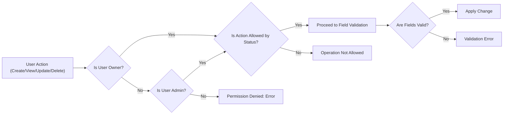

# Todo List Application Requirements Analysis

## Introduction

The Todo List Application provides each user with the ability to create, view, update, complete, and delete their own todo items. System features intentionally cover the minimal set required for a todo tracking tool and are described in natural language for clarity, with no reference to implementation code or database schema. All requirements use EARS format and are suitable for direct reference by backend engineers. The actors for this service are the end user and the optional administrator.

## User Actors & Permissions

- User: An authenticated individual who may create, read, update, complete, and delete only their own todo items.
- Admin: An authenticated individual with elevated privileges. The admin may view, edit, or remove any user's items as permitted by compliance or business policy.

### EARS Business Requirements for Permissions
- THE system SHALL require that all actions on a todo item check user authentication.
- THE system SHALL ensure only an authenticated user may create, view, update, or delete their own todos.
- WHEN a user attempts to perform any action on a todo item not owned by them, THE system SHALL deny the action and return an error stating insufficient permissions.
- WHEN the acting user is an admin, THE system SHALL allow access, updates, and deletion of any todo item, subject to audit and compliance limits.

## Business Rules & Data Validation

### Ownership & Privacy
- EVERY todo item SHALL be associated exclusively with one user account.
- WHEN a user is the owner, THE system SHALL permit only that user to access, change, or delete the item.
- WHEN a user who is not the owner attempts to read, update, or remove a todo, THE system SHALL return a permission denied error.

### Creation and Field Validation
- WHEN a todo is created, THE system SHALL require a non-empty title not exceeding 100 characters.
- WHEN a title is only whitespace or longer than 100 characters, THE system SHALL reject the request, stating the reason.
- WHEN a description is included, THE system SHALL permit up to 1,000 characters and reject or truncate excess input.
- WHEN a due date is included, THE system SHALL accept only valid ISO 8601 dates and SHALL validate that the due date is not in the past per user’s local time.
- WHEN no due date is provided, THE system SHALL store a null value.

### Status Rules
- WHEN a todo is created, THE status SHALL default to "pending".
- WHEN a status is updated, THE system SHALL permit only values in: "pending", "completed", "archived".
- WHEN a user marks a todo as complete, THE system SHALL only allow this transition from the "pending" state.
- WHEN a user requests to reopen a completed todo, THE system SHALL allow status change to "pending" and clear the completion timestamp, but only for the owner or an admin.
- WHEN a todo is archived, THE system SHALL prevent any further edits or restorations by standard users and only permit admin changes if justified for audit or compliance need.

### Immutability
- THE system SHALL generate a unique, immutable identifier upon todo creation.
- THE creation and last updated timestamps SHALL be system managed and unchangeable by users.

## Todo Item Life Cycle and Workflows

### Creation
- WHEN an authenticated user submits a valid todo, THE system SHALL create the todo and assign ownership.
- WHEN required fields are missing or invalid, THE system SHALL reject creation and provide a descriptive validation error.

### Viewing
- WHEN a user requests to view todos, THE system SHALL return only those where the user is the owner or, if admin, todos for all users.

### Updating
- WHEN a user edits a todo, THE system SHALL permit update only if the user is the owner or admin and the item is not archived.
- WHEN a todo is archived, THE system SHALL reject all update attempts from non-admins.
- WHEN updatable, ONLY the title, description, due date, and status may be updated.

### Completion/Reopening
- WHEN a user marks a todo as completed, THE system SHALL record a completion timestamp and prevent duplicate completion.
- WHEN an already completed todo is marked as completed again, THE system SHALL return an appropriate error.
- WHEN a completed todo is reopened, THE completion timestamp SHALL be erased, and status set to "pending", provided the user is the owner or admin.

### Deletion
- WHEN a user deletes their own todo, THE system SHALL permanently remove the item after permission verification.
- WHEN a user who is not the owner attempts deletion, THE system SHALL reject the request.
- WHEN an admin deletes, THE system SHALL audit and remove for standard users but may retain for compliance review as needed.

## Permission and Authentication Logic

- THE system SHALL require login for all todo item management actions.
- THE system SHALL restrict todo access by default to the authenticated user's data, except in the case of admin verified by a permission check.
- WHEN authorization fails, THE system SHALL return an error message indicating authentication or permission failure.

## Error Cases & Edge Scenarios

- WHEN a todo is not found for a given id, THE system SHALL return a not found error.
- WHEN required fields are missing or invalid, THE system SHALL return explicit error messages specifying the violated rule.
- WHEN any forbidden action is attempted (e.g., status change on archived item, unauthorized access), THE system SHALL respond with a clear, descriptive error.
- WHEN unsupported fields are present in input, THE system SHALL ignore these and process only valid attributes.
- WHEN input is not valid UTF-8, THE system SHALL reject the request and return an encoding error.

## Summary Table of Key Requirements

| Requirement Area | Condition/Event | EARS Requirement |
|---------------------|------------------------|-----------------------------------------------|
| Ownership           | Any access             | THE system SHALL allow only the owner or admin |
| Creation            | New todo submission    | THE system SHALL require valid title           |
| Viewing             | View request           | THE system SHALL show only owned todos         |
| Updating            | Edit request           | THE system SHALL restrict fields, enforce owner|
| Completion          | Complete request       | THE system SHALL only allow from pending       |
| Reopening           | Owner/admin only       | THE system SHALL revert status and clear ts    |
| Deletion            | Delete request         | THE system SHALL verify permission and remove  |
| Error Handling      | Invalid/missing input  | THE system SHALL explain reasons explicitly    |
| Archival            | Status = archived      | THE system SHALL prevent all further edits     |

## Mermaid Diagram – Main Workflow

## Supplementary Notes

- ONLY system-generated IDs and timestamps are immutable by users.
- Admins may have additional access for compliance, but all actor permissions must follow audit policy.
- Soft deletion or archival is not available to normal users; only admins may access deleted or archived todos for compliance.

All requirements above use precise language to remove ambiguity and ensure the backend implementation meets business objectives defined for a minimal, robust Todo List application.