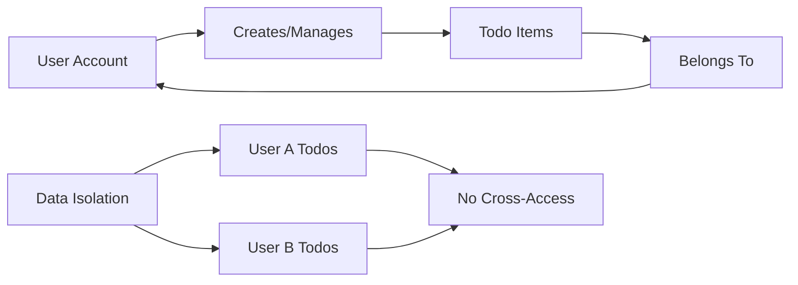

# Data Management Requirements Specification for Todo Application

## Executive Summary

This document defines the comprehensive data management requirements for the Todo application from a business perspective. The application handles user-generated todo items with specific lifecycle management, storage requirements, and privacy considerations. All requirements focus on what the system should accomplish for users, without specifying technical implementation details.

## Data Types and Structures

### Core Business Data Entities

The Todo application manages the following primary data types from a user perspective:

**User Account Information**
- User profile data including email address and account preferences
- Authentication credentials management
- Account creation and activity tracking
- User session management data

**Todo Item Data**
- Todo title/text content with business validation rules
- Completion status tracking (active/completed)
- Creation and modification timestamp management
- Optional feature data (due dates, priorities, categories if implemented)

### Data Relationships and Business Rules

**WHEN** managing user data relationships, **THE** system **SHALL** ensure complete data isolation between different user accounts.

**WHILE** processing todo operations, **THE** system **SHALL** maintain the ownership relationship between users and their todo items.

## Data Lifecycle Management

### Data Creation Process Requirements

**User Registration Data Creation**
**WHEN** a new user registers for the application, **THE** system **SHALL** create a user account record with the provided information and initiate the email verification process.

**WHEN** creating a user account, **THE** system **SHALL** validate that the email address follows standard format requirements and is not already registered in the system.

**IF** registration validation fails, **THEN THE** system **SHALL** provide clear, actionable error messages to guide the user through correction.

**Todo Item Creation Process**
**WHEN** a user creates a new todo item, **THE** system **SHALL** create a todo record with the following business attributes:
- Unique identifier within the user's todo collection
- Clear association with the creating user account
- Todo content/text with proper business validation
- Default "active" status for new todo items
- Accurate creation timestamp

**THE** system **SHALL** validate that todo content meets business requirements before creation, including minimum and maximum length constraints.

### Data Modification Requirements

**Todo Status Updates**
**WHEN** a user marks a todo as completed, **THE** system **SHALL** update the todo status to "completed" and record the precise completion timestamp.

**WHEN** a user marks a completed todo as incomplete, **THE** system **SHALL** revert the todo status to "active" and clear any completion-related timestamps.

**Todo Content Updates**
**WHEN** a user edits an existing todo item's content, **THE** system **SHALL** update the todo text while preserving the original creation timestamp and updating the modification timestamp.

**WHILE** modifying todo content, **THE** system **SHALL** apply the same validation rules as todo creation to ensure data consistency.

**User Profile Updates**
**WHEN** a user modifies their profile information, **THE** system **SHALL** update the user record while maintaining data integrity and security requirements.

### Data Archival and Deletion Requirements

**Todo Deletion Process**
**WHEN** a user deletes a todo item, **THE** system **SHALL** remove the todo record from active storage while providing appropriate user confirmation.

**WHERE** deletion confirmation is required, **THE** system **SHALL** ensure users understand the permanent nature of todo deletion.

**Account Deletion Requirements**
**WHEN** a user requests account deletion, **THE** system **SHALL** remove all associated todo items and user account data in accordance with privacy requirements.

**THE** system **SHALL** provide clear confirmation processes for account deletion to prevent accidental data loss.

## Storage Requirements

### Performance Expectations

**Data Retrieval Performance Standards**
**THE** system **SHALL** retrieve a user's complete todo list within 2 seconds for users managing up to 1,000 active todo items.

**WHEN** users access their todo dashboard, **THE** system **SHALL** display todo items in a organized manner that reflects their current status and creation order.

**Data Modification Performance Requirements**
**THE** system **SHALL** complete todo creation, update, and deletion operations within 1 second under normal operating conditions.

**WHILE** performing data modifications, **THE** system **SHALL** provide immediate user feedback indicating operation success or failure.

**Concurrent Access Handling**
**THE** system **SHALL** support multiple users accessing and modifying their individual todo lists simultaneously without performance degradation or data conflicts.

### Scalability Requirements

**User Growth Accommodation**
**THE** system **SHALL** support storage for up to 10,000 registered users, with each user capable of maintaining up to 1,000 individual todo items.

**WHILE** operating within specified user limits, **THE** system **SHALL** maintain consistent performance standards for all data operations regardless of system load.

**Data Volume Management**
**WHERE** users approach their todo item limits, **THE** system **SHALL** provide clear notifications and guidance for managing their todo collections.

### Data Integrity Requirements

**Data Validation Standards**
**THE** system **SHALL** validate all user input according to business rules before storing data to prevent corruption or invalid data entries.

**WHEN** processing todo operations, **THE** system **SHALL** ensure data consistency through proper transaction management and error handling.

**Transaction Consistency Requirements**
**THE** system **SHALL** ensure that todo operations are atomic and consistent, preventing partial updates or data loss during concurrent operations.

**WHILE** handling multiple simultaneous operations, **THE** system **SHALL** maintain data integrity and prevent race conditions.

## Data Retention Policies

### Active Data Retention Requirements

**User Accounts Retention**
User accounts **SHALL** be retained indefinitely unless explicitly deleted by the user through proper account deletion procedures.

**WHEN** users remain inactive for extended periods, **THE** system **SHALL** maintain their account data while providing appropriate notifications about account status.

**Todo Items Retention**
Active and completed todo items **SHALL** be retained as part of the user's ongoing todo history unless specifically deleted by the user.

**THE** system **SHALL** provide users with clear options for managing their todo item retention according to personal preference.

### Inactive Account Handling

**Account Inactivity Notification**
**IF** a user account remains completely inactive for 365 consecutive days, **THEN THE** system **SHALL** send a notification email regarding potential account cleanup procedures.

**Extended Inactivity Management**
**IF** a user account remains inactive for 730 consecutive days, **THEN THE** system **SHALL** initiate archival procedures while maintaining options for user data recovery.

### Data Cleanup Procedures

**Completed Todo Management**
**WHERE** users prefer automatic cleanup, **THE** system **SHALL** provide functionality to automatically archive or delete completed todo items after specified time periods.

**Temporary Data Handling**
**THE** system **SHALL** automatically清除 temporary session data and cache information after 30 days of inactivity to maintain system efficiency.

## Backup and Recovery Procedures

### Backup Requirements

**Regular Backup Operations**
**THE** system **SHALL** perform automated daily backups of all user data and critical application configuration information.

**WHEN** conducting backup operations, **THE** system **SHALL** ensure minimal impact on user experience and system performance.

**Backup Retention Policies**
Backup data **SHALL** be retained for a minimum of 30 days to allow comprehensive recovery from potential data loss incidents.

**Backup Verification Standards**
**THE** system **SHALL** include regular verification procedures to ensure backup integrity and reliable recoverability when needed.

### Disaster Recovery Requirements

**Data Recovery Process**
**IF** data loss occurs due to system failure or other incidents, **THEN THE** system **SHALL** provide capability to restore user data from the most recent valid backup.

**Recovery Time Objectives**
**THE** system **SHALL** restore full application functionality within 4 hours of a disaster recovery scenario declaration.

**Individual Data Recovery**
**WHERE** technically feasible, **THE** system **SHALL** allow recovery of individual user accounts or specific todo items without requiring full system restoration.

## Privacy and Compliance Requirements

### Data Privacy Standards

**User Data Confidentiality**
**THE** system **SHALL** ensure that each user's todo data remains accessible only by that specific user through proper authentication and authorization mechanisms.

**WHILE** storing user data, **THE** system **SHALL** implement appropriate security measures to prevent unauthorized access or data breaches.

**Data Encryption Requirements**
All sensitive user data, including authentication credentials and personal information, **SHALL** be encrypted both during storage (at rest) and during transmission (in transit).

**Privacy by Design Implementation**
**THE** system **SHALL** implement privacy considerations throughout the entire data lifecycle, from initial creation through final deletion procedures.

### Compliance Requirements

**Data Protection Compliance**
**THE** system **SHALL** comply with all relevant data protection regulations regarding user data handling, storage, and processing requirements.

**User Rights Implementation**
**THE** system **SHALL** provide clear mechanisms for users to access, modify, export, and delete their personal data upon request, in accordance with data protection regulations.

**Audit Trail Maintenance**
**WHERE** compliance requirements dictate, **THE** system **SHALL** maintain appropriate audit trails for significant data operations and access events.

### Security Considerations

**Access Control Implementation**
**THE** system **SHALL** implement strict access controls and authentication mechanisms to prevent unauthorized access to user data.

**Data Breach Response Procedures**
**IF** a data breach is detected, **THEN THE** system **SHALL** have established procedures to promptly notify affected users and relevant regulatory authorities as required by applicable laws.

## Success Criteria

### Data Management Performance Standards

**System Availability Requirements**
**THE** system **SHALL** maintain 99.9% availability for data access and modification operations during standard operating hours.

**Data Integrity Standards**
**THE** system **SHALL** maintain 100% data integrity with zero incidents of data corruption or unintended data modification.

**Performance Compliance**
**THE** system **SHALL** meet or exceed all specified performance requirements for data operations under normal system load conditions.

### User Experience Metrics

**Data Access Responsiveness**
Users **SHALL** experience near-instant loading of their todo lists and individual todo items under normal operating conditions.

**Data Modification Reliability**
Todo creation, updates, completion marking, and deletion operations **SHALL** complete successfully 100% of the time when initiated by authenticated users.

**Data Persistence Assurance**
User data **SHALL** persist reliably between application sessions with no unexpected data loss or corruption incidents.

### Compliance and Security Standards

**Privacy Regulation Compliance**
**THE** system **SHALL** fully comply with all applicable data protection and privacy regulations throughout all data handling processes.

**Security Incident Prevention**
**THE** system **SHALL** maintain zero successful security breaches resulting in unauthorized data access or compromise of user information.

**WHILE** operating the application, **THE** system **SHALL** continuously monitor for potential security threats and implement appropriate protective measures.

This comprehensive data management requirements specification ensures that the Todo application will handle user data with appropriate care, security, and reliability while maintaining focus on delivering excellent user experience through robust data management practices.

> *Developer Note: This document defines **business requirements only**. All technical implementations (database design, storage architecture, backup systems, etc.) are at the discretion of the development team.*