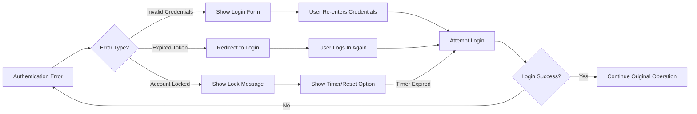
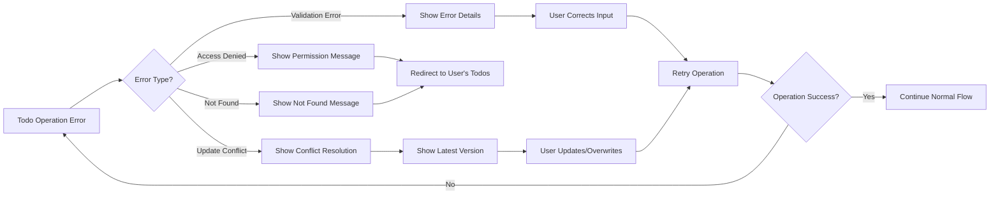
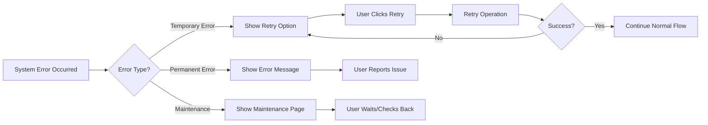

# Error Handling Requirements for Todo Application

## 1. Introduction

This document defines the comprehensive error handling strategy for the Todo list application. The error handling system is designed to provide clear, actionable feedback to users while maintaining system stability and data integrity. All error scenarios are documented using EARS (Easy Approach to Requirements Syntax) format to ensure clarity and testability.

### Error Handling Philosophy
- **User-Centric**: Error messages must be understandable by non-technical users
- **Actionable**: Every error should provide clear guidance for resolution
- **Consistent**: Error handling patterns should be consistent across all operations
- **Secure**: Error messages should not expose sensitive system information

## 2. Authentication Error Scenarios

### 2.1 User Registration Errors

**WHEN** a user attempts to register with an invalid email format, **THE** system **SHALL** return HTTP status code 400 with error code `REGISTRATION_INVALID_EMAIL` and message "Please enter a valid email address."

**WHEN** a user attempts to register with an email that already exists, **THE** system **SHALL** return HTTP status code 409 with error code `REGISTRATION_EMAIL_EXISTS` and message "An account with this email already exists. Please use a different email or try logging in."

**WHEN** a user attempts to register with a weak password, **THE** system **SHALL** return HTTP status code 400 with error code `REGISTRATION_WEAK_PASSWORD` and message "Password must be at least 8 characters long and include both letters and numbers."

### 2.2 User Login Errors

**WHEN** a user provides incorrect email or password, **THE** system **SHALL** return HTTP status code 401 with error code `LOGIN_INVALID_CREDENTIALS` and message "The email or password you entered is incorrect. Please try again."

**WHEN** a user attempts to log in to a non-existent account, **THE** system **SHALL** return HTTP status code 401 with error code `LOGIN_ACCOUNT_NOT_FOUND` and message "No account found with this email. Please check your email or register for a new account."

**WHEN** a user's account is temporarily locked due to multiple failed login attempts, **THE** system **SHALL** return HTTP status code 423 with error code `LOGIN_ACCOUNT_LOCKED` and message "Your account has been temporarily locked. Please try again in 15 minutes or reset your password."

### 2.3 Session Management Errors

**WHEN** a user's access token expires, **THE** system **SHALL** return HTTP status code 401 with error code `SESSION_TOKEN_EXPIRED` and message "Your session has expired. Please log in again."

**WHEN** a user provides an invalid or malformed access token, **THE** system **SHALL** return HTTP status code 401 with error code `SESSION_TOKEN_INVALID` and message "Invalid session. Please log in again."

**WHEN** a user attempts to access a resource without proper authentication, **THE** system **SHALL** return HTTP status code 403 with error code `AUTHENTICATION_REQUIRED` and message "You must be logged in to access this resource."

## 3. Todo Operation Errors

### 3.1 Todo Creation Errors

**WHEN** a user attempts to create a todo with an empty title, **THE** system **SHALL** return HTTP status code 400 with error code `TODO_TITLE_REQUIRED` and message "Todo title cannot be empty. Please enter a title for your todo."

**WHEN** a user attempts to create a todo with a title exceeding 255 characters, **THE** system **SHALL** return HTTP status code 400 with error code `TODO_TITLE_TOO_LONG` and message "Todo title cannot exceed 255 characters. Please shorten your title."

**WHEN** a user attempts to create a todo with an invalid due date format, **THE** system **SHALL** return HTTP status code 400 with error code `TODO_INVALID_DUE_DATE` and message "Invalid due date format. Please use YYYY-MM-DD format."

**WHEN** a user attempts to create a todo with a due date in the past, **THE** system **SHALL** return HTTP status code 400 with error code `TODO_PAST_DUE_DATE` and message "Due date cannot be in the past. Please select a future date."

### 3.2 Todo Retrieval Errors

**WHEN** a user attempts to access a todo that does not exist, **THE** system **SHALL** return HTTP status code 404 with error code `TODO_NOT_FOUND` and message "The requested todo item was not found."

**WHEN** a user attempts to access a todo that belongs to another user, **THE** system **SHALL** return HTTP status code 403 with error code `TODO_ACCESS_DENIED` and message "You do not have permission to access this todo item."

### 3.3 Todo Update Errors

**WHEN** a user attempts to update a todo that has been modified by another session, **THE** system **SHALL** return HTTP status code 409 with error code `TODO_UPDATE_CONFLICT` and message "This todo has been modified by another session. Please refresh and try again."

**WHEN** a user attempts to update a non-existent todo, **THE** system **SHALL** return HTTP status code 404 with error code `TODO_UPDATE_NOT_FOUND` and message "Cannot update: todo item not found."

**WHEN** a user attempts to mark a todo as completed that is already completed, **THE** system **SHALL** return HTTP status code 400 with error code `TODO_ALREADY_COMPLETED` and message "This todo is already marked as completed."

### 3.4 Todo Deletion Errors

**WHEN** a user attempts to delete a todo that does not exist, **THE** system **SHALL** return HTTP status code 404 with error code `TODO_DELETE_NOT_FOUND` and message "Cannot delete: todo item not found."

**WHEN** a user attempts to delete a todo that belongs to another user, **THE** system **SHALL** return HTTP status code 403 with error code `TODO_DELETE_ACCESS_DENIED` and message "You do not have permission to delete this todo item."

## 4. Data Validation Errors

### 4.1 Input Validation Errors

**WHEN** a user submits data with missing required fields, **THE** system **SHALL** return HTTP status code 400 with error code `VALIDATION_MISSING_FIELDS` and message "Required fields are missing. Please check your input."

**WHEN** a user submits data with invalid field types, **THE** system **SHALL** return HTTP status code 400 with error code `VALIDATION_INVALID_TYPE` and message "Invalid data type provided. Please check your input format."

**WHEN** a user submits data that exceeds maximum length limits, **THE** system **SHALL** return HTTP status code 400 with error code `VALIDATION_MAX_LENGTH_EXCEEDED` and message "Input exceeds maximum allowed length. Please shorten your input."

### 4.2 Business Rule Validation Errors

**WHEN** a user attempts to create more than 1000 active todos, **THE** system **SHALL** return HTTP status code 400 with error code `BUSINESS_RULE_MAX_TODOS` and message "You have reached the maximum number of active todos (1000). Please complete or delete some todos before creating new ones."

**WHEN** a user attempts to set a todo priority outside the allowed range (1-5), **THE** system **SHALL** return HTTP status code 400 with error code `BUSINESS_RULE_INVALID_PRIORITY` and message "Priority must be between 1 (lowest) and 5 (highest)."

## 5. System Failure Scenarios

### 5.1 Database Connectivity Errors

**WHEN** the database becomes unavailable during a user operation, **THE** system **SHALL** return HTTP status code 503 with error code `SYSTEM_DATABASE_UNAVAILABLE` and message "Service temporarily unavailable. Please try again in a few moments."

**WHEN** a database connection timeout occurs, **THE** system **SHALL** return HTTP status code 504 with error code `SYSTEM_DATABASE_TIMEOUT` and message "Request timeout. Please try again."

### 5.2 Server Errors

**WHEN** an unexpected server error occurs, **THE** system **SHALL** return HTTP status code 500 with error code `SYSTEM_INTERNAL_ERROR` and message "An unexpected error occurred. Our team has been notified. Please try again later."

**WHEN** the server is undergoing maintenance, **THE** system **SHALL** return HTTP status code 503 with error code `SYSTEM_MAINTENANCE` and message "The system is currently undergoing maintenance. Please try again later."

### 5.3 Network and Rate Limiting Errors

**WHEN** a user exceeds the rate limit for API requests, **THE** system **SHALL** return HTTP status code 429 with error code `SYSTEM_RATE_LIMIT_EXCEEDED` and message "Too many requests. Please slow down and try again in a few minutes."

**WHEN** a network timeout occurs during a request, **THE** system **SHALL** return HTTP status code 408 with error code `SYSTEM_REQUEST_TIMEOUT` and message "Request timeout. Please check your connection and try again."

## 6. User Recovery Flows

### 6.1 Authentication Recovery Flow



### 6.2 Todo Operation Recovery Flow



### 6.3 System Error Recovery Flow



## 7. Error Message Specifications

### 7.1 Error Message Structure

**THE** error response **SHALL** follow this consistent structure:

```json
{
  "error": {
    "code": "ERROR_CODE",
    "message": "User-friendly error message",
    "details": "Optional technical details for debugging",
    "timestamp": "2024-01-15T10:30:00Z",
    "requestId": "unique-request-identifier"
  }
}
```

### 7.2 Error Message Guidelines

**WHEN** displaying error messages to users, **THE** system **SHALL**:
- Use clear, non-technical language
- Explain what went wrong in simple terms
- Suggest specific actions the user can take
- Avoid exposing sensitive system information
- Maintain consistent tone and formatting

### 7.3 HTTP Status Code Mapping

| Error Category | HTTP Status | When to Use |
|----------------|-------------|-------------|
| Client Errors | 400-499 | User input errors, validation failures, authentication issues |
| Server Errors | 500-599 | System failures, database issues, internal errors |
| Success | 200-299 | Normal operation completion |
| Redirection | 300-399 | Authentication redirects, resource moved |

### 7.4 Error Logging Requirements

**WHEN** an error occurs, **THE** system **SHALL** log:
- Error code and message
- User ID (if authenticated)
- Request details (endpoint, parameters)
- Stack trace (for server errors)
- Timestamp and request ID

**WHEN** logging errors, **THE** system **SHALL** exclude:
- User passwords or authentication tokens
- Sensitive personal information
- Internal system configuration details

## 8. Error Handling Success Criteria

### 8.1 User Experience Metrics

**THE** error handling system **SHALL** achieve:
- 95% of users successfully recover from authentication errors on first retry
- 90% of users understand error messages without requiring support
- Less than 5% of operations result in unrecoverable errors

### 8.2 System Reliability Metrics

**THE** system **SHALL** maintain:
- Less than 1% of requests resulting in 5xx server errors
- Zero data loss due to error handling failures
- Consistent error response times under 100ms

### 8.3 Testing Requirements

**WHEN** testing error handling, **THE** development team **SHALL** verify:
- All error scenarios are properly handled
- Error messages are user-friendly and actionable
- Recovery flows work as expected
- No sensitive information is exposed in error responses
- System remains stable during error conditions

> *Developer Note: This document defines **business requirements only**. All technical implementations (architecture, APIs, database design, etc.) are at the discretion of the development team.*