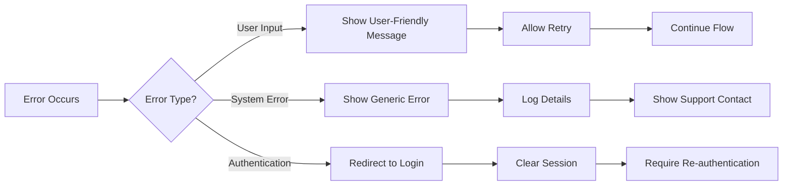

# Error Handling and Exception Management Requirements

## Introduction and Error Handling Philosophy

This document defines the comprehensive error handling requirements for the Todo application. The primary goal is to ensure that users experience minimal disruption when errors occur and can easily recover from any issues they encounter. The system shall handle errors gracefully, providing clear, actionable feedback while maintaining data integrity.

### Error Handling Principles
- **User-Friendly**: All error messages shall be clear, concise, and helpful
- **Recoverable**: Users shall be able to recover from errors without data loss
- **Secure**: Error messages shall not expose sensitive system information
- **Consistent**: Error handling shall follow consistent patterns throughout the application

## Error Categorization Framework

The Todo application shall categorize errors into three main types, each requiring different handling strategies:

### 1. User Input Errors
Errors caused by invalid user input or actions

### 2. System Errors
Errors caused by application or infrastructure failures

### 3. Authentication Errors
Errors related to user authentication and authorization



## Authentication and Authorization Errors

### Authentication Failure Scenarios

WHEN a user provides invalid login credentials, THE system SHALL display the message: "The email or password you entered is incorrect. Please try again."

WHEN a user session expires due to inactivity, THE system SHALL redirect to the login page with the message: "Your session has expired. Please log in again to continue."

WHEN a user attempts to access a resource without proper authentication, THE system SHALL return HTTP 401 status with the message: "Authentication required to access this resource."

### Authorization Failure Scenarios

WHEN a user attempts to access another user's todo items, THE system SHALL return HTTP 403 status with the message: "You don't have permission to access this todo item."

WHEN a user attempts to perform an action they're not authorized for, THE system SHALL return HTTP 403 status with the message: "You don't have permission to perform this action."

## Data Validation and Input Errors

### Todo Creation Errors

WHEN a user attempts to create a todo with empty text, THE system SHALL display the message: "Todo text cannot be empty. Please enter a description for your todo."

WHEN a user attempts to create a todo with text exceeding 500 characters, THE system SHALL display the message: "Todo text cannot exceed 500 characters. Please shorten your description."

### Todo Modification Errors

WHEN a user attempts to update a non-existent todo item, THE system SHALL display the message: "The todo item you're trying to update no longer exists."

WHEN a user attempts to mark a todo as complete that is already completed, THE system SHALL display the message: "This todo is already marked as complete."

### Input Format Errors

WHEN a user provides malformed data in any input field, THE system SHALL display the message: "The data you entered is not valid. Please check your input and try again."

## System and Infrastructure Errors

### Database Connection Errors

WHEN the system cannot connect to the database, THE system SHALL display the message: "We're experiencing technical difficulties. Please try again in a few moments."

WHEN a database query times out, THE system SHALL display the message: "The request is taking longer than expected. Please try again."

### Service Unavailability

WHEN required services are unavailable, THE system SHALL display the message: "The service is temporarily unavailable. Please try again later."

WHEN the system experiences high load, THE system SHALL display the message: "The system is currently busy. Please wait a moment and try again."

### Data Integrity Errors

WHEN data corruption is detected, THE system SHALL display the message: "We encountered an issue with your data. Our team has been notified and will resolve it shortly."

## User Recovery Flows and Error Messaging

### Error Recovery Patterns

WHEN an error occurs during todo creation, THE system SHALL preserve the user's input and allow them to retry the operation.

WHEN an error occurs during todo deletion, THE system SHALL confirm the deletion was unsuccessful and preserve the todo item.

WHEN a network error occurs, THE system SHALL automatically retry the operation up to 3 times before showing an error message.

### Error Message Standards

ALL error messages SHALL:
- Be written in clear, user-friendly language
- Explain what went wrong in simple terms
- Suggest how the user can fix the issue or what to do next
- Avoid technical jargon and system details
- Be consistent in tone and formatting

### Retry Mechanisms

WHEN a temporary error occurs, THE system SHALL provide a "Retry" button that allows users to attempt the operation again.

WHEN a persistent error occurs, THE system SHALL provide alternative actions or contact information for support.

## Logging and Monitoring Requirements

### Error Logging Standards

THE system SHALL log all errors with the following information:
- Timestamp of the error
- User ID (if authenticated)
- Error type and category
- Stack trace for system errors
- Request details (endpoint, parameters)
- User agent and IP address

### Error Monitoring

THE system SHALL monitor error rates and alert administrators when:
- Error rate exceeds 5% of total requests
- Authentication failures spike unexpectedly
- System errors indicate potential infrastructure issues

### Performance Impact Considerations

WHILE handling errors, THE system SHALL maintain response times under 2 seconds for user-facing errors.

IF error logging impacts system performance, THEN THE system SHALL implement asynchronous logging to minimize user impact.

## Error Prevention Strategies

### Input Validation

THE system SHALL validate all user input on both client and server sides to prevent common errors.

THE system SHALL provide real-time validation feedback to users as they enter data.

### Data Consistency Checks

THE system SHALL perform regular data integrity checks to prevent corruption.

THE system SHALL implement transaction rollback mechanisms for multi-step operations.

### Graceful Degradation

WHILE the system experiences partial failures, THE system SHALL continue to provide core functionality where possible.

IF non-essential features are unavailable, THEN THE system SHALL disable those features gracefully without affecting core todo operations.

## Error Handling Success Criteria

### User Experience Metrics
- 95% of errors shall be recoverable without user assistance
- Error messages shall have a user comprehension rate of 90% or higher
- Average error resolution time shall be under 30 seconds

### System Reliability Metrics
- System-wide error rate shall not exceed 2% of total requests
- Authentication errors shall account for less than 1% of total errors
- Data corruption incidents shall occur less than once per month

### Support Impact Metrics
- Error-related support tickets shall decrease by 50% after implementation
- User satisfaction with error handling shall score 4/5 or higher
- Error-related feature abandonment shall be under 5%

## Implementation Guidelines

### Error Handling Priority Levels

| Priority | Error Type | Response Time | User Impact |
|----------|------------|---------------|-------------|
| Critical | Authentication failures, Data loss | Immediate | High |
| High | System errors, Data corruption | < 5 seconds | Medium |
| Medium | Input validation errors | < 2 seconds | Low |
| Low | Warning conditions | < 1 second | Minimal |

### Error Response Templates

THE system SHALL use standardized error response templates for consistency:

```json
{
  "error": {
    "code": "ERROR_CODE",
    "message": "User-friendly message",
    "details": "Additional context for debugging",
    "recovery": "Suggested recovery action"
  }
}
```

### Testing Requirements

THE development team SHALL create comprehensive error scenario tests covering:
- All authentication failure cases
- Input validation edge cases
- System failure simulations
- Network connectivity issues
- Data corruption scenarios

This document provides the complete error handling requirements for the Todo application. Developers shall implement these requirements while maintaining the principle that errors should be invisible to users whenever possible, and when they do occur, they should be easy to understand and recover from.

> *Developer Note: This document defines **business requirements only**. All technical implementations (architecture, APIs, database design, etc.) are at the discretion of the development team.*