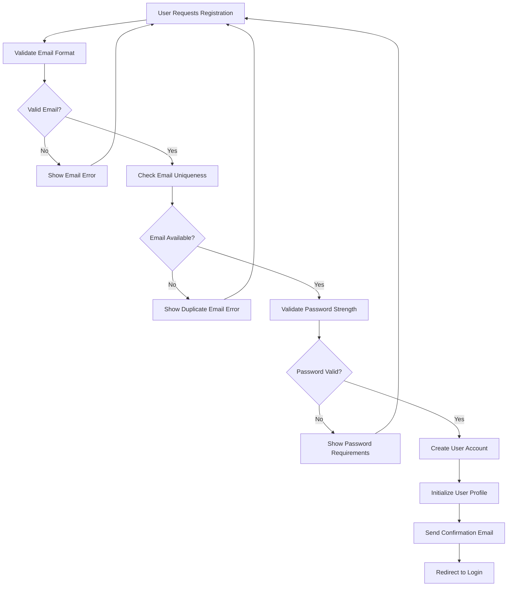
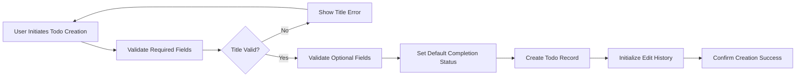
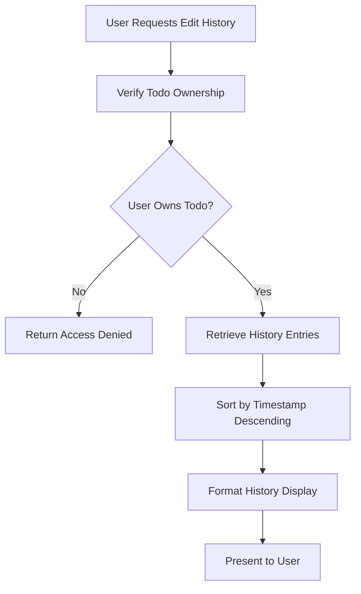
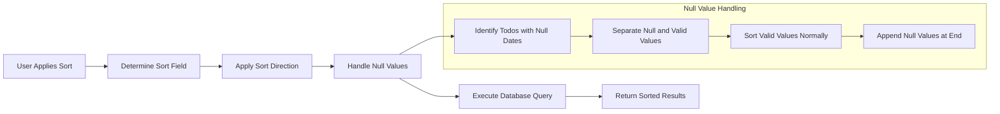

# Multi-User Todo Application Requirements Specification

## 1. Introduction

### 1.1 Purpose
This document specifies the complete requirements for a multi-user Todo application that provides private task management with comprehensive editing history, trash management, filtering, and sorting capabilities.

### 1.2 Scope
The application supports individual users managing their personal todo lists with complete privacy guarantees. Each user has isolated access to their own todos, profiles, and data.

### 1.3 Actors
- **Standard User**: Registered users who can manage their own todos and profile

## 2. User Account Management Requirements

### 2.1 User Registration

WHEN a new user wishes to create an account, THE system SHALL provide email and password-based registration with the following specifications:

- **Email Validation**: Verify email format and ensure uniqueness across all users
- **Password Requirements**: Enforce minimum password strength (8+ characters, mixed case, numbers/symbols)
- **Account Creation**: Create user account immediately upon successful validation
- **Profile Initialization**: Automatically create user profile with default display name
- **Confirmation**: Send email confirmation if required by business rules

### 2.2 User Authentication

WHEN a user attempts to log in, THE system SHALL authenticate using email and password credentials:

- **Credential Validation**: Verify email exists and password matches stored hash
- **Session Management**: Create secure session with JWT token upon successful authentication
- **Failed Attempt Handling**: Implement rate limiting and account lockout after multiple failures
- **Session Expiration**: Enforce reasonable session timeout for security

### 2.3 Password Management

WHEN a user requests to change their password, THE system SHALL:

- **Current Password Verification**: Require current password for authorization
- **New Password Validation**: Apply same strength requirements as registration
- **Security Update**: Invalidate all existing sessions and require re-authentication
- **Confirmation**: Notify user of successful password change

### 2.4 Account Deletion

WHEN a user requests to delete their account, THE system SHALL:

- **Confirmation Requirement**: Require explicit confirmation to prevent accidental deletion
- **Comprehensive Data Removal**: Permanently delete all user data including:
  - User profile information
  - All active todos
  - All todos in trash
  - Complete edit history
  - User authentication credentials
- **Irreversible Action**: Ensure account deletion cannot be reversed or recovered
- **Session Termination**: Immediately invalidate all active sessions

## 3. User Profile Management Requirements

### 3.1 Profile Structure

THE system SHALL maintain user profiles containing:

- **Display Name**: User-chosen identifier (1-50 characters, required)
- **Profile Creation Date**: Timestamp when profile was created
- **Last Updated Date**: Timestamp of most recent profile modification

### 3.2 Profile Editing

WHEN a user edits their profile display name, THE system SHALL:

- **Validation**: Ensure display name meets length and content requirements
- **Uniqueness Check**: Attempt to maintain unique display names where possible
- **Immediate Update**: Apply changes immediately upon successful validation
- **Consistent Reflection**: Update display name across all todo views and interfaces

### 3.3 Profile Privacy

THE system SHALL enforce complete profile privacy with the following guarantees:

- **No Cross-User Access**: Users cannot view or search other users' profiles
- **Isolated Data**: Profile data accessible only by the authenticated profile owner
- **No Discovery Mechanisms**: No APIs exist to discover or list other users

## 4. Todo Management Requirements

### 4.1 Todo Creation

WHEN a user creates a new todo, THE system SHALL support the following fields:

- **Title**: Required text field (1-255 characters)
- **Description**: Optional text field (maximum 2000 characters)
- **Start Date**: Optional datetime field for task commencement
- **Due Date**: Optional datetime field for task completion deadline
- **Completion Status**: Defaults to incomplete upon creation

### 4.2 Todo Viewing

#### 4.2.1 Todo List View

WHEN a user views their todo list, THE system SHALL display:

- **Paginated Results**: Support configurable page sizes (default 20 items)
- **Basic Information**: Title, completion status, start date, due date, creation date
- **Sorting Options**: Apply user-selected sorting preference
- **Filtering**: Show only items matching current filter criteria

#### 4.2.2 Single Todo View

WHEN a user views a single todo, THE system SHALL display complete details:

- **All Fields**: Title, description, start date, due date, completion status
- **Creation Information**: Original creation date and user
- **Edit History Link**: Access to complete modification history

### 4.3 Todo Completion Management

WHEN a user toggles todo completion status, THE system SHALL:

- **Simple Toggle**: Switch between complete and incomplete states
- **Immediate Update**: Apply status change without confirmation dialog
- **History Recording**: Create edit history entry for status changes
- **Visual Feedback**: Provide clear indication of current completion status

### 4.4 Todo Editing

WHEN a user edits a todo, THE system SHALL:

- **Field Updates**: Allow modification of title, description, start date, and due date
- **Validation**: Apply same validation rules as creation for updated fields
- **Atomic Operation**: Ensure all changes succeed or fail together
- **History Preservation**: Maintain complete edit history for audit purposes

## 5. Edit History Requirements

### 5.1 History Recording

WHEN any todo modification occurs, THE system SHALL create a history entry containing:

- **Timestamp**: Exact time of the modification
- **Changed Fields**: Record of which fields were modified
- **Previous Values**: Values before the modification (if changed)
- **New Values**: Values after the modification (if changed)
- **User Identifier**: Who performed the modification

### 5.2 History Viewing

WHEN a user views todo edit history, THE system SHALL:

- **Chronological Order**: Display entries from most recent to oldest
- **Complete History**: Show all modifications since todo creation
- **Field-Level Details**: Clearly indicate which specific fields changed
- **User Context**: Show which user performed each modification

### 5.3 History Integrity

THE system SHALL ensure edit history maintains data integrity through:

- **Immutable Records**: History entries cannot be modified or deleted
- **Complete Coverage**: Every modification generates a history entry
- **Temporal Accuracy**: Timestamps reflect actual modification times
- **User Attribution**: Accurately record which user performed each action

## 6. Todo Deletion and Trash Management

### 6.1 Soft Delete Implementation

WHEN a user deletes a todo, THE system SHALL implement soft deletion:

- **Non-Destructive Removal**: Move todo to trash instead of permanent deletion
- **Normal List Exclusion**: Deleted todos do not appear in standard todo lists
- **Data Preservation**: Maintain all todo data including edit history
- **Reversible Action**: Support restoration from trash

### 6.2 Trash Viewing

WHEN a user views their trash, THE system SHALL:

- **Paginated Display**: Show deleted todos with configurable page size
- **Deletion Information**: Display when each todo was deleted
- **Restore Option**: Provide ability to restore todos to active status
- **Permanent Delete Option**: Allow irreversible deletion from trash

### 6.3 Todo Restoration

WHEN a user restores a todo from trash, THE system SHALL:

- **Full Recovery**: Return todo to active status with all data intact
- **Edit History Preservation**: Maintain complete modification history
- **Normal List Inclusion**: Restored todo appears in standard todo lists
- **Timestamp Update**: Record restoration time in history

### 6.4 Permanent Deletion

WHEN a user permanently deletes a todo from trash, THE system SHALL:

- **Irreversible Removal**: Permanently delete todo and all associated data
- **Complete Data Erasure**: Remove todo record, edit history, and all references
- **Confirmation Requirement**: Require explicit confirmation for permanent deletion
- **No Recovery**: Ensure deleted data cannot be recovered

## 7. Filtering and Sorting Requirements

### 7.1 Filtering Capabilities

WHEN a user applies filters to their todo list, THE system SHALL support:

- **Completion Status Filtering**:
  - Show all todos (default)
  - Show only complete todos
  - Show only incomplete todos

- **Date-Based Filtering** (if implemented):
  - Filter by start date range
  - Filter by due date range
  - Filter by creation date range

### 7.2 Sorting Options

WHEN a user sorts their todo list, THE system SHALL provide multiple sorting methods:

- **Creation Date Sorting**:
  - Newest first (default)
  - Oldest first

- **Start Date Sorting**:
  - Earliest first
  - Latest first
  - Todos without start date appear at end

- **Due Date Sorting**:
  - Earliest first
  - Latest first
  - Todos without due date appear at end

### 7.3 Filter and Sort Persistence

THE system SHALL maintain user preferences for filtering and sorting:

- **Session Persistence**: Remember selections during user session
- **Default Restoration**: Return to default view when clearing filters
- **Responsive Updates**: Immediately apply changes to current view

## 8. Privacy and Security Requirements

### 8.1 Data Isolation

THE system SHALL ensure complete privacy between users with the following guarantees:

- **User-Specific Data Access**: Users can only access their own todos and profiles
- **No Cross-User Visibility**: No mechanism exists to view other users' data
- **Database-Level Enforcement**: Implement row-level security or equivalent
- **API-Level Validation**: Verify ownership on every data access request

### 8.2 Authentication Enforcement

WHEN processing any data access request, THE system SHALL:

- **Require Authentication**: All endpoints require valid authentication
- **Verify Ownership**: Confirm requesting user owns the accessed data
- **Prevent Information Leakage**: Return appropriate errors without revealing existence of other users' data

### 8.3 Security Implementation

THE system SHALL implement comprehensive security measures:

- **Password Hashing**: Use industry-standard bcrypt or equivalent
- **Session Security**: Implement secure JWT tokens with expiration
- **Input Validation**: Sanitize all user inputs to prevent injection attacks
- **Rate Limiting**: Protect against brute force and abuse attempts

## 9. Performance and Reliability Requirements

### 9.1 Response Time Expectations

THE system SHALL meet the following performance standards:

- **Todo List Loading**: < 500ms for typical user lists
- **Single Todo View**: < 200ms for individual todo retrieval
- **Todo Operations**: < 300ms for create, update, delete operations
- **Search and Filter**: < 1000ms for complex filtered queries

### 9.2 Scalability Requirements

THE system SHALL support:

- **Concurrent Users**: Handle 100+ simultaneous active users
- **Data Volume**: Support users with 10,000+ todos each
- **History Storage**: Efficiently manage extensive edit history
- **Database Performance**: Maintain responsiveness under load

### 9.3 Reliability Standards

THE system SHALL ensure:

- **High Availability**: 99.9% uptime for core functionality
- **Data Integrity**: No data loss during normal operations
- **Error Recovery**: Graceful handling of system failures
- **Backup Procedures**: Regular automated data backups

## 10. Error Handling and User Experience

### 10.1 Validation Errors

WHEN user input fails validation, THE system SHALL provide:

- **Clear Error Messages**: Specific, actionable error descriptions
- **Field-Level Feedback**: Identify exactly which field caused the error
- **Recovery Guidance**: Suggest how to correct the error
- **Consistent Formatting**: Uniform error presentation across all interfaces

### 10.2 System Errors

WHEN system errors occur, THE system SHALL:

- **Graceful Degradation**: Maintain basic functionality when possible
- **User-Friendly Messages**: Avoid technical jargon in error displays
- **Recovery Options**: Provide ways to retry or work around issues
- **Error Logging**: Record detailed error information for debugging

### 10.3 Success Confirmation

WHEN operations succeed, THE system SHALL provide:

- **Immediate Feedback**: Clear confirmation of successful actions
- **Visual Updates**: Immediate reflection of changes in the interface
- **Consistent State**: Ensure all views show updated information
- **Undo Options**: Where appropriate, provide ability to reverse actions

## 11. Business Rules and Constraints

### 11.1 Todo Lifecycle Rules

THE system SHALL enforce the following business rules for todo management:

- **Ownership Enforcement**: Users can only modify their own todos
- **Status Transitions**: Completion status follows simple toggle pattern
- **Edit Preservation**: All modifications are permanently recorded
- **Delete Safety**: Soft delete prevents accidental data loss

### 11.2 Date Validation Rules

WHEN handling date fields, THE system SHALL enforce:

- **Logical Date Ordering**: Start date must precede due date when both are set
- **Future Date Validation**: Prevent setting dates in the past where inappropriate
- **Null Handling**: Properly manage todos with missing date fields
- **Timezone Awareness**: Store and display dates in consistent timezone

### 11.3 User Management Rules

THE system SHALL maintain user account integrity through:

- **Unique Identification**: Ensure email addresses remain unique across all users
- **Profile Completeness**: Require valid display name for all users
- **Account Cleanup**: Comprehensive data removal during account deletion
- **Session Management**: Proper authentication state maintenance

## 12. Implementation Considerations

### 12.1 Database Design

THE system SHALL require database tables for:

- **Users**: Authentication credentials and account information
- **Profiles**: User profile data including display names
- **Todos**: Core todo items with all field definitions
- **Edit History**: Complete record of all todo modifications
- **Sessions**: User authentication session management

### 12.2 API Design

THE system SHALL provide RESTful APIs for:

- **Authentication**: Login, logout, password management
- **User Management**: Profile CRUD operations
- **Todo Management**: Complete todo lifecycle operations
- **History Access**: Todo edit history retrieval
- **Trash Management**: Deleted todo operations

### 12.3 Security Implementation

THE system SHALL implement security measures including:

- **HTTPS Enforcement**: All communications encrypted
- **Password Hashing**: Secure storage of authentication credentials
- **Input Validation**: Protection against injection attacks
- **Access Control**: Row-level security for data isolation

> *This requirements specification provides complete business requirements for backend implementation. All technical architecture decisions remain at the discretion of the development team.*