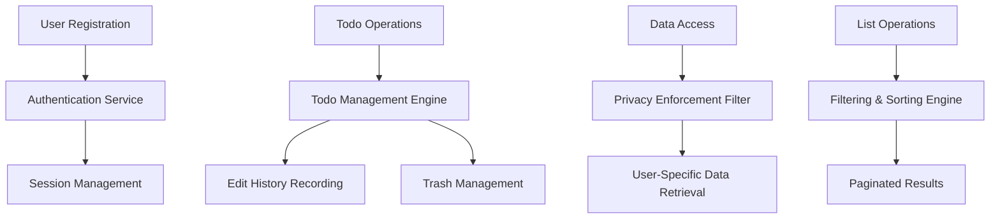

# Multi-User Todo Application Requirements Specification

## 1. Introduction

### 1.1 Document Overview
This requirements specification document provides complete business requirements for a Multi-User Todo Application that enables users to manage personal todo lists with comprehensive privacy controls, edit history tracking, and advanced organizational features.

### 1.2 Application Purpose
The application provides a secure, private todo management system where users can create, organize, track, and manage their personal tasks without collaboration or sharing capabilities. Each user's data remains completely isolated and inaccessible to other users.

### 1.3 Business Objectives
- Provide users with intuitive todo creation and management capabilities
- Ensure complete data privacy and security for all user content
- Enable flexible organization through filtering, sorting, and trash management
- Maintain comprehensive audit trails of all todo modifications
- Support scalable user growth with efficient data handling

## 2. System Architecture Overview

### 2.1 Core Components
The system comprises several integrated components that work together to deliver the complete functionality:

- **Authentication System**: Manages user accounts, sessions, and security
- **Todo Management Engine**: Handles todo creation, viewing, and modification
- **Edit History Service**: Tracks and maintains complete modification records
- **Trash Management System**: Implements soft delete and restore functionality
- **Filtering and Sorting Engine**: Provides flexible todo organization
- **Privacy Enforcement Layer**: Ensures strict data isolation between users

### 2.2 Data Flow Architecture


## 3. User Authentication and Account Management

### 3.1 User Registration Process
**WHEN a new user attempts to register, THE system SHALL:**
- Validate email format and ensure uniqueness across the system
- Verify password meets minimum complexity requirements
- Create user account with unique identifier
- Generate secure authentication tokens
- Send email verification if required by security policy

**Registration Data Requirements:**
- **Email Address**: Primary identifier (unique, valid email format)
- **Password**: Minimum 8 characters with complexity requirements
- **Display Name**: Optional field (max 50 characters)

### 3.2 Authentication and Session Management
**WHEN a user logs in successfully, THE system SHALL:**
- Validate credentials against stored authentication data
- Generate JSON Web Tokens (JWT) for secure session management
- Establish user context for all subsequent operations
- Record login activity for security monitoring
- Return user profile information and authentication tokens

**Session Security Requirements:**
- JWT tokens with 30-minute access token expiration
- Secure cookie storage with HttpOnly and Secure flags
- Automatic session timeout after 30 minutes of inactivity
- Cryptographic validation of all authentication tokens

### 3.3 Password Management
**WHEN a user changes their password, THE system SHALL:**
- Verify current password for security confirmation
- Validate new password meets complexity requirements
- Update password hash using secure hashing algorithms
- Invalidate existing sessions for security enforcement
- Send confirmation notification to the user

**Password Complexity Rules:**
- Minimum length: 8 characters
- Must contain: uppercase letters, lowercase letters, numbers
- Must NOT contain: easily guessable patterns or common passwords

### 3.4 Account Deletion Process
**WHEN a user requests account deletion, THE system SHALL:**
- Require password confirmation for security verification
- Permanently remove all user-associated data including:
  - User profile information
  - All active todo items
  - All todos in trash state
  - Complete edit history records
  - User session and authentication data
- Execute complete data erasure without retention periods
- Send confirmation of successful account deletion

## 4. Todo Data Model and Field Specifications

### 4.1 Core Todo Structure
Each todo item contains the following data fields with specific constraints:

**Required Fields:**
- **Todo ID**: Unique identifier (system-generated UUID)
- **Title**: Task description (1-255 characters, required)
- **Completion Status**: Boolean indicating completion state (default: false)
- **Creation Date**: System timestamp of creation
- **Owner ID**: Reference to owning user account
- **Deleted Flag**: Boolean indicating soft delete status (default: false)

**Optional Fields:**
- **Description**: Detailed task information (max 10,000 characters)
- **Start Date**: Planned start date (optional, ISO 8601 format)
- **Due Date**: Target completion date (optional, ISO 8601 format)
- **Last Modified Date**: Timestamp of most recent modification

### 4.2 Field Validation Rules
**Title Validation Constraints:**
- **WHEN** creating or updating a todo title, **THE system SHALL** validate that the title is:
  - Non-empty string
  - Between 1 and 255 characters in length
  - Not consisting solely of whitespace characters
  - Properly encoded to prevent injection attacks

**Date Validation Requirements:**
- **IF** both start date and due date are provided, **THE system SHALL** ensure start date is not after due date
- **WHEN** validating dates, **THE system SHALL** accept only valid ISO 8601 formatted dates
- **THE system SHALL** allow dates in the past but display appropriate warnings to users

**Description Handling:**
- **THE system SHALL** support multi-line text with proper line break handling
- **WHEN** description contains special characters, **THE system SHALL** apply appropriate encoding
- **THE system SHALL** limit description length to 10,000 characters for performance optimization

## 5. Todo Creation and Management

### 5.1 Todo Creation Process
**WHEN a user creates a new todo, THE system SHALL:**
- Present creation form with required and optional fields
- Validate all input data against business rules
- Assign automatic system-generated values including:
  - Unique todo identifier (UUID)
  - Current timestamp for creation date
  - Owner assignment to current user
  - Default completion status (incomplete)
  - Empty edit history array initialization
- Create the todo record in persistent storage
- Return success confirmation with created todo details

**Creation Interface Requirements:**
- Title input field with real-time character count validation
- Description text area with maximum length indicator
- Date picker widgets for start and due dates with calendar interface
- Clear indication of required vs optional fields
- Immediate validation feedback during data entry

### 5.2 Todo Viewing Capabilities

#### 5.2.1 Single Todo View
**WHEN a user views an individual todo, THE system SHALL display:**
- Complete title with proper formatting
- Full description with preserved line breaks and formatting
- Clear completion status indicator with visual cues
- Start date and due date (if specified)
- Creation date and last modification timestamp
- Access to complete edit history
- Action buttons for editing, deleting, and completion toggling

#### 5.2.2 Todo List View
**THE system SHALL provide paginated list display with:**
- Configurable page sizes (default: 20 items per page)
- Visual indicators for completion status
- Display of key information: title, status, dates, creation timestamp
- Clickable items that navigate to detailed todo view
- Pagination controls with page numbers and navigation arrows
- Total item count display for current filter criteria

### 5.3 Completion Status Management
**WHEN a user toggles completion status, THE system SHALL:**
- Immediately update the completion status in the database
- Record the status change timestamp for audit purposes
- Update the last modified date of the todo
- Provide immediate visual feedback in the user interface
- Maintain consistency across all views and filters

**Completion Workflow Rules:**
- **WHEN** marking as complete: set status to true and record completion timestamp
- **WHEN** marking as incomplete: set status to false and clear completion timestamp
- **THE system SHALL** ensure completion toggle operations are atomic and consistent

### 5.4 Todo Editing and Modification
**WHEN a user edits a todo, THE system SHALL:**
- Present edit form pre-populated with current values
- Validate all modifications against business rules
- Create comprehensive edit history entry recording:
  - Timestamp of modification
  - User who performed the edit
  - Specific fields that were changed
  - Previous and new values for each modified field
- Update the todo with new values
- Update last modified timestamp
- Return to todo view with success confirmation

**Edit Validation Requirements:**
- **THE system SHALL** prevent edits that would violate business rules
- **WHEN** concurrent edits occur, **THE system SHALL** detect conflicts and provide resolution options
- **THE system SHALL** maintain data integrity throughout edit operations

## 6. Edit History System

### 6.1 History Recording Mechanism
**THE system SHALL implement comprehensive edit tracking with the following capabilities:**

**WHEN any todo field is modified, THE system SHALL create a history entry containing:**
- Unique history entry identifier
- Exact timestamp of modification (millisecond precision)
- User identifier of the person making the change
- Specific field(s) that were modified
- Previous value(s) of modified fields
- New value(s) after modification
- Type of operation (create, update, field-specific change)

**History Entry Structure:**
Each history entry shall follow a standardized format:
```json
{
  "historyId": "uuid",
  "timestamp": "2024-01-15T10:30:45.123Z",
  "userId": "user-uuid",
  "operation": "field_update",
  "changes": [
    {
      "field": "title",
      "previousValue": "Old Title",
      "newValue": "New Title"
    }
  ]
}
```

### 6.2 History Viewing Interface
**WHEN a user views edit history, THE system SHALL provide:**
- Chronologically ordered list of all modifications (most recent first)
- Clear indication of what changed in each modification
- Timestamps formatted for user readability
- Visual differentiation between different types of changes
- Pagination for todos with extensive edit history
- Search and filter capabilities within history entries

**History Display Requirements:**
- **EACH** history entry shall clearly indicate which fields were modified
- **THE system SHALL** display before and after values for changed fields
- **WHEN** multiple fields change simultaneously, **THE system SHALL** group them in a single history entry
- **THE interface SHALL** provide intuitive navigation through historical changes

## 7. Trash Management System

### 7.1 Soft Delete Implementation
**WHEN a user deletes a todo, THE system SHALL:**
- Mark the todo as deleted (soft delete) instead of permanent removal
- Move the todo to the user's trash collection
- Remove the todo from normal listing views
- Preserve all todo data including edit history
- Provide confirmation of successful deletion

**Soft Delete Characteristics:**
- Deleted todos remain accessible through trash interface
- All todo properties and history are preserved
- Users can restore deleted todos to their original state
- Trash management follows the same privacy rules as active todos

### 7.2 Trash Interface
**THE system SHALL provide dedicated trash management with:**
- Paginated list view of all deleted todos
- Display of deletion timestamp for each item
- Restore functionality to return todos to active state
- Permanent deletion option for complete removal
- Search and filter capabilities within trash
- Bulk operations for multiple todo management

### 7.3 Restoration Process
**WHEN a user restores a todo from trash, THE system SHALL:**
- Remove the deleted flag from the todo
- Return the todo to active status
- Make the todo visible in normal listing views
- Preserve all original properties and edit history
- Provide confirmation of successful restoration

### 7.4 Permanent Deletion
**WHEN a user permanently deletes a todo from trash, THE system SHALL:**
- Require explicit confirmation due to irreversible nature
- Completely remove the todo record from the database
- Delete all associated edit history entries
- Provide final confirmation of permanent deletion
- Ensure no data recovery is possible after deletion

**Permanent Deletion Safeguards:**
- **THE system SHALL** provide clear warning about irreversible data loss
- **WHEN** confirming permanent deletion, **THE system SHALL** require additional verification
- **THE operation SHALL** be logged for security and audit purposes

## 8. Filtering and Sorting Capabilities

### 8.1 Filtering Functionality
**THE system SHALL provide comprehensive filtering options for todo lists:**

**Completion Status Filters:**
- **All Todos**: Display todos regardless of completion status
- **Complete Only**: Show only completed todo items
- **Incomplete Only**: Show only pending todo items

**Filter Implementation Requirements:**
- **WHEN** applying filters, **THE system SHALL** update display immediately
- **THE system SHALL** maintain filter state during user session
- **FILTER selections SHALL** work consistently across all list views
- **THE interface SHALL** clearly indicate active filter criteria

### 8.2 Sorting Mechanisms
**USERS SHALL be able to sort their todo lists by multiple criteria:**

**Sorting Options:**
- **Creation Date**: Newest first or oldest first
- **Start Date**: Earliest first or latest first
- **Due Date**: Earliest first or latest first

**Sorting Logic Specifications:**
- **WHEN** sorting by start date or due date, **THE system SHALL** place items without dates at the end
- **SORT order SHALL** be preserved during pagination navigation
- **USERS SHALL** be able to toggle between ascending and descending order
- **THE default sort order SHALL** be creation date (newest first)

### 8.3 Combined Filtering and Sorting
**THE system SHALL support simultaneous application of filters and sorting:**
- **USERS SHALL** be able to apply any filter combination with any sort order
- **THE interface SHALL** provide clear indication of active filters and sort criteria
- **RESULT counts SHALL** reflect the current filter and sort configuration
- **PERFORMANCE SHALL** be maintained regardless of filter complexity

## 9. Privacy and Security Enforcement

### 9.1 Data Isolation Principles
**THE system SHALL implement strict data isolation with the following rules:**

**User Data Segregation:**
- **EACH user SHALL** have complete privacy for their todo data
- **NO user SHALL** be able to view, access, or modify another user's todos
- **THE system SHALL** enforce data isolation at all application layers
- **ALL database queries SHALL** automatically include user-based filtering

**Access Control Implementation:**
- **WHEN** processing any request, **THE system SHALL** verify user ownership of requested resources
- **API endpoints SHALL** validate that users can only access their own data
- **DATABASE queries SHALL** include mandatory user ID filters
- **AUDIT logging SHALL** track all data access attempts

### 9.2 Authentication and Authorization
**THE system SHALL maintain robust security through:**

**Authentication Requirements:**
- **ALL operations SHALL** require valid user authentication
- **SESSION management SHALL** use secure JWT tokens with expiration
- **PASSWORD storage SHALL** use industry-standard cryptographic hashing
- **LOGIN attempts SHALL** be rate-limited to prevent brute force attacks

**Authorization Enforcement:**
- **USER permissions SHALL** be verified before every data access operation
- **UNAUTHORIZED access attempts SHALL** be logged and blocked
- **ERROR messages SHALL** not reveal existence of other users' data
- **SECURITY monitoring SHALL** detect and alert on suspicious activity patterns

### 9.3 Profile Privacy
**USER profile management SHALL adhere to strict privacy standards:**
- **PROFILES SHALL** be completely private and not discoverable by other users
- **NO user SHALL** be able to view another user's profile information
- **THE system SHALL** not provide any user discovery or search functionality
- **PROFILE data SHALL** only be accessible to the profile owner

## 10. Performance and Scalability Requirements

### 10.1 Response Time Standards
**THE system SHALL meet the following performance benchmarks:**

**Operation Performance Targets:**
- **TODO list loading**: Under 2 seconds for typical user collections
- **SINGLE todo operations** (create, update, delete): Under 1 second
- **AUTHENTICATION operations**: Under 1.5 seconds
- **FILTERING and sorting operations**: Under 500 milliseconds
- **PAGINATION navigation**: Under 300 milliseconds

### 10.2 Scalability Specifications
**THE system architecture SHALL support:**
- **UP to 10,000 todos per user** without performance degradation
- **CONCURRENT operations** from multiple users simultaneously
- **EFFICIENT indexing** for quick todo retrieval by various criteria
- **GRACEFUL degradation** under high load conditions

### 10.3 Data Integrity and Consistency
**THE system SHALL ensure data reliability through:**
- **ATOMIC operations** for all todo modifications
- **CONSISTENT data** across all views and operations
- **PROPER error handling** for concurrent modifications
- **DATA backup and recovery** procedures for business continuity

## 11. Error Handling and User Experience

### 11.1 Error Prevention and Validation
**THE system SHALL implement comprehensive input validation:**

**Client-Side Validation:**
- **REAL-TIME validation** during form data entry
- **CLEAR error messages** with specific guidance for correction
- **PREVENTIVE measures** to avoid common user errors
- **CONTEXTUAL help** for complex field requirements

**Server-Side Validation:**
- **COMPREHENSIVE validation** of all incoming data
- **BUSINESS rule enforcement** at the application layer
- **CONSISTENT error responses** across all API endpoints
- **SECURITY validation** to prevent injection attacks

### 11.2 Error Recovery and User Guidance
**WHEN errors occur, THE system SHALL provide:**

**Clear Error Communication:**
- **USER-FRIENDLY error messages** that explain the problem
- **SPECIFIC guidance** on how to resolve the issue
- **RECOVERY options** when available
- **REFERENCE codes** for support purposes

**Graceful Error Handling:**
- **DATA preservation** during error conditions
- **AUTOMATIC retry mechanisms** for transient failures
- **SESSION recovery** for authentication issues
- **PROGRESS indicators** for long-running operations

### 11.3 Success Confirmation and Feedback
**THE system SHALL provide positive user feedback through:**
- **IMMEDIATE confirmation** of successful operations
- **VISUAL indicators** of completed actions
- **STATUS updates** for multi-step processes
- **AUTO-DISMISSING messages** for routine operations

## 12. Compliance and Standards

### 12.1 Data Protection Compliance
**THE system SHALL adhere to relevant data protection standards:**
- **DATA encryption** for sensitive information at rest and in transit
- **PRIVACY by design** principles throughout the architecture
- **DATA retention policies** aligned with regulatory requirements
- **USER consent mechanisms** for data processing activities

### 12.2 Accessibility Standards
**THE application SHALL meet accessibility requirements including:**
- **WCAG 2.1 compliance** for user interface accessibility
- **KEYBOARD navigation** support for all functionality
- **SCREEN READER compatibility** with proper ARIA labels
- **COLOR contrast ratios** meeting accessibility guidelines
- **RESPONSIVE design** for various device sizes and orientations

### 12.3 Internationalization Considerations
**THE system architecture SHALL support:**
- **MULTI-LANGUAGE support** for user interface elements
- **LOCALIZED date and time formatting**
- **INTERNATIONAL character sets** for user content
- **TIMEZONE handling** for date-sensitive operations

## 13. Implementation Guidelines

### 13.1 Development Best Practices
**THE implementation SHALL follow established software engineering practices:**
- **MODULAR architecture** with clear separation of concerns
- **COMPREHENSIVE testing** including unit, integration, and end-to-end tests
- **CODE quality standards** with linting and static analysis
- **DOCUMENTATION coverage** for all components and APIs
- **VERSION control** with proper branching and release management

### 13.2 Security Implementation
**SECURITY measures SHALL be implemented at multiple layers:**
- **INPUT sanitization** to prevent injection attacks
- **AUTHENTICATION hardening** with secure token management
- **DATA validation** at both client and server levels
- **AUDIT logging** for security monitoring and incident response
- **REGULAR security updates** for dependencies and frameworks

### 13.3 Performance Optimization
**THE system SHALL employ performance optimization strategies:**
- **DATABASE indexing** for efficient query performance
- **CACHING strategies** for frequently accessed data
- **LAZY loading** techniques for large data sets
- **COMPRESSION methods** for network traffic reduction
- **MONITORING systems** for performance metric tracking

This comprehensive requirements specification provides the foundation for developing a robust, secure, and user-friendly Multi-User Todo Application that meets all specified business objectives while maintaining the highest standards of data privacy and system reliability.