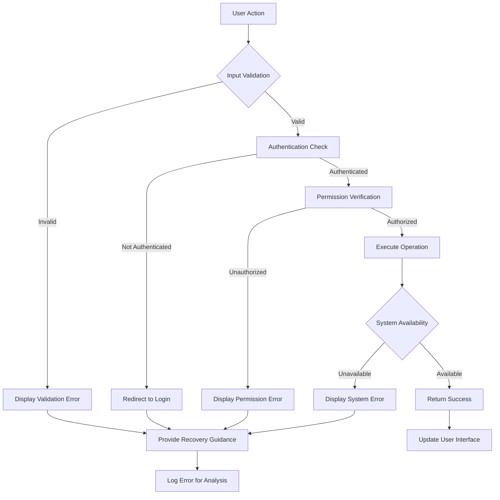

# Error Handling Scenarios for Multi-User Todo Application

## Document Overview

This document defines the comprehensive error handling and exception scenarios for the multi-user Todo application. It specifies how the system should handle various error conditions from a user's perspective, ensuring clear communication and appropriate recovery mechanisms. The error handling system is designed to maintain user confidence, provide actionable guidance, and preserve data integrity throughout all error scenarios.

## Authentication Errors

### User Registration Failures

**WHEN** a user attempts to register with an email that already exists in the system, **THE** system **SHALL** display a clear error message: "This email address is already registered. Please use a different email or try logging in."

**WHEN** a user attempts to register with an invalid email format, **THE** system **SHALL** validate the email format against RFC 5322 standards and display: "Please enter a valid email address format (e.g., user@example.com)."

**WHEN** a user attempts to register with a password that doesn't meet security requirements, **THE** system **SHALL** specify: "Password must be at least 8 characters long and include uppercase letters, lowercase letters, and numbers."

**WHEN** a user submits registration with missing required fields, **THE** system **SHALL** highlight the missing fields and display: "Please complete all required fields marked with asterisks (*)."

### User Login Failures

**WHEN** a user attempts to log in with incorrect credentials, **THE** system **SHALL** display a generic error message: "Invalid email or password. Please try again." to prevent email enumeration attacks.

**WHEN** a user's account has been temporarily locked due to 5 consecutive failed login attempts, **THE** system **SHALL** inform: "Account temporarily locked. Please try again in 15 minutes or reset your password."

**WHEN** a user's authentication token expires during an active session, **THE** system **SHALL** automatically attempt token refresh and display: "Session expired. Please log in again to continue."

**WHEN** a user attempts to access a protected resource without authentication, **THE** system **SHALL** redirect to the login page with: "Please log in to access this feature."

### Password Management Failures

**WHEN** a user attempts to change their password with an incorrect current password, **THE** system **SHALL** display: "Current password is incorrect. Please verify your current password."

**WHEN** a user requests a password reset for an unregistered email, **THE** system **SHALL** display the same generic message as for registered emails: "If this email is registered, you will receive password reset instructions."

**WHEN** a password reset token expires or is invalid, **THE** system **SHALL** display: "This password reset link has expired. Please request a new password reset."

### Account Management Failures

**WHEN** a user attempts to delete their account with incorrect password confirmation, **THE** system **SHALL** display: "Password confirmation failed. Please enter your current password correctly to delete your account."

**WHEN** account deletion fails due to system constraints, **THE** system **SHALL** display: "Unable to delete account at this time. Please try again later or contact support."

## Validation Failures

### Todo Creation Validation Errors

**WHEN** a user attempts to create a todo without a title, **THE** system **SHALL** highlight the title field and display: "Todo title is required. Please enter a title for your todo."

**WHEN** a user enters a todo title exceeding 200 characters, **THE** system **SHALL** display: "Title cannot exceed 200 characters. Current length: [current length]/200."

**WHEN** a user sets a due date that is before the start date, **THE** system **SHALL** display: "Due date cannot be before start date. Please adjust your dates."

**WHEN** a user enters an invalid date format, **THE** system **SHALL** display: "Please enter dates in the format YYYY-MM-DD or use the date picker."

### Todo Editing Validation Errors

**WHEN** a user attempts to save todo edits with an empty title, **THE** system **SHALL** preserve other edits and display: "Todo title cannot be empty. Please enter a title."

**WHEN** a user attempts to edit a todo that has been permanently deleted, **THE** system **SHALL** display: "This todo no longer exists. It may have been permanently deleted."

**WHEN** concurrent edits conflict, **THE** system **SHALL** display: "This todo was modified by another session. Please refresh and try your edit again."

### Profile Editing Validation Errors

**WHEN** a user attempts to set an empty display name, **THE** system **SHALL** display: "Display name cannot be empty. Please enter a name."

**WHEN** a user enters a display name with invalid characters, **THE** system **SHALL** display: "Display name can only contain letters, numbers, spaces, and common punctuation."

**WHEN** a display name exceeds 50 characters, **THE** system **SHALL** display: "Display name cannot exceed 50 characters. Current length: [current length]/50."

## Permission Denials

### Todo Access Denials

**WHEN** a user attempts to access a todo that doesn't exist or belongs to another user, **THE** system **SHALL** display: "Todo not found. It may have been deleted or you may not have permission to view it."

**WHEN** a user attempts to edit a todo they don't own, **THE** system **SHALL** display: "You don't have permission to edit this todo."

**WHEN** a user attempts to view another user's trash or edit history, **THE** system **SHALL** return the same generic "not found" error to prevent information disclosure.

### Profile and Account Access Denials

**WHEN** a user attempts to view another user's profile, **THE** system **SHALL** redirect to their own profile with: "Redirected to your profile."

**WHEN** a user attempts to modify another user's account settings, **THE** system **SHALL** log the attempt and display: "Access denied. You can only modify your own account settings."

## System Errors

### Network and Connectivity Issues

**WHEN** the system experiences network connectivity issues during todo operations, **THE** system **SHALL** display: "Network connection lost. Changes will be saved locally and synced when connection is restored."

**WHEN** a user loses internet connection while editing a todo, **THE** system **SHALL** automatically save draft changes and display a connectivity status indicator.

**WHEN** the system cannot reach authentication services, **THE** system **SHALL** display: "Authentication service unavailable. Please check your internet connection and try again."

### Server Errors

**WHEN** the backend server returns a 500 Internal Server Error, **THE** system **SHALL** display: "Something went wrong on our end. Please try again in a few moments."

**WHEN** the database is temporarily unavailable, **THE** system **SHALL** display: "System maintenance in progress. Please try again shortly."

**WHEN** the system experiences high load, **THE** system **SHALL** display: "System is experiencing high traffic. Your request has been queued and will be processed shortly."

### Data Integrity Errors

**WHEN** a todo cannot be saved due to data corruption, **THE** system **SHALL** attempt recovery and display: "We encountered an issue saving your todo. Please try again. If the problem persists, contact support."

**WHEN** edit history entries cannot be created, **THE** system **SHALL** log the issue but allow the primary todo operation to proceed with: "Todo saved successfully, but history tracking was temporarily unavailable."

**WHEN** data synchronization fails between devices, **THE** system **SHALL** display: "Sync conflict detected. Please review the changes and resolve conflicts."

## Recovery Processes

### Authentication Recovery

**WHEN** a user forgets their password, **THE** system **SHALL** provide a password reset flow with email verification and clear instructions at each step.

**WHEN** a user's account is locked, **THE** system **SHALL** provide specific unlock instructions based on the lock reason (too many attempts, suspicious activity, etc.).

**WHEN** authentication tokens expire, **THE** system **SHALL** automatically attempt token refresh before requiring full re-authentication.

### Data Recovery

**WHEN** a user accidentally deletes a todo, **THE** system **SHALL** provide easy access to the trash with: "Todo moved to trash. You can restore it within 30 days."

**WHEN** a user makes an incorrect edit to a todo, **THE** system **SHALL** provide access to edit history with: "View edit history to see previous versions and restore if needed."

**WHEN** system errors cause data inconsistency, **THE** system **SHALL** provide data integrity checks and recovery tools with guided resolution steps.

### Operation Recovery

**WHEN** a todo operation fails due to temporary issues, **THE** system **SHALL** provide clear retry mechanisms with: "Operation failed. [Retry] or [Cancel]"

**WHEN** bulk operations partially fail, **THE** system **SHALL** provide detailed reports: "3 of 5 todos deleted successfully. 2 failed due to [reason]."

**WHEN** pagination or filtering operations fail, **THE** system **SHALL** reset to default view: "Unable to apply filter. Showing all todos instead."

## Error Message Guidelines

### User-Friendly Messaging Principles

**THE** system **SHALL** display error messages in clear, actionable language that helps users understand what went wrong and how to fix it.

**THE** system **SHALL** avoid technical jargon and system-specific error codes in user-facing messages.

**THE** system **SHALL** provide specific guidance for recoverable errors and generic, reassuring messages for non-recoverable errors.

### Security-First Error Handling

**THE** system **SHALL** avoid revealing sensitive information in error messages that could aid attackers in enumeration or system analysis.

**WHEN** handling authentication errors, **THE** system **SHALL** use consistent messaging patterns to prevent information leakage about valid vs. invalid accounts.

**THE** system **SHALL** log detailed error information server-side while displaying user-friendly, security-conscious messages client-side.

## Error Handling Flow

## Error Severity Classification

### Informational Messages (Level 1)
- Input format suggestions and improvements
- Feature availability notices and recommendations
- System status information and maintenance announcements
- Performance optimization suggestions

### Warning Messages (Level 2)
- Validation warnings that don't prevent operation completion
- Optional feature limitations and workarounds
- Performance degradation notifications
- Deprecation warnings for older features

### Error Conditions (Level 3)
- Validation failures that prevent operation completion
- Permission denials and access restrictions
- Temporary system unavailability notifications
- Data consistency issues requiring user intervention

### Critical Errors (Level 4)
- Account security issues requiring immediate action
- Data corruption requiring administrative intervention
- Permanent system failures requiring support contact
- Security breach notifications

## User Experience Expectations

### Response Time Standards

**WHEN** displaying validation errors, **THE** system **SHALL** respond instantly (under 100ms) without noticeable delay.

**WHEN** handling permission checks, **THE** system **SHALL** respond within 2 seconds to maintain user flow.

**WHEN** recovering from system errors, **THE** system **SHALL** provide status updates every 5 seconds to manage user expectations.

### Error Recovery Performance

**WHEN** network connectivity is restored, **THE** system **SHALL** automatically retry failed operations within 10 seconds.

**WHEN** authentication tokens expire, **THE** system **SHALL** attempt refresh within 30 seconds before requiring re-login.

**WHEN** data synchronization fails, **THE** system **SHALL** provide manual sync options with clear progress indicators and estimated completion times.

### Accessibility Requirements

**THE** error messaging system **SHALL** be fully accessible via keyboard navigation and screen readers.

**THE** system **SHALL** provide appropriate ARIA labels and descriptions for all error states and recovery actions.

**WHERE** visual changes occur due to errors, **THE** system **SHALL** ensure screen reader users receive equivalent information.

## Compliance and Logging

### Error Logging Standards

**THE** system **SHALL** log all authentication failures with timestamps, IP addresses, and user agents for security monitoring.

**THE** system **SHALL** log permission denial attempts with user context, resource information, and action details.

**THE** system **SHALL** log system errors with sufficient detail for debugging while protecting user privacy through data anonymization.

### Privacy Compliance

**THE** system **SHALL** ensure that error messages and logs do not reveal sensitive user information or system vulnerabilities.

**THE** system **SHALL** comply with data protection regulations regarding error handling and user data disclosure.

**WHERE** required by law, **THE** system **SHALL** provide users with access to their error history upon request, subject to privacy constraints.

### Audit Trail Requirements

**THE** system **SHALL** maintain comprehensive audit trails of all error conditions and recovery actions.

**WHEN** security-related errors occur, **THE** system **SHALL** trigger appropriate security protocols and notifications.

**THE** audit trails **SHALL** be retained for compliance purposes according to data retention policies.

## Success Metrics and Monitoring

### Error Rate Tracking

**THE** system **SHALL** monitor and track error rates across different operation types and user segments.

**WHEN** error rates exceed established thresholds, **THE** system **SHALL** trigger alerts for investigation and resolution.

**THE** error rate metrics **SHALL** be used for continuous improvement of error handling mechanisms.

### User Satisfaction Measurement

**THE** system **SHALL** measure user satisfaction with error handling through:
- User feedback surveys following error resolution
- Support ticket analysis and resolution times
- User retention rates following error incidents
- Error recovery success rates and user completion metrics

### Performance Benchmarks

**THE** error handling system **SHALL** meet the following performance benchmarks:
- 95% of authentication errors resolved within user expectations
- 99% of validation errors provide clear, actionable guidance
- Maximum error resolution time not exceeding 3x the average target
- User satisfaction with error handling exceeding 90%

## Integration with Other System Components

### Relationship with Authentication System

**THE** error handling system **SHALL** integrate seamlessly with authentication workflows to provide consistent error messaging across login, registration, and session management.

**WHEN** authentication errors occur, **THE** system **SHALL** maintain session state appropriately to prevent data loss.

### Relationship with Data Validation

**THE** error handling **SHALL** work in conjunction with data validation rules to provide immediate feedback during user input.

**WHERE** possible, **THE** system **SHALL** implement client-side validation to prevent unnecessary server round-trips for validation errors.

### Relationship with User Interface

**THE** error messages **SHALL** be integrated into the user interface design to ensure visual consistency and accessibility.

**THE** error recovery actions **SHALL** be prominently displayed and easily accessible within the application workflow.

## Continuous Improvement Process

### Error Analysis and Learning

**THE** system **SHALL** regularly analyze error patterns to identify common user mistakes and system weaknesses.

**WHERE** patterns indicate user confusion, **THE** system **SHALL** improve user guidance and interface design.

**WHERE** patterns indicate system issues, **THE** system **SHALL** prioritize fixes and enhancements.

### User Feedback Integration

**THE** error handling system **SHALL** incorporate user feedback to improve error messages and recovery processes.

**WHEN** users report confusion or dissatisfaction with error handling, **THE** development team **SHALL** prioritize improvements.

### Regular Review and Updates

**THE** error handling requirements **SHALL** be reviewed quarterly to ensure they remain effective and up-to-date.

**WHERE** new error scenarios emerge, **THE** system **SHALL** be updated to handle them appropriately.

This comprehensive error handling specification ensures the multi-user Todo application provides robust, user-friendly error management that maintains data integrity, preserves user confidence, and supports efficient problem resolution across all system interactions.