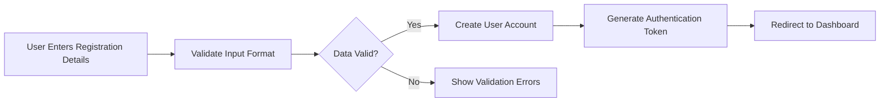
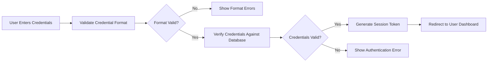
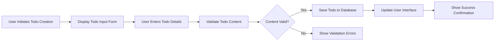
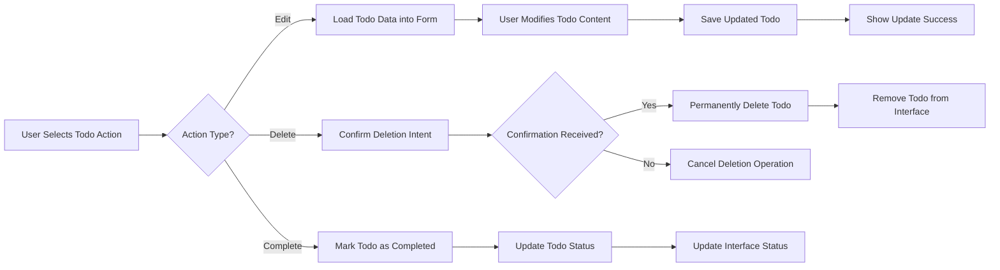

# Integration Requirements Specification for Todo Application

## Executive Summary

This document defines the integration requirements for the Todo application, focusing on the minimal external dependencies and interaction patterns necessary to deliver core todo management functionality. The application follows a self-contained architecture with minimal external integrations to maintain simplicity and reliability.

## External Service Integrations

### Core Integration Requirements

**Authentication Service Integration**
- THE authentication system SHALL provide user registration and login capabilities
- WHEN a user attempts to access protected resources, THE system SHALL validate authentication tokens
- IF authentication fails, THEN THE system SHALL redirect users to the login interface

**Data Persistence Integration**
- THE system SHALL persist todo items and user data across sessions
- WHEN a user creates or modifies a todo item, THE system SHALL immediately save the changes
- WHILE the application is online, THE system SHALL maintain real-time data synchronization

### Integration Architecture Principles
- **Simplicity First**: Minimize external dependencies to reduce complexity
- **Self-Contained Design**: Prefer built-in functionality over external services
- **Reliability Focus**: Ensure core functionality works without external dependencies

## API Interaction Patterns

### User Authentication Patterns

**Registration Flow**

**Login Flow**

### Todo Management Patterns

**Create Todo Flow**

**Todo Operations Flow**

## Data Exchange Requirements

### Data Format Specifications

**User Data Exchange**
- THE system SHALL exchange user profile information in structured format
- WHEN transmitting sensitive user data, THE system SHALL use secure encryption
- WHERE user preferences are involved, THE system SHALL maintain data consistency

**Todo Data Exchange**
- THE system SHALL maintain todo item integrity during data transfer
- WHEN synchronizing todo data, THE system SHALL preserve creation timestamps
- WHILE processing batch operations, THE system SHALL maintain operation order

### Data Validation Rules
- **Input Validation**: All user inputs SHALL be validated before processing
- **Format Consistency**: Data formats SHALL remain consistent across operations
- **Error Handling**: Invalid data SHALL trigger appropriate error responses

## Third-Party Dependencies

### Current Dependencies

**Authentication Provider**
- THE system SHALL manage user authentication internally
- No external authentication services are required for minimum functionality

**Data Storage**
- THE system SHALL use built-in persistence mechanisms
- External database services are optional for enhanced scalability

### Dependency Management Principles
- **Minimal Dependency**: Prefer zero external dependencies for core functionality
- **Progressive Enhancement**: Additional services may be added for advanced features
- **Fallback Mechanisms**: Core features SHALL work without external services

## Integration Error Handling

### Authentication Error Scenarios

**WHEN authentication service is unavailable**, THE system SHALL:
- Display appropriate error message to users
- Allow limited functionality for previously authenticated sessions
- Provide clear instructions for retry procedures

**IF user credentials are invalid**, THEN THE system SHALL:
- Return specific error codes indicating the nature of the failure
- Provide user-friendly error messages
- Maintain security by not revealing specific validation details

### Data Synchronization Errors

**WHEN data persistence fails**, THE system SHALL:
- Attempt automatic retry with exponential backoff
- Notify users of synchronization issues
- Preserve local changes until synchronization succeeds

**IF data corruption is detected**, THEN THE system SHALL:
- Isolate corrupted data to prevent system-wide issues
- Provide recovery mechanisms for users
- Log detailed error information for troubleshooting

### Network Connectivity Issues

**WHILE network connectivity is intermittent**, THE system SHALL:
- Operate in offline mode with local data storage
- Queue synchronization operations for when connectivity returns
- Provide visual indicators of connectivity status

**WHERE offline operations occur**, THE system SHALL:
- Maintain data consistency between local and remote storage
- Handle conflict resolution when synchronizing changes
- Preserve user actions during connectivity issues

## Future Integration Roadmap

### Phase 1: Core Integration (Initial Release)
- Internal authentication system
- Local data persistence
- Basic error handling mechanisms

### Phase 2: Enhanced Integration (Future Enhancement)
- External authentication providers (OAuth, social login)
- Cloud synchronization services
- Backup and recovery services

### Phase 3: Advanced Integration (Optional Features)
- Third-party calendar integration
- Email notification services
- Mobile app synchronization

### Integration Prioritization Criteria
- **User Value**: Integrations that significantly enhance user experience
- **Complexity Impact**: Balance between functionality benefits and implementation complexity
- **Maintenance Requirements**: Consider long-term support and update needs

## Success Criteria

### Integration Reliability
- THE system SHALL maintain 99.9% uptime for core integration points
- WHEN integration failures occur, THE system SHALL recover within 30 seconds
- WHILE handling integration errors, THE system SHALL preserve user data integrity

### Performance Metrics
- Authentication requests SHALL complete within 2 seconds
- Data synchronization operations SHALL process within 5 seconds
- User interface updates SHALL occur instantly after backend operations

### User Experience Standards
- Integration errors SHALL be communicated clearly to users
- Recovery procedures SHALL be intuitive and easy to follow
- System status SHALL be visible and understandable at all times

### Security Requirements
- All data exchanges SHALL use secure transmission protocols
- User authentication SHALL follow industry security standards
- Sensitive user data SHALL be protected during storage and transmission

## Comprehensive Integration Scenarios

### User Registration Integration Scenario

**WHEN** a new user registers for the Todo application, **THE** integration system **SHALL**:
- Validate email format and uniqueness against user database
- Generate secure authentication tokens upon successful registration
- Send verification email with secure confirmation link
- Create user session and redirect to todo dashboard

**IF** registration validation fails due to existing email, **THEN THE** system **SHALL**:
- Return specific error code "REGISTRATION_EMAIL_EXISTS"
- Provide user-friendly message suggesting password recovery
- Maintain security by not confirming whether email exists

### Todo Synchronization Integration Scenario

**WHEN** a user creates a new todo item while online, **THE** system **SHALL**:
- Immediately persist the todo to the primary database
- Generate unique todo identifier for reference
- Update user interface with the new todo item
- Log the creation event for audit purposes

**WHEN** a user modifies a todo item while offline, **THE** system **SHALL**:
- Store the modification in local storage
- Queue the synchronization operation
- Attempt automatic sync when connectivity is restored
- Handle conflict resolution if multiple devices modify same todo

### Authentication Token Refresh Scenario

**WHEN** an access token expires during user session, **THE** system **SHALL**:
- Automatically attempt token refresh using refresh token
- Maintain user session continuity during refresh process
- Redirect to login only if refresh token is invalid
- Provide seamless user experience without interruption

**IF** token refresh fails due to invalid refresh token, **THEN THE** system **SHALL**:
- Clear all authentication data from client storage
- Redirect user to login page with appropriate message
- Log the security event for monitoring purposes
- Prevent access to protected resources

## Error Recovery Procedures

### Network Failure Recovery

**WHEN** network connectivity is lost during todo operation, **THE** system **SHALL**:
- Detect connectivity loss within 5 seconds
- Switch to offline mode with clear user notification
- Queue pending operations for later synchronization
- Provide visual feedback indicating offline status

**WHEN** network connectivity is restored, **THE** system **SHALL**:
- Automatically attempt to sync queued operations
- Handle conflicts using last-write-wins strategy
- Notify user of synchronization completion
- Update interface to reflect synchronized state

### Data Corruption Recovery

**IF** data corruption is detected during synchronization, **THE** system **SHALL**:
- Isolate corrupted records to prevent spread
- Attempt data recovery from backups
- Notify system administrators of the issue
- Provide user with data recovery options

**WHEN** recovery from backup is required, **THE** system **SHALL**:
- Restore user data to last known good state
- Preserve as much user data as possible
- Provide clear communication about data recovery status
- Log the recovery process for audit purposes

## Integration Performance Standards

### Response Time Requirements
- User authentication: ≤ 2 seconds for 95% of requests
- Todo creation: ≤ 1 second for 95% of requests
- Todo synchronization: ≤ 5 seconds for complete sync
- Error recovery: ≤ 30 seconds for automatic recovery procedures

### Throughput Requirements
- Support up to 1,000 concurrent users
- Handle 100 todo operations per minute per user
- Process batch synchronization for up to 1,000 todo items
- Maintain performance under peak load conditions

### Scalability Requirements
- Scale horizontally to support user growth
- Maintain consistent performance with increasing data volume
- Support future integration enhancements without architecture changes
- Ensure integration points can handle increased load

## Security Integration Requirements

### Data Transmission Security
- ALL data exchanges SHALL use HTTPS with TLS 1.2 or higher
- Authentication tokens SHALL be transmitted securely
- Sensitive user data SHALL be encrypted in transit
- API endpoints SHALL validate request authenticity

### Access Control Integration
- User authentication SHALL be validated for every protected request
- Todo access SHALL be restricted to owning user only
- Session management SHALL prevent unauthorized access
- Audit logs SHALL track all integration operations

### Vulnerability Protection
- Integration points SHALL be protected against common web vulnerabilities
- Input validation SHALL prevent injection attacks
- Rate limiting SHALL prevent abuse of integration endpoints
- Security headers SHALL be implemented for all integrations

## Monitoring and Alerting Requirements

### Integration Health Monitoring
- THE system SHALL monitor integration endpoint availability
- Performance metrics SHALL be collected for all integration operations
- Error rates SHALL be tracked and alerted when thresholds are exceeded
- User experience metrics SHALL be monitored for integration quality

### Alerting Procedures
- WHEN integration failures exceed 5% error rate, THEN alerts SHALL be triggered
- IF integration performance degrades beyond defined thresholds, THEN notifications SHALL be sent
- WHERE security incidents are detected, THEN immediate alerts SHALL be generated
- FOR critical integration failures, THEN on-call procedures SHALL be activated

## Conclusion

This integration requirements specification establishes the foundation for a robust, self-contained Todo application that prioritizes reliability and user experience. The minimal external dependency approach ensures that core functionality remains available even when external services experience issues, while providing a clear roadmap for future enhancements through strategic integration points.

> *Developer Note: This document defines **business requirements only**. All technical implementations (architecture, APIs, database design, etc.) are at the discretion of the development team.*