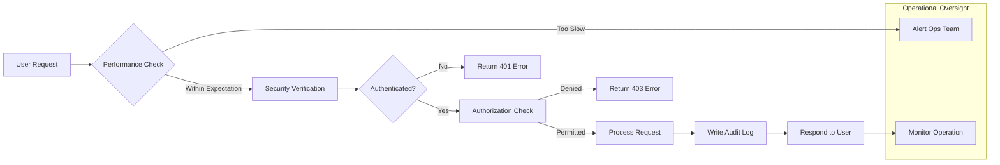

# Non-Functional Requirements for the Todo List Application

## Introduction
Robust non-functional requirements are crucial for even minimal backend applications, ensuring that the Todo List service is reliable, secure, scalable, and ready for production. These requirements define the expected behaviors that underpin user trust and system quality, and form the foundation for backend engineering and QA teams.

## 1. Performance Expectations

### Response Time
- WHEN a user submits any todo operation (create, update, delete, retrieve), THE system SHALL respond within 1 second for 95% of requests in typical usage conditions.
- THE system SHALL acknowledge all write operations with a response (including error or success) within 2 seconds.
- WHEN retrieving a user's todo list, THE system SHALL deliver each page of results (20 items per page) within 1 second under normal load.
- IF the system experiences response times above these thresholds for more than 5 consecutive requests, THEN operations SHALL be logged and an alert SHALL be triggered to administrators.

### Throughput & Scalability
- THE system SHALL support at least 1,000 concurrent active users without noticeable performance degradation.
- WHEN traffic spikes to >3x average hourly request volume, THE system SHALL maintain at least 90% of its target response times for at least 15 minutes before performance degrading is permissible.
- THE architecture SHALL support both vertical and horizontal scaling with minimal manual configuration.

### Resource Utilization
- THE system SHALL maintain average CPU and memory utilization below 70% during peak business hours to enable performance headroom.
- IF average resource utilization exceeds 80% for 10 minutes, THEN THE system SHALL trigger a monitoring alert to operators for potential remediation.

### Performance Monitoring
- THE system SHALL record and expose key operational metrics such as average response time, request volume, and error rates to system administrators and DevOps personnel in real-time dashboards.

## 2. Security Requirements

### Authentication & Authorization
- THE system SHALL require all users to authenticate using secure login before accessing any todo features.
- THE system SHALL enforce strict role-based access control, allowing regular users to access only their own todos, while an admin role can access and manage any user's data.
- WHEN a user attempts to access or change another user's todo data, THE system SHALL deny the request and provide a generic, non-revealing error message.

### Token-Based Security
- THE system SHALL use JWT for secure session management, with access tokens expiring after 15 minutes and refresh tokens valid for up to 30 days.
- THE JWT payload SHALL include only userId, role, and permissions—never sensitive or extraneous information.
- IF a token is invalid or expired, THEN THE system SHALL reject the request, return HTTP 401, and provide a standard error response.

### Data Privacy & Protection
- THE system SHALL encrypt all data in transit (across REST, GraphQL, or websocket protocols) with industry-standard TLS.
- THE system SHALL never expose sensitive information (passwords, tokens, internal details) within API responses or system logs.
- THE system SHALL enforce strong password rules—minimum 8 characters, mix of letters and numbers—to prevent weak credential usage.
- WHERE a user performs sensitive actions (such as password reset or permanent account deletion), THE system SHALL require additional authentication or verification.
- Input for all endpoints SHALL be sanitized to prevent common vulnerabilities including injection, XSS, and CSRF.

### Secure Data Storage
- THE system SHALL securely hash and salt all stored user passwords using contemporary cryptography.
- WHEN a password reset or account compromise occurs, THE system SHALL destroy all outstanding tokens and require re-login for previous sessions.

### Logging and Incident Management
- THE system SHALL log all failed login/auth attempts with details including IP, timestamp, and (if available) user or email.
- WHEN multiple failed logins (>5 per minute from a single IP) occur, THEN THE system SHALL temporarily block access from that IP and alert administrators for review.

## 3. Reliability and Uptime

### Availability
- THE system SHALL maintain no less than 99.9% uptime (excluding preannounced maintenance of ≤1 hour/month).
- IF a server or service instance fails, THEN THE system SHALL automatically attempt failover/restart and notify operators.
- All todo operations are atomic and transactional: todos SHALL never be lost, duplicated, or partially updated, even during failures.

### Redundancy and Disaster Recovery
- THE system SHALL synchronize backend data for backups on at least an hourly basis; restore operations SHALL be possible within 2 hours of a crisis event.
- Software updates SHALL be supported with rolling deployments and user-facing downtime less than 2 minutes per event.

### User Experience During Downtime
- WHEN scheduled maintenance or outages occur, THE system SHALL present users with a clear service-unavailable message and an estimated recovery time.
- All service downtime incidents SHALL be logged with start/end times, root causes, and responsible components.

### Error Resilience
- IF critical dependencies (database, authentication) are unavailable, THEN THE system SHALL degrade gracefully, returning informative user messages and protecting data integrity.

## 4. Auditability

### Audit Trail and Logging
- THE system SHALL create an audit log for every create, update, delete, login, logout, and all admin actions. Each log record shall include actor ID, event timestamp (ISO8601 UTC), action, target (e.g., which todo or user), IP address, and outcome.
- Only admin-role accounts SHALL have access to audit trails.

### Data Visibility and Monitoring
- WHEN an admin accesses a user's todo or account for moderation/support, THE system SHALL log such access events and make these logs available for compliance audit.
- THE system SHALL retain all audit logs for at least 180 days, storing them tamper-evidently and supporting secure export for external audit and compliance.
- THE system SHALL provide dashboards to system administrators summarizing uptime, error rates, authentication failures, and resource utilization.

## 5. Visualization: Service Non-Functional Flow (Mermaid)

## 6. Conclusion
These non-functional requirements guarantee that the Todo List application is built on a foundation of reliability, security, and operational excellence. Compliance is verified through automated tests, real-time monitoring, and regular audits. The requirements are implementation-neutral and provide clear quality targets that are mandatory for a system intended for real users and production deployment.