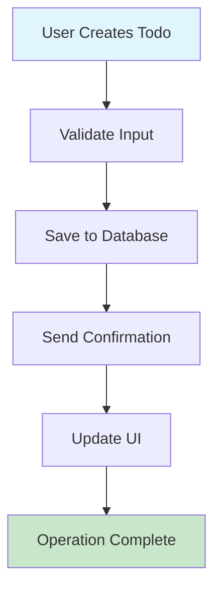
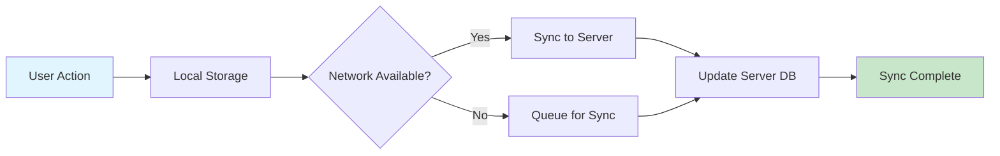
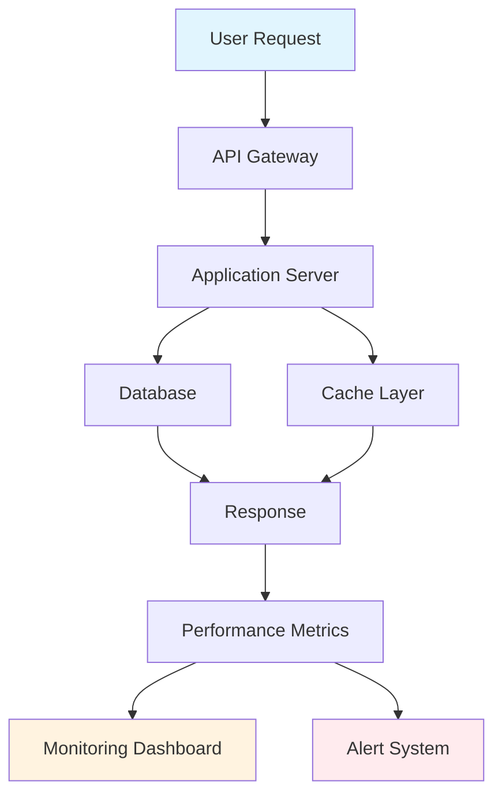

# Performance Expectations for Todo List Application

## Document Overview

This document defines the performance requirements and user experience expectations for the Todo list application. These requirements ensure the system delivers responsive, reliable service that meets user expectations for a productivity tool.

## 1. Response Time Expectations

### 1.1 Core Operations Response Times

**Page Load Performance:**
- WHEN a user accesses the application, THE system SHALL render the main interface within 2 seconds.
- THE initial todo list view SHALL display within 1 second of page load completion.

**Todo Operations Response Times:**
- WHEN creating a new todo item, THE system SHALL confirm creation within 500 milliseconds.
- WHEN updating a todo item (status, title, or description), THE system SHALL confirm the update within 300 milliseconds.
- WHEN deleting a todo item, THE system SHALL confirm deletion within 200 milliseconds.
- WHEN marking a todo as complete/incomplete, THE system SHALL update the status within 250 milliseconds.

**Search and Filter Performance:**
- WHEN searching through todo items, THE system SHALL return results instantly for lists up to 1,000 items.
- WHEN filtering todos by status (active/completed), THE system SHALL display filtered results within 100 milliseconds.

### 1.2 Authentication Performance

- WHEN a user logs in, THE system SHALL authenticate and redirect to the dashboard within 2 seconds.
- WHEN a user registers a new account, THE system SHALL complete registration within 3 seconds.

## 2. Concurrent User Support

### 2.1 User Capacity Requirements

**Initial Launch Capacity:**
- THE system SHALL support up to 100 concurrent users during initial launch.
- THE system SHALL handle peak loads of up to 50 simultaneous todo operations per minute.

**Growth Projections:**
- WHERE user base grows beyond initial capacity, THE system SHALL scale to support 1,000 concurrent users.
- THE system SHALL maintain performance standards during gradual user growth.

### 2.2 Session Management Performance

- THE system SHALL maintain user sessions reliably for up to 1,000 concurrent authenticated users.
- WHEN managing user sessions, THE system SHALL handle session creation and validation without noticeable delay.

## 3. Data Loading Performance

### 3.1 Todo List Loading

**Small Lists (1-50 items):**
- THE system SHALL load todo lists with up to 50 items within 500 milliseconds.
- THE todo list interface SHALL feel instantaneously responsive for typical user loads.

**Medium Lists (51-500 items):**
- THE system SHALL load todo lists with up to 500 items within 1 second.
- WHERE lists exceed 100 items, THE system SHALL implement pagination or lazy loading.

**Large Lists (501+ items):**
- THE system SHALL load initial view of large lists within 2 seconds.
- THE system SHALL implement efficient scrolling and search for lists exceeding 500 items.

### 3.2 Data Synchronization

- WHEN a user makes changes across multiple devices, THE system SHALL synchronize data within 5 seconds.
- THE system SHALL handle data conflicts gracefully without data loss.

## 4. Availability Requirements

### 4.1 Service Uptime

**Core Availability:**
- THE system SHALL maintain 99.5% uptime during business hours (6:00 AM - 10:00 PM local time).
- THE system SHALL be available for at least 99% of the time overall.

**Maintenance Windows:**
- WHERE scheduled maintenance is required, THE system SHALL provide at least 24 hours notice to users.
- Planned maintenance SHALL not exceed 2 hours per month.

### 4.2 Disaster Recovery

- THE system SHALL recover from failures within 15 minutes for non-critical issues.
- THE system SHALL implement automatic failover for critical system components.
- WHERE data loss occurs, THE system SHALL restore from backups within 1 hour.

## 5. Scalability Considerations

### 5.1 Horizontal Scaling

**User Growth Scaling:**
- THE system architecture SHALL support horizontal scaling to accommodate user growth.
- WHERE user count doubles, THE system SHALL maintain performance standards without architectural changes.

**Data Volume Scaling:**
- THE system SHALL efficiently handle up to 10,000 todo items per user.
- THE system SHALL maintain performance as individual user data volumes increase.

### 5.2 Resource Optimization

**Memory Usage:**
- THE application SHALL use less than 50MB of memory for typical usage patterns.
- THE system SHALL implement efficient memory management for large todo lists.

**Network Efficiency:**
- THE system SHALL minimize data transfer between client and server.
- WHERE possible, THE system SHALL implement client-side caching to reduce server load.

## 6. User Experience Standards

### 6.1 Perceived Performance

**Instant Feedback:**
- THE system SHALL provide immediate visual feedback for all user actions.
- WHEN performing operations, THE system SHALL show loading indicators for actions taking longer than 100 milliseconds.

**Smooth Interactions:**
- THE user interface SHALL respond to interactions within 100 milliseconds.
- Animations and transitions SHALL be smooth and not interfere with usability.

### 6.2 Offline Capability Considerations

**Basic Offline Functionality:**
- WHERE network connectivity is lost, THE system SHALL allow users to view existing todos.
- THE system SHALL queue created/updated todos for synchronization when connectivity resumes.

**Offline Limitations:**
- WHILE offline, THE system SHALL disable features requiring server communication.
- THE system SHALL clearly indicate offline status to users.

## 7. Performance Monitoring Requirements

### 7.1 Key Performance Indicators (KPIs)

**Response Time Monitoring:**
- THE system SHALL monitor and log response times for all core operations.
- THE system SHALL alert administrators when response times exceed defined thresholds.

**User Experience Metrics:**
- THE system SHALL track page load times and user interaction responsiveness.
- THE system SHALL measure and report on user-perceived performance.

### 7.2 Capacity Planning

**Usage Patterns Analysis:**
- THE system SHALL collect data on peak usage times and user behavior patterns.
- THE system SHALL provide capacity planning insights based on historical data.

**Performance Trending:**
- THE system SHALL track performance trends over time to identify degradation.
- THE system SHALL provide early warning for capacity issues.

## 8. Success Criteria and Metrics

### 8.1 Performance Benchmarks

**Response Time Success Criteria:**
- 95% of todo operations SHALL complete within defined time thresholds.
- 99% of page loads SHALL complete within 3 seconds.

**Availability Success Criteria:**
- THE system SHALL meet availability targets for 30 consecutive days.
- Unplanned downtime SHALL not exceed 4 hours per month.

### 8.2 User Satisfaction Metrics

**Performance Satisfaction:**
- User surveys SHALL indicate satisfaction with application responsiveness.
- THE system SHALL maintain low abandonment rates due to performance issues.

**Scalability Validation:**
- THE system SHALL demonstrate ability to handle projected user growth.
- Performance SHALL remain consistent as user base expands.

## 9. Implementation Guidelines

### 9.1 Performance Optimization Strategies

**Database Optimization:**
- THE system SHALL implement efficient database queries for todo operations.
- WHERE appropriate, THE system SHALL use database indexing for frequently accessed data.

**Caching Strategies:**
- THE system SHALL implement appropriate caching for frequently accessed data.
- Caching strategies SHALL balance performance gains with data freshness requirements.

### 9.2 Testing and Validation

**Performance Testing:**
- THE system SHALL undergo load testing with simulated user patterns.
- Performance testing SHALL validate all defined response time requirements.

**Continuous Monitoring:**
- THE system SHALL include performance monitoring in production environment.
- Performance metrics SHALL be regularly reviewed and optimized.

## 10. Performance Workflow Diagrams

### 10.1 Todo Creation Performance Flow

### 10.2 Data Synchronization Flow

### 10.3 Performance Monitoring Architecture

## 11. Performance Scenarios

### 11.1 Peak Usage Scenario

**Scenario:** Morning productivity rush when users plan their day
- WHEN multiple users access the system simultaneously between 8:00-9:00 AM
- THE system SHALL maintain response times within defined thresholds
- THE system SHALL handle concurrent todo creation and updates efficiently
- WHERE load exceeds normal capacity, THE system SHALL scale resources automatically

### 11.2 Large Todo List Scenario

**Scenario:** User with extensive todo management needs
- WHEN a user maintains over 1,000 active todo items
- THE system SHALL provide efficient search and filtering capabilities
- THE system SHALL load list views incrementally to maintain responsiveness
- WHERE performance degradation occurs, THE system SHALL provide optimization suggestions

### 11.3 Multi-Device Synchronization Scenario

**Scenario:** User working across desktop, mobile, and tablet devices
- WHEN a user creates todos on mobile device while commuting
- THE system SHALL synchronize changes to other devices within 5 seconds of connectivity
- WHERE conflicts occur (same todo edited on multiple devices)
- THE system SHALL resolve conflicts using last-write-wins strategy
- THE system SHALL notify user of synchronization status

## 12. Performance Validation Criteria

### 12.1 Load Testing Requirements

**Concurrent User Testing:**
- THE system SHALL be tested with 100 concurrent users performing typical operations
- Response times SHALL remain within defined thresholds during peak load
- Memory usage SHALL not exceed allocated resources

**Data Volume Testing:**
- THE system SHALL be tested with users maintaining 10,000+ todo items
- Search and filter operations SHALL remain responsive under heavy data loads
- Database queries SHALL be optimized for large datasets

### 12.2 Stress Testing Requirements

**Resource Exhaustion Testing:**
- THE system SHALL be tested under memory and CPU constraints
- Performance degradation SHALL be graceful under resource limitations
- THE system SHALL provide appropriate error messages rather than crashing

**Network Latency Testing:**
- THE system SHALL be tested with varying network conditions
- User experience SHALL remain acceptable under high-latency conditions
- Offline functionality SHALL work reliably when network connectivity is poor

## 13. Performance Optimization Priorities

### 13.1 Critical Path Optimization

**High Priority Optimizations:**
- Todo creation and update operations (most frequent user actions)
- List loading and rendering (primary user interface)
- Authentication flows (user entry points)

**Medium Priority Optimizations:**
- Search functionality (important but less frequent)
- Data synchronization (background process)
- Administrative functions (limited user base)

### 13.2 Performance Budget Allocation

**Development Resources:**
- 60% of optimization effort SHALL focus on core todo operations
- 25% of optimization effort SHALL focus on user interface responsiveness
- 15% of optimization effort SHALL focus on scalability and infrastructure

**Monitoring Focus:**
- Primary monitoring SHALL track core operation response times
- Secondary monitoring SHALL track user interface performance
- Tertiary monitoring SHALL track system resource utilization

> *Developer Note: This document defines **business requirements only**. All technical implementations (architecture, APIs, database design, etc.) are at the discretion of the development team.*