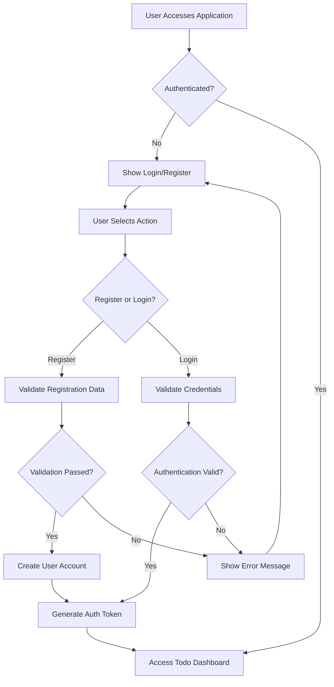
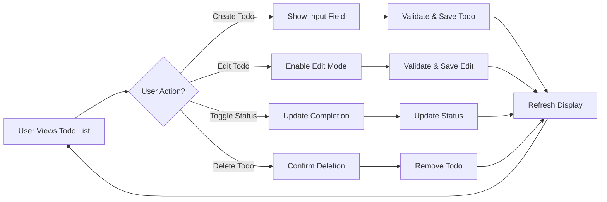
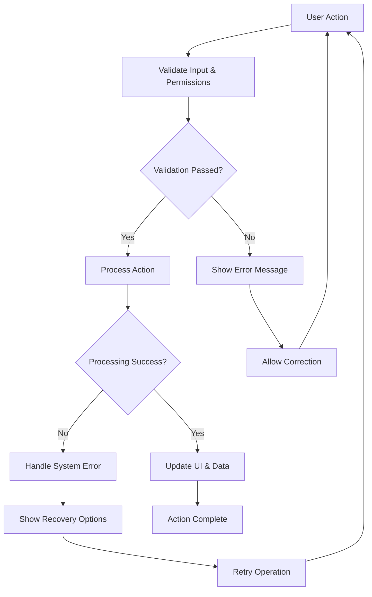

# Todo Application Requirements Analysis Report

## Executive Summary

The Todo Application is a purpose-built minimal task management solution designed to address the fundamental need for simple, accessible personal organization tools. This analysis report provides comprehensive requirements specification for developing a backend application that supports core todo functionality with maximum efficiency and minimum complexity.

## Business Problem Analysis

### Market Gap Identification
Current task management applications suffer from feature bloat that overwhelms users seeking simple todo list functionality. The primary market gap exists between basic methods (pen & paper) and complex project management tools, where individual users need reliable digital task tracking without unnecessary features.

### User Pain Points
- **Complexity Overload**: Existing applications include team collaboration and advanced workflows irrelevant to individual users
- **Performance Issues**: Feature-rich applications often suffer from slow performance
- **Privacy Concerns**: Cloud synchronization requirements create data security concerns
- **Learning Curve**: Complex interfaces require significant time investment

## Solution Architecture Requirements

### Core Functional Requirements

**WHEN** a user wants to create a new todo item, **THE** system **SHALL** provide a simple interface for entering todo text with validation for 1-500 characters.

**WHEN** displaying todo items, **THE** system **SHALL** organize items with incomplete todos displayed first, followed by completed items, showing text description, completion status, and creation timestamp.

**WHEN** a user marks a todo item as complete or incomplete, **THE** system **SHALL** update the completion status immediately and refresh the display accordingly.

**WHEN** a user edits todo text, **THE** system **SHALL** preserve the original creation timestamp while updating the text content with proper validation.

**WHEN** a user deletes a todo item, **THE** system **SHALL** provide confirmation mechanism and permanently remove the item without undo functionality.

### User Authentication Requirements

**WHEN** a user registers, **THE** system **SHALL** validate email format and uniqueness, require secure password (minimum 8 characters), and create user account with unique identifier.

**WHEN** a user logs in, **THE** system **SHALL** validate credentials, generate JWT access token with 30-minute expiration, and provide refresh token mechanism.

**WHILE** a user is authenticated, **THE** system **SHALL** maintain session state securely and validate JWT tokens on each API request.

### Performance Requirements

**THE** system **SHALL** provide sub-second response times for all todo operations:
- Todo creation: within 500ms
- Status updates: within 300ms
- Todo editing: within 400ms
- Todo deletion: within 350ms
- List loading: within 800ms for up to 1000 items

**THE** system **SHALL** support up to 100 concurrent active users with performance degradation limited to 150% of baseline under full load.

## Technical Architecture Requirements

### Data Management

**THE** system **SHALL** persist all todo items securely with immediate save operations for create, update, and delete actions.

**THE** system **SHALL** maintain referential integrity between users and their todo items, ensuring users can only access and modify their own data.

**THE** system **SHALL** validate all todo data according to business rules:
- Todo text: 1-500 characters, no empty strings
- Completion status: boolean values only
- User ownership: todos must belong to authenticated user
- Timestamps: valid date/time format

### Security Requirements

**THE** system **SHALL** implement password hashing with salt using industry-standard algorithms and rate limiting for login attempts.

**WHERE** user data is stored, **THE** system **SHALL** encrypt sensitive information and implement proper access controls with audit logging.

**IF** authentication fails, **THEN THE** system **SHALL** return appropriate HTTP status codes and provide clear error messages without exposing sensitive information.

## Business Process Flows

### User Registration and Authentication

### Todo Management Workflow

### Error Handling Scenarios

## Success Criteria and Metrics

### Functional Success Criteria
- Users can reliably perform all CRUD operations on todo items
- All operations complete successfully without data loss
- System handles common error scenarios gracefully
- Performance meets defined response time targets

### Technical Success Criteria
- System maintains 99.5% availability during business hours
- Data integrity preserved through all operations
- Security measures effectively protect user data
- Application scales appropriately with user growth

### User Experience Success Criteria
- Interface is intuitive with minimal learning curve
- Users accomplish todo management tasks efficiently
- Application provides clear feedback for all actions
- Mobile and desktop experiences are consistently good

## Implementation Priorities

### Phase 1: Core Functionality (High Priority)
- User authentication and registration
- Basic todo CRUD operations
- Data persistence and validation
- Responsive web interface

### Phase 2: Enhanced Features (Medium Priority)
- Advanced filtering and search capabilities
- Task categorization options
- Export functionality
- Performance optimization

### Phase 3: Refinement (Low Priority)
- Progressive web app features
- Keyboard shortcuts
- Accessibility improvements
- Advanced user preferences

## Risk Assessment and Mitigation

### Technical Risks
- **Performance degradation under load**: Implement efficient database indexing and query optimization
- **Data integrity issues**: Use transaction-based operations and proper error handling
- **Security vulnerabilities**: Follow security best practices and regular security audits

### Business Risks
- **User adoption challenges**: Focus on intuitive design and clear value proposition
- **Feature creep pressure**: Maintain disciplined approach to minimal core functionality
- **Competitive pressure**: Differentiate through superior simplicity and performance

## Conclusion

This requirements analysis provides comprehensive specification for developing a minimal Todo application backend that balances functionality with simplicity. The architecture prioritizes core todo management operations while ensuring robust security, performance, and user experience. The implementation approach focuses on delivering immediate value through reliable, efficient task management capabilities.

The backend system will support the business objectives of providing a focused, high-performance todo solution that addresses the market gap between basic methods and complex project management tools. By maintaining strict adherence to minimal functionality, the application will deliver superior user experience through instant usability and reliable performance.