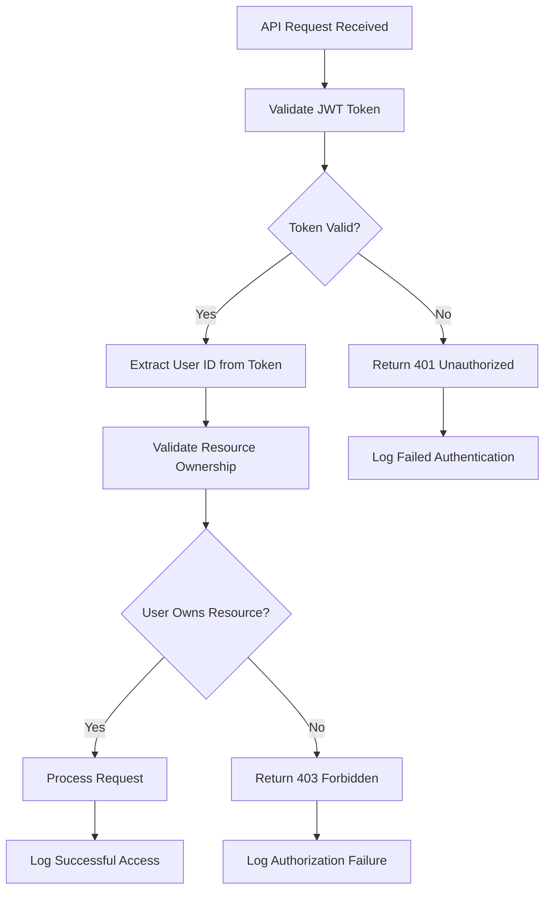
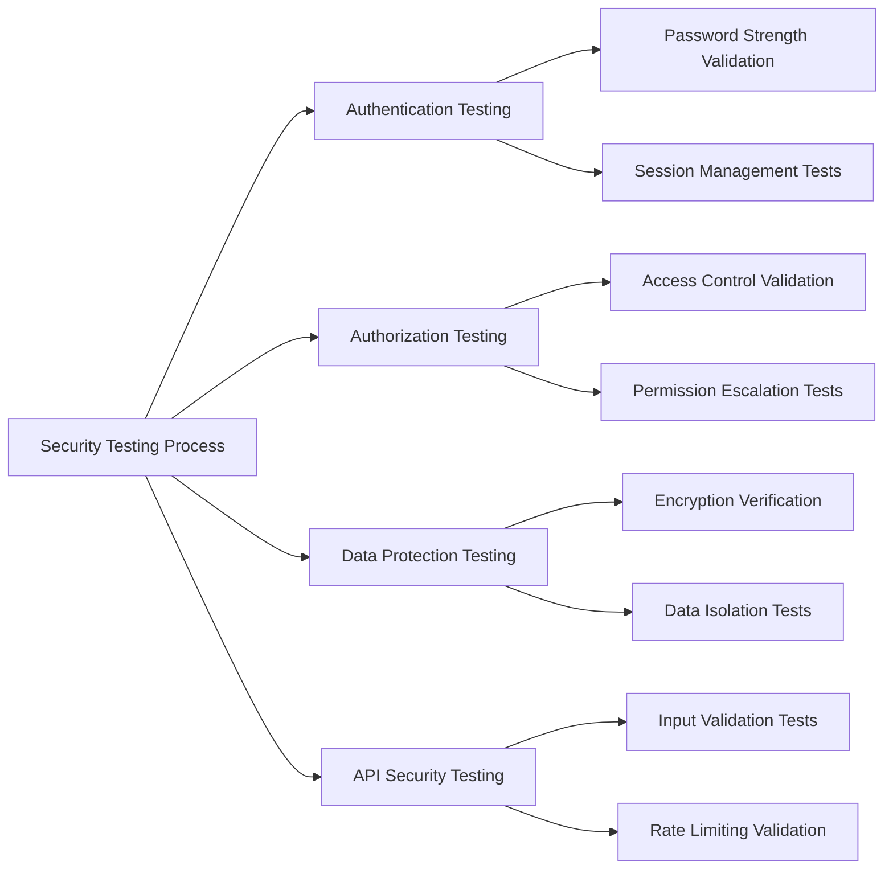

# Security Requirements Specification for Todo Application

## Executive Summary

This document defines the comprehensive security requirements for the Todo list application, focusing on protecting user data and ensuring secure access to personal todo items. The application follows security best practices appropriate for a single-user todo management system, implementing essential security measures to protect user information while maintaining application usability.

## Authentication Security Requirements

### Password Security

**WHEN a user registers an account, THE system SHALL enforce strong password policies:**
- Minimum password length of 8 characters
- Require at least one uppercase letter
- Require at least one lowercase letter  
- Require at least one number
- Require at least one special character
- Store passwords using bcrypt hashing with salt
- Never store passwords in plain text
- Validate password strength before account creation

**WHEN a user logs in, THE system SHALL implement secure authentication:**
- Validate credentials against hashed passwords
- Implement account lockout after 5 failed login attempts within 15 minutes
- Lockout duration of 30 minutes
- Clear failed attempt counter on successful login
- Generate secure JWT tokens for authenticated sessions
- Set JWT token expiration to 30 minutes
- Provide refresh tokens with 7-day expiration

### Session Management

**WHILE a user is authenticated, THE system SHALL maintain secure session management:**
- Validate JWT tokens on each API request
- Refresh tokens automatically when near expiration
- Implement secure token storage in HTTP-only cookies
- Provide session revocation capability for all devices
- Log all authentication events for security monitoring

**WHEN a user logs out, THE system SHALL:**
- Invalidate the current session token immediately
- Clear session data from server-side storage
- Redirect to login page with confirmation message
- Log the logout event for security auditing

## Data Protection Requirements

### Data Encryption

**THE system SHALL implement comprehensive data encryption:**
- Encrypt todo content at rest using AES-256 encryption
- Use unique encryption keys per user account
- Store encryption keys securely separate from encrypted data
- Implement secure key rotation procedures every 90 days
- Encrypt sensitive user data including email addresses

**WHEN transmitting data between client and server, THE system SHALL:**
- Use HTTPS/TLS 1.2 or higher for all communications
- Implement perfect forward secrecy for TLS connections
- Validate SSL certificates to prevent man-in-the-middle attacks
- Implement secure headers including HSTS, CSP, and X-Frame-Options
- Encrypt sensitive data in transit using additional application-level encryption

### Storage Security

**THE system SHALL protect stored data through multiple layers of security:**
- Implement database access controls with principle of least privilege
- Use parameterized queries exclusively to prevent SQL injection attacks
- Sanitize all user inputs to prevent XSS and other injection attacks
- Implement data backup and recovery procedures with encrypted backups
- Secure database connection strings and credentials
- Implement database activity monitoring for suspicious access patterns

**WHEN storing user data, THE system SHALL:**
- Separate user data by account with strict isolation
- Implement data retention policies according to privacy requirements
- Provide secure data deletion procedures for account termination
- Log all data access attempts for security auditing

## API Security Requirements

### Endpoint Protection

**ALL API endpoints SHALL implement comprehensive security measures:**
- Require valid JWT tokens for all authenticated endpoints
- Validate user permissions for each resource request
- Implement rate limiting to prevent abuse and DoS attacks
- Log all security-related events including failed authentication attempts
- Implement input validation for all request parameters and payloads

**WHEN processing API requests, THE system SHALL:**
- Validate request parameters against expected schemas
- Check user authorization for requested resources before processing
- Implement comprehensive input sanitization and validation
- Return appropriate HTTP status codes for security-related errors
- Implement request size limits to prevent resource exhaustion

### Access Control Implementation

**THE system SHALL implement role-based access control with the following rules:**
- Users can only access their own todo items
- Prevent cross-user data access through strict ownership validation
- Validate ownership for all todo operations (create, read, update, delete)
- Implement proper error handling for unauthorized access attempts

**WHEN a user attempts to access another user's data, THE system SHALL:**
- Return HTTP 403 Forbidden status with generic error message
- Log the unauthorized access attempt with full request details
- Notify system administrators of suspicious activity patterns
- Implement progressive security measures for repeated violations

## Privacy and Compliance Requirements

### Data Privacy Implementation

**THE system SHALL protect user privacy through comprehensive measures:**
- Collect only necessary personal information for todo functionality
- Implement data minimization principles throughout the application
- Provide clear privacy policy explaining data usage and protection
- Allow users to delete their account and associated data completely
- Implement data anonymization for analytics and reporting purposes

**WHEN handling user data, THE system SHALL:**
- Anonymize data before using for analytics or improvement purposes
- Implement data retention policies with automatic cleanup procedures
- Provide data export functionality in standard formats
- Ensure compliance with applicable privacy regulations (GDPR, CCPA)
- Implement cookie consent management for web applications

### User Consent Management

**WHEN collecting user data, THE system SHALL:**
- Obtain explicit consent for data collection and usage
- Provide clear information about data usage purposes
- Allow users to withdraw consent at any time
- Implement cookie consent management with granular controls
- Maintain consent records for compliance auditing

## Security Testing Requirements

### Testing Procedures and Validation

**THE system SHALL undergo comprehensive security testing:**
- Penetration testing for all API endpoints and user flows
- Vulnerability scanning for known security issues and CVEs
- Code review for security vulnerabilities and best practices
- Security regression testing with each release and update
- Automated security testing integrated into CI/CD pipeline

**WHEN deploying security updates, THE system SHALL:**
- Conduct security impact assessment for all changes
- Test for new vulnerabilities introduced by updates
- Verify security controls remain effective after changes
- Update security documentation to reflect new implementations
- Conduct security training for development team members

### Security Testing Success Criteria

**THE security testing SHALL achieve the following metrics:**
- 100% of critical security vulnerabilities identified and resolved
- Zero high-severity security issues in production deployment
- Security test coverage of 90% for all authentication flows
- Regular security audits with external validation
- Compliance with OWASP Top 10 security guidelines

## Incident Response Requirements

### Security Incident Handling Procedures

**WHEN a security incident occurs, THE system SHALL implement comprehensive response:**
- Detect and log security events in real-time monitoring systems
- Notify system administrators immediately upon incident detection
- Implement incident response procedures with defined escalation paths
- Conduct post-incident analysis and root cause investigation
- Implement corrective actions to prevent recurrence

**THE system SHALL maintain continuous security monitoring:**
- Implement security event logging with detailed context information
- Monitor for suspicious activities and anomaly detection
- Set up alerting for security events with appropriate thresholds
- Maintain audit trails for forensic investigations
- Implement security information and event management (SIEM) integration

### Incident Response Timeline Requirements

**THE system SHALL meet the following response time objectives:**
- Security incident detection within 5 minutes of occurrence
- Initial response and containment within 15 minutes
- Full incident resolution within 4 hours for critical issues
- Post-incident reporting within 24 hours
- Implementation of preventive measures within 7 days

## Implementation Guidelines and Priorities

### Security Implementation Phases

**Phase 1 - Critical Security Foundations (Week 1-2):**
- Password hashing and secure authentication implementation
- HTTPS/TLS implementation with proper certificate management
- Basic input validation and sanitization procedures
- Fundamental access controls and user isolation
- Basic security logging and monitoring

**Phase 2 - Enhanced Security Measures (Week 3-4):**
- Advanced session management with token refresh
- Data encryption at rest for sensitive information
- Comprehensive rate limiting and abuse prevention
- Enhanced security logging and alerting systems
- Security testing integration into development workflow

**Phase 3 - Advanced Security Controls (Week 5-6):**
- Multi-factor authentication implementation
- Advanced threat detection and anomaly monitoring
- Security information and event management system
- Regular security audits and penetration testing
- Security training and awareness programs

### Security Configuration Requirements

**THE system SHALL implement secure configuration management:**
- Disable unnecessary services and ports on all servers
- Secure default configurations for all components
- Regular security updates and patch management
- Secure communication protocols with strong cipher suites
- Configuration hardening based on security benchmarks

**WHEN configuring security settings, THE system SHALL:**
- Follow principle of least privilege for all access controls
- Implement defense in depth with multiple security layers
- Regular security configuration reviews and audits
- Automated configuration validation and compliance checking
- Secure secret management for credentials and keys

## Compliance and Regulatory Requirements

### Security Standards Compliance

**THE system SHALL adhere to established security best practices:**
- Follow OWASP Top 10 security guidelines for web applications
- Implement secure coding practices throughout development
- Conduct regular security audits with external validation
- Perform vulnerability assessments and penetration testing
- Maintain security documentation and compliance records

### Regulatory Compliance Implementation

**THE system SHALL ensure compliance with applicable regulations:**
- GDPR requirements for European user data protection
- Data protection regulations specific to user locations
- Privacy laws governing personal information handling
- Industry-specific security standards and certifications
- Legal requirements for data breach notification

## Risk Assessment and Management

### Security Risk Assessment

**THE system SHALL conduct comprehensive risk assessments:**
- Identify potential security threats and vulnerabilities
- Assess impact of security breaches on users and business
- Implement risk mitigation strategies with priority ranking
- Monitor risk levels over time with regular reassessment
- Maintain risk register with mitigation progress tracking

**WHEN new features are added, THE system SHALL:**
- Conduct security impact analysis for each new component
- Update risk assessment documentation accordingly
- Implement additional security controls as needed
- Test security of new functionality before deployment
- Train team members on security aspects of new features

### Risk Mitigation Strategies

**FOR identified security risks, THE system SHALL implement:**
- Preventive controls to reduce likelihood of incidents
- Detective controls to identify incidents quickly
- Corrective controls to minimize impact of incidents
- Recovery controls to restore normal operations rapidly
- Continuous improvement based on lessons learned

## Security Documentation Requirements

### Documentation Standards and Maintenance

**THE system SHALL maintain comprehensive security documentation:**
- Security architecture documentation with design decisions
- Incident response procedures with escalation paths
- Security testing results and vulnerability management
- Compliance documentation for regulatory requirements
- Security training materials and awareness programs

**WHEN making security changes, THE system SHALL:**
- Update security documentation to reflect current state
- Communicate changes to all relevant team members
- Train team members on new security procedures
- Maintain version control for security documents
- Conduct regular documentation reviews and updates

## Security Metrics and Monitoring

### Performance and Effectiveness Metrics

**THE system SHALL track and report on security metrics:**
- Number of security incidents by severity and type
- Mean time to detect security incidents
- Mean time to resolve security incidents
- Security control effectiveness measurements
- User security awareness and training completion rates

### Continuous Security Monitoring

**THE system SHALL implement continuous security monitoring:**
- Real-time security event monitoring and alerting
- Regular security posture assessments
- Vulnerability scanning and management
- Security compliance monitoring and reporting
- Threat intelligence integration and analysis

## Conclusion and Success Criteria

### Security Implementation Success Metrics

**THE security implementation SHALL achieve the following success criteria:**
- Zero security breaches affecting user data
- 100% compliance with defined security requirements
- Security controls effectiveness rating of 95% or higher
- User trust and satisfaction with security measures
- Successful completion of independent security audits

### Ongoing Security Maintenance

**THE system SHALL maintain security through continuous improvement:**
- Regular security updates and patch management
- Continuous security monitoring and threat detection
- Periodic security training and awareness programs
- Regular security audits and compliance assessments
- Proactive security enhancement based on emerging threats

This comprehensive security requirements specification provides a complete framework for securing the Todo list application. By implementing these requirements, the system will protect user data, prevent unauthorized access, maintain confidentiality and integrity of todo items, and build user trust through demonstrated security commitment.

> *Developer Note: This document defines **security requirements only**. All technical implementations (encryption methods, authentication systems, API security mechanisms, etc.) are at the discretion of the development team.*