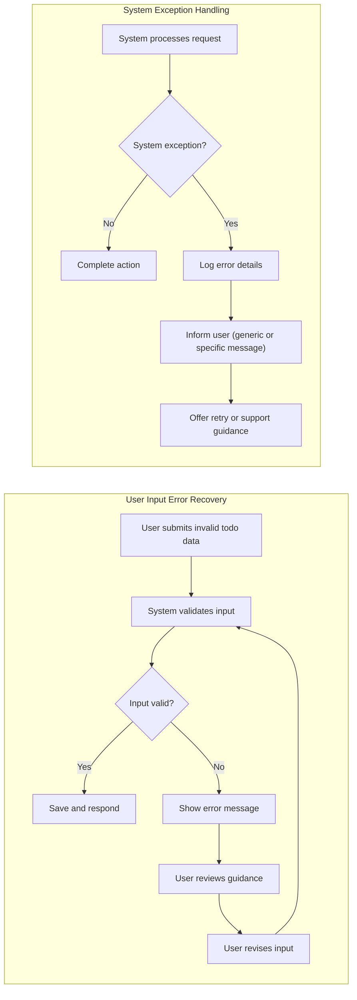

# Error Handling and Exception Flows for Todo List Service

Effective error handling and clearly defined exception flows are mandatory for delivering a reliable, user-friendly Todo List application. All error responses and exception management must be documented in natural business language according to EARS (Easy Approach to Requirements Syntax) standards. This document is intended as the definitive backend specification for all error and exception flows relevant to a simple Todo List system, providing clarity for both immediate user-facing situations and development edge cases.

---

## 1. Types of User Errors

User input, business logic violations, and permission boundaries are principal sources of user errors. The system SHALL provide precise, actionable feedback for each category.

### 1.1 Input Validation Errors
- WHEN a user submits a todo item with a blank or whitespace-only title, THE system SHALL display the message "Todo title cannot be blank." and SHALL reject the operation.
- WHEN a user provides a description exceeding 500 characters, THE system SHALL block the submission and SHALL show the message "Description exceeds maximum length of 500 characters."
- WHEN a user attempts to set a due date before today's date, THE system SHALL prevent creation/edit completion and SHALL return "Due date must be today or later."
- WHEN a user updates a todo's status to any value other than "pending", "completed", or "archived", THE system SHALL reject the request, returning "Invalid status."

### 1.2 Permission and Access Violations
- WHEN a non-authenticated actor attempts to create, edit, or delete a todo, THE system SHALL deny the operation and SHALL prompt login with "Please log in to continue."
- WHEN a user attempts to view, update, or remove another user's todo, THE system SHALL respond "You do not have permission to access this todo." and SHALL NOT reveal any todo data.
- WHEN a user attempts an administrative function (such as viewing all users or managing others' todos) without the admin role, THE system SHALL return "Admin privileges required."

### 1.3 Action and Sequence Errors
- WHEN a user attempts to delete or update a todo item that does not exist or was already deleted, THE system SHALL return "Todo not found."
- WHEN a user attempts to mark an archived todo as completed, THE system SHALL show "Cannot modify an archived todo."

### 1.4 Rate Limiting and Abuse Prevention
- WHEN any user or admin attempts more than 20 create, update, or delete actions within one minute, THE system SHALL restrict further actions temporarily and SHALL inform the actor: "Too many actions. Please try again after a moment."

---

## 2. System-Generated Exceptions

Exceptions not directly caused by end-user behavior shall trigger robust and consistent handling, user-friendly feedback, and developer observability.

### 2.1 Infrastructure Failure
- IF a database connection is lost during a user action, THE system SHALL return "Unable to process request. Please try again later." and SHALL log the error with sufficient context for support review.
- IF a data integrity constraint is violated (e.g., an attempt to create two todos with the same title for a user), THE system SHALL reject the request and SHALL display "A todo with this title already exists."
- IF the application is placed in maintenance mode or a system-wide outage is detected, THE system SHALL inform all users: "Service is temporarily unavailable. Please retry later."

### 2.2 External Service Disruptions
- IF the system cannot send email notifications (for due date reminders, password resets, or related events), THEN THE system SHALL display "Notification could not be sent. Please check your settings."

### 2.3 Edge and Future-Proof Cases
- IF an admin attempts an action reserved for a higher-level permission role (intended for extensibility), THE system SHALL deny the action, log the attempt, and SHALL not reveal internal details to the actor.

---

## 3. User-Friendly Recovery Flows

The system must guide users toward resolution for all recoverable errors, avoiding technical jargon and ensuring all feedback is actionable.

### 3.1 Error Presentation Principles
- THE system SHALL always display error messages in clear, non-technical language.
- WHEN an error is related to user input, THE system SHALL highlight the relevant field and provide corrective guidance.
- WHEN a permission error occurs, THE system SHALL explain the missing permission and, IF feasible, suggest requesting access or contacting support.

### 3.2 Recovery and Support Requirements
- WHEN a rate limit, temporary block, or infrastructure event occurs, THE system SHALL communicate estimated wait or retry time if possible.
- WHEN a repeated error is encountered by a user, THE system SHALL suggest accessing help or support and SHALL provide a reference code for further troubleshooting.
- THE system SHALL never expose internal stack traces or database details in responses to users.
- IF an error is caused by external system downtime, THE system SHALL recommend retrying later and SHALL avoid assigning user blame.

### 3.3 Logging and Developer Support
- THE system SHALL log every exception with user identifier, attempted action, relevant context, and (where possible) anonymized input for secure troubleshooting.

### 3.4 Example User Recovery Flow

---

## 4. General Best Practices and Summary

- THE system SHALL employ standardized error messages wherever possible for consistency across all interfaces.
- ALL user-facing error messages SHALL present a clear, actionable recovery path or suggestion.
- EVERY system-generated exception SHALL be logged, and those logs SHALL contain actionable metadata for operational support teams.
- Error handling and exceptions SHALL be managed in a user-centric way, protecting user privacy and never exposing sensitive information.
- ALL requirements SHALL be testable and stated using EARS format.
- All backend code developed MUST reference this document as the authoritative source for all error and exception handling relating to the Todo List service.