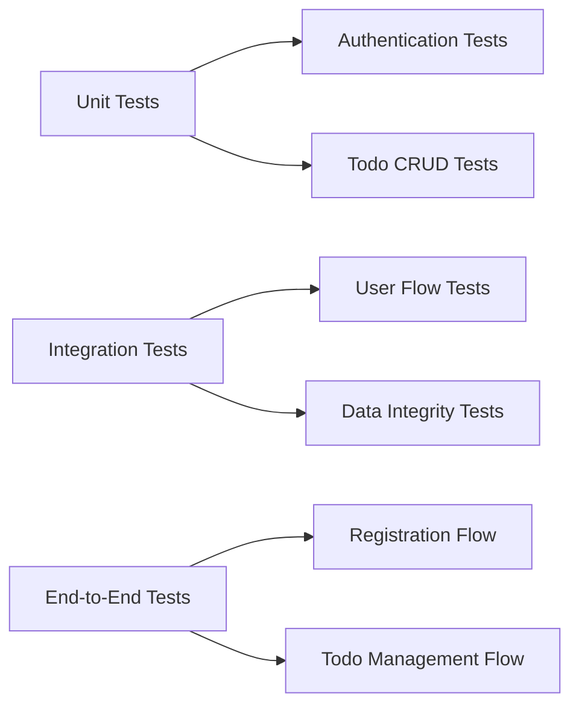
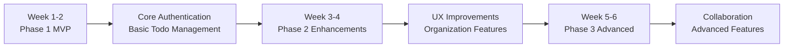

# Implementation Roadmap for Todo Application

## Executive Summary

This document outlines the phased implementation strategy for the Todo application, focusing on delivering minimum viable functionality first while ensuring a solid foundation for future enhancements. The roadmap prioritizes core features that provide immediate value to users while maintaining technical quality and scalability.

## Development Phases

### Phase 1: Core Minimum Viable Product (MVP)
**Timeline**: Week 1-2
**Focus**: Essential functionality that delivers immediate value

#### Priority Features (Must-Have)
1. **User Authentication System**
   - User registration with email and password
   - User login/logout functionality
   - JWT-based session management
   - Password reset capability

2. **Basic Todo Management**
   - Create new todo items
   - View todo list (user-specific)
   - Mark todos as complete/incomplete
   - Delete todo items

3. **Essential Data Persistence**
   - User account storage
   - Todo item storage with user association
   - Basic data validation

#### Phase 1 Success Criteria
- Users can register and log in successfully
- Users can create, view, and manage their personal todo list
- System maintains data integrity and user isolation
- All core functionality works without errors

### Phase 2: Enhanced User Experience
**Timeline**: Week 3-4
**Focus**: Improving usability and adding valuable features

#### Priority Features
1. **Todo Organization**
   - Todo categories or tags
   - Due date functionality
   - Priority levels (high/medium/low)

2. **User Interface Improvements**
   - Responsive design for mobile devices
   - Real-time updates without page refresh
   - Enhanced visual feedback for user actions

3. **Data Management**
   - Search and filter functionality
   - Bulk operations (mark all complete, delete multiple)
   - Data export capability

#### Phase 2 Success Criteria
- Users can organize todos effectively
- Application works seamlessly across devices
- Performance meets user expectations for responsiveness
- Additional features provide clear value without complexity

### Phase 3: Advanced Features
**Timeline**: Week 5-6
**Focus**: Adding sophisticated functionality and scalability

#### Priority Features
1. **Collaboration Features**
   - Shared todo lists
   - Todo assignment to other users
   - Commenting on todos

2. **Advanced Functionality**
   - Recurring todos
   - Todo templates
   - Advanced sorting and filtering

3. **System Enhancements**
   - Performance optimization
   - Enhanced security measures
   - Analytics and usage tracking

#### Phase 3 Success Criteria
- Advanced features work reliably
- System handles increased user load
- Security measures protect user data effectively
- Performance remains excellent with new features

## Testing Strategy

### Phase 1 Testing Focus

**Testing Approach**:
- **Unit Testing**: Test individual components in isolation
- **Integration Testing**: Verify component interactions
- **End-to-End Testing**: Validate complete user workflows

### Testing Priorities by Phase

#### Phase 1 Testing Requirements
- Authentication flow testing (registration, login, logout)
- Todo CRUD operations validation
- User data isolation testing
- Error handling for invalid inputs

#### Phase 2 Testing Requirements
- Cross-device compatibility testing
- Performance testing for new features
- Data integrity with enhanced functionality
- User experience validation

#### Phase 3 Testing Requirements
- Collaboration feature testing
- Security testing for shared data
- Performance under load testing
- Advanced feature reliability testing

## Deployment Plan

### Development Environment Setup
- Version control with Git
- Continuous integration pipeline
- Automated testing on code commit
- Development server with hot reload

### Staging Environment
- Pre-production testing environment
- User acceptance testing
- Performance benchmarking
- Security validation

### Production Deployment
- Zero-downtime deployment strategy
- Database migration planning
- Rollback procedures
- Monitoring and alerting setup

### Deployment Phases
1. **Initial Deployment**: Core MVP functionality
2. **Iterative Updates**: Feature releases every 1-2 weeks
3. **Monitoring Phase**: Performance and usage monitoring
4. **Maintenance Phase**: Regular updates and improvements

## Priority Matrix

### Must-Have Features (Phase 1)
| Feature | Business Value | Technical Complexity | Priority |
|---------|---------------|---------------------|----------|
| User Registration | High | Low | Critical |
| User Login/Logout | High | Low | Critical |
| Create Todo | High | Low | Critical |
| View Todo List | High | Low | Critical |
| Mark Todo Complete | High | Low | Critical |
| Delete Todo | High | Low | Critical |

### Should-Have Features (Phase 2)
| Feature | Business Value | Technical Complexity | Priority |
|---------|---------------|---------------------|----------|
| Todo Categories | Medium | Medium | High |
| Due Dates | Medium | Medium | High |
| Mobile Responsive | High | Medium | High |
| Search Functionality | Medium | Medium | Medium |

### Could-Have Features (Phase 3)
| Feature | Business Value | Technical Complexity | Priority |
|---------|---------------|---------------------|----------|
| Shared Todo Lists | Medium | High | Medium |
| Recurring Todos | Low | High | Low |
| Advanced Analytics | Low | High | Low |

## Risk Assessment and Mitigation

### Technical Risks
1. **Database Performance**
   - Risk: Slow response with many todos
   - Mitigation: Implement pagination and indexing early
   
2. **Authentication Security**
   - Risk: Security vulnerabilities
   - Mitigation: Follow security best practices from start
   
3. **Scalability Issues**
   - Risk: System doesn't scale with user growth
   - Mitigation: Design with scalability in mind

### Project Risks
1. **Scope Creep**
   - Risk: Adding features beyond minimum requirements
   - Mitigation: Strict adherence to phase priorities
   
2. **Timeline Delays**
   - Risk: Features taking longer than expected
   - Mitigation: Regular progress reviews and adjustments

## Success Metrics

### Phase 1 Metrics
- 100% test coverage for core functionality
- Registration success rate > 95%
- Todo creation success rate > 98%
- Page load time < 2 seconds

### Phase 2 Metrics
- Mobile usage rate > 40%
- Feature adoption rate > 70%
- User satisfaction score > 4/5
- Error rate reduction by 50%

### Phase 3 Metrics
- Active daily users growth > 20% monthly
- Feature usage diversity > 3 features per user
- System uptime > 99.9%
- Performance maintained under load

## Resource Planning

### Development Team Requirements
- **Phase 1**: 1-2 developers focused on core functionality
- **Phase 2**: 2-3 developers including frontend specialization
- **Phase 3**: 2-3 developers with potential for specialization

### Infrastructure Requirements
- **Phase 1**: Basic hosting, database, and authentication services
- **Phase 2**: Enhanced hosting for mobile optimization
- **Phase 3**: Scalable infrastructure for growth

## Timeline Overview

## Conclusion

This implementation roadmap provides a clear, phased approach to building the Todo application, ensuring that minimal functionality is delivered first while maintaining a path for future enhancements. By focusing on core features in Phase 1, we can quickly deliver value to users while building a solid foundation for more sophisticated functionality in later phases.

The priority-based approach ensures that development effort is focused on features that provide the greatest value to users while maintaining technical quality and scalability. Regular testing and validation at each phase will ensure that the application meets user expectations and business objectives.

> *Developer Note: This document defines **business requirements only**. All technical implementations (architecture, APIs, database design, etc.) are at the discretion of the development team.*