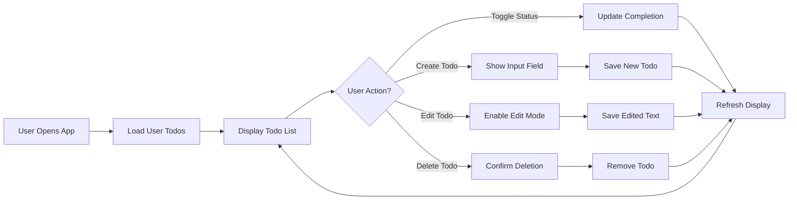
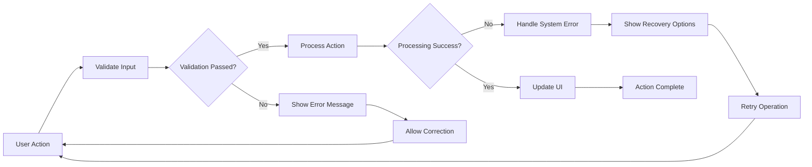

# Todo Application Functional Requirements Specification

## 1. Introduction and Scope

This document defines the complete functional requirements for a minimal Todo list application. The application provides users with a simple, intuitive interface for managing personal todo items with essential CRUD (Create, Read, Update, Delete) operations.

### Business Purpose
The Todo application exists to help individuals organize their daily tasks and priorities in a straightforward, accessible manner. It solves the problem of task management complexity by providing a clean, minimal interface that focuses on core functionality without unnecessary features.

### Target Users
The primary user base consists of individuals seeking a simple task management solution for personal use. The application targets users who value simplicity and efficiency over feature-rich complexity.

## 2. Core Todo Management Features

### 2.1 Todo Creation

**WHEN** a user wants to create a new todo item, **THE** system **SHALL** provide a simple interface for entering todo text.

**THE** system **SHALL** allow users to create todo items with the following properties:
- Text description (required)
- Creation timestamp (automatically assigned)
- Completion status (default: incomplete)

**WHEN** creating a todo item, **THE** system **SHALL** validate that the todo text contains between 1 and 500 characters.

### 2.2 Todo Reading and Display

**THE** system **SHALL** display all todo items belonging to the authenticated user.

**WHEN** displaying todo items, **THE** system **SHALL** show:
- Todo text description
- Completion status (checked/unchecked)
- Creation date in user-friendly format

**THE** system **SHALL** organize todo items with incomplete items displayed first, followed by completed items.

### 2.3 Todo Status Management

**WHEN** a user marks a todo item as complete, **THE** system **SHALL** update the completion status and move the item to the completed section.

**WHEN** a user marks a completed todo item as incomplete, **THE** system **SHALL** update the completion status and move the item back to the active section.

**THE** system **SHALL** provide clear visual indicators for completion status (checked checkbox for complete, unchecked for incomplete).

### 2.4 Todo Editing

**WHEN** a user wants to edit a todo item's text, **THE** system **SHALL** provide an editing interface that allows modification of the todo description.

**WHEN** saving edited todo text, **THE** system **SHALL** validate that the updated text contains between 1 and 500 characters.

**THE** system **SHALL** preserve the original creation timestamp when editing todo text.

### 2.5 Todo Deletion

**WHEN** a user wants to delete a todo item, **THE** system **SHALL** provide a confirmation mechanism to prevent accidental deletion.

**WHEN** confirming deletion, **THE** system **SHALL** permanently remove the todo item from the user's list.

**THE** system **SHALL** not provide undo functionality for deleted todo items.

## 3. User Interface Requirements (Business Perspective)

### 3.1 Navigation and Layout

**THE** application **SHALL** provide a clean, intuitive interface with the following sections:
- Header with application title and user information
- Main content area displaying todo items
- Input area for creating new todos
- Clear separation between active and completed todos

**THE** interface **SHALL** be responsive and work effectively on both desktop and mobile devices.

### 3.2 User Interaction Patterns

**WHEN** interacting with todo items, **THE** system **SHALL** provide immediate visual feedback for user actions.

**THE** system **SHALL** ensure that all user interactions feel responsive and instantaneous.

## 4. Data Management Requirements

### 4.1 Data Persistence

**THE** system **SHALL** persist all todo items securely, ensuring no data loss during normal operation.

**WHEN** a user creates, updates, or deletes a todo item, **THE** system **SHALL** immediately save the changes to persistent storage.

### 4.2 Data Integrity

**THE** system **SHALL** maintain referential integrity between users and their todo items.

**WHEN** processing todo operations, **THE** system **SHALL** ensure that users can only access and modify their own todo items.

### 4.3 Data Validation

**THE** system **SHALL** validate all todo data according to the following rules:
- Todo text: 1-500 characters, no empty strings
- Completion status: boolean values only
- User ownership: todos must belong to authenticated user
- Timestamps: valid date/time format

## 5. Error Handling Scenarios

### 5.1 Authentication Errors

**IF** a user attempts to access the application without proper authentication, **THEN THE** system **SHALL** redirect to the login page.

**IF** authentication fails during todo operations, **THEN THE** system **SHALL** clear user session and require re-authentication.

### 5.2 Data Validation Errors

**IF** a user submits invalid todo text (empty or too long), **THEN THE** system **SHALL** display a clear error message and prevent saving.

**IF** a user attempts to modify a todo item that doesn't exist or doesn't belong to them, **THEN THE** system **SHALL** display an appropriate error message.

### 5.3 System Errors

**IF** the system experiences temporary unavailability, **THEN THE** system **SHALL** display a friendly error message and allow retry operations.

**IF** data corruption is detected, **THEN THE** system **SHALL** attempt recovery while preserving user data integrity.

## 6. Performance Expectations

### 6.1 Response Time

**THE** system **SHALL** provide sub-second response times for all todo operations under normal load conditions.

**WHEN** loading the todo list, **THE** system **SHALL** display initial content within 2 seconds.

**WHEN** performing CRUD operations, **THE** system **SHALL** provide visual feedback within 500 milliseconds.

### 6.2 Concurrent Usage

**THE** system **SHALL** support multiple concurrent users without performance degradation.

**WHEN** multiple users access their todo lists simultaneously, **THE** system **SHALL** maintain consistent performance.

### 6.3 Data Volume

**THE** system **SHALL** efficiently handle todo lists containing up to 1,000 items per user.

**WHEN** displaying large todo lists, **THE** system **SHALL** implement pagination or virtual scrolling to maintain performance.

## 7. Business Rules and Validation

### 7.1 Todo Lifecycle Rules

**WHILE** a todo item exists in the system, **THE** system **SHALL** enforce the following rules:
- Each todo must belong to exactly one user
- Todo text cannot be empty or consist only of whitespace
- Completion status changes must be audited
- Deleted todos are permanently removed

### 7.2 User Permission Rules

**THE** system **SHALL** enforce that users can only perform operations on their own todo items.

**WHERE** todo ownership is concerned, **THE** system **SHALL** validate user permissions before any modification operation.

### 7.3 Data Consistency Rules

**THE** system **SHALL** maintain data consistency through the following rules:
- Todo items cannot reference non-existent users
- Timestamps must be sequential (creation before modification)
- Deletion operations are irreversible
- Data integrity constraints are enforced at the application level

## 8. Success Criteria

The Todo application will be considered successful when it meets the following criteria:

### 8.1 Functional Success Criteria
- Users can reliably create, read, update, and delete todo items
- All todo operations complete successfully without data loss
- The application handles common error scenarios gracefully
- Performance meets or exceeds defined response time targets

### 8.2 User Experience Success Criteria
- The interface is intuitive and requires minimal learning
- Users can accomplish their todo management tasks efficiently
- The application provides clear feedback for all user actions
- Mobile and desktop experiences are consistently good

### 8.3 Technical Success Criteria
- The system maintains 99.9% availability during normal operation
- Data integrity is preserved through all operations
- Security measures effectively protect user data
- The application scales appropriately with user growth

## 9. Minimal Functionality Validation

### 9.1 Core Feature Set Verification

**THE** application **SHALL** provide exactly the minimum functionality required for basic todo list management:

**WHEN** evaluating feature completeness, **THE** system **SHALL** include only the following essential operations:
- Create new todo items
- Read/display todo items
- Update todo text and completion status
- Delete todo items
- User authentication and authorization

**THE** system **SHALL** explicitly exclude the following non-essential features:
- Team collaboration or sharing
- Advanced project management
- Complex categorization systems
- Calendar integration
- Notification systems
- File attachments

### 9.2 Simplicity Metrics

**THE** application **SHALL** maintain simplicity through measurable criteria:
- User interface with fewer than 10 distinct interactive elements
- Learning curve of less than 2 minutes for new users
- Zero configuration required for basic usage
- No dependency on external services for core functionality

### 9.3 Performance Simplicity

**WHEN** designing for minimalism, **THE** system **SHALL** prioritize:
- Fast loading times over feature richness
- Reliability over complexity
- Clear user feedback over advanced interactions
- Straightforward workflows over customizable options

## 10. Implementation Guidelines

### 10.1 Development Constraints

**THE** development team **SHALL** adhere to the following constraints to maintain minimalism:

**WHEN** implementing features, **THE** team **SHALL**:
- Implement only explicitly specified requirements
- Avoid feature creep by rejecting "nice-to-have" additions
- Prioritize code simplicity and maintainability
- Ensure each feature serves a clear, essential purpose

### 10.2 Technical Minimalism

**THE** technical architecture **SHALL** reflect the application's minimal philosophy:
- Simple database schema with minimal tables
- Straightforward API design with clear endpoints
- Minimal external dependencies
- Clean separation of concerns without over-engineering

### 10.3 User Experience Minimalism

**THE** user interface **SHALL** embody minimal design principles:
- Clean, uncluttered visual design
- Intuitive navigation without complex menus
- Immediate usability without tutorials
- Consistent interaction patterns throughout

## 11. Quality Assurance for Minimalism

### 11.1 Feature Scope Validation

**WHEN** testing the application, **THE** quality assurance process **SHALL** verify:
- No undocumented features are present
- All implemented features are explicitly required
- The application performs only its intended purpose
- User experience remains simple and straightforward

### 11.2 Complexity Assessment

**THE** application **SHALL** undergo complexity evaluation to ensure:
- Feature count remains within minimal boundaries
- User interface maintains intuitive simplicity
- Technical implementation avoids unnecessary abstraction
- Overall system complexity aligns with minimal goals

## 12. Conclusion

This functional requirements specification defines a truly minimal Todo application that delivers essential task management functionality without complexity or feature bloat. By strictly adhering to the principle of "minimum viable functionality," the application provides exactly what users need for personal todo management while avoiding the common pitfall of over-engineering.

The requirements ensure that developers can build a focused, efficient application that meets user needs for simplicity and reliability. Each requirement has been carefully evaluated to include only essential functionality, resulting in a specification that guides the creation of a minimal yet complete todo management solution.

> *Developer Note: This document defines **business requirements only**. All technical implementations (architecture, APIs, database design, etc.) are at the discretion of the development team.*