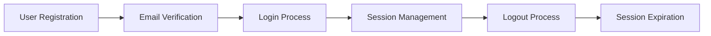
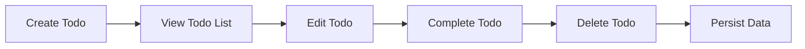

# Todo Application Testing Strategy

## 1. Testing Approach and Strategy Overview

### Testing Philosophy
This testing strategy adopts a risk-based approach focusing on the core functionality of the minimal Todo application. The strategy prioritizes testing scenarios that ensure the application meets user expectations for reliability, usability, and data integrity.

### Testing Levels
- **Unit Testing**: Individual component testing for Todo operations
- **Integration Testing**: End-to-end workflow testing
- **User Acceptance Testing**: Validation against business requirements
- **Performance Testing**: Responsiveness and load handling

### Testing Methodology
WHEN testing the Todo application, THE testing team SHALL employ a combination of manual and automated testing approaches to ensure comprehensive coverage of all functional requirements.

## 2. Acceptance Criteria Definition

### Core Todo Operations Acceptance Criteria

#### Todo Creation
WHEN a user creates a new todo item, THE system SHALL meet the following acceptance criteria:
- THE todo item SHALL be saved immediately upon creation
- THE todo SHALL appear in the active todos list
- THE todo text SHALL be preserved exactly as entered
- THE system SHALL provide visual confirmation of successful creation

#### Todo Completion
WHEN a user marks a todo as complete, THE system SHALL meet the following acceptance criteria:
- THE todo SHALL move from active to completed section
- THE completion status SHALL be visually distinguishable
- THE system SHALL maintain the original todo text
- THE completion action SHALL be reversible

#### Todo Deletion
WHEN a user deletes a todo item, THE system SHALL meet the following acceptance criteria:
- THE todo SHALL be permanently removed from all lists
- THE system SHALL request confirmation before deletion
- THE deletion SHALL provide immediate visual feedback
- THE system SHALL not allow recovery of deleted todos

#### Todo Editing
WHEN a user edits an existing todo, THE system SHALL meet the following acceptance criteria:
- THE original todo text SHALL be preserved until saved
- THE edit SHALL be cancellable without changes
- THE updated todo SHALL maintain its position in the list
- THE system SHALL validate todo text before saving

## 3. Test Scenario Specifications

### User Authentication Test Scenarios

#### Registration Flow Test Scenarios
WHEN a new user registers for the application, THE system SHALL:
- Validate email format and uniqueness
- Send verification email with secure token
- Create user account upon successful verification
- Provide clear error messages for invalid inputs

#### Login Flow Test Scenarios
WHEN a user attempts to log in, THE system SHALL:
- Validate credentials against stored user data
- Create secure session upon successful authentication
- Handle incorrect password attempts with appropriate delays
- Provide clear error messages for authentication failures

### Todo Management Test Scenarios

#### Data Persistence Test Scenarios
WHILE the application is running, THE system SHALL:
- Maintain todo data across browser refreshes
- Preserve todo completion status during navigation
- Handle browser closure and reopening gracefully
- Recover data after unexpected application termination

## 4. Quality Assurance Standards

### Usability Standards
THE Todo application SHALL meet the following usability criteria:
- Page load time under 2 seconds for initial visit
- Todo operations (create, edit, complete, delete) responding within 500ms
- Intuitive user interface requiring minimal learning curve
- Consistent visual feedback for all user actions

### Accessibility Standards
WHERE accessibility features are implemented, THE application SHALL:
- Support keyboard navigation for all functions
- Provide appropriate ARIA labels for screen readers
- Maintain sufficient color contrast for readability
- Ensure responsive design for various screen sizes

### Reliability Standards
THE application SHALL demonstrate reliability through:
- 99.9% uptime availability for authenticated users
- Zero data loss during normal operation
- Graceful error handling without application crashes
- Consistent performance under normal user load

## 5. User Acceptance Testing Requirements

### UAT Scenarios Definition

#### Happy Path Scenarios
WHEN testing the primary user workflows, THE UAT SHALL verify:
- Successful user registration and login process
- Seamless todo creation and management
- Accurate todo status tracking and updates
- Proper data persistence across sessions

#### Edge Case Scenarios
IF unusual conditions occur during testing, THE UAT SHALL validate:
- Behavior with extremely long todo text
- Handling of special characters in todo content
- Performance under maximum todo items
- Recovery from network connectivity issues

### UAT Success Criteria
THE User Acceptance Testing SHALL be considered successful WHEN:
- All core functionality operates as specified in business requirements
- No critical defects preventing basic todo operations are found
- Performance meets or exceeds defined standards
- Users can accomplish their goals without confusion or frustration

## 6. Performance Testing Criteria

### Load Testing Requirements
WHILE simulating multiple concurrent users, THE system SHALL:
- Handle up to 100 concurrent users without degradation
- Maintain response times under established thresholds
- Scale resources appropriately based on demand
- Recover gracefully from peak load conditions

### Stress Testing Requirements
IF the system experiences extreme load conditions, THE testing SHALL verify:
- Graceful degradation rather than complete failure
- Appropriate error messages for overwhelmed resources
- Recovery procedures for returning to normal operation
- Data integrity maintenance during stress conditions

## 7. Security Testing Requirements

### Authentication Security
THE security testing SHALL validate:
- Secure password storage using industry-standard hashing
- Protection against brute force login attempts
- Secure session management and token handling
- Proper logout functionality clearing all session data

### Data Security
WHERE user data is stored or transmitted, THE testing SHALL ensure:
- Encryption of sensitive data in transit and at rest
- Protection against common web vulnerabilities (XSS, CSRF)
- Secure handling of authentication tokens
- Proper access controls preventing unauthorized data access

## 8. Data Integrity Testing

### Data Validation Testing
WHEN users interact with todo data, THE testing SHALL verify:
- Prevention of SQL injection through proper input sanitization
- Validation of todo text length and content
- Proper handling of special characters and formatting
- Maintenance of data relationships and constraints

### Data Recovery Testing
IF data corruption or loss occurs, THE testing SHALL validate:
- Backup mechanisms for user todo data
- Recovery procedures for restoring lost data
- Data consistency checks following recovery operations
- User notification processes for data-related issues

## 9. Error Handling Test Scenarios

### User-Facing Error Scenarios
WHEN errors occur during normal operation, THE testing SHALL verify:
- Clear, user-friendly error messages
- Guidance for resolving common issues
- Maintenance of application state during errors
- Proper logging of errors for troubleshooting

### System Error Scenarios
IF system-level errors occur, THE testing SHALL validate:
- Graceful degradation rather than application crashes
- Appropriate error reporting to system administrators
- Recovery procedures for various error conditions
- User experience during temporary service disruptions

## 10. Cross-Browser/Device Testing Requirements

### Browser Compatibility
THE testing SHALL cover the following browser environments:
- Latest versions of Chrome, Firefox, Safari, and Edge
- Mobile browsers on iOS and Android devices
- Various screen sizes from mobile to desktop
- Different operating systems and configurations

### Responsive Design Testing
WHERE responsive design is implemented, THE testing SHALL verify:
- Proper layout adaptation to different screen sizes
- Functional usability on touch-enabled devices
- Consistent user experience across all supported platforms
- Performance optimization for mobile devices

## Testing Completion Criteria

THE testing process SHALL be considered complete WHEN:
- All acceptance criteria have been met or exceeded
- No critical or high-priority defects remain open
- Performance benchmarks have been achieved
- Security requirements have been validated
- User acceptance testing has received positive feedback

> *Developer Note: This document defines testing requirements only. All technical implementation of testing frameworks, tools, and methodologies are at the discretion of the development and QA teams.*